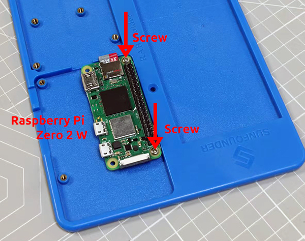
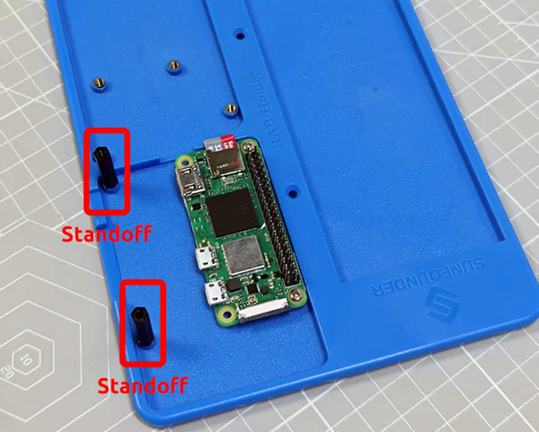
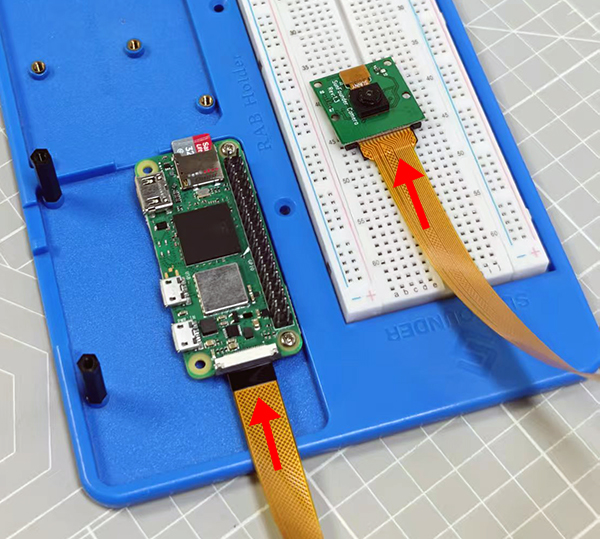
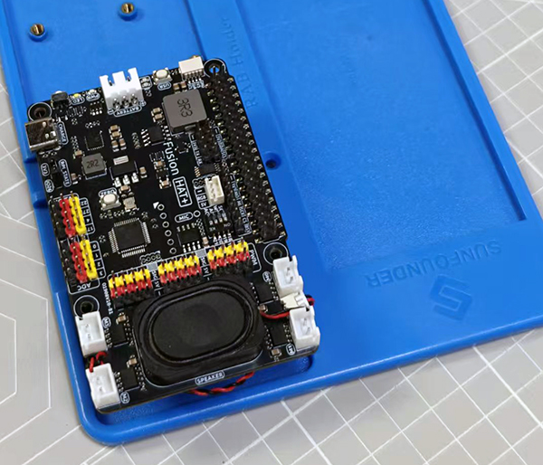
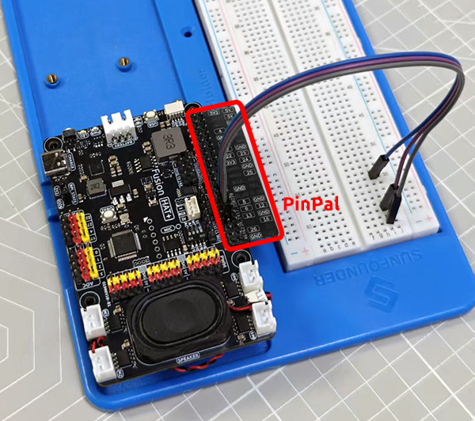

Assemble the Fusion Hat 
====================================

Before executing the example, you can assemble the Fusion Hat and Raspberry Pi Zero 2 W on the RAB Holder.

The RAB Holder is a base that can hold the Raspberry Pi ZERO 2 W, breadboard, and Fusion Hat. It can help you easily connect various sensors and actuators during the experiment and ensure the stability of the device.

Please follow the steps below to assemble.

1. Put the Raspberry Pi Zero 2 W on the RAB Holder and fix it with screws.

2. Assemble two Standoffs to support the Fusion Hat.

3. If you want to use the Raspberry Pi camera, please connect the camera to the Raspberry Pi Zero 2 W via the FPC cable at this time.

4. Plug the Fusion Hat into the Raspberry Pi Zero 2 W.

5. When working on a project, you can use PinPal to help you find the pinout of the Raspberry Pi Zero 2 W.

