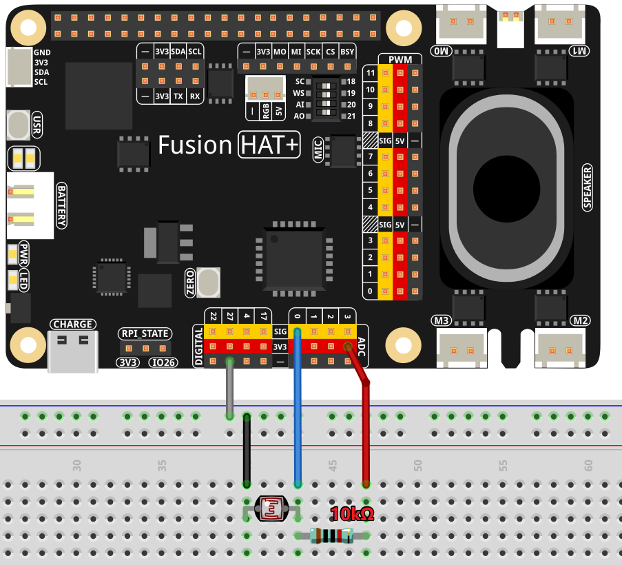

.. _gpt_easy_feel:

1.6 How Does It Feel?
============================

In the rapidly evolving world of technology, the integration of artificial intelligence (AI) with real-world sensors opens up a myriad of possibilities for creating smarter, more responsive environments. This chapter explores how AI can transcend traditional boundaries, interacting directly with physical surroundings to enhance decision-making and user experiences.

Utilizing sensors like photoresistors, which measure ambient light, we can enable AI to understand and react to environmental conditions in real-time. This capability is not just about processing data but about making sense of the world in ways that are directly relevant to users. For instance, an AI integrated with light sensors can adjust home lighting automatically, enhance security systems, or optimize energy consumption based on real-time data.

The potential applications are vast and varied. From creating more engaging and intuitive smart homes to developing systems that can adapt to changing environmental conditions for accessibility or efficiency, the possibilities are nearly limitless. By the end of this chapter, you will understand how to harness the power of AI and sensors like the photoresistor to build applications that not only respond to but also anticipate the needs of users based on their immediate environment.

Through practical examples, this chapter will guide you through setting up your Raspberry Pi to collect environmental data and use it to influence AI decision-making processes. This approach not only adds a layer of interactivity to projects but also helps demystify how AI can be applied in everyday situations to make technology more useful and responsive.

----------------------------------------------

**What You’ll Need**

The following components are required for this project:

.. list-table::
    :widths: 30 20
    :header-rows: 1

    *   - COMPONENT INTRODUCTION
        - PURCHASE LINK

    *   - :ref:`cpn_breadboard`
        - |link_breadboard_buy|
    *   - :ref:`cpn_wires`
        - |link_wires_buy|
    *   - :ref:`cpn_resistor`
        - |link_resistor_buy|
    *   - :ref:`cpn_photoresistor`
        - |link_photoresistor_buy|
    *   - Fusion HAT
        - 
    *   - Raspberry Pi Zero 2 W
        -

----------------------------------------------

**Diagram**

----------------------------------------------

**Running the Example**

All example code used in this course is located in the ``ai-explorer-lab-kit`` directory. Follow the steps below to run this example:

.. code-block:: shell

   cd ~/ai-explorer-lab-kit/gpt_example/
   sudo ~/my_venv/bin/python3 gpt_easy_feel.py

----------------------------------------------

**Code**

Below is the complete example code:

.. code-block:: python

   import openai
   from keys import OPENAI_API_KEY
   from pathlib import Path

   import readline # optimize keyboard input, only need to import
   import sys
   import os
   import subprocess
   from fusion_hat import ADC

   # gets API Key from environment variable OPENAI_API_KEY
   client = openai.OpenAI(api_key=OPENAI_API_KEY)
   os.system("fusion_hat enable_speaker")

   TTS_OUTPUT_FILE = 'tts_output.mp3'

   # Set up the photoresistor 
   photoresistor = ADC('A0')

   instructions_text = '''
   You are a light assistant. Your task is to determine if the current light conditions are suitable for reading based on the photosensor value provided by the user. 

   The photosensor value range is:
   - 0: Brightest
   - 4095: Darkest

   Input Format:
   "photoresistor: [value], message: [user query]"

   Output Guidelines:
   1. If the light is sufficient for reading (e.g., value <= 2000), respond positively.
   2. If the light is too dim (e.g., value > 2000), suggest increasing brightness.
   3. Include the sensor value in your response to explain your reasoning.

   Example Input:
   photoresistor: 150, message: Is the light good for reading?

   Example Output:
   Yes, the light is suitable for reading. A value of 150 indicates moderate brightness.

   '''

   assistant = client.beta.assistants.create(
      name="BOT",
      instructions=instructions_text,
      model="gpt-4-1106-preview",
   )

   thread = client.beta.threads.create()

   def text_to_speech(text):
      speech_file_path = Path(__file__).parent / "speech.mp3"
      # print(speech_file_path)
      with client.audio.speech.with_streaming_response.create(
         model="tts-1",
         voice="alloy",
         input=text
      ) as response:
         response.stream_to_file(speech_file_path)
      p=subprocess.Popen("mplayer speech.mp3", shell=True, stdout=subprocess.PIPE, stderr=subprocess.STDOUT)
      p.wait()

   try:
      while True:
         msg = ""
         msg = input(f'\033[1;30m{"intput: "}\033[0m').encode(sys.stdin.encoding).decode('utf-8')
         if msg == False or msg == "":
               print() # new line
               continue

         text_send="photoresistor:" +str(photoresistor.read()) +" , message: " + msg

         message = client.beta.threads.messages.create(
               thread_id=thread.id,
               role="user",
               content=text_send,
         )

         run = client.beta.threads.runs.create_and_poll(
               thread_id=thread.id,
               assistant_id=assistant.id,
         )

         if run.status == "completed":
               messages = client.beta.threads.messages.list(thread_id=thread.id)

               for message in messages.data:
                  if message.role == 'user':
                     for block in message.content:
                           if block.type == 'text':
                              label = message.role 
                              text = block.text.value
                              print(f'{label:>10} >>> {text}')
                     break # only last reply

               for message in messages.data:
                  if message.role == 'assistant':
                     for block in message.content:
                           if block.type == 'text':
                              label = assistant.name
                              text = block.text.value
                              print(f'{label:>10} >>> {text}')
                              text_to_speech(text)
                     break # only last reply

   finally:
      client.beta.assistants.delete(assistant.id)

----------------------------------------------

**Code Explanation**

This example builds upon :ref:`gpt_easy_tts`, with the main difference being the integration of the ``ADC`` module. Key modifications include the following:

.. code-block:: python
   :emphasize-lines: 3,8,18,23

   import openai
   ...
   from fusion_hat import ADC

   ...

   # Set up the photoresistor 
   photoresistor = ADC('A0')

   ...

   try:
      while True:
         msg = input(f'\033[1;30m{"Input: "}\033[0m').encode(sys.stdin.encoding).decode('utf-8')
         if msg == False or msg == "":
            continue

         text_send="photoresistor:" +str(photoresistor.read()) +" , message: " + msg

         message = client.beta.threads.messages.create(
            thread_id=thread.id,
            role="user",
            content=text_send,
         )

The photoresistor is a sensor whose resistance varies with ambient light intensity. Using the Fusion HAT, its analog signal is converted into a digital value that the AI can process. For more details about using the ADC module, refer to :ref:`2.2.1_py`.

In this project, the AI receives the photoresistor value along with a user query, enabling it to determine whether the environment is suitable for reading.

----------------------------------------------

**Crafting Effective AI Instructions**

Writing effective ``instructions_text`` is vital for guiding the AI's behavior and ensuring it interacts correctly with both the user and the sensor data. The ``instructions_text`` acts as a directive for the AI, informing it of its role, how it should interpret input, and how it should communicate its findings or decisions. Here are detailed steps and considerations for writing effective instructions:

1. **Define the AI's Role Clearly**

Start by explicitly stating what the AI is supposed to do. This helps in framing the rest of the instructions around this central purpose. For instance:

- "You are a light assistant. Your primary task is to assess ambient light conditions and provide recommendations for reading comfort based on the sensor data received."

2. **Specify Input and Output Formats**

Clarity in what the AI receives as input and what it is expected to output is crucial. Clearly outline the format and type of data the AI will handle:

- **Input Format**: Specify what the input will look like, e.g., "You will receive input in the format: ``photoresistor: [value], message: [user query]``."

- **Output Format**: Describe how responses should be structured, e.g., "Respond with a direct statement about the lighting condition followed by a suggestion if necessary."

3. **Provide Context and Parameters**

Inform the AI of the context within which it operates. This includes any thresholds or parameters it needs to consider:

- "Consider light levels suitable for reading as any value from 0 to 100, where 0 is the brightest and 100 still acceptable. Values above 100 should trigger a suggestion to increase lighting."

4. **Use Examples to Guide Expectations**

Incorporate examples to show how typical inputs should be handled. This not only clarifies expectations but also aids in debugging and refining AI responses:

- **Example Input**: "photoresistor: 80, message: Is the lighting adequate for reading?"

- **Example Output**: "Yes, the light level is adequate for reading. A value of 80 is comfortably bright."

5. **Set Guidelines for Tone and Style**

The tone and style of the AI's communication can significantly impact user experience. Specify how the AI should communicate its assessments:

- "Respond in a friendly and professional tone. Prioritize clarity and brevity in your recommendations."

6. **Highlight Constraints and Prohibitions**

If there are certain responses or behaviors that should be avoided, make these clear:

- "Avoid giving advice that could be construed as medical, such as commenting on the health effects of lighting conditions."

7. **Encourage Feedback Incorporation**

Encourage the AI to ask for user feedback to refine its accuracy over time:

- "Ask users for feedback on your recommendations to improve accuracy and user satisfaction."

**Iterative Refinement**

- Encourage users to test and refine the instructions based on real-world interactions. Real user interactions often provide insights that can significantly enhance the AI’s performance and reliability.

By following these detailed steps, users can create ``instructions_text`` that effectively guides the AI's operation, enhancing its functionality and ensuring it performs its designated tasks accurately. This approach not only improves the interaction between the AI and the user but also leverages the AI's capabilities to provide meaningful and contextually appropriate responses.

-------------------------------------------------

**Troubleshooting**

Integrating sensors with AI systems, especially in a hardware-limited environment like the Raspberry Pi, can present a variety of challenges. Here are some common issues that you might encounter and how to troubleshoot them effectively:

1. **Incorrect Sensor Readings**

**Problem:** The sensor, such as a photoresistor, is not providing accurate readings or always shows maximum or minimum values.

**Solutions:**

- **Check Connections**: Ensure all wires are properly connected according to the circuit diagram. Loose connections often cause inconsistent readings.
- **Verify Component Integrity**: Test the sensor independently (if possible) with a multimeter to ensure it is functioning correctly.
- **Adjust Calibration**: Some sensors require calibration to provide accurate readings. Check the sensor documentation and adjust settings in the software accordingly.

2. **Software Bugs**

**Problem:** The program crashes or does not behave as expected.

**Solutions:**

- **Debugging Output**: Add print statements before and after critical operations to track down the point of failure.
- **Code Review**: Go through your code to ensure there are no syntactic or logical errors. Pay special attention to how data is passed between functions.
- **Environment Issues**: Check the version of Python and libraries you are using. Compatibility issues might cause unexpected behavior.

3. **AI Model Does Not Respond Appropriately**

**Problem:** The AI model does not generate suitable responses based on the sensor data.

**Solutions:**

- **Review AI Instructions**: Ensure that the instructions provided to the AI model clearly describe how it should interpret the sensor data and respond accordingly.
- **Data Format**: Check if the sensor data is formatted correctly before being sent to the AI. Incorrect data formats or types can lead to inappropriate AI behavior.
- **Model Limitations**: Consider the limitations of the model you are using. Some models may require fine-tuning or specific training to handle custom scenarios effectively.

4. **Audio Output Issues**

**Problem:** No sound from the speaker or poor audio quality when the AI responds.

**Solutions:**

- **Volume Settings**: Check the volume settings on your Raspberry Pi; they might be muted or set too low.
- **Audio Drivers**: Verify that the correct audio drivers are installed and that they are not conflicting with other software.

By systematically addressing these common issues, you can minimize downtime and frustration in your projects. Remember, troubleshooting is often a process of trial and error, and patience is key to diagnosing and resolving problems effectively.
