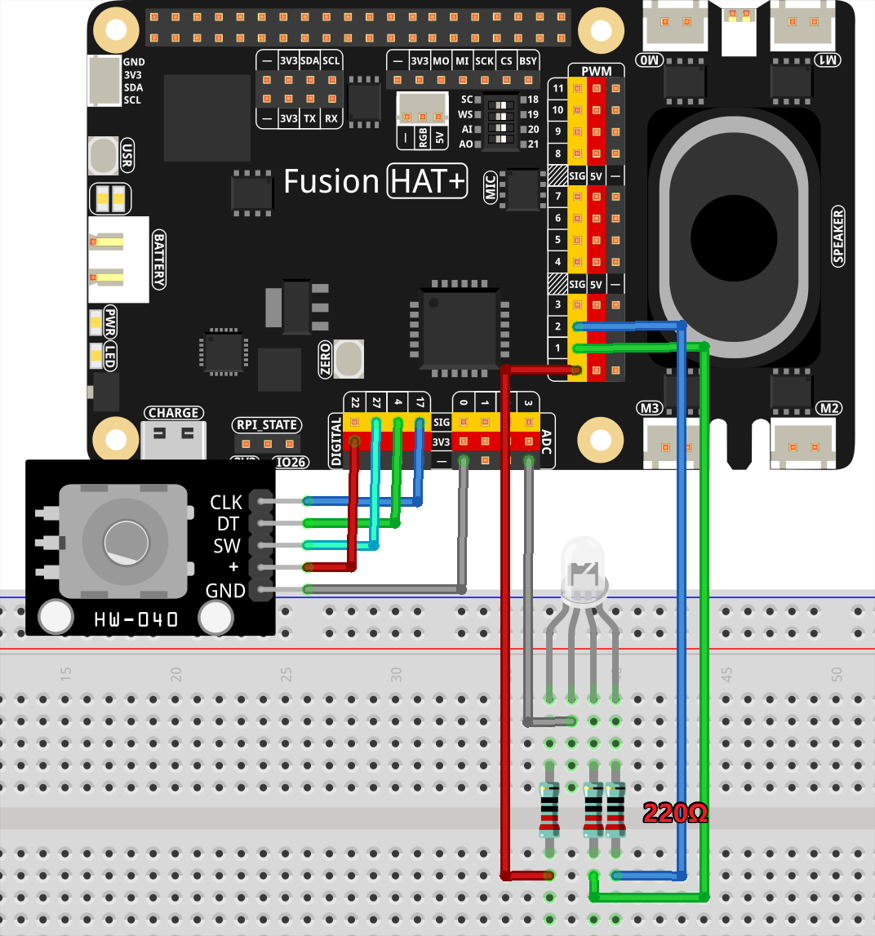

Color Analyzer
====================================

This project is an interactive mood-aware assistant that utilizes a rotary encoder and an RGB LED to analyze color values and provide mood-based insights. By adjusting the encoder, the user can cycle through different colors, which are then interpreted using OpenAI's GPT-4 API. When the user presses a button, the assistant evaluates the RGB color and generates a response with mood-based advice, which is then converted into speech using OpenAI's text-to-speech (TTS) feature.

----------------------------------------------

**Features**

- **RGB-Based Mood Interpretation**: The assistant analyzes RGB values to determine mood-related insights.
- **Rotary Encoder Input**: Users can change colors by rotating an encoder.
- **Button-Activated AI Response**: Pressing a button sends color data to OpenAI's API for interpretation.
- **Text-to-Speech Integration**: The AI-generated response is spoken aloud using OpenAI’s TTS.
- **Interactive LED Feedback**: The RGB LED displays colors in real time based on the encoder's position.

----------------------------------------------

**What You’ll Need**

.. list-table::
    :widths: 30 20
    :header-rows: 1

    *   - COMPONENT INTRODUCTION
        - PURCHASE LINK

    *   - :ref:`cpn_rotary_encoder`
        - |link_rotary_encoder_buy|
    *   - :ref:`cpn_resistor`
        - |link_resistor_buy|
    *   - :ref:`cpn_rgb_led`
        - |link_rgb_led_buy|
    *   - :ref:`cpn_wires`
        - |link_wires_buy|
    *   - Fusion HAT
        - 
    *   - Raspberry Pi Zero 2 W
        -

----------------------------------------------

**Wiring Diagram**

----------------------------------------------

**Code**

.. code-block:: python

    #!/usr/bin/env python3
    import colorsys
    from fusion_hat import Pin, RGB_LED, PWM, Rotary_Encoder
    from signal import pause

    import openai
    from keys import OPENAI_API_KEY
    import subprocess
    import os
    from pathlib import Path

    os.system("fusion_hat enable_speaker")

    # initialize openai client
    client = openai.OpenAI(api_key=OPENAI_API_KEY)

    instructions_text = '''
    You are a mood-aware assistant. Your task is to interpret the user's environment based on RGB color values and provide mood-related insights or advice.

    ### Input Format:
    "red: [value], green: [value], blue: [value]"

    ### Output Guidelines:
    1. Analyze the RGB values to determine the overall mood or atmosphere.
    2. If the color is warm (e.g., high red/yellow tones), describe it as cozy, energetic, or passionate.
    3. If the color is cool (e.g., high blue/green tones), describe it as calming, relaxing, or refreshing.
    4. If the color is neutral (e.g., balanced RGB), describe it as stable or neutral.
    5. Provide mood-based advice or activities that suit the detected atmosphere.
    6. Include the RGB values in your response to justify your interpretation.

    ### Example Input:
    red: 255, green: 100, blue: 50

    ### Example Output:
    The dominant warm tones (R: 255, G: 100, B: 50) create an energetic and cozy ambiance. This color is great for stimulating creativity and warmth. Consider using this lighting for social gatherings or artistic activities.
    '''

    assistant = client.beta.assistants.create(
        name="BOT",
        instructions=instructions_text,
        model="gpt-4-1106-preview",
    )

    thread = client.beta.threads.create()

    def text_to_speech(text):
        speech_file_path = Path(__file__).parent / "speech.mp3"
        with client.audio.speech.with_streaming_response.create(
            model="tts-1",  # Low-latency TTS model for real-time usage
            voice="alloy",  # Selected voice for audio playback
            input=text  # Text to convert to speech
        ) as response:
            response.stream_to_file(speech_file_path) # Save audio to the specified file
        p=subprocess.Popen("mplayer speech.mp3", shell=True, stdout=subprocess.PIPE, stderr=subprocess.STDOUT)
        p.wait()

    def change_color(encoder, led):
        """
        This function reads the position from the encoder and sets the LED color.
        The color is adjusted according to the hue value on the color wheel.
        """
        global r, g, b
        hue = encoder.steps() % 360  # Hue value cycles between 0 and 359
        r, g, b = colorsys.hsv_to_rgb(hue / 360.0, 1.0, 1.0)  # Full saturation and value for bright colors
        led.color = (int(r * 255), int(g * 255), int(b * 255))

    def send_message(message):
        global r, g, b
        events = "red: {}, green: {}, blue: {}" .format(r, g, b)
        try:
            message = client.beta.threads.messages.create(
                thread_id=thread.id,
                role="user",
                content=events,
            )

            run = client.beta.threads.runs.create_and_poll(
                thread_id=thread.id,
                assistant_id=assistant.id,
        )

            # print("Run completed with status: " + run.status)

            if run.status == "completed":
                messages = client.beta.threads.messages.list(thread_id=thread.id)

                for message in messages.data:
                    if message.role == 'assistant':
                        for block in message.content:
                            if block.type == 'text':
                                decoded_message = block.text.value
                        break # only last reply

            print(f"Decoded Message: {decoded_message}")
            text_to_speech(decoded_message)

        except Exception as e:
            print(f"Error in AI processing: {e}")

    try:
        clk_pin = 17  # Example GPIO pin for CLK
        dt_pin = 4   # Example GPIO pin for DT
        encoder = Rotary_Encoder(clk_pin, dt_pin)
        sw = Pin(27, Pin.IN, pull= Pin.PULL_UP)  # Button (sw) connected to GPIO pin 27

        # Initialize an RGB LED. Connect the red component to P0, green to P1, and blue to P2.
        r,g,b = 0,0,0
        rgb_led = RGB_LED(PWM('P0'), PWM('P1'), PWM('P2'),common=RGB_LED.CATHODE)

        # Set the callback for when the encoder is rotated
        encoder.when_rotated = lambda: change_color(encoder, rgb_led)
        sw.when_activated = send_message

        pause()  # Wait indefinitely for events

    finally:
        client.beta.assistants.delete(assistant.id)

----------------------------------------------

**Code Explanation**

1. **Initialization**

The script begins by importing necessary modules and enabling the speaker:

.. code-block:: python

    import colorsys
    from fusion_hat import Pin, RGB_LED, PWM, Rotary_Encoder
    from signal import pause
    import openai
    from keys import OPENAI_API_KEY
    import subprocess
    import os
    from pathlib import Path

    os.system("fusion_hat enable_speaker")

An OpenAI client instance is created using the provided API key:

.. code-block:: python

    client = openai.OpenAI(api_key=OPENAI_API_KEY)

----------------------------------------------

2. **Defining Instructions for OpenAI Assistant**

A set of instructions is defined to guide the assistant in interpreting RGB values and providing mood-based responses:

.. code-block:: python

    instructions_text = '''
    You are a mood-aware assistant. Your task is to interpret the user's environment based on RGB color values and provide mood-related insights or advice.
    ... (full instructions)
    '''

The assistant is created and a new chat thread is initialized:

.. code-block:: python

    assistant = client.beta.assistants.create(
        name="BOT",
        instructions=instructions_text,
        model="gpt-4-1106-preview",
    )

    thread = client.beta.threads.create()

----------------------------------------------

3. **Text-to-Speech Functionality**

The ``text_to_speech`` function takes AI-generated text, converts it to speech, saves it as an MP3 file, and plays it using ``mplayer``:

.. code-block:: python

    def text_to_speech(text):
        speech_file_path = Path(__file__).parent / "speech.mp3"
        with client.audio.speech.with_streaming_response.create(
            model="tts-1",
            voice="alloy",
            input=text
        ) as response:
            response.stream_to_file(speech_file_path)
        p=subprocess.Popen("mplayer speech.mp3", shell=True, stdout=subprocess.PIPE, stderr=subprocess.STDOUT)
        p.wait()

----------------------------------------------

4. **Color Change Functionality**

The ``change_color`` function modifies the RGB LED based on the rotary encoder’s position:

.. code-block:: python

    def change_color(encoder, led):
        global r, g, b
        hue = encoder.steps() % 360
        r, g, b = colorsys.hsv_to_rgb(hue / 360.0, 1.0, 1.0)
        led.color = (int(r * 255), int(g * 255), int(b * 255))

----------------------------------------------

5. **Sending Color Data to OpenAI**

When the button is pressed, the ``send_message`` function captures the RGB values and sends them to OpenAI’s API for analysis:

.. code-block:: python

    def send_message(message):
        global r, g, b
        events = "red: {}, green: {}, blue: {}".format(r, g, b)
        try:
            message = client.beta.threads.messages.create(
                thread_id=thread.id,
                role="user",
                content=events,
            )

            run = client.beta.threads.runs.create_and_poll(
                thread_id=thread.id,
                assistant_id=assistant.id,
            )

            if run.status == "completed":
                messages = client.beta.threads.messages.list(thread_id=thread.id)

                for message in messages.data:
                    if message.role == 'assistant':
                        for block in message.content:
                            if block.type == 'text':
                                decoded_message = block.text.value
                        break

            print(f"Decoded Message: {decoded_message}")
            text_to_speech(decoded_message)
        except Exception as e:
            print(f"Error in AI processing: {e}")

----------------------------------------------

6. **Main Execution & Cleanup**

The script initializes the rotary encoder, RGB LED, and button, setting up event handlers:

.. code-block:: python

    try:
        clk_pin = 17
        dt_pin = 4
        encoder = Rotary_Encoder(clk_pin, dt_pin)
        sw = Pin(27, Pin.IN, pull= Pin.PULL_UP)

        r,g,b = 0,0,0
        rgb_led = RGB_LED(PWM('P0'), PWM('P1'), PWM('P2'), common=RGB_LED.CATHODE)

        encoder.when_rotated = lambda: change_color(encoder, rgb_led)
        sw.when_activated = send_message

        pause()
    finally:
        client.beta.assistants.delete(assistant.id)

----------------------------------------------

**Debugging Tips**

1. **RGB LED Not Changing Colors?**

   - Check if the rotary encoder is connected correctly.
   - Ensure the correct GPIO pins are defined for the encoder.

2. **No Response from OpenAI?**

   - Verify that the API key is correctly set.
   - Ensure the OpenAI service is running and accessible.

3. **No Audio Output?**

   - Confirm that ``mplayer`` is installed.
   - Ensure the speaker is enabled and properly connected.

4. **Button Press Not Working?**

   - Check if the button is correctly wired to the GPIO pin.
   - Ensure that ``Pin.PULL_UP`` is correctly set.

