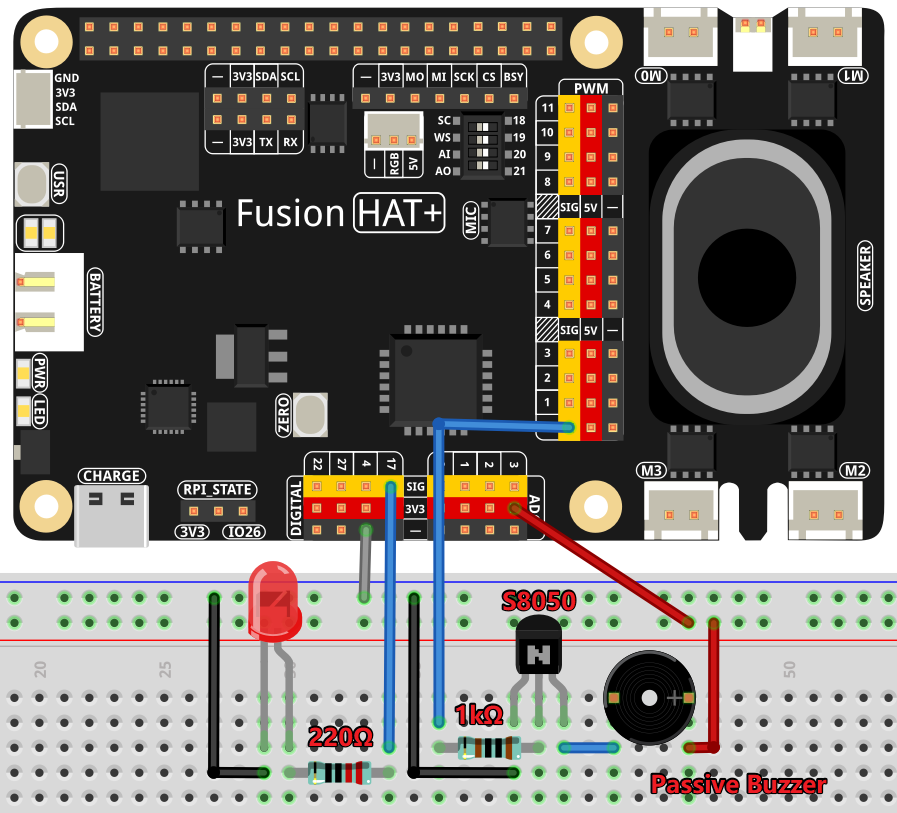

Composition Assistant
======================================

This example showcases how to integrate OpenAI's GPT model with GPIO-controlled hardware to create an interactive music composition assistant. 

The assistant invites users to sing three notes, such as "do, re, mi," which it captures via a microphone. Using OpenAI's Whisper model for transcription and GPT for composition, the assistant generates a melody based on the sung notes. The resulting tune is then played on a buzzer while a textual description of the composition is provided, offering a creative and engaging musical experience.

----------------------------------------------

**Features**

1. **Voice Input**: Captures the user's voice commands via a microphone.
2. **GPT-Powered Composition**: Generates a melody based on the user's input using GPT.
3. **Melody Playback**: Plays the generated melody on a tonal buzzer.
4. **LED Indicator**: Uses an LED to indicate when the system is actively listening.
5. **Friendly Feedback**: Displays both the generated melody and a textual response from the assistant.

----------------------------------------------

**What You’ll Need**

The following components are required for this project:

.. list-table::
    :widths: 30 20
    :header-rows: 1

    *   - COMPONENT INTRODUCTION
        - PURCHASE LINK

    *   - :ref:`cpn_breadboard`
        - |link_breadboard_buy|
    *   - :ref:`cpn_wires`
        - |link_wires_buy|
    *   - :ref:`cpn_resistor`
        - |link_resistor_buy|
    *   - :ref:`cpn_led`
        - |link_led_buy|
    *   - :ref:`cpn_buzzer`
        - |link_passive_buzzer_buy|
    *   - :ref:`cpn_transistor`
        - |link_transistor_buy|
    *   - Fusion HAT
        - 
    *   - Raspberry Pi Zero 2 W
        -

----------------------------------------------

**Diagram**

----------------------------------------------

**Code**

.. raw:: html

   <run></run>
   
.. code-block:: python

   import openai
   from keys import OPENAI_API_KEY
   import readline # optimize keyboard input, only need to import
   import sys
   import os
   from time import sleep

   import speech_recognition as sr

   from fusion_hat import Buzzer,Pin,PWM

   os.system("fusion_hat enable_speaker")

   # gets API Key from environment variable OPENAI_API_KEY
   client = openai.OpenAI(api_key=OPENAI_API_KEY)

   # Speech recognizer
   recognizer = sr.Recognizer()

   def speech_to_text(audio_file):
      from io import BytesIO

      wav_data = BytesIO(audio_file.get_wav_data())
      wav_data.name = "stt_output.wav"

      transcription = client.audio.transcriptions.create(
         model="whisper-1", 
         file=wav_data,
         language=['zh','en']
      )
      return transcription.text

   def redirect_error_2_null():
      devnull = os.open(os.devnull, os.O_WRONLY)
      old_stderr = os.dup(2)
      sys.stderr.flush()
      os.dup2(devnull, 2)
      os.close(devnull)
      return old_stderr

   def cancel_redirect_error(old_stderr):
      os.dup2(old_stderr, 2)
      os.close(old_stderr)

   # Initialize hardware components
   buzzer = Buzzer('P0') 
   led = Pin(17, Pin.OUT)

   # Create an OpenAI assistant
   instructions_text = (
      "You are a music composition assistant. Based on three given notes, "
      "you must create a melody and provide it as a JSON dictionary. "
      "The JSON must include 'melody' (a list of tuples with notes and durations) "
      "and 'message' (a textual description). Example format: "
      "{\"melody\": [('C#4', 0.2), ('D4', 0.2), (None, 0.2)], \"message\": \"Your melody is ready.\"}"
   )

   assistant = client.beta.assistants.create(
      name="BOT",
      instructions=instructions_text,
      model="gpt-4o",
   )

   thread = client.beta.threads.create()

   def play_tune(tune):
      """
      Play a musical tune using the buzzer.
      :param tune: List of tuples (note, duration), where each tuple represents a note and its duration.
      """
      for note, duration in tune:
         print(note)  # Output the current note being played
         buzzer.play(note,float(duration))  # Play the note on the buzzer
      buzzer.off()  # Stop playing after the tune is complete
      sleep(1)

   try:
      while True:
         # Listen to user input
         led.on()
         print(f'\033[1;30m{"listening... "}\033[0m')
         _stderr_back = redirect_error_2_null() # ignore error print to ignore ALSA errors
         with sr.Microphone(chunk_size=8192) as source:
               cancel_redirect_error(_stderr_back) # restore error print
               recognizer.adjust_for_ambient_noise(source)
               audio = recognizer.listen(source)
         print(f'\033[1;30m{"stop listening... "}\033[0m')
         led.off()

         # Convert audio to text
         msg = ""
         msg = speech_to_text(audio)
         if msg == False or msg == "":
               print("No valid input received.")
               continue

         message = client.beta.threads.messages.create(
               thread_id=thread.id,
               role="user",
               content=msg,
         )

         run = client.beta.threads.runs.create_and_poll(
               thread_id=thread.id,
               assistant_id=assistant.id,
         )

         if run.status == "completed":
               messages = client.beta.threads.messages.list(thread_id=thread.id)

               for message in messages.data:
                  if message.role == 'user':
                     for block in message.content:
                           if block.type == 'text':
                              label = message.role 
                              value = block.text.value
                              print(f'{label:>10} >>> {value}')
                     break # only last reply

               for message in messages.data:
                  if message.role == 'assistant':
                     for block in message.content:
                           if block.type == 'text':
                              response = block.text.value
                              try:
                                 response_dict = eval(response)
                                 melody = response_dict.get('melody', [])
                                 text = response_dict.get('message', "No message provided.")
                                 print(f"{assistant.name:>10} >>>  {text}")
                                 play_tune(melody)
                              except Exception as e:
                                 print(f"Error processing assistant response: {e}")

                     break # only last reply

   finally:
      buzzer.off()
      client.beta.assistants.delete(assistant.id)

----------------------------------------------

**Code Explanation**

1. **Import Necessary Libraries**

.. code-block:: python
      
   import openai
   from keys import OPENAI_API_KEY
   import readline 
   import sys
   import os
   from time import sleep
   import speech_recognition as sr
   from fusion_hat import Buzzer,Pin,PWM

* ``openai``: Interacts with OpenAI's GPT and Whisper models.
* ``speech_recognition``: Captures and processes audio input.
* ``fusion_hat``: Controls GPIO components such as the buzzer and LED.

2. **Initialize OpenAI Client**

.. code-block:: python

   client = openai.OpenAI(api_key=OPENAI_API_KEY)

The OpenAI client is configured using an API key to access GPT and Whisper models.

3. **Define Helper Functions**

.. code-block:: python

   def speech_to_text(audio_file):
      from io import BytesIO
      wav_data = BytesIO(audio_file.get_wav_data())
      wav_data.name = "stt_output.wav"
      transcription = client.audio.transcriptions.create(
         model="whisper-1", 
         file=wav_data,
         language=['zh','en']
      )
      return transcription.text

Speech-to-Text Conversion:

* Uses OpenAI's Whisper model to transcribe audio into text.
* Supports multiple languages (e.g., Chinese and English).

.. code-block:: python

   def redirect_error_2_null():
      devnull = os.open(os.devnull, os.O_WRONLY)
      old_stderr = os.dup(2)
      sys.stderr.flush()
      os.dup2(devnull, 2)
      os.close(devnull)
      return old_stderr

   def cancel_redirect_error(old_stderr):
      os.dup2(old_stderr, 2)
      os.close(old_stderr)

Redirect ALSA Errors: Suppresses ALSA-related errors to prevent unnecessary console noise during microphone usage.

.. code-block:: python

   def play_tune(tune):
      """
      Play a musical tune using the buzzer.
      :param tune: List of tuples (note, duration), where each tuple represents a note and its duration.
      """
      for note, duration in tune:
         print(note)  # Output the current note being played
         buzzer.play(note,float(duration))  # Play the note on the buzzer
      buzzer.off()  # Stop playing after the tune is complete
      sleep(1)

Play Melody on Buzzer:

* Accepts a melody as a list of (note, duration) tuples.
* Plays each note on the buzzer for the specified duration.

4. **Configure Hardware Components**

.. code-block:: python
      
   # Initialize hardware components
   buzzer = Buzzer(PWM('P0')) 
   led = Pin(17, Pin.OUT)

Initializes GPIO components for audio playback and status indication.

5. Create OpenAI Assistant

.. code-block:: python

   instructions_text = (
      "You are a music composition assistant. Based on three given notes, "
      "you must create a melody and provide it as a JSON dictionary. "
      "The JSON must include 'melody' (a list of tuples with notes and durations) "
      "and 'message' (a textual description). Example format: "
      "{\"melody\": [('C#4', 0.2), ('D4', 0.2), (None, 0.2)], \"message\": \"Your melody is ready.\"}"
   )

   assistant = client.beta.assistants.create(
      name="BOT",
      instructions=instructions_text,
      model="gpt-4o",
   )

   thread = client.beta.threads.create()

Defines an assistant named BOT with clear instructions to:

* Accept input notes.
* Generate a melody in JSON format.
* Provide a textual description of the melody.

6. **Main Loop for Listening and Responding**

.. code-block:: python

   led.on()
   print(f'\033[1;30m{"listening... "}\033[0m')
   _stderr_back = redirect_error_2_null()
   with sr.Microphone(chunk_size=8192) as source:
      cancel_redirect_error(_stderr_back)
      recognizer.adjust_for_ambient_noise(source)
      audio = recognizer.listen(source)
   led.off()

Voice Input Capture:

* LED lights up while the system is listening.
* Captures and processes user voice input using speech_recognition.

.. code-block:: python

   message = client.beta.threads.messages.create(
      thread_id=thread.id,
      role="user",
      content=msg,
   )

   run = client.beta.threads.runs.create_and_poll(
      thread_id=thread.id,
      assistant_id=assistant.id,
   )

   if run.status == "completed":
      messages = client.beta.threads.messages.list(thread_id=thread.id)

      for message in messages.data:
            if message.role == 'user':
               for block in message.content:
                  if block.type == 'text':
                        label = message.role 
                        value = block.text.value
                        print(f'{label:>10} >>> {value}')
               break # only last reply

      for message in messages.data:
            if message.role == 'assistant':
               for block in message.content:
                  if block.type == 'text':
                        response = block.text.value
                        try:
                           response_dict = eval(response)
                           melody = response_dict.get('melody', [])
                           text = response_dict.get('message', "No message provided.")
                           print(f"{assistant.name:>10} >>>  {text}")
                           play_tune(melody)
                        except Exception as e:
                           print(f"Error processing assistant response: {e}")

Process GPT Response:

* Sends the transcribed text to the GPT assistant.
* Parses the JSON response for the melody and plays it using the buzzer.

7. **Cleanup Resources**

.. code-block:: python

   finally:
      buzzer.off()
      client.beta.assistants.delete(assistant.id)

Ensures hardware components are reset and OpenAI resources are released.

----------------------------------------------

**Debugging Tips**

1. Microphone Not Capturing Input:

   * Ensure the microphone is properly connected.
   * Verify the microphone permissions using alsamixer or your OS settings.

2. Buzzer Not Playing Notes:

   * Check the GPIO pin connections.
   * Ensure the notes in the melody are valid for the buzzer.

3. JSON Parsing Errors:

   * Verify that the assistant's response adheres to the specified JSON format.
   * Add debugging statements to print raw GPT responses.

4. ALSA Errors in Console:

   * Use the provided ``redirect_error_2_null()`` function to suppress ALSA errors.

5. No Response from GPT:

   * Check the internet connection.
   * Ensure the OpenAI API key is valid and has sufficient usage credits.