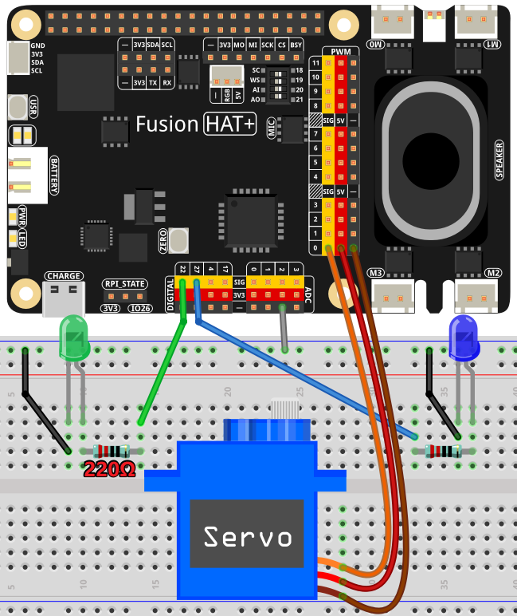

2.4 Debate Simulation
======================================

This Python script simulates a debate between two GPT-based assistants: one playing the role of an affirmative speaker and the other as the opposition. The program uses hardware elements such as a servo motor and LEDs to visually represent the debate and integrates text-to-speech for auditory feedback.

The program integrates text-to-speech, servo motor movement, and LED lighting to enhance the interactive experience, providing a realistic simulation of a debate scenario.

----------------------------------------------

**Features**

1. **Interactive Debate**:

   * Two AI assistants, one affirmative and one opposition, engage in a structured debate.
   * Alternating turns with clearly defined roles and instructions for each assistant.

2. **Speech Synthesis**:

   * Converts AI-generated responses into audible speech using OpenAI's TTS model.
   * Separate voices for each assistant for clarity and realism.

3. **Hardware Integration**:

   * Servo motor movement visually indicates the active speaker.
   * LEDs light up to represent the affirmative (LED 1) or opposition (LED 2) speaker.

4. **Customizable Topics**:

   * User-provided input serves as the debate topic.
   * AI generates arguments and counterarguments dynamically.

5. **Resource Cleanup**:

   * Ensures proper deactivation of hardware and API resources after use.

----------------------------------------------

**What You’ll Need**

The following components are required for this project:

.. list-table::
    :widths: 30 20
    :header-rows: 1

    *   - COMPONENT
        - PURCHASE LINK

    *   - :ref:`cpn_servo`
        - |link_servo_buy|
    *   - :ref:`cpn_resistor`
        - |link_resistor_buy|
    *   - :ref:`cpn_led`
        - |link_led_buy|        
    *   - Fusion HAT
        - 
    *   - Raspberry Pi Zero 2 W
        -

----------------------------------------------

**Diagram**

----------------------------------------------

**Running the Example**

All example code used in this tutorial is available in the ``ai-explorer-lab-kit`` directory. 
Follow these steps to run the example:

.. code-block:: shell
   
   cd ~/ai-explorer-lab-kit/gpt_example/
   sudo ~/my_venv/bin/python3 gpt_fun_debate.py 

----------------------------------------------

**Code**

.. code-block:: python

   import openai
   from keys import OPENAI_API_KEY
   import readline  # Optimize keyboard input, only need to import
   import sys,os
   from pathlib import Path
   from fusion_hat import Servo, Pin
   import subprocess

   os.system("fusion_hat enable_speaker")

   # Initialize GPIO components
   servo = Servo('P0')
   led1 = Pin(27, Pin.OUT)
   led2 = Pin(22, Pin.OUT)
   led1.off()
   led2.off()

   # Initialize OpenAI client
   client = openai.OpenAI(api_key=OPENAI_API_KEY)

   # Define assistants with specific instructions
   assistants = [
      client.beta.assistants.create(
         name="Alloy",
         instructions=(
               "You are a debate team affirmative speaker. You must agree with the "
               "proposed viewpoint, provide reasonable arguments, and respond to opposition "
               "criticism. Each response should start with the phrase 'This is affirmative response #X' "
               "and must be under 100 words."
         ),
         model="gpt-4-1106-preview",
      ),
      client.beta.assistants.create(
         name="Echo",
         instructions=(
               "You are a debate team opposition speaker. You must refute the affirmative's arguments "
               "using logical reasoning and references. Each response should start with the phrase 'This is opposition response #X' "
               "and must be under 100 words."
         ),
         model="gpt-4-1106-preview",
      ),
   ]

   # Text-to-speech function
   def text_to_speech(text, player):
      """
      Convert text to speech using OpenAI's TTS model.
      :param text: The text to be converted.
      :param player: The speaker identifier (0 for Alloy, 1 for Echo).
      """
      voice_player = "alloy" if player == 0 else "echo"
      speech_file_path = Path(__file__).parent / "speech.mp3"

      try:
         with client.audio.speech.with_streaming_response.create(
               model="tts-1", voice=voice_player, input=text
         ) as response:
               response.stream_to_file(speech_file_path)
      except Exception as e:
         print(f"Error in TTS: {e}")
         return None
      return speech_file_path

   # Debate function
   def debate(player, msg):
      """
      Handle the debate flow for a single turn.
      :param player: The current player's identifier (0 for affirmative, 1 for opposition).
      :param msg: The message to send to the assistant.
      :return: The assistant's response as a string.
      """
      assistant = assistants[player]

      try:
         client.beta.threads.messages.create(
               thread_id=thread.id, role="user", content=msg
         )

         run = client.beta.threads.runs.create_and_poll(
               thread_id=thread.id, assistant_id=assistant.id
         )

         if run.status == "completed":
               messages = client.beta.threads.messages.list(thread_id=thread.id)
               for message in messages.data:
                  if message.role == "assistant" and message.assistant_id == assistant.id:
                     for block in message.content:
                           if block.type == "text":
                              response = block.text.value
                              print(f'{assistant.name} >>> {response}')
                              play_response(response, player)
                              return response
      except Exception as e:
         print(f"Error during debate: {e}")
         return "An error occurred. Please try again."

   # Play response function
   def play_response(response, player):
      """
      Play the assistant's response through text-to-speech and control hardware.
      :param response: The assistant's response text.
      :param player: The speaker identifier (0 for Alloy, 1 for Echo).
      """
      speech_file_path = text_to_speech(response, player)
      if speech_file_path:
         try:
               # Play the speech and control LEDs/Servo
               servo.angle(45) if player == 0 else servo.angle(-45)
               led1.on() if player == 0 else led1.off()
               led2.on() if player == 1 else led2.off()
               p = subprocess.Popen(
                  ["mplayer", str(speech_file_path)],
                  shell=False,
                  stdout=subprocess.PIPE,
                  stderr=subprocess.STDOUT,
               )
               p.wait()
         except Exception as e:
               print(f"Error playing response: {e}")

   # Create a thread for the debate
   thread = client.beta.threads.create()

   try:
      print("Start the debate by entering your topic:")
      msg = input(f'\033[1;30m{"Input: "}\033[0m').strip()
      if not msg:
         print("No input provided. Exiting.")
         sys.exit(0)

      for turn in range(6):
         msg = debate(turn % 2, msg)

   finally:
      # Cleanup GPIO and OpenAI resources
      servo.angle(0)
      led1.off()
      led2.off()
      for assistant in assistants:
         client.beta.assistants.delete(assistant.id)
      print("Resources cleaned up. Exiting.")

----------------------------------------------

**Code Explanation**

1. Initialization

.. code-block:: python

   import openai
   from keys import OPENAI_API_KEY
   import readline  # Optimize keyboard input, only need to import
   import sys,os
   from pathlib import Path
   from fusion_hat import Servo, Pin
   import subprocess

Importing Required Libraries:

* ``openai``: Interacts with GPT and TTS models.
* ``fusion_hat``: Controls GPIO-connected hardware (servo motor, LEDs).
* ``subprocess``: Plays audio files generated by the TTS model.

.. code-block:: python

   CORRECTION = 0.45
   MAX_PW = (2.0 + CORRECTION) / 1000
   MIN_PW = (1.0 - CORRECTION) / 1000

   servo = Servo(5, min_pulse_width=MIN_PW, max_pulse_width=MAX_PW)
   led1 = LED(23)
   led2 = LED(24)
   led1.off()
   led2.off()

Hardware Configuration:

* Servo Motor: Adjusted with fine-tuned pulse widths for precise movements.
* LEDs: Indicate the active speaker.

.. code-block:: python

   client = openai.OpenAI(api_key=OPENAI_API_KEY)

OpenAI Initialization:

* Creates an OpenAI client using an API key stored in the ``keys.py`` file.

2. Assistant Creation

.. code-block:: python

   assistants = [
      client.beta.assistants.create(
         name="Alloy",
         instructions=(
               "You are a debate team affirmative speaker. You must agree with the "
               "proposed viewpoint, provide reasonable arguments, and respond to opposition "
               "criticism. Each response should start with the phrase 'This is affirmative response #X' "
               "and must be under 100 words."
         ),
         model="gpt-4-1106-preview",
      ),
      client.beta.assistants.create(
         name="Echo",
         instructions=(
               "You are a debate team opposition speaker. You must refute the affirmative's arguments "
               "using logical reasoning and references. Each response should start with the phrase 'This is opposition response #X' "
               "and must be under 100 words."
         ),
         model="gpt-4-1106-preview",
      ),
   ]

* Alloy: Represents the affirmative speaker.
* Echo: Represents the opposition speaker.
* Each assistant has specific instructions for generating concise responses.

3. Debate Logic

.. code-block:: python

   def debate(player, msg):
      """
      Handle the debate flow for a single turn.
      :param player: The current player's identifier (0 for affirmative, 1 for opposition).
      :param msg: The message to send to the assistant.
      :return: The assistant's response as a string.
      """
      assistant = assistants[player]

      try:
         client.beta.threads.messages.create(
               thread_id=thread.id, role="user", content=msg
         )

         run = client.beta.threads.runs.create_and_poll(
               thread_id=thread.id, assistant_id=assistant.id
         )

         if run.status == "completed":
               messages = client.beta.threads.messages.list(thread_id=thread.id)
               for message in messages.data:
                  if message.role == "assistant" and message.assistant_id == assistant.id:
                     for block in message.content:
                           if block.type == "text":
                              response = block.text.value
                              print(f'{assistant.name} >>> {response}')
                              play_response(response, player)
                              return response
      except Exception as e:
         print(f"Error during debate: {e}")
         return "An error occurred. Please try again."

Debate Function:

* Sends the user's statement to the assistant.
* Retrieves and processes the assistant's response.
* Calls ``play_response()`` to synthesize and play the response.

.. code-block:: python

   # Play response function
   def play_response(response, player):
      """
      Play the assistant's response through text-to-speech and control hardware.
      :param response: The assistant's response text.
      :param player: The speaker identifier (0 for Alloy, 1 for Echo).
      """
      speech_file_path = text_to_speech(response, player)
      if speech_file_path:
         try:
               # Play the speech and control LEDs/Servo
               servo.value = 0.5 if player == 0 else -0.5
               led1.on() if player == 0 else led1.off()
               led2.on() if player == 1 else led2.off()
               p = subprocess.Popen(
                  ["mplayer", str(speech_file_path)],
                  shell=False,
                  stdout=subprocess.PIPE,
                  stderr=subprocess.STDOUT,
               )
               p.wait()
         except Exception as e:
               print(f"Error playing response: {e}")

Play Response Function:

* Adjusts servo position and LED states to indicate the active speaker.
* Plays the synthesized speech using ``mplayer``.

.. code-block:: python

   # Text-to-speech function
   def text_to_speech(text, player):
      """
      Convert text to speech using OpenAI's TTS model.
      :param text: The text to be converted.
      :param player: The speaker identifier (0 for Alloy, 1 for Echo).
      """
      voice_player = "alloy" if player == 0 else "echo"
      speech_file_path = Path(__file__).parent / "speech.mp3"

      try:
         with client.audio.speech.with_streaming_response.create(
               model="tts-1", voice=voice_player, input=text
         ) as response:
               response.stream_to_file(speech_file_path)
      except Exception as e:
         print(f"Error in TTS: {e}")
         return None
      return speech_file_path

Text-to-Speech Function:

* Converts the assistant's response into speech using OpenAI's TTS model.
* Saves the audio file for playback.

4. Main Loop

.. code-block:: python

   # Create a thread for the debate
   thread = client.beta.threads.create()

   try:
      print("Start the debate by entering your topic:")
      msg = input(f'\033[1;30m{"Input: "}\033[0m').strip()
      if not msg:
         print("No input provided. Exiting.")
         sys.exit(0)

      for turn in range(6):
         msg = debate(turn % 2, msg)

   finally:
      # Cleanup GPIO and OpenAI resources
      servo.mid()
      servo.close()
      led1.off()
      led1.close()
      led2.off()
      led2.close()
      for assistant in assistants:
         client.beta.assistants.delete(assistant.id)
      print("Resources cleaned up. Exiting.")

* Alternates between affirmative and opposition speakers for six turns.
* Cleans up hardware resources and deletes assistant instances after completion.

----------------------------------------------

**Debugging Tips**

1. Servo and LEDs Not Working:

   * Verify GPIO connections and pin configurations.
   * Ensure proper power supply to the components.

2. Speech Not Playing:

   * Check if mplayer is installed (sudo apt install mplayer).
   * Ensure the TTS API is generating valid audio files.

3. OpenAI Errors:

   * Verify your API key and internet connection.
   * Check for API usage limits in your OpenAI account.

4. Unexpected Assistant Responses:

   * Debug by printing raw responses: print(response).
   * Ensure the assistant instructions are clear and concise.