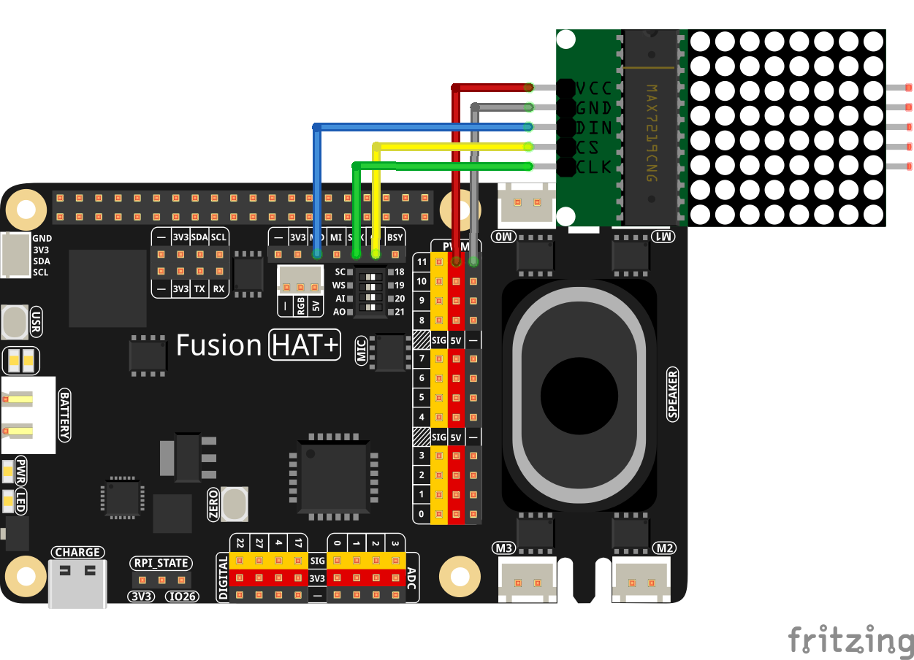

2.9 DigiPet
===================

This Python script integrates OpenAI's GPT API with an 8x8 LED matrix and audio input/output functionalities to simulate an interactive electronic pet. The "pet" listens to the user's voice, responds with a facial expression on the LED matrix, and speaks the response aloud.

----------------------------------------------

**Features**

1. Speech-to-Text Conversion:

   * Captures user input via a microphone and converts it into text using OpenAI's Whisper model.

2. Text-to-Speech Output:

   * Converts the assistant's textual response into speech using OpenAI's TTS model.

3. 8x8 LED Matrix Display:

   * Displays facial expressions or patterns representing the bot's emotions based on the assistant's response.

4. Dynamic Interactions:

   * Creates a conversational flow with a personalized, animated experience.

----------------------------------------------

**What You’ll Need**

The following components are required for this project:

.. list-table::
    :widths: 30 20
    :header-rows: 1

    *   - COMPONENT
        - PURCHASE LINK

    *   - :ref:`cpn_wires`
        - |link_wires_buy|
    *   - :ref:`cpn_dot_matrix`
        - |link_led_matrix_buy|
    *   - Fusion HAT
        - 
    *   - Raspberry Pi Zero 2 W
        -

----------------------------------------------

**Diagram**

----------------------------------------------

**Code**

.. raw:: html

   <run></run>

.. code-block:: python

   import openai
   from keys import OPENAI_API_KEY
   import speech_recognition as sr

   from fusion_hat import LedMatrix
   from pathlib import Path
   import subprocess
   import sys
   import os

   # Initialize OpenAI client
   client = openai.OpenAI(api_key=OPENAI_API_KEY)
   os.system("fusion_hat enable_speaker")

   # Initialize hardware components
   rgb_matrix = LedMatrix(rotate=0)
   recognizer = sr.Recognizer()

   # Functions for speech-to-text and text-to-speech
   def speech_to_text(audio_file):
      """
      Convert speech audio to text using OpenAI Whisper model.
      """
      from io import BytesIO
      wav_data = BytesIO(audio_file.get_wav_data())
      wav_data.name = "record.wav"

      try:
         transcription = client.audio.transcriptions.create(
               model="whisper-1",
               file=wav_data,
               language=["zh", "en"]
         )
         return transcription.text
      except Exception as e:
         print(f"Error in Speech-to-Text: {e}")
         return ""

   def text_to_speech(text):
      """
      Convert text to speech using OpenAI's TTS model.
      """
      speech_file_path = Path(__file__).parent / "speech.mp3"
      try:
         with client.audio.speech.with_streaming_response.create(
               model="tts-1",
               voice="alloy",
               input=text
         ) as response:
               response.stream_to_file(speech_file_path)
         p=subprocess.Popen("mplayer speech.mp3", shell=True, stdout=subprocess.PIPE, stderr=subprocess.STDOUT)
         p.wait()
      except Exception as e:
         print(f"Error in Text-to-Speech: {e}")
         return None

   # Redirect ALSA errors to null
   def redirect_error_to_null():
      devnull = os.open(os.devnull, os.O_WRONLY)
      old_stderr = os.dup(2)
      sys.stderr.flush()
      os.dup2(devnull, 2)
      os.close(devnull)
      return old_stderr

   def cancel_redirect_error(old_stderr):
      os.dup2(old_stderr, 2)
      os.close(old_stderr)

   # Create an OpenAI assistant
   assistant = client.beta.assistants.create(
      name="Electronic Pet Bot",
      instructions=(
         "You are an electronic pet robot with an 8x8 LED matrix as your face. "
         "When interacting with the user, provide a JSON output with a 'pattern' for the face "
         "and a 'message' for interaction. Example JSON: "
         '{"pattern": [0b00111100, 0b01000010, 0b10100101, 0b10000001, 0b10100101, 0b10011001, 0b01000010, 0b00111100], '
         '"message": "Hello, nice to meet you!"}'
      ),
      model="gpt-4o-mini",
      response_format="auto",
   )

   # Create a conversation thread
   thread = client.beta.threads.create()

   try:
      while True:
         print(f'\033[1;30m{"Listening..."}\033[0m')
         old_stderr = redirect_error_to_null()
         with sr.Microphone(chunk_size=8192) as source:
               cancel_redirect_error(old_stderr)
               recognizer.adjust_for_ambient_noise(source)
               audio = recognizer.listen(source)

         print(f'\033[1;30m{"Processing audio..."}\033[0m')
         user_message = speech_to_text(audio)
         if not user_message:
               print("No input detected. Please try again.")
               continue

         # Send the user's message to the assistant
         message = client.beta.threads.messages.create(
               thread_id=thread.id,
               role="user",
               content=user_message,
         )

         run = client.beta.threads.runs.create_and_poll(
               thread_id=thread.id,
               assistant_id=assistant.id,
         )

         # Process the assistant's response
         if run.status == "completed":
               messages = client.beta.threads.messages.list(thread_id=thread.id)
               for message in messages.data:
                  if message.role == "assistant":
                     for block in message.content:
                           if block.type == "text":
                              try:
                                 response = eval(block.text.value)
                                 pattern = response.get("pattern", [])
                                 assistant_message = response.get("message", "")
                                 if pattern:
                                       rgb_matrix.display_pattern(pattern) 
                                 if assistant_message:
                                       print(f"Bot: {assistant_message}")
                                       text_to_speech(assistant_message)
                              except Exception as e:
                                 print(f"Error in processing assistant response: {e}")
                     break

   finally:
      client.beta.assistants.delete(assistant.id)
      print("Resources cleaned up.")

----------------------------------------------

**Code Explanation**

1. Initialization

.. code-block:: python

   # Initialize OpenAI client
   client = openai.OpenAI(api_key=OPENAI_API_KEY)
   os.system("fusion_hat enable_speaker")

   # Initialize hardware components
   rgb_matrix = LedMatrix(rotate=0)
   recognizer = sr.Recognizer()

* Initializes the OpenAI client with an API key.
* Sets up the 8x8 LED matrix using the ``LedMatrix`` Class.
* Configures the speech recognizer for audio input.

2. Speech-to-Text Conversion

.. code-block:: python

   def speech_to_text(audio_file):
      from io import BytesIO
      wav_data = BytesIO(audio_file.get_wav_data())
      wav_data.name = "record.wav"

      transcription = client.audio.transcriptions.create(
         model="whisper-1",
         file=wav_data,
         language=["zh", "en"]
      )
      return transcription.text

* Captures audio input and converts it into a text transcription using the Whisper model.
* Supports multilingual input (zh for Chinese, en for English).

3. Text-to-Speech Conversion

.. code-block:: python

   def text_to_speech(text):
      speech_file_path = Path(__file__).parent / "speech.mp3"
      with client.audio.speech.with_streaming_response.create(
         model="tts-1",
         voice="alloy",
         input=text
      ) as response:
         response.stream_to_file(speech_file_path)
      return speech_file_path

* Converts the assistant's text response into an MP3 file using OpenAI's TTS model.
* Outputs the file path for playback.

4. Error Handling for ALSA

.. code-block:: python

   def redirect_error_to_null():
      devnull = os.open(os.devnull, os.O_WRONLY)
      old_stderr = os.dup(2)
      os.dup2(devnull, 2)
      return old_stderr

   def cancel_redirect_error(old_stderr):
      os.dup2(old_stderr, 2)
      os.close(old_stderr)

* Redirects ALSA errors to /dev/null to avoid excessive error output during microphone setup.
* Restores standard error output after the microphone is initialized.

5. Assistant Creation

.. code-block:: python

   assistant = client.beta.assistants.create(
      name="Electronic Pet Bot",
      instructions=(
         "You are an electronic pet robot with an 8x8 LED matrix as your face. "
         "Provide JSON output with a 'pattern' for the face and a 'message' for interaction. "
      ),
      model="gpt-4o-mini",
      response_format="auto",
   )

Configures the GPT assistant to respond with a JSON structure containing:

* A ``pattern`` key for the LED matrix display.
* A ``message`` key for the textual and spoken response.

6. Conversation Flow

.. code-block:: python

   thread = client.beta.threads.create()

   while True:
      old_stderr = redirect_error_to_null()
      with sr.Microphone(chunk_size=8192) as source:
         cancel_redirect_error(old_stderr)
         recognizer.adjust_for_ambient_noise(source)
         audio = recognizer.listen(source)

      user_message = speech_to_text(audio)
      if not user_message:
         continue

      message = client.beta.threads.messages.create(
         thread_id=thread.id,
         role="user",
         content=user_message,
      )

      run = client.beta.threads.runs.create_and_poll(
         thread_id=thread.id,
         assistant_id=assistant.id,
      )

* Continuously listens for user input via the microphone.
* Converts the user's speech to text and sends it to the assistant.
* Waits for the assistant's response and processes the output.

7. Response Handling

.. code-block:: python

   if run.status == "completed":
      messages = client.beta.threads.messages.list(thread_id=thread.id)
      for message in messages.data:
         if message.role == "assistant":
               for block in message.content:
                  if block.type == "text":
                     response = eval(block.text.value)
                     pattern = response.get("pattern", [])
                     assistant_message = response.get("message", "")
                     if pattern:
                           display_pattern(device, pattern)
                     if assistant_message:
                           speech_path = text_to_speech(assistant_message)
                           if speech_path:
                              subprocess.Popen(
                                 ["mplayer", str(speech_path)],
                                 stdout=subprocess.PIPE,
                                 stderr=subprocess.STDOUT,
                              ).wait()

* Parses the assistant's JSON response to extract the ``pattern`` and ``message``.
* Displays the pattern on the LED matrix.
* Plays the text response using TTS and an external audio player.

8. Cleanup

.. code-block:: python

   finally:
      client.beta.assistants.delete(assistant.id)
      print("Resources cleaned up.")

Ensures proper cleanup of resources, including deleting the assistant instance.

----------------------------------------------

**Debugging Tips**

1. Speech Recognition Issues:

   * Minimize background noise for better recognition.

2. LED Matrix Not Displaying Patterns:

   * Verify LED Matrix Module wiring and connections.
   * Ensure the pattern is a valid list of 8 integers.

3. Audio Playback Issues:

   * Ensure mplayer is installed (sudo apt install mplayer).

4. OpenAI API Errors:

   * Confirm the API key is valid and your internet is stable.
   * Print raw assistant responses to debug invalid JSON.