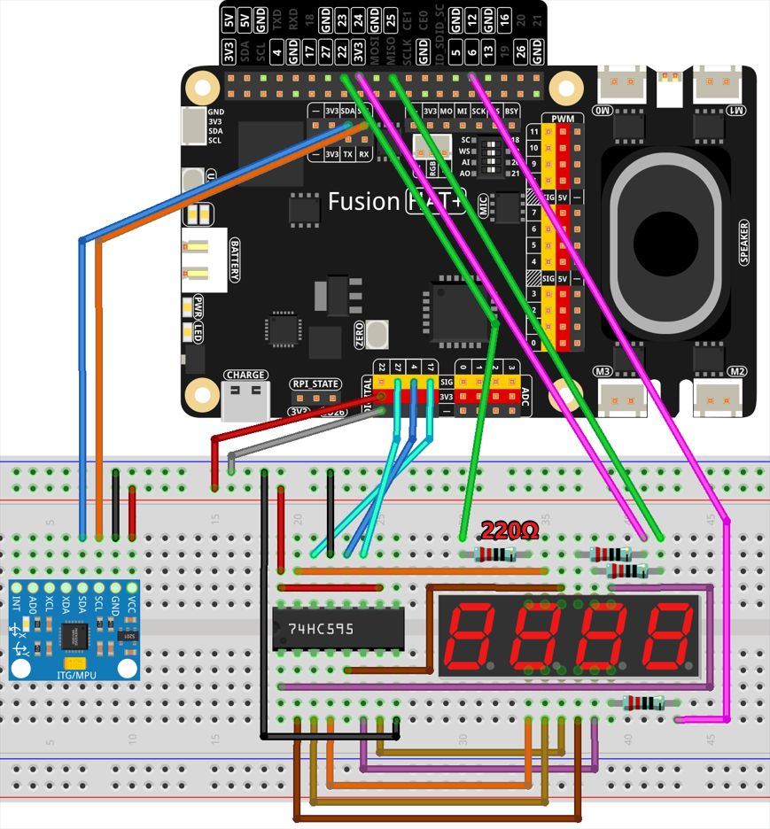

Smart Fitness Assistant
======================================

This project is a smart fitness assistant that helps users track their dumbbell workouts in real-time. Using an MPU6050 accelerometer sensor, the system detects lifting motions, calculates speed, and interacts with OpenAI's API to provide personalized feedback and motivation. The feedback is delivered through text-to-speech (TTS), ensuring a seamless workout experience.

----------------------------------------------

**Features**

- **Motion Detection**: Uses an MPU6050 accelerometer to track dumbbell lifts.
- **Repetition Counting**: Keeps track of the number of lifts performed.
- **Speed Calculation**: Monitors lifting speed to assess consistency and effort.
- **Real-Time Feedback**: Uses OpenAI's API to analyze workout data and generate feedback.
- **Text-to-Speech Output**: Provides spoken feedback to encourage and guide the user.
- **7-Segment Display**: Shows the lift count in real-time.
- **Auto Stop Feature**: Ends the session after 30 seconds of inactivity.

----------------------------------------------

**What You’ll Need**

.. list-table::
    :widths: 30 20
    :header-rows: 1

    *   - COMPONENT
        - PURCHASE LINK

    *   - :ref:`cpn_breadboard`
        - |link_breadboard_buy|
    *   - :ref:`cpn_mpu6050`
        - |link_mpu6050_buy|
    *   - :ref:`cpn_wires`
        - |link_wires_buy|
    *   - :ref:`cpn_resistor`
        - |link_resistor_buy|
    *   - :ref:`cpn_4_digit`
        - \-
    *   - :ref:`cpn_74hc595`
        - |link_74hc595_buy|
    *   - Fusion HAT
        - 
    *   - Raspberry Pi Zero 2 W
        -

----------------------------------------------

**Wiring Diagram**

----------------------------------------------

**Code**

.. raw:: html

   <run></run>

.. code-block:: python

    from fusion_hat import MPU6050, Pin
    from time import sleep,time
    import openai
    from keys import OPENAI_API_KEY
    import sys,os
    import subprocess
    from pathlib import Path

    # gets API Key from environment variable OPENAI_API_KEY
    client = openai.OpenAI(api_key=OPENAI_API_KEY)
    os.system("fusion_hat enable_speaker")

    TTS_OUTPUT_FILE = 'tts_output.mp3'

    instructions_text = '''
    You are a smart fitness assistant. Your task is to analyze the user's dumbbell workout based on the number of lifts and speed data, then provide feedback and recommendations.

    ### Input Format:
    "The number of times you lift dumbbells: [count], Motion data: [(timestamp, speed), (timestamp, speed), ...]"

    ### Output Guidelines:
    1. **If the user stops lifting for 5 seconds**, acknowledge the session's completion and summarize performance.
    2. **Analyze lifting consistency**:
    - If speed varies greatly, suggest maintaining a steady pace.
    - If speed is increasing, praise progress and encourage continued effort.
    - If speed is decreasing, suggest focusing on endurance.
    3. **Encourage based on repetition count**:
    - **<10 reps**: Motivate the user to do more.
    - **10-30 reps**: Encourage consistency.
    - **>30 reps**: Praise the effort and suggest a rest.
    4. **Provide fitness insights**:
    - If the user lifts too fast, suggest controlled movements for muscle engagement.
    - If the user lifts too slow, suggest increasing intensity for better endurance.
    5. **Ensure responses are engaging and motivational**.

    ### Example Inputs & Outputs:

    **Example 1:**
    Input:  
    "The number of times you lift dumbbells: 5, Motion data: [(1700000000, 0.2), (1700000002, 0.25), (1700000004, 0.22)]"

    Output:  
    "You've lifted the dumbbell 5 times. Keep going! Try to maintain a steady rhythm to maximize your gains."

    ---

    **Example 2:**
    Input:  
    "The number of times you lift dumbbells: 35, Motion data: [(1700000000, 0.3), (1700000001, 0.32), (1700000002, 0.31)]"

    Output:  
    "Great job! You've completed 35 reps with excellent consistency. Take a short break and stay hydrated before your next set."

    ---

    **Example 3:**
    Input:  
    "The number of times you lift dumbbells: 20, Motion data: [(1700000000, 0.4), (1700000002, 0.6), (1700000004, 0.2)]"

    Output:  
    "You're at 20 reps, but your speed fluctuates. Try to maintain a controlled pace for better strength gains!"
    '''

    assistant = client.beta.assistants.create(
        name="BOT",
        instructions=instructions_text,
        model="gpt-4-1106-preview",
    )

    thread = client.beta.threads.create()

    def text_to_speech(text):
        speech_file_path = Path(__file__).parent / "speech.mp3"
        with client.audio.speech.with_streaming_response.create(
            model="tts-1",  # Low-latency TTS model for real-time usage
            voice="alloy",  # Selected voice for audio playback
            input=text  # Text to convert to speech
        ) as response:
            response.stream_to_file(speech_file_path) # Save audio to the specified file
        p=subprocess.Popen("mplayer speech.mp3", shell=True, stdout=subprocess.PIPE, stderr=subprocess.STDOUT)
        p.wait()

    # Define GPIO pins for the 74HC595 shift register
    SDI = Pin(17,Pin.OUT)   # Serial Data Input
    RCLK = Pin(4,Pin.OUT)  # Register Clock
    SRCLK = Pin(27,Pin.OUT) # Shift Register Clock

    # Define GPIO pins for digit selection on the 7-segment display
    placePin = [Pin(pin,Pin.OUT) for pin in (23, 24, 25, 12)]

    # Define segment codes for numbers 0-9 for the 7-segment display
    number = (0xc0, 0xf9, 0xa4, 0xb0, 0x99, 0x92, 0x82, 0xf8, 0x80, 0x90)

    def clearDisplay():
        """ Clear the 7-segment display. """
        for _ in range(8):
            SDI.high()
            SRCLK.high()
            SRCLK.low()
        RCLK.high()
        RCLK.low()

    def hc595_shift(data):
        """ Shift a byte of data to the 74HC595 shift register. """
        for i in range(8):
            SDI.value(0x80 & (data << i))  # Set SDI high/low based on data bit
            SRCLK.high()  # Pulse the Shift Register Clock
            SRCLK.low()
        RCLK.high()  # Latch data on the output by pulsing Register Clock
        RCLK.low()

    def pickDigit(digit):
        """ Select a digit for display on the 7-segment display. """
        for pin in placePin:
            pin.low()  # Turn off all digit selection pins
        placePin[digit].high()  # Turn on the selected digit

    def display(count):
        """ Main loop to update the 7-segment display with count value. """
        for i in range(4):  # Loop through each digit
            clearDisplay()  # Clear display before setting new digit
            pickDigit(i)    # Select digit for display

            # Choose the digit of count to display
            digit = (count // (10 ** i)) % 10

            hc595_shift(number[digit])  # Shift digit value to 74HC595
            sleep(0.001)  # Short delay for display stability

    def destroy():
        """ Cleanup GPIO resources and stop timer on exit. """
        global timer1
        timer1.cancel()  # Stop the timer
        for device in [SDI, RCLK, SRCLK] + placePin:
            device.close()  # Close GPIO devices

    mpu = MPU6050()

    # mpu.set_accel_range(MPU6050.ACCEL_RANGE_2G)
    # mpu.set_gyro_range(MPU6050.GYRO_RANGE_250DEG)

    threshold_up = 11  # raise threshold
    threshold_down = 8  # down threshold

    last_state = "down"
    time_last = time()
    last_lift_time = time()
    motion_data = []  # store timestamp for analysis
    speed_list = []
    count = 0

    text_to_speech("Start exercise!")

    while count <= 100:
        time_now = time()  # get current time
        dt = time_now - time_last  # calculate time interval
        time_last = time_now  # update last time

        acc_x, acc_y, acc_z = mpu.get_accel_data()

        # speed calculation
        v = abs(acc_z * dt) 

        # print("v:", v, "acc_z:", acc_z, "time:", dt)

        # detect lift
        if acc_z > threshold_up and last_state == "down":
            count += 1
            last_state = "up"

            # record motion data
            motion_data.append((time_now, v))
            last_lift_time = time_now  # update last_lift_time to current time only when a lift is detected

            print(f"Dumbbell lifts: {count}, Speed: {v:.2f} m/s")

        elif acc_z < threshold_down and last_state == "up":
            last_state = "down"

        # 5s to auto stop
        if time_now - last_lift_time > 30:
            print("No movement detected for 30 seconds. Ending session.")
            break

        display(count)
        sleep(0.2)
    # send data to AI

    try:
        msg = f"Dumbbell lifts: {count}, Motion data: {motion_data}"
        message = client.beta.threads.messages.create(
            thread_id=thread.id,
            role="user",
            content=msg,
        )

        run = client.beta.threads.runs.create_and_poll(
            thread_id=thread.id,
            assistant_id=assistant.id,
        )

        # print("Run completed with status: " + run.status)

        if run.status == "completed":
            messages = client.beta.threads.messages.list(thread_id=thread.id)

            for message in messages.data:
                if message.role == 'assistant':
                    for block in message.content:
                        if block.type == 'text':
                            label = assistant.name
                            value = block.text.value
                            print(f'{label:>10} >>> {value}')
                            text_to_speech(value)
                    break # only last reply

    finally:
        client.beta.assistants.delete(assistant.id)

----------------------------------------------

**Code Explanation**

This project is structured around multiple functionalities:

1. **Initialization and Setup:**

   - The program starts by importing necessary modules and initializing OpenAI's API.
   - It sets up GPIO pins for the 74HC595 shift register and the 7-segment display.
   - The ``MPU6050`` sensor is initialized to read motion data.

2. **Text-to-Speech Function**:

   - This function converts text responses from the AI into speech using OpenAI’s TTS model.
   - The generated audio is played using ``mplayer``.

   .. code-block:: python

       def text_to_speech(text):
           speech_file_path = Path(__file__).parent / "speech.mp3"
           with client.audio.speech.with_streaming_response.create(
               model="tts-1",
               voice="alloy",
               input=text
           ) as response:
               response.stream_to_file(speech_file_path)
           p = subprocess.Popen("mplayer speech.mp3", shell=True, stdout=subprocess.PIPE, stderr=subprocess.STDOUT)
           p.wait()

3. **7-Segment Display Control:**

   - Functions ``hc595_shift``, ``clearDisplay``, and ``display`` control the shift register to update the display.
   - ``display(count)`` is used to show the number of lifts in real-time.

   .. code-block:: python

       def display(count):
           for i in range(4):
               clearDisplay()
               pickDigit(i)
               digit = (count // (10 ** i)) % 10
               hc595_shift(number[digit])
               sleep(0.001)

4. **Workout Tracking Logic:**

   - Reads acceleration data from ``MPU6050``.
   - Calculates the speed of motion.
   - Detects when a dumbbell is lifted and counts repetitions.
   - Stores motion data for analysis.
   - Ends the session if no movement is detected for 30 seconds.

   .. code-block:: python

       while count <= 100:
           time_now = time()
           dt = time_now - time_last
           time_last = time_now
           acc_x, acc_y, acc_z = mpu.get_accel_data()
           v = abs(acc_z * dt)

           if acc_z > threshold_up and last_state == "down":
               count += 1
               last_state = "up"
               motion_data.append((time_now, v))
               last_lift_time = time_now
               print(f"Dumbbell lifts: {count}, Speed: {v:.2f} m/s")
           elif acc_z < threshold_down and last_state == "up":
               last_state = "down"

           if time_now - last_lift_time > 30:
               print("No movement detected for 30 seconds. Ending session.")
               break

           display(count)
           sleep(0.2)

5. **AI Feedback Generation:**

   - Sends motion data and repetition count to OpenAI.
   - The AI analyzes the data and generates motivational feedback.
   - The feedback is spoken using TTS.

   .. code-block:: python

       msg = f"Dumbbell lifts: {count}, Motion data: {motion_data}"
       message = client.beta.threads.messages.create(
           thread_id=thread.id,
           role="user",
           content=msg,
       )

       run = client.beta.threads.runs.create_and_poll(
           thread_id=thread.id,
           assistant_id=assistant.id,
       )

       if run.status == "completed":
           messages = client.beta.threads.messages.list(thread_id=thread.id)
           for message in messages.data:
               if message.role == 'assistant':
                   for block in message.content:
                       if block.type == 'text':
                           print(f'BOT >>> {block.text.value}')
                           text_to_speech(block.text.value)
                   break

6. **Cleanup and Exit:**

   - The program ensures resources are cleaned up properly on exit.
   - GPIO pins are reset.
   - The AI assistant instance is deleted.

   .. code-block:: python

       finally:
           client.beta.assistants.delete(assistant.id)

----------------------------------------------

**Debugging Tips**

- **No movement detected?**

  - Check that the MPU6050 sensor is correctly connected and configured.
  - Print raw acceleration data to confirm it's being read correctly.

- **Incorrect repetition count?**

  - Adjust the ``threshold_up`` and ``threshold_down`` values to better detect lifts.
  - Ensure noise in acceleration readings is minimized.

- **No AI response?**

  - Verify your OpenAI API key is correctly set up.
  - Ensure network connectivity for API calls.
  - Add print statements to debug response statuses from OpenAI.

- **No speech output?**

  - Check if ``mplayer`` is installed and working.
  - Ensure TTS output files are being generated correctly.

