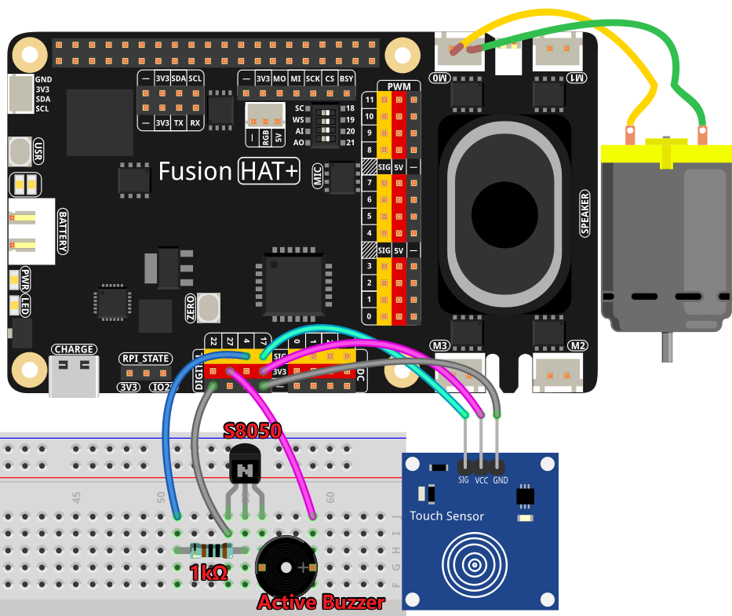

Voice-Controlled Fan
================================================

This project is a voice-controlled fan speed regulator powered by OpenAI's API. Users can give voice commands to adjust the speed of a motor, which acts as the fan. The system utilizes a microphone for voice input, a motor driver to control fan speed, and a buzzer for auditory feedback. It ensures a seamless interaction by recognizing speech, processing commands through AI, and dynamically adjusting the fan's speed.

----------------------------------------------

**Features**

- **Voice-Controlled Fan Speed**: Users can increase, decrease, or stop the fan with voice commands.
- **Real-Time Speed Adjustment**: The system ensures the speed stays within the valid range (0-100%).
- **Touch Sensor for Speed Increase**: A physical touch sensor allows manual speed adjustments.
- **Buzzer Feedback**: Provides an audible beep for user interactions.
- **AI-Based Command Processing**: OpenAI's GPT-4 interprets user requests and generates JSON-formatted responses.
- **Speech-to-Text Conversion**: Uses OpenAI’s Whisper model for speech recognition.
- **Dynamic Noise Adjustment**: The system adapts to background noise for accurate speech recognition.

----------------------------------------------

**What You’ll Need**

.. list-table::
    :widths: 30 20
    :header-rows: 1

    *   - COMPONENT
        - PURCHASE LINK

    *   - :ref:`cpn_wires`
        - |link_wires_buy|
    *   - :ref:`cpn_resistor`
        - |link_resistor_buy|
    *   - :ref:`cpn_buzzer`
        - |link_passive_buzzer_buy|
    *   - :ref:`cpn_transistor`
        - |link_transistor_buy|
    *   - :ref:`cpn_motor`
        - |link_motor_buy|
    *   - :ref:`cpn_touch_switch`
        - |link_touch_buy|
    *   - Fusion HAT
        - 
    *   - Raspberry Pi Zero 2 W
        -

----------------------------------------------

**Wiring Diagram**

----------------------------------------------

**Code**

.. raw:: html

   <run></run>
   
.. code-block:: python

   import openai
   from keys import OPENAI_API_KEY
   import sys
   import os
   import time
   import speech_recognition as sr
   from fusion_hat import Motor,PWM,Pin,Buzzer

   # gets API Key from environment variable OPENAI_API_KEY
   client = openai.OpenAI(api_key=OPENAI_API_KEY)

   os.system("fusion_hat enable_speaker")

   TTS_OUTPUT_FILE = 'tts_output.mp3'

   instructions_text = '''
   You are a fan control assistant. Your task is to interpret the user's speech input and adjust the motor speed accordingly.

   ### Input Format:
   "current speed: [value], message: [user command]"

   ### Output Guidelines:
   1. If the user requests a speed change, provide a response in JSON format:
      {"speed": <new_speed>, "message": "<response text>"}
   2. If the user does not mention speed, acknowledge their input and provide relevant information.
   3. Ensure the new speed stays within a 0-100 range.
   4. If the user asks about the current speed, return a friendly status update.

   ### Example Inputs & Outputs:

   **Example 1:**
   Input: "current speed: 30, message: increase speed"
   Output: {"speed": 40, "message": "Speed increased to 40%."}

   **Example 2:**
   Input: "current speed: 100, message: stop the motor"
   Output: {"speed": 0, "message": "Fan stopped."}

   **Example 3:**
   Input: "current speed: 50, message: What is my current speed?"
   Output: {"speed": 50, "message": "Your current speed is 50%."}
   '''

   # assistant=client.beta.assistants.retrieve(OPENAI_ASSISTANT_ID)
   assistant = client.beta.assistants.create(
      name="BOT",
      instructions=instructions_text,
      model="gpt-4-1106-preview",
   )

   thread = client.beta.threads.create()
   recognizer = sr.Recognizer()
   os.system("fusion_hat enable_speaker")

   # speech_recognition init
   # =================================================================
   recognizer.dynamic_energy_adjustment_damping = 0.15
   recognizer.dynamic_energy_ratio = 1
   recognizer.operation_timeout = None  # seconds after an internal operation (e.g., an API request) starts before it times out, or ``None`` for no timeout
   recognizer.pause_threshold = 1

   def speech_to_text(audio_file):
      from io import BytesIO

      wav_data = BytesIO(audio_file.get_wav_data())
      wav_data.name = "record.wav"

      transcription = client.audio.transcriptions.create(
         model="whisper-1", 
         file=wav_data,
         language=['zh','en']
      )
      return transcription.text

   def redirect_error_2_null():
      # https://github.com/spatialaudio/python-sounddevice/issues/11

      devnull = os.open(os.devnull, os.O_WRONLY)
      old_stderr = os.dup(2)
      sys.stderr.flush()
      os.dup2(devnull, 2)
      os.close(devnull)
      return old_stderr

   def cancel_redirect_error(old_stderr):
      os.dup2(old_stderr, 2)
      os.close(old_stderr)

   motor = Motor('M0')
   touch_sensor = Pin(17, Pin.IN, pull = Pin.PULL_DOWN) 
   buzzer = Buzzer(Pin(4))
   speed = 0

   def beep():
      buzzer.on()
      time.sleep(0.1)
      buzzer.off()

   last_triggered = 0 

   def speed_up():
      global speed,last_triggered
      if time.time() - last_triggered < 0.5:  # 500ms debounce
         return
      last_triggered = time.time()
      speed += 10
      beep()
      if speed > 100:
         motor.stop()
         speed = 0
      else:
         motor.speed(speed)

   touch_sensor.when_activated = speed_up

   try:
      while True:
         msg = ""
         # Notify user that recording has started
         print(f'\033[1;30m{"listening... "}\033[0m')
         # Redirect error messages to suppress ALSA warnings
         _stderr_back = redirect_error_2_null() 
         with sr.Microphone(chunk_size=8192) as source:
               # Restore standard error output
               cancel_redirect_error(_stderr_back)
               # Adjust for ambient noise to filter background sound
               recognizer.adjust_for_ambient_noise(source)
               # Record user speech
               audio = recognizer.listen(source)
         print(f'\033[1;30m{"stop listening... "}\033[0m')

         # Convert recorded audio to text
         msg = speech_to_text(audio)

         if msg == False or msg == "":
               print() # new line
               continue
         
         beep()

         send_message= "current speed:"+ str(speed) + "message:" + msg

         message = client.beta.threads.messages.create(
               thread_id=thread.id,
               role="user",
               content=send_message,
         )

         run = client.beta.threads.runs.create_and_poll(
               thread_id=thread.id,
               assistant_id=assistant.id,
         )

         if run.status == "completed":
               messages = client.beta.threads.messages.list(thread_id=thread.id)

               for message in messages.data:
                  if message.role == 'user':
                     for block in message.content:
                           if block.type == 'text':
                              label = message.role 
                              value = block.text.value
                              print(f'{label:>10} >>> {value}')
                     break # only last reply

               for message in messages.data:
                  if message.role == 'assistant':
                     for block in message.content:
                           if block.type == 'text':
                              label = assistant.name
                              value = block.text.value
                              # print(f"Raw AI Response: {value}")
                              try:
                                 value = eval(value)
                              except Exception as e:
                                 value = str(value)
                              if isinstance(value, dict):
                                 if 'speed' in value:
                                       speed = value['speed']
                                 else:
                                       speed = -1
                                 if 'message' in value:
                                       text = value['message']
                                 else :
                                       text = ''
                              else:
                                 speed = -1
                                 text = value

                              print(f'{label:>10} >>> {text} {speed}')

                              if speed >= 0:
                                 motor.speed(speed)

                     break # only last reply

   finally:
      client.beta.assistants.delete(assistant.id)
      buzzer.off()
      motor.stop()

----------------------------------------------

**Code Explanation**

This project consists of several key functional components:

1. **Initialization and Setup:**

   - Imports necessary libraries, including OpenAI for AI processing and ``speech_recognition`` for speech input.
   - Sets up the OpenAI client using ``OPENAI_API_KEY``.
   - enable the microphone by ``os.system("fusion_hat enable_speaker")``.
   - Initializes hardware components, including the motor, buzzer, and touch sensor.

2. **Speech Recognition**:

   - Converts recorded audio into text using OpenAI’s Whisper model.
   - Supports multiple languages (``zh``, ``en``).

   .. code-block:: python

       def speech_to_text(audio_file):
           from io import BytesIO
           wav_data = BytesIO(audio_file.get_wav_data())
           wav_data.name = "record.wav"
           transcription = client.audio.transcriptions.create(
               model="whisper-1",
               file=wav_data,
               language=['zh','en']
           )
           return transcription.text

3. **Touch Sensor Handling (``speed_up``)**:

   - A touch sensor allows manual speed adjustments.
   - Debounce logic prevents accidental multiple triggers.
   - Increments speed by 10% per touch, resetting to 0% if exceeding 100%.

   .. code-block:: python

       def speed_up():
           global speed, last_triggered
           if time.time() - last_triggered < 0.5:
               return
           last_triggered = time.time()
           speed += 10
           beep()
           if speed > 100:
               motor.stop()
               speed = 0
           else:
               motor.speed(speed)

4. **Voice Command Processing:**

   - Captures user speech and converts it into text.
   - Sends the transcribed text to OpenAI’s assistant along with the current fan speed.
   - The AI returns a JSON response containing the new speed and a textual response.

   .. code-block:: python

       send_message= "current speed:"+ str(speed) + "message:" + msg
       message = client.beta.threads.messages.create(
           thread_id=thread.id,
           role="user",
           content=send_message,
       )
       run = client.beta.threads.runs.create_and_poll(
           thread_id=thread.id,
           assistant_id=assistant.id,
       )

5. **AI Response Processing:**

   - Extracts speed and message from the AI’s JSON response.
   - Updates the motor speed accordingly.

   .. code-block:: python

       for message in messages.data:
           if message.role == 'assistant':
               for block in message.content:
                   if block.type == 'text':
                       value = eval(block.text.value)
                       if isinstance(value, dict):
                           speed = value.get('speed', -1)
                           text = value.get('message', '')
                       print(f'BOT >>> {text} {speed}')
                       if speed >= 0:
                           motor.speed(speed)

6. **Error Handling and Cleanup:**

   - Suppresses ALSA warnings to prevent unnecessary errors.
   - Ensures OpenAI assistant is deleted and hardware is reset upon exit.

   .. code-block:: python

       finally:
           client.beta.assistants.delete(assistant.id)
           buzzer.off()
           motor.stop()

----------------------------------------------

**Debugging Tips**

- **Speech recognition not working?**

  - Increase ``recognizer.adjust_for_ambient_noise(source)`` duration if background noise is interfering.

- **Fan speed not updating?**

  - Check the OpenAI API response format to ensure JSON is correctly parsed.
  - Verify that ``motor.speed(speed)`` is being executed with the expected value.

- **Touch sensor not responding?**

  - Add print statements to ``speed_up()`` to confirm it is being triggered.
  - Ensure proper pull-down configuration for the GPIO pin.

- **Buzzer not making sound?**

  - Check that ``buzzer.on()`` and ``buzzer.off()`` are properly called.
  - Ensure GPIO output is enabled for the buzzer pin.

