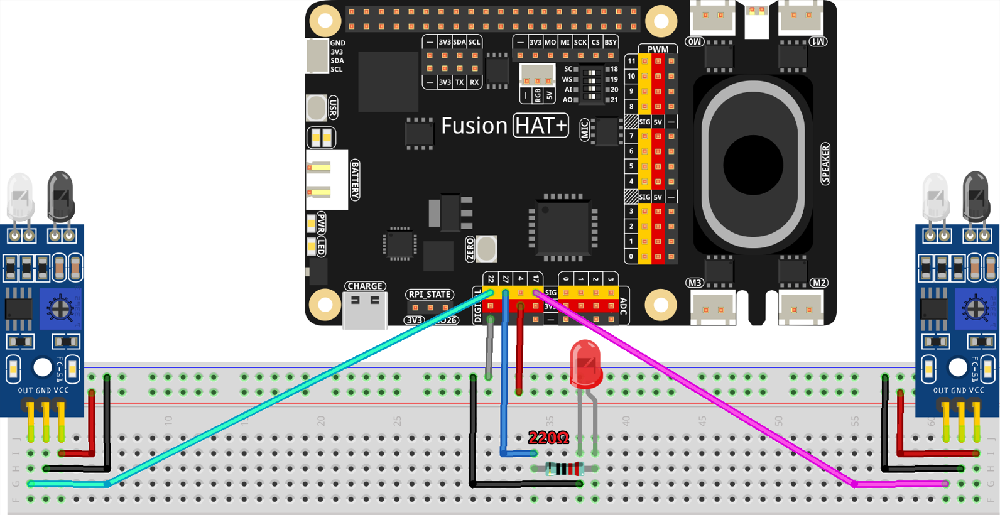

2.6 Hand-wave Interaction System
======================================

This project is a gesture interaction system that utilizes two infrared obstacle avoidance sensors to detect hand waves. The system sends detected sensor events to an OpenAI-powered assistant, which analyzes the time difference between sensor activations to determine the nature of the user's hand movement. Based on the analysis, the assistant generates relevant responses, such as recognizing a wave gesture and responding accordingly.

-----------------------------------

**Features**

- **Dual Infrared Sensor Input**: Detects hand motion using two sensors placed 10 cm apart.
- **Real-Time Gesture Recognition**: Determines the direction, speed, and type of hand waves.
- **AI-Based Interpretation**: Sends sensor trigger data to OpenAI for processing and response generation.
- **LED Indicator**: Signals system status during gesture recognition.
- **Event-Driven Execution**: Uses GPIO callbacks for efficient real-time detection.

-----------------------------------

**What You’ll Need**

.. list-table::
    :widths: 30 20
    :header-rows: 1

    *   - COMPONENT
        - PURCHASE LINK

    *   - :ref:`cpn_avoid_module`
        - |link_obstacle_avoidance_buy|
    *   - :ref:`cpn_wires`
        - |link_wires_buy|
    *   - :ref:`cpn_resistor`
        - |link_resistor_buy|
    *   - :ref:`cpn_led`
        - |link_led_buy|
    *   - Fusion HAT
        - 
    *   - Raspberry Pi Zero 2 W
        -

-----------------------------------

**Wiring Diagram**

----------------------------------------------

**Running the Example**

All example code used in this tutorial is available in the ``ai-explorer-lab-kit`` directory. 
Follow these steps to run the example:

.. code-block:: shell
   
   cd ~/ai-explorer-lab-kit/gpt_example/
   sudo ~/my_venv/bin/python3 gpt_fun_hand_wave.py 

-----------------------------------

**Code**

.. raw:: html

   <run></run>

.. code-block:: python

   import openai
   from keys import OPENAI_API_KEY
   import time
   from fusion_hat import Pin
   from signal import pause

   # init openai
   client = openai.OpenAI(api_key=OPENAI_API_KEY)

   assistant = client.beta.assistants.create(
      name="BOT",
      instructions="You function as a gesture interaction device equipped with two infrared obstacle avoidance sensors positioned approximately 10 cm apart. You will receive trigger information from these sensors in the format: {('left', timestamp), ('right', timestamp)}. Based on the time difference between these triggers, determine if the user is waving their hand. Provide appropriate responses, such as 'You waved quickly from left to right, hello!' or 'You waved slowly twice on the left side, hello!'.",
      model="gpt-4-1106-preview",
   )

   thread = client.beta.threads.create()

   # setup GPIO
   sensor_left = Pin(17, Pin.IN, Pin.PULL_UP)
   sensor_right = Pin(22, Pin.IN, Pin.PULL_UP)
   led = Pin(27, Pin.OUT)  # indicate LED connect to GPIO 27
   led.on()

   # store timestamp of sensor triggered
   events = []

   def sensor_triggered(sensor_id):
      global events
      timestamp = time.time()
      events.append((sensor_id, timestamp))
      print(f"Sensor {sensor_id} triggered at {timestamp}")

      # when sensor triggered twice, analyze the hand wave
      if len(events) >= 2:
         analyze_hand_wave()

   def analyze_hand_wave():
      global events
      # insure the events list has at least two elements
      if len(events) < 2:
         return
      print("Start analyzing hand wave...")
      led.off()

      # send events to AI for decoding
      try:
         message = client.beta.threads.messages.create(
               thread_id=thread.id,
               role="user",
               content=str(events),
         )

         run = client.beta.threads.runs.create_and_poll(
               thread_id=thread.id,
               assistant_id=assistant.id,
         )

         # print("Run completed with status: " + run.status)

         if run.status == "completed":
               messages = client.beta.threads.messages.list(thread_id=thread.id)

               for message in messages.data:
                  if message.role == 'assistant':
                     for block in message.content:
                           if block.type == 'text':
                              decoded_message = block.text.value
                     break # only last reply

         print(f"Decoded Message: {decoded_message}")

         # clear events list
         events.clear()
         led.on()

      except Exception as e:
         print(f"Error in AI processing: {e}")

   # set sensor callbacks
   sensor_left.when_activated = lambda: sensor_triggered('left')
   sensor_right.when_activated = lambda: sensor_triggered('right')

   try:
      print("Press CTRL+C to exit.")
      pause()

   finally:
      print("Resources cleaned up. Exiting.")
      client.beta.assistants.delete(assistant.id)
      

-----------------------------------

**Code Explanation**

This project is divided into multiple key functional components:

1. **Initialization and Setup:**

   - Imports necessary modules, including ``openai`` for AI processing and ``fusion_hat`` for GPIO handling.
   - Initializes the OpenAI API client with ``OPENAI_API_KEY``.
   - Configures GPIO pins for the left and right sensors, as well as an LED indicator.

2. **Sensor Event Handling**:

   - Each time a sensor is triggered, the timestamp and sensor ID are recorded in ``events``.
   - If at least two events are detected, the system calls ``analyze_hand_wave`` to determine the gesture.

   .. code-block:: python

       def sensor_triggered(sensor_id):
           global events
           timestamp = time.time()
           events.append((sensor_id, timestamp))
           print(f"Sensor {sensor_id} triggered at {timestamp}")

           if len(events) >= 2:
               analyze_hand_wave()

3. **Hand Wave Analysis**:

   - Verifies that at least two sensor triggers exist.
   - Sends the recorded sensor event data to OpenAI for interpretation.
   - Receives and processes the AI response, which describes the gesture.

   .. code-block:: python

       def analyze_hand_wave():
           global events
           if len(events) < 2:
               return
           print("Start analyzing hand wave...")
           led.off()

           try:
               message = client.beta.threads.messages.create(
                   thread_id=thread.id,
                   role="user",
                   content=str(events),
               )

               run = client.beta.threads.runs.create_and_poll(
                   thread_id=thread.id,
                   assistant_id=assistant.id,
               )

               if run.status == "completed":
                   messages = client.beta.threads.messages.list(thread_id=thread.id)
                   for message in messages.data:
                       if message.role == 'assistant':
                           for block in message.content:
                               if block.type == 'text':
                                   decoded_message = block.text.value
                           break
               print(f"Decoded Message: {decoded_message}")
               events.clear()
               led.on()
           except Exception as e:
               print(f"Error in AI processing: {e}")

4. **AI Integration and Response Processing:**

   - Uses OpenAI’s GPT-4 model to analyze hand motion patterns.
   - Determines wave characteristics, such as speed and direction.
   - Responds with an appropriate message based on movement patterns.

5. **System Loop and Cleanup:**

   - Uses ``pause()`` to keep the program running indefinitely.
   - On exit (e.g., via ``CTRL+C``), cleans up resources and deletes the OpenAI assistant instance.

   .. code-block:: python

       try:
           print("Press CTRL+C to exit.")
           pause()
       finally:
           print("Resources cleaned up. Exiting.")
           client.beta.assistants.delete(assistant.id)

-----------------------------------

**Debugging Tips**

- **No sensor triggers detected?**

  - Ensure the infrared sensors are correctly wired and powered.
  - Print raw sensor readings to verify their functionality.

- **AI not responding?**

  - Confirm your OpenAI API key is valid and properly set.
  - Check network connectivity to ensure API calls are successful.

- **Incorrect gesture interpretation?**

  - Verify that sensor timestamps are correctly recorded.
  - Increase the distance between sensors if wave detection is too sensitive.

- **LED not turning on/off?**

  - Confirm the GPIO pin assignments match the hardware setup.
  - Ensure the ``led.on()`` and ``led.off()`` functions are correctly called.

