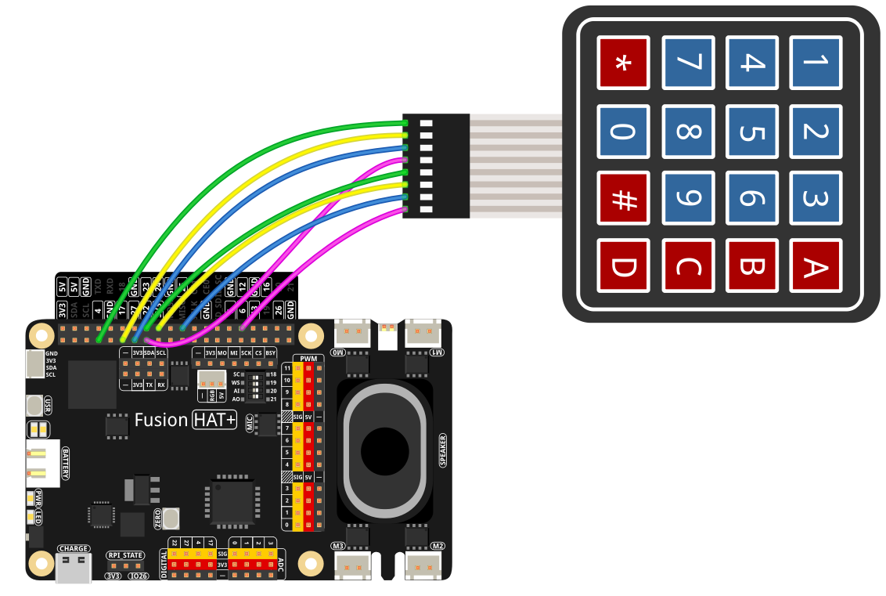

2.7 MBTI Personality Test
======================================

In this example, you will learn how to build a simple MBTI (Myers-Briggs Type Indicator) personality test using OpenAI’s GPT model and a 4x4 keypad on a Raspberry Pi (or similar hardware). 

Users respond to questions by pressing keys on the keypad, and the GPT assistant will generate the corresponding MBTI result once all questions are answered.

----------------------------------------------

**Features**

1. **User enters a key** on the 4x4 keypad, representing how strongly they agree or disagree with a statement (1 to 5).  
2. **The code sends** that key press as a user message to GPT.  
3. **GPT** returns the next question or a summary of the results, following the provided instructions.  
4. **This loop** continues until all 10 questions have been answered, and GPT provides a final MBTI summary.

----------------------------------------------

**What You’ll Need**

The following components are required for this project:

.. list-table::
    :widths: 30 20
    :header-rows: 1

    *   - COMPONENT INTRODUCTION
        - PURCHASE LINK

    *   - :ref:`cpn_keypad`
        - |link_keypad_buy|
    *   - :ref:`cpn_wires`
        - |link_wires_buy|
    *   - Fusion HAT
        - 
    *   - Raspberry Pi Zero 2 W
        -

----------------------------------------------

**Diagram**

----------------------------------------------

**Running the Example**

All example code used in this tutorial is available in the ``ai-explorer-lab-kit`` directory. 
Follow these steps to run the example:

.. code-block:: shell
   
   cd ~/ai-explorer-lab-kit/gpt_example/
   sudo ~/my_venv/bin/python3 gpt_fun_mbti.py 

----------------------------------------------

**Code**

.. raw:: html

   <run></run>

.. code-block:: python
      
   import openai
   from keys import OPENAI_API_KEY
   import sys
   from fusion_hat import Keypad

   # Initialize OpenAI client
   client = openai.OpenAI(api_key=OPENAI_API_KEY)

   instructions_text = '''
   You are an MBTI personality test assistant. Your role is to ask me a series of personality-related questions and assess my MBTI type based on my responses. Please follow these guidelines:

   1. **Rules Overview**: Before asking, briefly explain how the test works and how I should answer.
   2. **Numbered Questions**: Each question must be labeled with a number (e.g., “Question 1: …,” “Question 2: …”) for clarity.
   3. **Answer Format**: I will respond with a number from 1 to 5, where:
      - 1: Strongly disagree
      - 2: Disagree
      - 3: Neutral
      - 4: Agree
      - 5: Strongly agree
   4. **Question Count**: After I have answered 10 questions, please use my responses to generate my MBTI result and provide a concise explanation.
   5. **Style Requirements**: Maintain a concise, friendly tone without adding extraneous details.

   Once all 10 questions are answered, please provide a summary and give me the final MBTI result.
   '''

   # Create or retrieve the assistant
   assistant = client.beta.assistants.create(
      name="MBTI_Assistant",
      instructions=instructions_text,
      model="gpt-4-1106-preview",
   )

   # Create a conversation thread
   thread = client.beta.threads.create()

   def process_user_input(keypad, count):
      """
      Handles user input through the keypad or initiates the test.
      """
      if count == 0:
         return "10 questions to test personality! Let's go!", count + 1

      while True:
         pressed_keys = keypad.read()
         if pressed_keys:
               print(f"Key pressed: {pressed_keys}")
               return pressed_keys[0], count + 1

   try:
      # Configure rows, columns, and keypad layout
      rows_pins = [4, 17, 27, 22]
      cols_pins = [23, 24, 25, 12]
      keys = ["1", "2", "3", "A",
               "4", "5", "6", "B",
               "7", "8", "9", "C",
               "*", "0", "#", "D"]

      keypad = Keypad(rows_pins, cols_pins, keys)
      count = 0

      while count<=10:

         msg = ""
         msg, count = process_user_input(keypad, count)

         if msg == False or msg == "":
               print() # new line
               continue

         message = client.beta.threads.messages.create(
               thread_id=thread.id,
               role="user",
               content=msg,
         )

         run = client.beta.threads.runs.create_and_poll(
               thread_id=thread.id,
               assistant_id=assistant.id,
            )

         if run.status == "completed":
               messages = client.beta.threads.messages.list(thread_id=thread.id)

               for message in messages.data:
                  if message.role == 'user':
                     for block in message.content:
                           if block.type == 'text':
                              label = message.role 
                              value = block.text.value
                              print(f'{label:>10} >>> {value}')
                     break # only last reply

               for message in messages.data:
                  if message.role == 'assistant':
                     for block in message.content:
                           if block.type == 'text':
                              label = assistant.name
                              value = block.text.value
                              print(f'{label:>10} >>> {value}')
                     break # only last reply

      input("\n Press enter for quit.")

   finally:
      client.beta.assistants.delete(assistant.id)
      print("\n Delete Assistant ID")

----------------------------------------------

**Code Explanation**

1. **Import Libraries**

   * ``openai``: Interacts with the OpenAI API.
   * ``fusion_hat``: Manages GPIO pins for controlling digital output devices (keypad rows) and buttons (keypad columns).
   * ``sys``: Handles system-specific functions like reading command-line arguments (though not heavily used here).

2. **Initialize OpenAI Client**

   .. code-block:: python

      client = openai.OpenAI(api_key=OPENAI_API_KEY)

   This sets up your client instance using the API key from the ``keys.py`` file.

3. **Instructions for GPT Assistant**

   .. code-block:: python

      instructions_text = '''
         ...
      '''
      assistant = client.beta.assistants.create(
         ...
      )

   * **instructions_text** describes how the assistant should behave.  
   * **create**: Creates a GPT assistant with the specified instructions and model.

4. **Conversation Thread**

   .. code-block:: python

      thread = client.beta.threads.create()

   A conversation thread maintains context between your user messages and the assistant's responses.

5. **User Input Processing**

   .. code-block:: python

      def process_user_input(keypad, count):
          ...

   * If ``count == 0``, returns an introductory message to start the test.  
   * Otherwise, reads pressed keys from the keypad.  
   * Each key press is returned, and the count is incremented.

6. **Main Loop**

   .. code-block:: python

      while count <= 10:
          msg, count = process_user_input(keypad, count)
          ...

   * Repeats until the user has answered 10 questions.  
   * Sends the message (``msg``) to the GPT assistant and retrieves the assistant's response.

7. **OpenAI Assistant Calls**

   .. code-block:: python

      message = client.beta.threads.messages.create(...)
      run = client.beta.threads.runs.create_and_poll(...)

   * ``create``: Creates a user message in the thread.  
   * ``create_and_poll``: Runs the assistant and polls until completion.

8. **Response Handling**

   .. code-block:: python

      if run.status == "completed":
          messages = client.beta.threads.messages.list(thread_id=thread.id)
          ...

   * Iterates through ``messages.data`` to find the assistant's final response (``role == 'assistant'``).
   * Prints the user and assistant messages.

9. **Cleanup**

   .. code-block:: python

      finally:
         client.beta.assistants.delete(assistant.id)
         print("\n Delete Assistant ID")

   * Deletes the assistant instance upon exit, ensuring no leftover resources.

----------------------------------------------

**Debugging Tips**

1. **Keypad Not Responding:**

   * Ensure that the row and column pins are correctly connected to the GPIO pins.
   * Verify that the ``fusion_hat`` library is installed and properly configured for your setup.

2. **GPT Assistant Not Responding:**

   * Check your API key and assistant ID in ``keys.py``.
   * Make sure the assistant is created successfully by verifying the assistant status with ``client.beta.assistants.retrieve(assistant_id)``.

3. **Response Format Errors from GPT:**

   * If GPT’s response is not in the expected format, use ``print(f"Raw Response: {value}")`` to inspect the returned data.
   * Double-check the instructions provided to GPT, ensuring they clearly define the expected output structure.

4. **General Debugging:**

   * Use print statements at critical points in the code to track variable values, like ``msg``, ``count``, and the assistant's responses.
   * Add error handling to catch unexpected issues and provide useful debug information.
