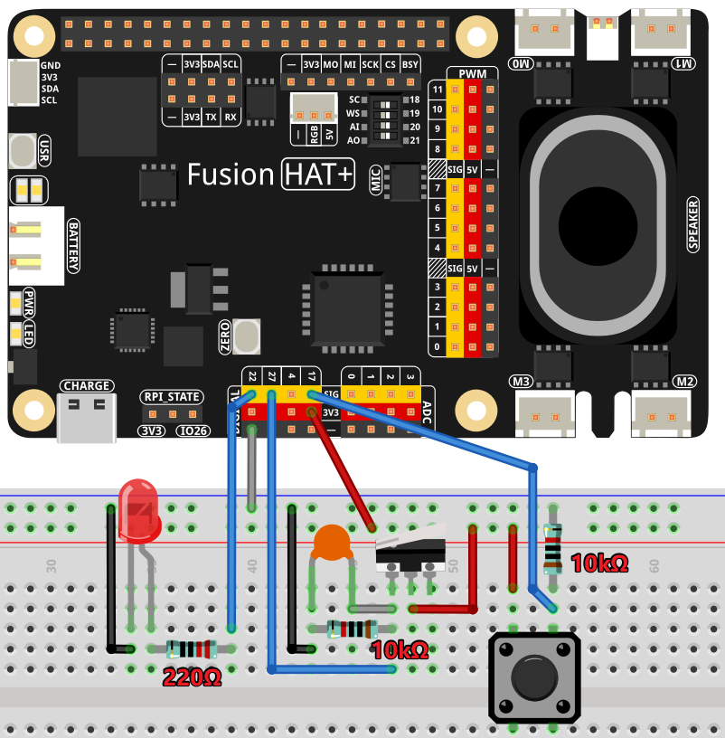

2.8 Morse Code Decoder
============================

This project is a Morse code decoder that interprets button presses as Morse code signals. Short presses are recognized as dots, and long presses as dashes. The system collects these inputs and sends them to an OpenAI-powered assistant for decoding. Once decoded, the translated message is displayed on the console.

----------------------------------------------

**Features**

- **Morse Code Input**: Button presses represent Morse code signals.
- **Real-Time Signal Processing**: Captures press and release times to distinguish between dots and dashes.
- **AI-Based Decoding**: Sends Morse sequences to OpenAI for interpretation.
- **Start/Stop Button**: Controls the input session.
- **LED Indicator**: Signals when Morse input is active.

----------------------------------------------

**What You’ll Need**

To complete this project, you will need the following components:

.. list-table::
    :widths: 30 20
    :header-rows: 1

    *   - COMPONENT
        - PURCHASE LINK

    *   - :ref:`cpn_breadboard`
        - |link_breadboard_buy|
    *   - :ref:`cpn_wires`
        - |link_wires_buy|
    *   - :ref:`cpn_resistor`
        - |link_resistor_buy|
    *   - :ref:`cpn_led`
        - |link_led_buy|
    *   - :ref:`cpn_button`
        - |link_button_buy|
    *   - :ref:`cpn_micro_switch`
        - \-
    *   - :ref:`cpn_capacitor`
        - |link_capacitor_buy|        
    *   - Fusion HAT
        - 
    *   - Raspberry Pi Zero 2 W
        -

----------------------------------------------

**Wiring Diagram**

----------------------------------------------

**Running the Example**

All example code used in this tutorial is available in the ``ai-explorer-lab-kit`` directory. 
Follow these steps to run the example:

.. code-block:: shell
   
   cd ~/ai-explorer-lab-kit/gpt_example/
   sudo ~/my_venv/bin/python3 gpt_fun_morse_decoder.py 

----------------------------------------------

**Code**

.. raw:: html

   <run></run>

.. code-block:: python

    import openai
    from keys import OPENAI_API_KEY
    from fusion_hat import Pin
    from signal import pause
    import time

    # init openai
    client = openai.OpenAI(api_key=OPENAI_API_KEY)

    assistant = client.beta.assistants.create(
        name="BOT",
        instructions="You are a Morse code decoder. Decode based on the button press time, interpreting short presses as dots and long presses as dashes. The message you receive may be a word or a sentence, please decode it and output it.",
        model="gpt-4-1106-preview",
    )

    thread = client.beta.threads.create()

    # setup GPIO
    morse_input = Pin(22, Pin.IN, pull= Pin.PULL_DOWN)  
    start_stop_button = Pin(17, Pin.IN, pull= Pin.PULL_DOWN)  
    led = Pin(27, Pin.OUT)  # indicate LED to GPIO 27

    # store the morse code events
    morse_events = []
    input_active = False  # flag to indicate if the input is active

    # send the morse code to the AI for decoding
    def decode_and_speak():
        global morse_events
        try:
            message = client.beta.threads.messages.create(
                thread_id=thread.id,
                role="user",
                content=str(morse_events),
            )

            run = client.beta.threads.runs.create_and_poll(
                thread_id=thread.id,
                assistant_id=assistant.id,
        )

            # print("Run completed with status: " + run.status)

            if run.status == "completed":
                messages = client.beta.threads.messages.list(thread_id=thread.id)

                for message in messages.data:
                    if message.role == 'assistant':
                        for block in message.content:
                            if block.type == 'text':
                                decoded_message = block.text.value
                        break # only last reply

            print(f"Decoded Message: {decoded_message}")
        except Exception as e:
            print(f"Error in decoding: {e}")
        morse_events = []  # clear the morse code events

    # morse code input
    start_time = 0

    def morse_input_pressed():
        global start_time
        start_time = time.time()  

    def morse_input_released():
        release_time = time.time()  
        if release_time - start_time < 0.1:
            return  # debounce
        morse_events.append(('pressed', start_time))
        morse_events.append(('released', release_time))
        print(f" Pressed at {start_time}-{release_time}")

    # start/stop button
    def handle_start_stop():
        global input_active
        if input_active:
            led.off()
            print("Input stopped and decoded.")
            decode_and_speak()
            input_active = False
        else:
            input_active = True
            morse_events.clear()
            led.on()
            print("Input started.")

    # add event listeners
    morse_input.when_activated = morse_input_pressed
    morse_input.when_deactivated = morse_input_released
    start_stop_button.when_activated = handle_start_stop

    try:
        print("Morse Code Decoder is running. Press CTRL+C to exit.")
        handle_start_stop()
        pause()

    finally:
        client.beta.assistants.delete(assistant.id)
        print("\n Delete Assistant ID")

----------------------------------------------

**Code Explanation**

This project is structured into several key functional components:

1. **Initialization and Setup:**

   - Imports necessary modules, including ``openai`` for AI processing and ``fusion_hat`` for GPIO handling.
   - Sets up OpenAI API client using ``OPENAI_API_KEY``.
   - Configures GPIO pins for Morse input, a start/stop button, and an LED indicator.

2. **Morse Code Input Handling:**

   - Records timestamps for button press and release events.
   - Uses the duration of a press to determine if it is a dot or a dash.

   .. code-block:: python

       def morse_input_pressed():
           global start_time
           start_time = time.time()
       
       def morse_input_released():
           release_time = time.time()
           if release_time - start_time < 0.1:
               return  # debounce
           morse_events.append(('pressed', start_time))
           morse_events.append(('released', release_time))
           print(f" Pressed at {start_time}-{release_time}")

3. **Start/Stop Button Handling:**

   - Controls when Morse code input begins and ends.
   - Clears previous input when restarted.
   - Triggers decoding when input is stopped.

   .. code-block:: python

       def handle_start_stop():
           global input_active
           if input_active:
               led.off()
               print("Input stopped and decoded.")
               decode_and_speak()
               input_active = False
           else:
               input_active = True
               morse_events.clear()
               led.on()
               print("Input started.")

4. **Morse Code Decoding**:

   - Sends collected Morse code input data to OpenAI.
   - Retrieves and prints the decoded text.

   .. code-block:: python

       def decode_and_speak():
           global morse_events
           try:
               message = client.beta.threads.messages.create(
                   thread_id=thread.id,
                   role="user",
                   content=str(morse_events),
               )
               run = client.beta.threads.runs.create_and_poll(
                   thread_id=thread.id,
                   assistant_id=assistant.id,
               )
               if run.status == "completed":
                   messages = client.beta.threads.messages.list(thread_id=thread.id)
                   for message in messages.data:
                       if message.role == 'assistant':
                           for block in message.content:
                               if block.type == 'text':
                                   decoded_message = block.text.value
                           break
               print(f"Decoded Message: {decoded_message}")
           except Exception as e:
               print(f"Error in decoding: {e}")
           morse_events = []

5. **System Loop and Cleanup:**

   - Uses ``pause()`` to keep the program running indefinitely.
   - Cleans up resources and deletes OpenAI assistant on exit.

   .. code-block:: python

       try:
           print("Morse Code Decoder is running. Press CTRL+C to exit.")
           handle_start_stop()
           pause()
       finally:
           client.beta.assistants.delete(assistant.id)
           print("\n Delete Assistant ID")

----------------------------------------------

**Debugging Tips**

- **Button presses not registering?**

  - Check GPIO pin connections and ensure the buttons are wired correctly.
  - Print ``morse_events`` to verify input is being captured.

- **Incorrect Morse code interpretation?**

  - Adjust debounce timing if short presses are missed.
  - Verify timestamps are correctly recorded.

- **AI not responding?**

  - Confirm OpenAI API key is valid.
  - Ensure the network connection is stable.

- **LED indicator not working?**

  - Check that ``led.on()`` and ``led.off()`` are correctly called.
  - Verify that the correct GPIO pin is assigned for the LED.

