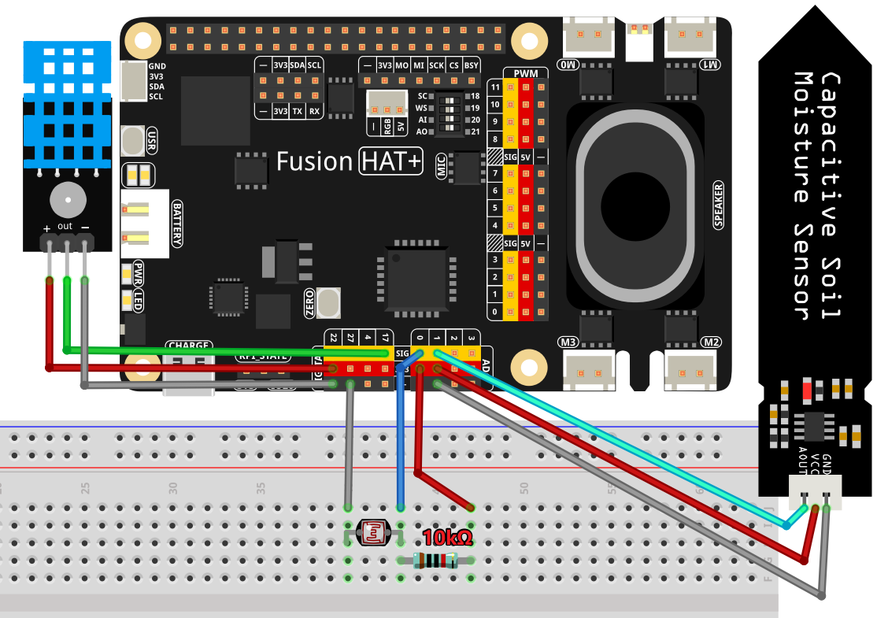

2.2 Virtual Plant 
===================================

This example demonstrates how to integrate OpenAI's GPT model with IoT hardware components to create a virtual plant assistant. The assistant uses environmental data from sensors to simulate a plant's "feelings" and responds to user inquiries in a natural, plant-like manner.

----------------------------------------------

**Features**

1. **Speech Interaction:** Users can interact with the virtual plant using speech. The assistant uses OpenAI's Whisper model to convert speech to text.

2. **Sensor Data Integration:** The virtual plant gathers real-time environmental data from sensors, including:

   * **DHT11:** Measures temperature and humidity.
   * **Soil Moisture Sensor:** Measures soil moisture level.
   * **photoresistor:** light intensity.

3. **Text-to-Speech Feedback:** The plant responds to user questions using OpenAI's TTS model, providing a spoken response.

4. **Concise Responses:** The assistant replies in a way that mimics a plant's feelings based on environmental data.

5. **Real-Time Processing:** Sensor data is collected in the background, ensuring up-to-date information for interactions.

----------------------------------------------

**What You’ll Need**

The following components are required for this project:

.. list-table::
    :widths: 30 20
    :header-rows: 1

    *   - COMPONENT INTRODUCTION
        - PURCHASE LINK

    *   - :ref:`cpn_breadboard`
        - |link_breadboard_buy|
    *   - :ref:`cpn_wires`
        - |link_wires_buy|
    *   - :ref:`cpn_resistor`
        - |link_resistor_buy|
    *   - :ref:`cpn_photoresistor`
        - |link_photoresistor_buy|
    *   - :ref:`cpn_humiture_sensor`
        - |link_humiture_buy|
    *   - :ref:`cpn_soil_moisture`
        - |link_soil_moisture_buy|
    *   - Fusion HAT
        - 
    *   - Raspberry Pi Zero 2 W
        -

----------------------------------------------

**Diagram**

----------------------------------------------

**Code**

.. raw:: html

   <run></run>

.. code-block:: python

   import openai
   from keys import OPENAI_API_KEY
   import readline  # Optimize keyboard input
   import sys
   import os
   import subprocess
   from pathlib import Path
   import speech_recognition as sr
   from fusion_hat import ADC,DHT11

   import time
   import threading

   # Initialize OpenAI client
   client = openai.OpenAI(api_key=OPENAI_API_KEY)

   os.system("fusion_hat enable_speaker")

   # Initialize speech recognizer
   recognizer = sr.Recognizer()

   # Initialize hardware components
   dht11 = DHT11(17)
   light_sensor = ADC('A0')
   moisture_sensor = ADC('A1')

   humidity = None
   temperature = None
   light = None
   moisture = None

   # Function to fetch sensor data
   def fetch_sensor_data():
      global humidity, temperature, light, moisture
      while True:
         _humidity, _temperature = dht11.read()
         if _humidity != 0.0:
               humidity = _humidity
         if _temperature != 0.0:
               temperature = _temperature
         light = light_sensor.read()
         moisture = moisture_sensor.read()
         time.sleep(1)

   # Start a background thread for sensor data
   sensor_thread = threading.Thread(target=fetch_sensor_data)
   sensor_thread.daemon = True
   sensor_thread.start()

   # Function for text-to-speech conversion
   def text_to_speech(text):
      speech_file_path = Path(__file__).parent / "speech.mp3"
      try:
         with client.audio.speech.with_streaming_response.create(
               model="tts-1", voice="alloy", input=text
         ) as response:
               response.stream_to_file(speech_file_path)
         p=subprocess.Popen("mplayer speech.mp3", shell=True, stdout=subprocess.PIPE, stderr=subprocess.STDOUT)
         p.wait()
      except Exception as e:
         print(f"Error in TTS: {e}")
         return None

   # Function for speech-to-text conversion
   def speech_to_text(audio_file):
      from io import BytesIO

      wav_data = BytesIO(audio_file.get_wav_data())
      wav_data.name = "record.wav"
      transcription = client.audio.transcriptions.create(
         model="whisper-1", file=wav_data, language=["zh", "en"]
      )
      return transcription.text

   # Function to redirect errors to null
   def redirect_error_to_null():
      devnull = os.open(os.devnull, os.O_WRONLY)
      old_stderr = os.dup(2)
      sys.stderr.flush()
      os.dup2(devnull, 2)
      os.close(devnull)
      return old_stderr

   # Function to cancel redirected errors
   def cancel_redirect_error(old_stderr):
      os.dup2(old_stderr, 2)
      os.close(old_stderr)

   # Create OpenAI assistant
   assistant = client.beta.assistants.create(
      name="Plant Bot",
      instructions=(
         "You are a virtual plant. Based on the received greeting and environmental conditions "
         "(light, soil moisture, temperature, humidity), respond with how you feel. "
         "Provide a concise, plant-like response. Units: "
         "Temperature in Celsius, humidity in %, soil moisture (3200: dry, 2500: wet), "
         "light (4095: dark, 2300: bright sunlight). User input will be JSON format like: "
         '{"light": 512, "moisture": 3000, "temperature": 25, "humidity": 62, "message": "How do you feel?"}'
      ),
      tools=[{"type": "code_interpreter"}],
      model="gpt-4-1106-preview",
   )

   # Create a conversation thread
   thread = client.beta.threads.create()

   try:
      while True:
         # Listen for user input
         print(f'\033[1;30m{"Listening..."}\033[0m')
         old_stderr = redirect_error_to_null()
         with sr.Microphone(chunk_size=8192) as source:
               cancel_redirect_error(old_stderr)
               recognizer.adjust_for_ambient_noise(source)
               audio = recognizer.listen(source)
         print(f'\033[1;30m{"Processing audio..."}\033[0m')

         # Convert speech to text
         user_message = speech_to_text(audio)
         if not user_message:
               print("No valid input detected.")
               continue

         # Prepare input for assistant
         assistant_input = {
               "light": light,
               "moisture": moisture,
               "temperature": temperature,
               "humidity": humidity,
               "message": user_message,
         }

         # Send message to assistant
         message = client.beta.threads.messages.create(
               thread_id=thread.id, role="user", content=str(assistant_input)
         )

         # Get assistant response
         run = client.beta.threads.runs.create_and_poll(
               thread_id=thread.id, assistant_id=assistant.id
         )

         if run.status == "completed":
               messages = client.beta.threads.messages.list(thread_id=thread.id)
               for message in messages.data:
                  if message.role == "assistant":
                     for block in message.content:
                           if block.type == "text":
                              response = block.text.value
                              print(f"Plant Bot >>> {response}")
                              text_to_speech(response)
                     break
   finally:
      client.beta.assistants.delete(assistant.id)
      print("\n Delete Assistant ID")

----------------------------------------------

**Code Explanation**

1. Initialization

.. code-block:: python

   client = openai.OpenAI(api_key=OPENAI_API_KEY)

Initializes the OpenAI client using your API key.

.. code-block:: python

   # Initialize hardware components
   dht11 = DHT11(17)
   light_sensor = ADC('A0')
   moisture_sensor = ADC('A1')

Initializes the modules for reading light and soil moisture data.
Initializes the DHT11 sensor for temperature and humidity readings.

2. Sensor Data Collection

.. code-block:: python

   # Function to fetch sensor data
   def fetch_sensor_data():
      global humidity, temperature, light, moisture
      while True:
         _humidity, _temperature = dht11.read()
         if _humidity != 0.0:
               humidity = _humidity
         if _temperature != 0.0:
               temperature = _temperature
         light = light_sensor.read()
         moisture = moisture_sensor.read()
         time.sleep(1)

This function continuously updates global variables with sensor data, running on a separate thread to avoid blocking the main program.

3. Speech-to-Text and Text-to-Speech

.. code-block:: python

   def speech_to_text(audio_file):
      transcription = client.audio.transcriptions.create(
         model="whisper-1", file=wav_data, language=["zh", "en"]
      )
      return transcription.text

Uses OpenAI's Whisper model to transcribe the user's spoken input into text.

.. code-block:: python

   # Function for text-to-speech conversion
   def text_to_speech(text):
      speech_file_path = Path(__file__).parent / "speech.mp3"
      try:
         with client.audio.speech.with_streaming_response.create(
               model="tts-1", voice="alloy", input=text
         ) as response:
               response.stream_to_file(speech_file_path)
         p=subprocess.Popen("mplayer speech.mp3", shell=True, stdout=subprocess.PIPE, stderr=subprocess.STDOUT)
         p.wait()
      except Exception as e:
         print(f"Error in TTS: {e}")
         return None

Converts the assistant's textual response into a spoken audio file using OpenAI's TTS model.
Then plays the audio file using mplayer.

4. Creating the Assistant

.. code-block:: python

   instructions=(
      "You are a virtual plant. Based on the received greeting and environmental conditions "
      "(light, soil moisture, temperature, humidity), respond with how you feel. "
      "Provide a concise, plant-like response. Units: "
      "Temperature in Celsius, humidity in %, soil moisture (3200: dry, 2500: wet), "
      "light (4095: dark, 2300: bright sunlight). User input will be JSON format like: "
      '{"light": 512, "moisture": 3000, "temperature": 25, "humidity": 62, "message": "How do you feel?"}'
   ),

The assistant is designed to mimic the personality of a plant, considering environmental data when responding.

5. Processing User Interactions

.. code-block:: python

   assistant_input = {
      "light": light,
      "moisture": moisture,
      "temperature": temperature,
      "humidity": humidity,
      "message": user_message,
   }
   message = client.beta.threads.messages.create(
      thread_id=thread.id, role="user", content=str(assistant_input)
   )

Sends the sensor data and user query to the assistant as a JSON-formatted string.

6. Generating a Response

.. code-block:: python

   run = client.beta.threads.runs.create_and_poll(
      thread_id=thread.id, assistant_id=assistant.id
   )

Waits for the assistant to generate a response.

.. code-block:: python

   if run.status == "completed":
      messages = client.beta.threads.messages.list(thread_id=thread.id)
      for message in messages.data:
            if message.role == "assistant":
               for block in message.content:
                  if block.type == "text":
                        response = block.text.value
                        print(f"Plant Bot >>> {response}")
                        text_to_speech(response)
               break

converts the assistant's response to text and prints it to the console. It also uses the text-to-speech function to play the assistant's response aloud.

----------------------------------------------

**Debugging Tips**

1. **No Sensor Data:**
   
   * Ensure sensors are properly connected to the GPIO pins.
   * Use a multimeter to verify power supply to the sensors.

2. **Audio Issues:**
   
   * Verify microphone and speaker connections.
   * Check if audio input/output devices are recognized by the system.
