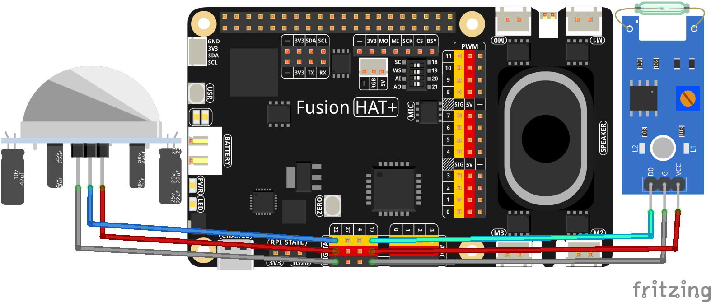

Real-Time Security Monitoring
===========================================================

This project is a real-time security monitoring system that utilizes a reed switch and a motion sensor to detect door openings and movement. When triggered, the system provides an audible alert using OpenAI's text-to-speech (TTS) feature. The system continuously monitors sensor inputs and announces detected events through a speaker.

-----------------------------------------------------------

**Features**

- **Real-Time Door Monitoring**: Detects when a door is opened using a reed switch.
- **Motion Detection Alerts**: Recognizes movement and provides a verbal warning.
- **Text-to-Speech Integration**: Uses OpenAI’s TTS model to generate voice alerts.
- **Continuous Monitoring**: The script runs indefinitely to monitor sensor inputs.
- **Event-Based Response System**: Executes predefined actions upon sensor activation.

-----------------------------------------------------------

**What You’ll Need**

Below are the components required for this project:

.. list-table::
    :widths: 30 20
    :header-rows: 1

    *   - COMPONENT INTRODUCTION
        - PURCHASE LINK

    *   - :ref:`cpn_pir`
        - |link_pir_buy| 
    *   - :ref:`cpn_reed_switch`
        - |link_reed_switch_buy|
    *   - :ref:`cpn_wires`
        - |link_wires_buy|        
    *   - Fusion HAT
        - 
    *   - Raspberry Pi Zero 2 W
        -

-----------------------------------------------------------

**Wiring Diagram**

-----------------------------------------------------------

**Code**

.. code-block:: python

    import openai
    from keys import OPENAI_API_KEY
    from fusion_hat import Pin
    from pathlib import Path
    import subprocess
    import os

    # Initialize OpenAI client
    client = openai.OpenAI(api_key=OPENAI_API_KEY)
    # thread = client.beta.threads.create()
    os.system("fusion_hat enable_speaker")

    # Initialize sensors
    reed_switch = Pin(17, Pin.IN, pull=Pin.PULL_UP)
    motion_sensor = Pin(22, Pin.IN, pull=Pin.PULL_DOWN)

    # Function for text-to-speech conversion and play the speech
    def text_to_speech(text):
        speech_file_path = Path(__file__).parent / "speech.mp3"
        try:
            with client.audio.speech.with_streaming_response.create(
                model="tts-1", voice="alloy", input=text
            ) as response:
                response.stream_to_file(speech_file_path)
            # Play the generated speech file
            subprocess.Popen(
                ["mplayer", str(speech_file_path)],
                shell=False,
                stdout=subprocess.PIPE,
                stderr=subprocess.STDOUT,
            ).wait()
        except Exception as e:
            print(f"Error in TTS or playing the file: {e}")

    # Sensor event handlers
    def door_opened():
        print("Door was opened!")
        text_to_speech("Attention! The door was opened.")

    def motion_detected():
        print("Motion detected!")
        text_to_speech("Warning! Motion detected.")

    # Assign event handlers
    reed_switch.when_deactivated = door_opened
    motion_sensor.when_activated = motion_detected

    # Keep the script running
    try:
        print("System is active. Monitoring...")
        import signal
        signal.pause()  # Use signal.pause() on Unix to keep the script running
    except KeyboardInterrupt:
        print("Program terminated by user.")
    finally:
        print("Cleaning up resources.")

----------------------------------------------------------------

**Code Explanation**

1. **Initialization**

The script starts by importing the necessary modules and initializing the OpenAI client:

.. code-block:: python

    import openai
    from keys import OPENAI_API_KEY
    from fusion_hat import Pin
    from pathlib import Path
    import subprocess
    import os

    client = openai.OpenAI(api_key=OPENAI_API_KEY)

Next, the script enables the speaker:

.. code-block:: python

    os.system("fusion_hat enable_speaker")

This ensures that the system can generate and play audio alerts.

2. **Sensor Setup**

The script initializes the reed switch (door sensor) and the motion sensor:

.. code-block:: python

    reed_switch = Pin(17, Pin.IN, pull=Pin.PULL_UP)
    motion_sensor = Pin(22, Pin.IN, pull=Pin.PULL_DOWN)

- The **reed switch** is used to detect door openings and is configured with an internal pull-up resistor.
- The **motion sensor** detects movement and uses a pull-down configuration to register activation.

3. **Text-to-Speech Functionality**

The ``text_to_speech`` function converts text to speech using OpenAI's API and plays the generated audio file:

.. code-block:: python

    def text_to_speech(text):
        speech_file_path = Path(__file__).parent / "speech.mp3"
        try:
            with client.audio.speech.with_streaming_response.create(
                model="tts-1", voice="alloy", input=text
            ) as response:
                response.stream_to_file(speech_file_path)

            subprocess.Popen(
                ["mplayer", str(speech_file_path)],
                shell=False,
                stdout=subprocess.PIPE,
                stderr=subprocess.STDOUT,
            ).wait()
        except Exception as e:
            print(f"Error in TTS or playing the file: {e}")

This function:

- Generates a speech file using OpenAI’s TTS.
- Saves the output as ``speech.mp3``.
- Uses ``mplayer`` to play the file.

If an error occurs, it is caught and displayed.

4. **Event Handlers for Sensor Activation**

The script defines two functions that handle sensor events:

.. code-block:: python

    def door_opened():
        print("Door was opened!")
        text_to_speech("Attention! The door was opened.")

    def motion_detected():
        print("Motion detected!")
        text_to_speech("Warning! Motion detected.")

- ``door_opened()``: Triggers when the reed switch detects a door opening.
- ``motion_detected()``: Triggers when the motion sensor detects movement.
- Each function prints a message and calls ``text_to_speech()`` to announce the event.

5. **Assigning Event Handlers**

To link the sensor events to their respective handlers:

.. code-block:: python

    reed_switch.when_deactivated = door_opened
    motion_sensor.when_activated = motion_detected

- **Reed switch (``when_deactivated``)**: Fires when the door is opened.
- **Motion sensor (``when_activated``)**: Fires when motion is detected.

6. **Keeping the Script Running**

The script continuously runs to monitor sensor activity:

.. code-block:: python

    try:
        print("System is active. Monitoring...")
        import signal
        signal.pause()  # Use signal.pause() on Unix to keep the script running
    except KeyboardInterrupt:
        print("Program terminated by user.")
    finally:
        print("Cleaning up resources.")

- ``signal.pause()``: Keeps the script running indefinitely.
- ``KeyboardInterrupt`` Handling: Allows the user to stop the program with ``CTRL+C``.
- ``finally`` Block: Ensures proper resource cleanup before exiting.

-----------------------------------------------------------

**Debugging Tips**

1. **No Audio Output?**

   - Ensure ``mplayer`` is installed on the system.
   - Check if the speaker is properly enabled (``fusion_hat enable_speaker``).
   - Verify the OpenAI API key is valid.

2. **Sensors Not Responding?**

   - Confirm that the reed switch and motion sensor are correctly wired to the Raspberry Pi.
   - Check that the correct GPIO pins are assigned in the script.
   - Use ``print()`` statements to debug sensor state changes.

3. **Script Exits Unexpectedly?**

   - Ensure ``signal.pause()`` is supported on your system.
   - Run the script in a terminal and observe any error messages.
   - Check for syntax errors or missing dependencies.
