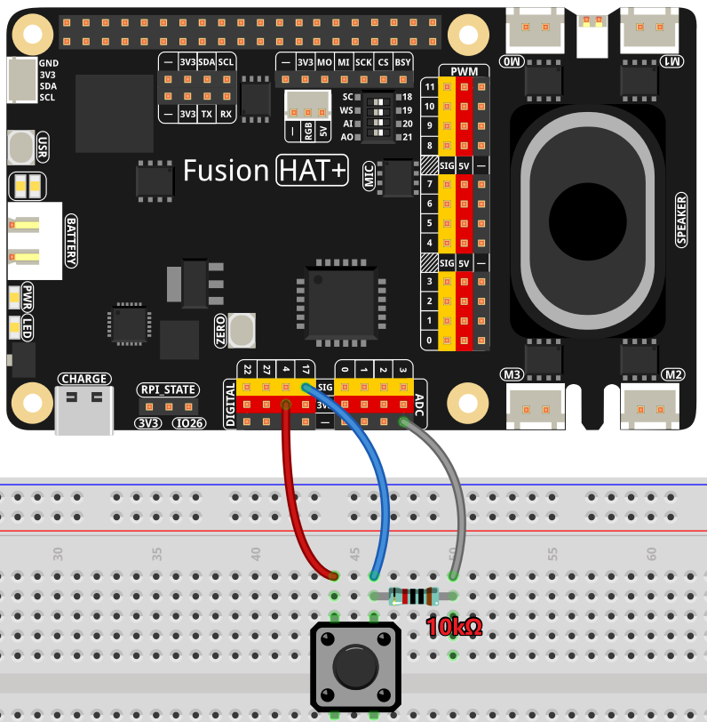

Story Teller
==========================

This Python script integrates OpenAI's GPT with hardware components like a button and a camera to create an interactive storytelling experience based on a book cover photo. 

The program waits for the user to press a button.

When pressed:

#. A photo of the book cover is captured.

#. The photo is sent to OpenAI's GPT model, which generates a story summary.

#. The story is converted to speech and played back.

----------------------------------------------

**Features**

* Interactive Experience: Users can interact with the system through a button and receive both visual and auditory feedback.

* AI-Powered Storytelling: GPT interprets the book cover and provides a creative summary.

* Voice Feedback: The generated story is read aloud, enhancing accessibility and engagement.

---------------------------------------------

**What You’ll Need**

The following components are required for this project:

.. list-table::
    :widths: 30 20
    :header-rows: 1

    *   - COMPONENT INTRODUCTION
        - PURCHASE LINK

    *   - :ref:`cpn_breadboard`
        - |link_breadboard_buy|
    *   - :ref:`cpn_wires`
        - |link_wires_buy|   
    *   - :ref:`cpn_resistor`
        - |link_resistor_buy|
    *   - :ref:`cpn_button`
        - |link_button_buy|
    *   - :ref:`cpn_camera_module`
        - |link_camera_buy|
    *   - Fusion HAT
        - 
    *   - Raspberry Pi Zero 2 W
        -

----------------------------------------------

**Circuit Diagram**

----------------------------------------------

**Code**

.. raw:: html

   <run></run>

.. code-block:: python
      
   import openai
   from keys import OPENAI_API_KEY
   import readline  # Optimize keyboard input
   import sys
   import os
   from pathlib import Path
   import subprocess
   from fusion_hat import Pin
   from picamera2 import Picamera2

   os.system("fusion_hat enable_speaker")

   # Initialize OpenAI client
   client = openai.OpenAI(api_key=OPENAI_API_KEY)

   # Initialize hardware components
   button = Pin(17, Pin.IN, Pin.PULL_DOWN)
   camera = Picamera2()

   # Function to capture a photo
   def capture_photo():
      """
      Capture a photo using the Picamera2 and save it as 'my_photo.jpg'.
      """
      try:
         print(f'\033[1;30m{"Shooting photo..."}\033[0m')
         # Set preview configuration
         camera.configure(camera.preview_configuration)
         camera.start()
         camera.capture_file("my_photo.jpg")
         camera.stop()
         story_talking()
      except Exception as e:
         print(f"Error capturing photo: {e}")

   # Function for text-to-speech conversion
   def text_to_speech(text):
      """
      Convert text to speech using OpenAI's TTS model.
      """
      speech_file_path = Path(__file__).parent / "speech.mp3"
      try:
         with client.audio.speech.with_streaming_response.create(
               model="tts-1", voice="alloy", input=text
         ) as response:
               response.stream_to_file(speech_file_path)
         subprocess.Popen("mplayer speech.mp3", shell=True, stdout=subprocess.PIPE, stderr=subprocess.STDOUT).wait()
      except Exception as e:
         print(f"Error in Text-to-Speech: {e}")

   # Function to send the photo and get a story from GPT
   def story_talking():
      """
      Send the captured photo to GPT and receive a story about the book.
      """
      print(f'\033[1;30m{"GPT reading..."}\033[0m')
      try:
         # Upload the photo to OpenAI
         file = client.files.create(
               file=open("my_photo.jpg", "rb"), purpose="vision"
         )

         # Send user message and photo to GPT
         message = client.beta.threads.messages.create(
               thread_id=thread.id,
               role="user",
               content=[
                  {"type": "text", "text": "What is this book about?"},
                  {"type": "image_file", "image_file": {"file_id": file.id}},
               ],
         )

         # Run the assistant and get the response
         run = client.beta.threads.runs.create_and_poll(
               thread_id=thread.id, assistant_id=assistant.id
         )

         if run.status == "completed":
               messages = client.beta.threads.messages.list(thread_id=thread.id)
               for message in messages.data:
                  if message.role == "assistant":
                     for block in message.content:
                           if block.type == "text":
                              response = block.text.value
                              print(f"Assistant >>> {response}")
                              text_to_speech(response)
                              return
      except Exception as e:
         print(f"Error in story_talking: {e}")

   # Create OpenAI assistant
   assistant = client.beta.assistants.create(
      name="Storyteller Bot",
      instructions=(
         "You are a storyteller. When given a book cover image, "
         "provide a brief story summary as if you were telling a bedtime story."
      ),
      model="gpt-4o-mini",
   )

   # Create a conversation thread
   thread = client.beta.threads.create()

   button.when_activated = capture_photo

   try:
      print(f'\033[1;30m{"Waiting for button press to capture photo..."}\033[0m')
      print(f'\033[1;30m{"Tap any key to exit..."}\033[0m')
      import signal
      signal.pause()  # Use signal.pause() on Unix to keep the script running
   finally:
      # Clean up resources
      client.beta.assistants.delete(assistant.id)
      print("Resources cleaned up. Exiting.")

----------------------------------------------

**Code Explanation**

1. Import Necessary Libraries

.. code-block:: python

   import openai
   from keys import OPENAI_API_KEY
   import readline  # Optimize keyboard input
   import sys
   import os
   from pathlib import Path
   import subprocess
   from fusion_hat import Pin
   from picamera2 import Picamera2

* ``openai``: To interact with OpenAI's GPT and Whisper models.
* ``fusion_hat``: To handle button presses for capturing photos.
* ``picamera2``: To control the Raspberry Pi camera for taking photos.
* ``subprocess``: To play audio files for text-to-speech output.

2. Initialize OpenAI Client and Hardware

.. code-block:: python

   client = openai.OpenAI(api_key=OPENAI_API_KEY)

This sets up the OpenAI client with the provided API key for accessing GPT and Whisper models.

.. code-block:: python

   button = Pin(17, Pin.IN, Pin.PULL_DOWN)
   camera = Picamera2()

The button connected to GPIO pin 17 triggers the photo capture process. The ``Picamera2`` instance controls the Raspberry Pi camera.

3. Capture Photo

.. code-block:: python

   def capture_photo():
      """
      Capture a photo using the Picamera2 and save it as 'my_photo.jpg'.
      """
      try:
         print(f'\033[1;30m{"Shooting photo..."}\033[0m')
         # Set preview configuration
         camera.configure(camera.preview_configuration)
         camera.start()
         camera.capture_file("my_photo.jpg")
         camera.stop()
      except Exception as e:
         print(f"Error capturing photo: {e}")

* Configures the camera's preview settings.
* Starts the camera to capture an image.
* Saves the image as `my_photo.jpg`.

4. Text-to-Speech Conversion

.. code-block:: python

   def text_to_speech(text):
      """
      Convert text to speech using OpenAI's TTS model.
      """
      speech_file_path = Path(__file__).parent / "speech.mp3"
      try:
         with client.audio.speech.with_streaming_response.create(
               model="tts-1", voice="alloy", input=text
         ) as response:
               response.stream_to_file(speech_file_path)
         subprocess.Popen("mplayer speech.mp3", shell=True, stdout=subprocess.PIPE, stderr=subprocess.STDOUT).wait()
      except Exception as e:
         print(f"Error in Text-to-Speech: {e}")

* Converts text responses from GPT into an audio file (``speech.mp3``) using OpenAI's text-to-speech model.
* Plays the audio file using the ``mplayer`` command.

5. Interact with GPT for Storytelling

The ``story_talking()`` function:

.. code-block:: python

   file = client.files.create(
      file=open("my_photo.jpg", "rb"), purpose="vision"
   )

Upload the Photo: The captured photo (``my_photo.jpg``) is uploaded to OpenAI for processing.

.. code-block:: python

   message = client.beta.threads.messages.create(
      thread_id=thread.id,
      role="user",
      content=[
            {"type": "text", "text": "What is this book about?"},
            {"type": "image_file", "image_file": {"file_id": file.id}},
      ],
   )

Send a User Query: The script sends a message along with the photo to the assistant.

.. code-block:: python

   run = client.beta.threads.runs.create_and_poll(
      thread_id=thread.id, assistant_id=assistant.id
   )

   if run.status == "completed":
      messages = client.beta.threads.messages.list(thread_id=thread.id)
      for message in messages.data:
            if message.role == "assistant":
               for block in message.content:
                  if block.type == "text":
                        response = block.text.value
                        print(f"Assistant >>> {response}")
                        text_to_speech(response)
                        return

Process GPT Response: GPT processes the input and generates a response. The response includes a story summary, which is printed and converted to speech.

6. OpenAI Assistant Configuration

.. code-block:: python

   assistant = client.beta.assistants.create(
      name="Storyteller Bot",
      instructions=(
         "You are a storyteller. When given a book cover image, "
         "provide a brief story summary as if you were telling a bedtime story."
      ),
      model="gpt-4o-mini",
   )

This defines the assistant's role and ensures that responses are formatted appropriately for storytelling.

7. Event Loop

.. code-block:: python

   try:
      while True:
         print(f'\033[1;30m{"Waiting for button press to capture photo..."}\033[0m')
         button.wait_for_press()
         capture_photo()
         story_talking()
   finally:
      # Clean up resources
      button.close()
      client.beta.assistants.delete(assistant.id)
      print("Resources cleaned up. Exiting.")

* Waits for a button press.
* Captures a photo when the button is pressed.
* Sends the photo to GPT for storytelling.
* Plays the generated story using text-to-speech.
* The finally block ensures proper cleanup.

----------------------------------------------

**Debugging Tips**

1. Camera Issues: 
   
   * Ensure the Raspberry Pi camera is enabled and connected properly. Run raspi-config to check camera settings.

2. Incomplete Book Cover in Photo:
   
   * Since this project lacks a preview screen, ensure the book is positioned properly before pressing the button:
      
      * Place the book at a consistent distance and angle relative to the camera.
      * Use a fixed stand or guide to ensure the book's cover fits entirely within the camera's frame.
      * Test with different setups to determine the optimal placement for consistent results.
   
   * If cropping issues persist, consider using a connected display or external device to verify positioning during setup.
