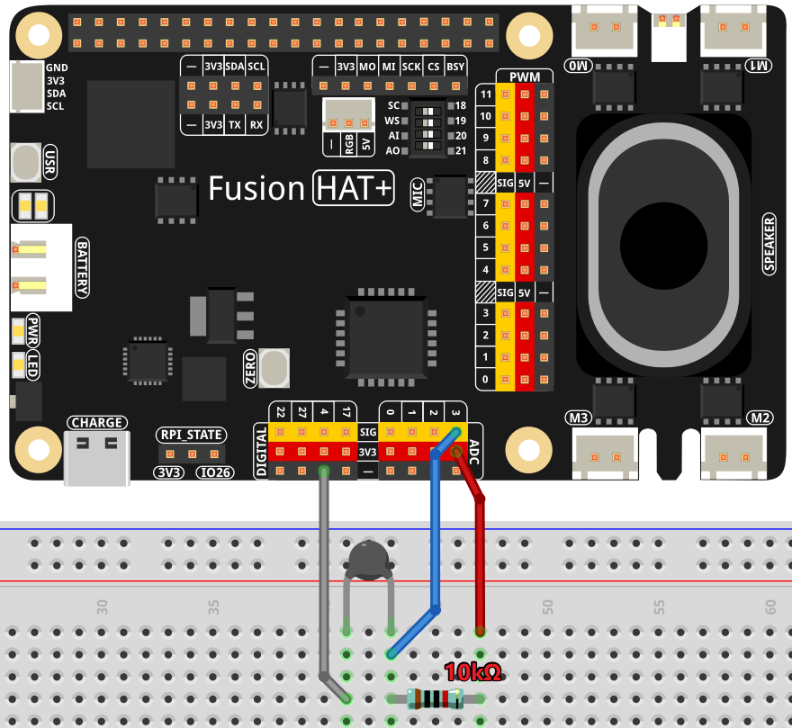

AI Thermometer Assistant
===================================================

This project is a voice-interactive health assistant designed to monitor body temperature using a thermistor and provide personalized health advice through OpenAI's GPT-4 API. The system listens to the user's voice input, reads the current body temperature from a sensor, and uses AI to generate health-related responses. It also supports text-to-speech functionality to audibly deliver the assistant’s feedback.

---------------------------------------------------------

**Features**  

.. list-table::
    :widths: 30 20
    :header-rows: 1

    *   - COMPONENT INTRODUCTION
        - PURCHASE LINK

    *   - :ref:`cpn_wires`
        - |link_wires_buy|
    *   - :ref:`cpn_thermistor`
        - |link_thermistor_buy|
    *   - Fusion HAT
        - 
    *   - Raspberry Pi Zero 2 W
        -

---------------------------------------------------------

**What You’ll Need**  

Here are the components required for this project:

.. list-table::
    :widths: 30 20
    :header-rows: 1

    *   - COMPONENT INTRODUCTION
        - PURCHASE LINK

    *   - Breadboard
        - |link_breadboard_buy|
    *   - Wires
        - |link_wires_buy|
    *   - Resistor
        - |link_resistor_buy|
    *   - Thermistor
        - |link_thermistor_buy|
    *   - Fusion HAT
        - 
    *   - Raspberry Pi Zero 2 W
        -

---------------------------------------------------------

**Wiring Diagram**  

---------------------------------------------------------

**Code**  

.. code-block:: python

   import openai
   from keys import OPENAI_API_KEY
   import time
   from fusion_hat import ADC
   from pathlib import Path
   import speech_recognition as sr
   import sys
   import os
   import subprocess
   import math

   # initialize openai client
   client = openai.OpenAI(api_key=OPENAI_API_KEY)

   os.system("fusion_hat enable_speaker")

   instructions_text = '''
   You are a health assistant. Your task is to assess the user's body temperature based on the thermistor reading and provide appropriate health advice.

   The thermistor reading represents body temperature in Celsius.

   ### Input Format:
   "thermistor: [value], message: [user query]"

   ### Output Guidelines:
   1. If temperature < 35.0°C, warn about hypothermia and suggest warming up.
   2. If 35.0°C ≤ temperature ≤ 37.5°C, confirm normal temperature and reassure the user.
   3. If 37.5°C < temperature ≤ 38.5°C, indicate mild fever and suggest rest and hydration.
   4. If temperature > 38.5°C, alert about high fever and recommend medical attention.
   5. Include the temperature value in your response to justify your assessment.

   ### Example Input:
   thermistor: 39.0, message: I feel unwell.

   ### Example Output:
   Your body temperature is 39.0°C, which indicates a high fever. Please rest, stay hydrated, and consider seeking medical advice if symptoms persist.
   '''

   assistant = client.beta.assistants.create(
      name="BOT",
      instructions=instructions_text,
      model="gpt-4-1106-preview",
   )

   thread = client.beta.threads.create()

   # Initialize speech recognizer
   recognizer = sr.Recognizer()

   # setup ADC for thermistor reading
   thermistor = ADC('A3')

   # Function for text-to-speech conversion
   def text_to_speech(text):
      speech_file_path = Path(__file__).parent / "speech.mp3"
      try:
         with client.audio.speech.with_streaming_response.create(
               model="tts-1", voice="alloy", input=text
         ) as response:
               response.stream_to_file(speech_file_path)
         p=subprocess.Popen("mplayer speech.mp3", shell=True, stdout=subprocess.PIPE, stderr=subprocess.STDOUT)
         p.wait()
      except Exception as e:
         print(f"Error in TTS: {e}")

   # Function for speech-to-text conversion
   def speech_to_text(audio_file):
      from io import BytesIO

      wav_data = BytesIO(audio_file.get_wav_data())
      wav_data.name = "record.wav"
      transcription = client.audio.transcriptions.create(
         model="whisper-1", file=wav_data, language=["zh", "en"]
      )
      return transcription.text

   # Function to redirect errors to null
   def redirect_error_to_null():
      devnull = os.open(os.devnull, os.O_WRONLY)
      old_stderr = os.dup(2)
      sys.stderr.flush()
      os.dup2(devnull, 2)
      os.close(devnull)
      return old_stderr

   # Function to cancel redirected errors
   def cancel_redirect_error(old_stderr):
      os.dup2(old_stderr, 2)
      os.close(old_stderr)

   def temperature():
      while True:
         analogVal = thermistor.read()
         Vr = 3.3 * float(analogVal) / 4095
         if 3.3 - Vr < 0.1:
               print("Please check the sensor")
               continue
         Rt = 10000 * Vr / (3.3 - Vr)
         temp = 1 / (((math.log(Rt / 10000)) / 3950) + (1 / (273.15 + 25)))
         Cel = temp - 273.15
         return Cel

   try:
      while True:
         msg = ""
         # Listen for user input
         print(f'\033[1;30m{"Listening..."}\033[0m')
         old_stderr = redirect_error_to_null()
         with sr.Microphone(chunk_size=8192) as source:
               cancel_redirect_error(old_stderr)
               recognizer.adjust_for_ambient_noise(source)
               audio = recognizer.listen(source)
         print(f'\033[1;30m{"Processing audio..."}\033[0m')

         # Convert speech to text
         msg = speech_to_text(audio)
         if not msg:
               print("No valid input detected.")
               continue

         text_send="thermistor:" +str(temperature()) +" , message: " + msg

         message = client.beta.threads.messages.create(
               thread_id=thread.id,
               role="user",
               content=text_send,
         )

         run = client.beta.threads.runs.create_and_poll(
               thread_id=thread.id,
               assistant_id=assistant.id,
         )

         if run.status == "completed":
               messages = client.beta.threads.messages.list(thread_id=thread.id)

               for message in messages.data:
                  if message.role == 'user':
                     for block in message.content:
                           if block.type == 'text':
                              label = message.role 
                              text = block.text.value
                              print(f'{label:>10} >>> {text}')
                     break # only last reply

               for message in messages.data:
                  if message.role == 'assistant':
                     for block in message.content:
                           if block.type == 'text':
                              label = assistant.name
                              text = block.text.value
                              print(f'{label:>10} >>> {text}')
                              text_to_speech(text)
                     break # only last reply

   finally:
      client.beta.assistants.delete(assistant.id)

---------------------------------------------------------

**Code Explanation**  

This code creates a voice-controlled health assistant system. Below is a breakdown of key sections:

- **OpenAI Initialization**:  

  The ``client = openai.OpenAI(...)`` initializes the OpenAI API client with a secret API key for accessing GPT and Whisper.

- **Speech & Audio Setup**:  

  ``speech_recognition`` is used for capturing voice commands via microphone, while ``text_to_speech()`` uses OpenAI’s ``tts-1`` model to convert the assistant's response to audio.

- **Thermistor Reading**:  

  The ``temperature()`` function reads the analog voltage from the thermistor, computes the resistance (``Rt``), and converts it into Celsius using the Steinhart-Hart equation:

  .. code-block:: python

      Vr = 3.3 * float(analogVal) / 4095
      Rt = 10000 * Vr / (3.3 - Vr)
      temp = 1 / (((math.log(Rt / 10000)) / 3950) + (1 / (273.15 + 25)))
      Cel = temp - 273.15

- **OpenAI Assistant Configuration**:  

  A new assistant is created with specific instructions in ``instructions_text`` that guide it to interpret the thermistor reading and provide health recommendations.

- **Main Loop**:  

  The ``while True:`` block continuously listens for voice input, converts it to text, reads the temperature, and sends a formatted message to the assistant like:  
  ``thermistor: 37.0 , message: I feel dizzy``

- **Assistant Processing**:  

  The message is sent using ``client.beta.threads.messages.create`` and a run is initiated via ``client.beta.threads.runs.create_and_poll``. If successful, the assistant’s reply is printed and spoken aloud.

- **Clean-up**:  

  On program termination, the assistant is deleted to prevent cluttering the API with unused instances.

---------------------------------------------------------

**Debugging Tips**  

#. **No Audio Detected**:  

   If no voice is recognized, ensure your microphone is properly connected and functioning. You may test it with other software or check system audio settings.

#. **Sensor Issues**:  

   If the thermistor reading results in a voltage near 3.3V, this likely means the sensor is disconnected or faulty. The program will display ``Please check the sensor``—double-check wiring and sensor placement.

#. **No Response from Assistant**:  

   If the assistant does not reply, verify your internet connection and confirm your OpenAI API key is valid and active.

#. **Speech-to-Text Fails**:  

   If transcription returns nothing, background noise might be interfering. Try adjusting the environment or increasing the microphone sensitivity with  
  
   .. code-block:: python

      recognizer.adjust_for_ambient_noise(source)

#. **Audio Playback Errors**:  

   If text-to-speech fails or no audio plays, make sure the ``mplayer`` utility is installed and your speaker is enabled via ``fusion_hat enable_speaker``.

#. **Suppressing ALSA Warnings**:  

   To avoid clutter from audio system warnings, error output is redirected using ``redirect_error_to_null()``. If troubleshooting audio input, consider commenting this out temporarily to view detailed error logs.

