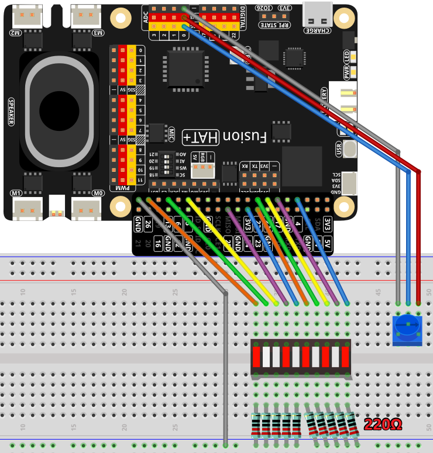

Voice Level
=====================================

This project is a voice-controlled AI assistant that listens to user speech, transcribes it using OpenAI's Whisper model, generates a response using GPT-4, and plays the response back through text-to-speech (TTS). The system also integrates a potentiometer to control volume levels with visual LED feedback.

--------------------------------------

**Features**

- **Voice Recognition**: Uses OpenAI's Whisper model to transcribe speech.
- **AI-Powered Responses**: Utilizes GPT-4 to generate relevant responses based on user input.
- **Text-to-Speech (TTS)**: Converts AI-generated responses into spoken audio.
- **Volume Control via Potentiometer**: Adjusts system volume with real-time LED indicators.
- **Continuous Monitoring**: Runs in an infinite loop to process user commands dynamically.
- **LED Feedback System**: Indicates volume levels using a series of LEDs.

--------------------------------------

**What You’ll Need**

Here are the components required for this project:

.. list-table::
    :widths: 30 20
    :header-rows: 1

    *   - COMPONENT
        - PURCHASE LINK

    *   - :ref:`cpn_breadboard`
        - |link_breadboard_buy|
    *   - :ref:`cpn_wires`
        - |link_wires_buy|
    *   - :ref:`cpn_resistor`
        - |link_resistor_buy|
    *   - :ref:`cpn_photoresistor`
        - |link_photoresistor_buy|
    *   - :ref:`cpn_bar_graph`
        - \-
    *   - Fusion HAT
        - 
    *   - Raspberry Pi Zero 2 W
        -

--------------------------------------

**Wiring Diagram**

--------------------------------------

**Code**

.. raw:: html

   <run></run>

.. code-block:: python

    #!/usr/bin/env python3

    from fusion_hat import ADC, Pin
    from time import sleep
    import openai
    from keys import OPENAI_API_KEY
    import sys
    import os
    import subprocess
    from pathlib import Path

    import speech_recognition as sr

    os.system("fusion_hat enable_speaker")

    # gets API Key from environment variable OPENAI_API_KEY
    client = openai.OpenAI(api_key=OPENAI_API_KEY)

    TTS_OUTPUT_FILE = 'tts_output.mp3'

    assistant = client.beta.assistants.create(
        name="BOT",
        instructions="You are a chat bot, you answer people question to help them.",
        model="gpt-4-1106-preview",
    )

    thread = client.beta.threads.create()
    recognizer = sr.Recognizer()
    os.system("fusion_hat enable_speaker")

    # speech_recognition init
    # =================================================================
    '''
    recognizer.energy_threshold = 300  # minimum audio energy to consider for recording
    recognizer.dynamic_energy_threshold = True
    recognizer.dynamic_energy_adjustment_damping = 0.15
    recognizer.dynamic_energy_ratio = 1.5
    recognizer.pause_threshold = 0.8  # seconds of non-speaking audio before a phrase is considered complete
    recognizer.operation_timeout = None  # seconds after an internal operation (e.g., an API request) starts before it times out, or ``None`` for no timeout

    recognizer.phrase_threshold = 0.3  # minimum seconds of speaking audio before we consider the speaking audio a phrase - values below this are ignored (for filtering out clicks and pops)
    recognizer.non_speaking_duration = 0.5  # seconds of non-speaking audio to keep on both sides of the recording

    '''
    recognizer.dynamic_energy_adjustment_damping = 0.15
    recognizer.dynamic_energy_ratio = 1
    recognizer.operation_timeout = None  # seconds after an internal operation (e.g., an API request) starts before it times out, or ``None`` for no timeout
    recognizer.pause_threshold = 1

    def speech_to_text(audio_file):
        from io import BytesIO

        wav_data = BytesIO(audio_file.get_wav_data())
        wav_data.name = "record.wav"

        transcription = client.audio.transcriptions.create(
            model="whisper-1", 
            file=wav_data,
            language=['zh','en']
        )
        return transcription.text

    def redirect_error_2_null():
        # https://github.com/spatialaudio/python-sounddevice/issues/11

        devnull = os.open(os.devnull, os.O_WRONLY)
        old_stderr = os.dup(2)
        sys.stderr.flush()
        os.dup2(devnull, 2)
        os.close(devnull)
        return old_stderr

    def cancel_redirect_error(old_stderr):
        os.dup2(old_stderr, 2)
        os.close(old_stderr)

    def text_to_speech(text):
        speech_file_path = Path(__file__).parent / "speech.mp3"
        # print(speech_file_path)
        with client.audio.speech.with_streaming_response.create(
            model="tts-1",
            voice="alloy",
            input=text
        ) as response:
            response.stream_to_file(speech_file_path)
        p=subprocess.Popen("mplayer speech.mp3", shell=True, stdout=subprocess.PIPE, stderr=subprocess.STDOUT)
        p.wait()

    # Set up the potentiometer
    pot = ADC('A0')

    # Define GPIO pins where LEDs are connected
    led_pins = [4, 17, 27, 22, 23, 24, 25, 5, 13, 26]

    # Create LED objects for each pin
    leds = [Pin(pin, Pin.OUT) for pin in led_pins]

    def MAP(x, in_min, in_max, out_min, out_max):
        """
        Map a value from one range to another.
        :param x: The value to be mapped.
        :param in_min: The lower bound of the value's current range.
        :param in_max: The upper bound of the value's current range.
        :param out_min: The lower bound of the value's target range.
        :param out_max: The upper bound of the value's target range.
        :return: The mapped value.
        """
        return (x - in_min) * (out_max - out_min) / (in_max - in_min) + out_min

    def set_volume(percent):
        """set volume (0-100%)"""
        for led in leds:
            led.low()
        for i in range(int(percent/10)):
            leds[i].high()
        os.system(f"amixer set Master {percent}%")

    def is_mplayer_running():
        """check if mplayer is running"""
        result = subprocess.run(["pgrep", "-x", "mplayer"], stdout=subprocess.PIPE)
        return result.returncode == True  

    try:
        while True:
            # Check if mplayer is running, if not, start recording
            if not is_mplayer_running():
                msg = ""
                print(f'\033[1;30m{"listening... "}\033[0m')
                _stderr_back = redirect_error_2_null() 
                with sr.Microphone(chunk_size=8192) as source:
                    cancel_redirect_error(_stderr_back)
                    recognizer.adjust_for_ambient_noise(source)
                    audio = recognizer.listen(source)
                print(f'\033[1;30m{"stop listening... "}\033[0m')

                # Convert recorded audio to text
                msg = speech_to_text(audio)

                if msg == False or msg == "":
                    print() # new line
                    continue

                # Pass the transcribed text to the chatbot
                message = client.beta.threads.messages.create(
                    thread_id=thread.id,
                    role="user",
                    content=msg,
                )

                # Generate and process the assistant's response
                run = client.beta.threads.runs.create_and_poll(
                    thread_id=thread.id,
                    assistant_id=assistant.id,
                )

                # print("Run completed with status: " + run.status)
                if run.status == "completed":
                    messages = client.beta.threads.messages.list(thread_id=thread.id)

                    for message in messages.data:
                        if message.role == 'user':
                            for block in message.content:
                                if block.type == 'text':
                                    label = message.role 
                                    value = block.text.value
                                    print(f'{label:>10} >>> {value}')
                            break # only last reply

                    for message in messages.data:
                        if message.role == 'assistant':
                            for block in message.content:
                                if block.type == 'text':
                                    label = assistant.name
                                    value = block.text.value
                                    print(f'{label:>10} >>> {value}')
                                    text_to_speech(value)
                            break # only last reply

            # Map the ADC value to a range suitable for setting LED brightness
            volume = MAP(pot.read(), 0, 4095, 0, 100)
            # print('current volume = %d ' %(result))
            set_volume(volume)    
            sleep(0.2)

    finally:
        client.beta.assistants.delete(assistant.id)
        for led in leds:
            led.low()

--------------------------------------

**Code Explanation**

1. **Initialization**

The script starts by importing necessary modules and enabling the speaker:

.. code-block:: python

    import openai
    from keys import OPENAI_API_KEY
    from fusion_hat import ADC, Pin
    from time import sleep
    import speech_recognition as sr
    import subprocess
    import os
    from pathlib import Path

    os.system("fusion_hat enable_speaker")

The OpenAI client is initialized:

.. code-block:: python

    client = openai.OpenAI(api_key=OPENAI_API_KEY)

An AI assistant and a conversation thread are created:

.. code-block:: python

    assistant = client.beta.assistants.create(
        name="BOT",
        instructions="You are a chatbot, you answer people’s questions to help them.",
        model="gpt-4-1106-preview",
    )

    thread = client.beta.threads.create()

2. **Speech Recognition Setup**

The ``speech_to_text`` function converts spoken input into text using OpenAI’s Whisper model:

.. code-block:: python

    def speech_to_text(audio_file):
        from io import BytesIO
        wav_data = BytesIO(audio_file.get_wav_data())
        wav_data.name = "record.wav"
        transcription = client.audio.transcriptions.create(
            model="whisper-1",
            file=wav_data,
            language=['zh','en']
        )
        return transcription.text

- Converts recorded audio to WAV format.
- Sends the audio file to OpenAI’s Whisper model for transcription.
- Returns the transcribed text.

3. **Text-to-Speech Processing**

The ``text_to_speech`` function generates an audio response:

.. code-block:: python

    def text_to_speech(text):
        speech_file_path = Path(__file__).parent / "speech.mp3"
        with client.audio.speech.with_streaming_response.create(
            model="tts-1",
            voice="alloy",
            input=text
        ) as response:
            response.stream_to_file(speech_file_path)
        p = subprocess.Popen("mplayer speech.mp3", shell=True, stdout=subprocess.PIPE, stderr=subprocess.STDOUT)
        p.wait()

- Converts the response text into an MP3 file.
- Uses ``mplayer`` to play the generated speech.

4. **Potentiometer and LED Volume Control**

The potentiometer reads the ADC value and maps it to a percentage for volume control:

.. code-block:: python

    def MAP(x, in_min, in_max, out_min, out_max):
        return (x - in_min) * (out_max - out_min) / (in_max - in_min) + out_min

    def set_volume(percent):
        for led in leds:
            led.low()
        for i in range(int(percent/10)):
            leds[i].high()
        os.system(f"amixer set Master {percent}%")

- ``MAP``: Converts the ADC reading (0-4095) to a percentage (0-100%).
- ``set_volume``: Updates LED indicators and adjusts system volume accordingly.

5. **Main Loop: Listening & Processing**

The script continuously listens for user input and processes it:

.. code-block:: python

    while True:
        if not is_mplayer_running():
            print("Listening...")
            with sr.Microphone(chunk_size=8192) as source:
                recognizer.adjust_for_ambient_noise(source)
                audio = recognizer.listen(source)
            print("Processing...")

            msg = speech_to_text(audio)
            if msg:
                message = client.beta.threads.messages.create(
                    thread_id=thread.id,
                    role="user",
                    content=msg,
                )

                run = client.beta.threads.runs.create_and_poll(
                    thread_id=thread.id,
                    assistant_id=assistant.id,
                )

                if run.status == "completed":
                    messages = client.beta.threads.messages.list(thread_id=thread.id)
                    for message in messages.data:
                        if message.role == 'assistant':
                            for block in message.content:
                                if block.type == 'text':
                                    text_to_speech(block.text.value)
                            break
        
        volume = MAP(pot.read(), 0, 4095, 0, 100)
        set_volume(volume)
        sleep(0.2)

6. **Cleanup and Resource Management**

If the script is interrupted, resources are cleaned up:

.. code-block:: python

    finally:
        client.beta.assistants.delete(assistant.id)
        for led in leds:
            led.low()

- Deletes the assistant to free API resources.
- Turns off all LEDs before exiting.

--------------------------------------

**Debugging Tips**

1. **No Audio Response?**

   - Ensure ``mplayer`` is installed.
   - Check if ``fusion_hat enable_speaker`` is executed properly.

2. **Speech Recognition Not Working?**

   - Adjust noise threshold settings in ``speech_recognition``.

3. **Volume Control Not Responding?**

   - Check the potentiometer connections.
   - Use ``print(pot.read())`` to verify ADC readings.
