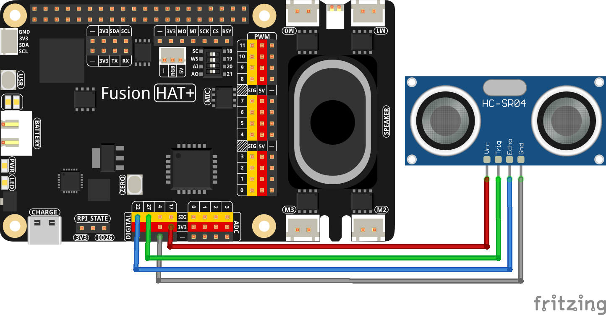

2.14 Water Level Monitoring System
=======================================================

This project is a **voice-controlled water level monitoring system** that utilizes an ultrasonic sensor to measure the water level and interacts with users via speech recognition and text-to-speech. The system employs **OpenAI’s GPT-4** to analyze sensor data and provide feedback on whether the water level is normal, low, or high. Users can communicate through voice input, and the assistant responds with real-time verbal feedback.

----------------------------------------------

**Features**

- **Ultrasonic Sensor-Based Water Level Measurement**: Reads the distance from the sensor to the water surface.
- **Voice Interaction**: Uses **speech recognition (STT)** and **text-to-speech (TTS)** for a hands-free experience.
- **OpenAI GPT-4 Integration**: Processes water level data and provides context-aware responses.
- **Real-Time Monitoring**: Continuously reads sensor data and updates the assistant.

----------------------------------------------

**What You’ll Need**

Here are the components required for this project:

.. list-table::
    :widths: 30 20
    :header-rows: 1

    *   - COMPONENT INTRODUCTION
        - PURCHASE LINK

    *   - :ref:`cpn_wires`
        - |link_wires_buy|
    *   - :ref:`cpn_ultrasonic_sensor`
        - |link_ultrasonic_buy|
    *   - Fusion HAT
        - 
    *   - Raspberry Pi Zero 2 W
        -

----------------------------------------------

**Wiring Diagram**

----------------------------------------------

**Running the Example**

All example code used in this tutorial is available in the ``ai-explorer-lab-kit`` directory. 
Follow these steps to run the example:

.. code-block:: shell
   
   cd ~/ai-explorer-lab-kit/gpt_example/
   sudo ~/my_venv/bin/python3 gpt_fun_water_level.py 

----------------------------------------------

**Code**

.. raw:: html

   <run></run>
   
.. code-block:: python

    import openai
    from keys import OPENAI_API_KEY
    import readline  # Optimize keyboard input
    import sys
    import os
    import subprocess
    from pathlib import Path
    import speech_recognition as sr
    from fusion_hat import Ultrasonic,Pin
    import time
    import threading

    os.system("fusion_hat enable_speaker")

    # Initialize OpenAI client
    client = openai.OpenAI(api_key=OPENAI_API_KEY)

    # Initialize speech recognizer
    recognizer = sr.Recognizer()

    # Initialize the DistanceSensor using GPIO Zero library
    # Trigger pin is connected to GPIO 27, Echo pin to GPIO 22
    sensor = Ultrasonic(trig=Pin(27), echo=Pin(22))
    distance = 0

    # Function to fetch sensor data
    def fetch_sensor_data():
        global distance
        while True:
            dis = sensor.read()  # Measure distance in centimeters
            if dis > 0:
                distance = dis
            time.sleep(1)

    # Start a background thread for sensor data
    sensor_thread = threading.Thread(target=fetch_sensor_data)
    sensor_thread.daemon = True
    sensor_thread.start()

    # Function for text-to-speech conversion
    def text_to_speech(text):
        speech_file_path = Path(__file__).parent / "speech.mp3"
        try:
            with client.audio.speech.with_streaming_response.create(
                model="tts-1", voice="alloy", input=text
            ) as response:
                response.stream_to_file(speech_file_path)
            p=subprocess.Popen("mplayer speech.mp3", shell=True, stdout=subprocess.PIPE, stderr=subprocess.STDOUT)
            p.wait()
        except Exception as e:
            print(f"Error in TTS: {e}")

    # Function for speech-to-text conversion
    def speech_to_text(audio_file):
        from io import BytesIO

        wav_data = BytesIO(audio_file.get_wav_data())
        wav_data.name = "record.wav"
        transcription = client.audio.transcriptions.create(
            model="whisper-1", file=wav_data, language=["zh", "en"]
        )
        return transcription.text

    # Function to redirect errors to null
    def redirect_error_to_null():
        devnull = os.open(os.devnull, os.O_WRONLY)
        old_stderr = os.dup(2)
        sys.stderr.flush()
        os.dup2(devnull, 2)
        os.close(devnull)
        return old_stderr

    # Function to cancel redirected errors
    def cancel_redirect_error(old_stderr):
        os.dup2(old_stderr, 2)
        os.close(old_stderr)

    # Create OpenAI assistant
    assistant = client.beta.assistants.create(
        name="Water Level Assistant",
        instructions=(
            "You are an assistant designed to help users monitor water levels using ultrasonic sensor data. The 'distance' refers to the measurement from the sensor to the surface of the water, which you will use to determine the current water level status. When a user sends you this distance along with a message, analyze the data to provide feedback on whether the water level is normal, low, or high based on preset thresholds. Offer advice or actions to take if the water levels are outside normal ranges."
        ),
        model="gpt-4-1106-preview",
    )

    # Create a conversation thread
    thread = client.beta.threads.create()

    try:
        while True:
            # Listen for user input
            print(f'\033[1;30m{"Listening..."}\033[0m')
            old_stderr = redirect_error_to_null()
            with sr.Microphone(chunk_size=8192) as source:
                cancel_redirect_error(old_stderr)
                recognizer.adjust_for_ambient_noise(source)
                audio = recognizer.listen(source)
            print(f'\033[1;30m{"Processing audio..."}\033[0m')

            # Convert speech to text
            user_message = speech_to_text(audio)
            if not user_message:
                print("No valid input detected.")
                continue

            # Prepare input for assistant
            assistant_input = {
                "distance": distance,
                "message": user_message,
            }

            # Send message to assistant
            message = client.beta.threads.messages.create(
                thread_id=thread.id, role="user", content=str(assistant_input)
            )

            # Get assistant response
            run = client.beta.threads.runs.create_and_poll(
                thread_id=thread.id, assistant_id=assistant.id
            )

            if run.status == "completed":
                messages = client.beta.threads.messages.list(thread_id=thread.id)
                for message in messages.data:
                    if message.role == "assistant":
                        for block in message.content:
                            if block.type == "text":
                                response = block.text.value
                                print(f"Bot >>> {response}")
                                text_to_speech(response)
    
                        break
    finally:
        client.beta.assistants.delete(assistant.id)
        print("Cleaned up resources.")

----------------------------------------------

**Code Explanation**

The program consists of several major components:

1. **Initializing OpenAI Assistant and Sensor**

.. code-block:: python

    client = openai.OpenAI(api_key=OPENAI_API_KEY)
    sensor = Ultrasonic(trig=Pin(27), echo=Pin(22))
    assistant = client.beta.assistants.create(
        name="Water Level Assistant",
        instructions="You are an assistant designed to help users monitor water levels...",
        model="gpt-4-1106-preview",
    )

- Initializes an OpenAI assistant with specific instructions for water level monitoring.
- Configures the ultrasonic sensor with its GPIO trigger and echo pins.

2. **Background Sensor Data Collection**

.. code-block:: python

    def fetch_sensor_data():
        global distance
        while True:
            dis = sensor.read()
            if dis > 0:
                distance = dis
            time.sleep(1)
    
    sensor_thread = threading.Thread(target=fetch_sensor_data)
    sensor_thread.daemon = True
    sensor_thread.start()

- Reads the water level distance from the ultrasonic sensor every second.
- Runs as a background thread to ensure real-time updates without blocking main execution.

3. **Speech Recognition and Processing**

.. code-block:: python

    with sr.Microphone(chunk_size=8192) as source:
        recognizer.adjust_for_ambient_noise(source)
        audio = recognizer.listen(source)
    user_message = speech_to_text(audio)

- Captures voice input using a microphone.
- Converts the speech input into text using OpenAI’s ``whisper-1`` model.
- Supports multilingual input (Chinese and English).

4. **Assistant Response Processing**

.. code-block:: python

    assistant_input = {
        "distance": distance,
        "message": user_message,
    }
    message = client.beta.threads.messages.create(
        thread_id=thread.id, role="user", content=str(assistant_input)
    )
    run = client.beta.threads.runs.create_and_poll(
        thread_id=thread.id, assistant_id=assistant.id
    )

- Sends a message containing the water level data and user query to the assistant.
- Polls for the assistant’s response and retrieves it.

5. **Text-to-Speech Conversion and Playback**

.. code-block:: python

    def text_to_speech(text):
        speech_file_path = Path(__file__).parent / "speech.mp3"
        with client.audio.speech.with_streaming_response.create(
            model="tts-1", voice="alloy", input=text
        ) as response:
            response.stream_to_file(speech_file_path)
        subprocess.Popen("mplayer speech.mp3", shell=True).wait()

- Converts the assistant's text response into an audio file.
- Uses ``mplayer`` to play the generated speech output.

6. **Error Handling for Microphone Input**

.. code-block:: python

    def redirect_error_to_null():
        devnull = os.open(os.devnull, os.O_WRONLY)
        old_stderr = os.dup(2)
        os.dup2(devnull, 2)
        os.close(devnull)
        return old_stderr
    
    def cancel_redirect_error(old_stderr):
        os.dup2(old_stderr, 2)
        os.close(old_stderr)

- Redirects microphone errors to avoid unnecessary warnings.
- Restores normal error output after capturing speech input.

7. **Graceful Cleanup on Exit**

.. code-block:: python

    finally:
        client.beta.assistants.delete(assistant.id)
        print("Cleaned up resources.")

- Deletes the OpenAI assistant instance before exiting the program.
- Ensures that allocated resources are released properly.

----------------------------------------------

**Debugging Tips**

1. **Microphone Not Capturing Input?**

   - Check ambient noise levels and adjust with ``recognizer.adjust_for_ambient_noise(source)``.

2. **Assistant Response Delayed or Missing?**

   - Ensure OpenAI API credentials are correct and internet connectivity is stable.
   - Print the ``assistant_input`` before sending it to verify correct formatting.

3. **No Audio Output?**

   - Confirm ``mplayer`` is installed (``mplayer test.mp3``).
   - Check if ``speech.mp3`` is generated in the correct directory.

4. **Sensor Not Providing Data?**

   - Ensure correct GPIO pin connections (Trigger: GPIO 27, Echo: GPIO 22).
   - Print ``sensor.read()`` values to check real-time readings.

5. **Program Freezes or Crashes?**

   - Use ``top`` or ``htop`` to check CPU usage.
   - Debug threading by printing periodic messages within ``fetch_sensor_data()``.

