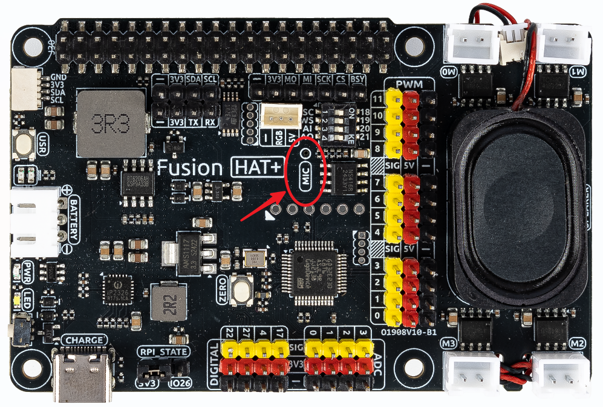

.. _gpt_easy_stt:

1.5 Speech-to-Text Chatbot
===========================================

This example builds upon :ref:`gpt_easy_tts`, enhancing the chatbot to not only speak but also understand user speech. By integrating OpenAI's Whisper API for speech-to-text (STT), the chatbot can now accept voice input and provide conversational replies.

Speech-to-text technology allows chatbots to interact with users in a more natural and accessible way. This is particularly useful for hands-free interactions, accessibility applications, and real-time communication systems.

----------------------------------------------

**Running the Example**

All example code used in this tutorial is available in the ``ai-explorer-lab-kit`` directory. 
Follow these steps to run the example:

.. code-block:: shell

   cd ~/ai-explorer-lab-kit/gpt_example/
   sudo ~/my_venv/bin/python3 gpt_easy_stt.py

----------------------------------------------

**Code**

Here is the complete example code:

.. raw:: html

   <run></run>

.. code-block:: python

   import openai
   from keys import OPENAI_API_KEY
   import readline # optimize keyboard input, only need to import
   import sys
   import os
   import subprocess
   from pathlib import Path

   import speech_recognition as sr

   # gets API Key from environment variable OPENAI_API_KEY
   client = openai.OpenAI(api_key=OPENAI_API_KEY)

   TTS_OUTPUT_FILE = 'tts_output.mp3'

   assistant = client.beta.assistants.create(
      name="BOT",
      instructions="You are a chat bot, you answer people question to help them.",
      model="gpt-4-1106-preview",
   )

   thread = client.beta.threads.create()
   recognizer = sr.Recognizer()
   os.system("fusion_hat enable_speaker")

   # speech_recognition init
   # =================================================================
   recognizer.dynamic_energy_adjustment_damping = 0.15
   recognizer.dynamic_energy_ratio = 1
   recognizer.operation_timeout = None  # seconds after an internal operation (e.g., an API request) starts before it times out, or ``None`` for no timeout
   recognizer.pause_threshold = 1

   def speech_to_text(audio_file):
      from io import BytesIO

      wav_data = BytesIO(audio_file.get_wav_data())
      wav_data.name = "record.wav"

      transcription = client.audio.transcriptions.create(
         model="whisper-1", 
         file=wav_data,
         language=['zh','en']
      )
      return transcription.text

   def redirect_error_2_null():
      # https://github.com/spatialaudio/python-sounddevice/issues/11

      devnull = os.open(os.devnull, os.O_WRONLY)
      old_stderr = os.dup(2)
      sys.stderr.flush()
      os.dup2(devnull, 2)
      os.close(devnull)
      return old_stderr

   def cancel_redirect_error(old_stderr):
      os.dup2(old_stderr, 2)
      os.close(old_stderr)

   def text_to_speech(text):
      speech_file_path = Path(__file__).parent / "speech.mp3"
      # print(speech_file_path)
      with client.audio.speech.with_streaming_response.create(
         model="tts-1",
         voice="alloy",
         input=text
      ) as response:
         response.stream_to_file(speech_file_path)

   try:
      while True:
         msg = ""
         # Notify user that recording has started
         print(f'\033[1;30m{"listening... "}\033[0m')
         # Redirect error messages to suppress ALSA warnings
         _stderr_back = redirect_error_2_null() 
         with sr.Microphone(chunk_size=8192) as source:
               # Restore standard error output
               cancel_redirect_error(_stderr_back)
               # Adjust for ambient noise to filter background sound
               recognizer.adjust_for_ambient_noise(source)
               # Record user speech
               audio = recognizer.listen(source)
         print(f'\033[1;30m{"stop listening... "}\033[0m')

         # Optional: Save and playback the recorded audio for debugging
         # This is for testing purposes and can be removed in production
         with open("stt-rec.wav", "wb") as f:
               f.write(audio.get_wav_data())
         os.system('play stt-rec.wav')

         # Convert recorded audio to text
         msg = speech_to_text(audio)

         if msg == False or msg == "":
               print() # new line
               continue

         # Pass the transcribed text to the chatbot
         message = client.beta.threads.messages.create(
               thread_id=thread.id,
               role="user",
               content=msg,
         )

         # Generate and process the assistant's response
         run = client.beta.threads.runs.create_and_poll(
               thread_id=thread.id,
               assistant_id=assistant.id,
         )

         # print("Run completed with status: " + run.status)
         if run.status == "completed":
               messages = client.beta.threads.messages.list(thread_id=thread.id)

               for message in messages.data:
                  if message.role == 'user':
                     for block in message.content:
                           if block.type == 'text':
                              label = message.role 
                              value = block.text.value
                              print(f'{label:>10} >>> {value}')
                     break # only last reply

               for message in messages.data:
                  if message.role == 'assistant':
                     for block in message.content:
                           if block.type == 'text':
                              label = assistant.name
                              value = block.text.value
                              print(f'{label:>10} >>> {value}')
                              text_to_speech(value)
                              p=subprocess.Popen("mplayer speech.mp3", shell=True, stdout=subprocess.PIPE, stderr=subprocess.STDOUT)
                              p.wait()
                     break # only last reply

   finally:
      client.beta.assistants.delete(assistant.id)

----------------------------------------------

**Code Explanation**

Here are key points from the code:

.. code-block:: python

   import speech_recognition as sr
   import os

The ``speech_recognition`` library is a powerful and flexible Python library for handling audio input 
from microphones or files and performing speech recognition. 

The ``os`` and ``subprocess`` libraries are used for file operations and executing system commands, respectively.

.. code-block:: python

   os.system("fusion_hat enable_speaker")

This line enables the speaker and microphone on the Fusion HAT.

.. code-block:: python

   recognizer = sr.Recognizer()
   recognizer.dynamic_energy_adjustment_damping = 0.15
   recognizer.dynamic_energy_ratio = 1
   recognizer.operation_timeout = None 
   recognizer.pause_threshold = 1

The recognizer is configured with parameters for handling audio input effectively. Below is a summary of key parameters:

.. list-table::
   :widths: 20 20 60
   :header-rows: 1

   *  - Parameter
      - Default Value
      - Description
   *  - energy_threshold
      - 300
      - The threshold to distinguish between background noise and speech. Increase this for noisy environments.
   *  - dynamic_energy_threshold
      - True
      - Automatically adjusts the threshold based on ambient noise before each recording.
   *  - dynamic_energy_adjustment_damping
      - 0.15
      - Controls the speed of dynamic threshold changes. Lower values mean faster adjustments.
   *  - dynamic_energy_ratio
      - 1.5
      - Ratio of dynamic threshold to ambient noise. Higher values require louder speech.
   *  - pause_threshold
      - 0.8
      - The length of silence required to end a phrase. Increase for longer pauses.
   *  - operation_timeout
      - None 
      - Sets the maximum wait time for recognition operations. None means no timeout.
   *  - phrase_threshold
      - 0.3
      - The duration of silence required to consider the speech segment finished.
   *  - non_speaking_duration
      - 0.5
      - Allows some silence before and after speech to ensure complete phrase capture.

.. code-block:: python

   def redirect_error_2_null():
      ...

   def cancel_redirect_error(old_stderr):
      ...

   while True:

      ...

      print(f'\033[1;30m{"listening... "}\033[0m')
      _stderr_back = redirect_error_2_null() # ignore error print to ignore ALSA errors
      with sr.Microphone(chunk_size=8192) as source:
         cancel_redirect_error(_stderr_back) # restore error print
         recognizer.adjust_for_ambient_noise(source)
         audio = recognizer.listen(source)
      print(f'\033[1;30m{"stop listening... "}\033[0m')

This section of the main loop handles real-time voice input.

When using a microphone, certain devices, such as Raspberry Pi, may generate ALSA-related warnings or error messages. 
These messages do not affect the program's functionality. 
To enhance user experience, the functions ``redirect_error_2_null()`` and ``cancel_redirect_error()`` are implemented 
to suppress and restore error messages respectively.

* The line ``with sr.Microphone(chunk_size=8192) as source:`` opens the microphone as the audio input source. The ``chunk_size`` parameter specifies the size of audio samples processed per second.
* The ``with`` statement ensures the microphone resource is properly closed after use.
* The method ``recognizer.adjust_for_ambient_noise(source)`` captures a brief sample of background audio to dynamically adjust the noise threshold, filtering out ambient noise.
* The function ``audio = recognizer.listen(source)`` records the user's speech and returns an ``audio`` object containing the captured audio data.

The two ``print()`` statements are used to inform the user when recording starts and stops.

.. code-block:: python

   with open("stt-rec.wav", "wb") as f:
      f.write(audio.get_wav_data())
   os.system('play stt-rec.wav')

This code saves the recorded speech as a WAV file and immediately plays it back. 
This feature is useful for debugging, allowing you to verify the recording quality. 
In a production environment, this code can be commented out to streamline the workflow.

.. code-block:: python

   msg = speech_to_text(audio)

.. code-block:: python

   def speech_to_text(audio_file):
      from io import BytesIO

      wav_data = BytesIO(audio_file.get_wav_data())
      wav_data.name = "record.wav"

      transcription = client.audio.transcriptions.create(
         model="whisper-1", 
         file=wav_data,
         language=['zh','en']
      )
      return transcription.text

To transcribe the recorded audio file into text, 
the main loop calls a custom function ``speech_to_text(audio)``, 
with the recorded ``audio`` object as its parameter.

This function uses OpenAI's ``whisper-1`` model to process the audio data:

* The ``wav_data`` object is created as an in-memory ``BytesIO`` stream, making it ideal for temporary storage and transmission of audio data.
* The ``wav_data`` file is assigned a virtual filename ``"record.wav"`` because the ``whisper-1`` model requires a filename as part of its metadata.

The ``language=['zh', 'en']`` parameter specifies supported languages as Chinese and English. In practice, Whisper can detect and transcribe other languages. To enable automatic language detection, set ``language=None``.

This transcription mechanism ensures flexibility in handling multilingual input, making the chatbot more adaptable to diverse user interactions.

----------------------------------------------

**Error Handling**

Robust error handling is crucial for ensuring the reliability and user-friendliness of your speech-to-text chatbot. Below are revised strategies for managing specific issues effectively:

1. **API Connection Errors**

**Problem:** Network issues or incorrect API configurations can prevent the chatbot from connecting to OpenAI's servers.

**Solution:** Implement retry logic with exponential backoff and catch exceptions related to network issues. Ensure your API keys are correctly configured and handle any authentication errors gracefully.

.. code-block:: python

   import time
   import requests

   def reliable_api_call(callable, *args, **kwargs):
      retries = 5
      for i in range(retries):
         try:
               return callable(*args, **kwargs)
         except requests.exceptions.RequestException as e:
               wait = 2 ** i
               print(f"Network error: {e}, retrying in {wait} seconds...")
               time.sleep(wait)
         except openai.APIError as e:
               print(f"API error: {e}, check your API configuration.")
               break
      return None

2. **Misinterpretation of Silence**

**Problem:** Whisper sometimes transcribes silence as meaningful speech in various languages.

**Solution:** Use Voice Activity Detection (VAD) to ensure that only audio segments with potential speech are processed. Adjust the sensitivity of the speech recognizer to better distinguish between silence and speech.

.. code-block:: python

   import speech_recognition as sr

   def listen_and_filter_silence(recognizer, source):
      with sr.Microphone() as source:
         recognizer.adjust_for_ambient_noise(source)
         audio = recognizer.listen(source)
         if audio.frame_data:  # Check if there's significant audio
               return audio
         else:
               print("Silence detected, ignoring input.")
               return None

3. **Whisper Transcription Errors**

**Problem:** Whisper can occasionally generate incorrect transcriptions due to ambient noise, accents, or the system interpreting silence.

**Solution:** Implement a feedback loop where users can confirm or correct the transcription. This feedback can be used to train or adjust the system further.

.. code-block:: python

   def ask_for_feedback(transcribed_text):
      print(f"Transcribed: {transcribed_text}")
      user_correction = input("If this is incorrect, please type the correct text, or just press enter if it is correct: ")
      if user_correction:
         return user_correction
      else:
         return transcribed_text

4. **Audio Input Errors**

**Problem:** Incorrectly configured microphones or poor audio quality can result in no input or poor transcription quality.

**Solution:** Regularly test microphone settings and ensure the audio input is clear. Use diagnostic tools to monitor and adjust input levels.

.. code-block:: python

   def test_microphone_settings():
      recognizer = sr.Recognizer()
      with sr.Microphone() as source:
         try:
               recognizer.adjust_for_ambient_noise(source)
               print("Microphone is properly configured.")
         except sr.RequestError as e:
               print(f"Microphone configuration error: {e}")
         except sr.UnknownValueError:
               print("Microphone setup failed, please check your audio device.")
