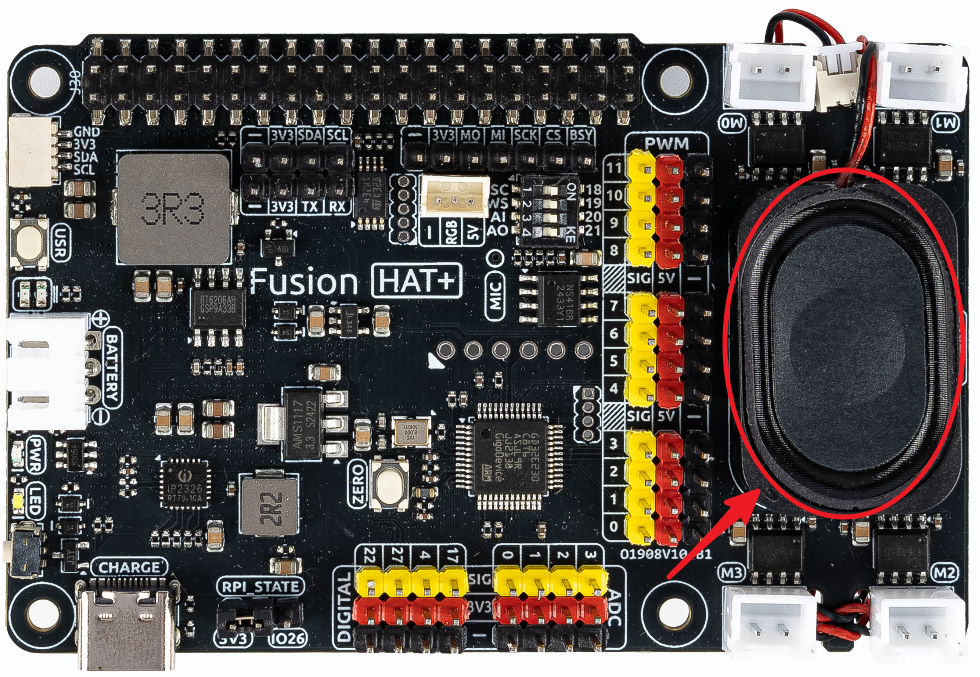

.. _gpt_easy_tts:

1.4 Voice-Enabled Chatbot
==============================================

This example builds upon :ref:`gpt_easy_keyboard` by enabling the chatbot to play its responses as speech. 
The implementation integrates OpenAI's TTS (Text-to-Speech) API and a local audio player for playback.

----------------------------------------------

**Running the Example**

Before running this example, ensure that your system has a compatible audio player installed.

For Linux systems, install ``mplayer`` by running:

.. code-block:: shell

   sudo apt install mplayer

Once installed, navigate to the project directory and execute the script:

.. code-block:: shell

   cd ~/ai-explorer-lab-kit/gpt_example/
   sudo ~/my_venv/bin/python3 gpt_easy_tts.py

----------------------------------------------

**Code**

The complete example code is as follows:

.. raw:: html

   <run></run>

.. code-block:: python

   import openai
   from keys import OPENAI_API_KEY
   import readline # optimize keyboard input, only need to import
   import sys
   import subprocess
   from pathlib import Path

   # gets API Key from environment variable OPENAI_API_KEY
   client = openai.OpenAI(api_key=OPENAI_API_KEY)
   os.system("fusion_hat enable_speaker")

   TTS_OUTPUT_FILE = 'tts_output.mp3'

   assistant = client.beta.assistants.create(
      name="BOT",
      instructions="You are a chat bot, you answer people question to help them. ",
      model="gpt-4-1106-preview",
   )

   thread = client.beta.threads.create()

   def text_to_speech(text):
      speech_file_path = Path(__file__).parent / "speech.mp3"
      with client.audio.speech.with_streaming_response.create(
         model="tts-1",  # Low-latency TTS model for real-time usage
         voice="alloy",  # Selected voice for audio playback
         input=text  # Text to convert to speech
      ) as response:
         response.stream_to_file(speech_file_path) # Save audio to the specified file

   try:
      while True:
         msg = ""
         msg = input(f'\033[1;30m{"intput: "}\033[0m').encode(sys.stdin.encoding).decode('utf-8')
         if msg == False or msg == "":
            print() # new line
            continue

         message = client.beta.threads.messages.create(
            thread_id=thread.id,
            role="user",
            content=msg,
         )

         run = client.beta.threads.runs.create_and_poll(
            thread_id=thread.id,
            assistant_id=assistant.id,
         )

         # print("Run completed with status: " + run.status)

         if run.status == "completed":
            messages = client.beta.threads.messages.list(thread_id=thread.id)

            for message in messages.data:
               if message.role == 'user':
                  for block in message.content:
                     if block.type == 'text':
                        label = message.role 
                        value = block.text.value
                        print(f'{label:>10} >>> {value}')
                  break # only last reply

            for message in messages.data:
               if message.role == 'assistant':
                  for block in message.content:
                     if block.type == 'text':
                        label = assistant.name
                        value = block.text.value
                        print(f'{label:>10} >>> {value}')
                        text_to_speech(value)
                        p=subprocess.Popen("mplayer speech.mp3", shell=True, stdout=subprocess.PIPE, stderr=subprocess.STDOUT)
                        p.wait()
                  break # only last reply

   finally:
      client.beta.assistants.delete(assistant.id)

----------------------------------------------

**Code Explanation**

Here are the key parts of the code to focus on:

.. code-block:: python
   :emphasize-lines: 5,6

   import openai
   from keys import OPENAI_API_KEY
   import readline # optimize keyboard input, only need to import
   import sys
   import subprocess
   from pathlib import Path

The ``subprocess`` library is used to execute system commands, which in this case play the audio file. 

The ``pathlib`` library provides tools for working with file paths in a consistent and cross-platform way.

.. code-block:: python

   os.system("fusion_hat enable_speaker")

This line enables the speaker and microphone on the Fusion HAT.

.. code-block:: python

   def text_to_speech(text):
      speech_file_path = Path(__file__).parent / "speech.mp3"
      with client.audio.speech.with_streaming_response.create(
         model="tts-1",
         voice="alloy",
         input=text
      ) as response:
         response.stream_to_file(speech_file_path)

This function implements the Text-to-Speech (TTS) feature using OpenAI's TTS API (``audio.speech`` module). 
The function converts the input text into audio and saves it as an MP3 file.

The ``speech`` endpoint takes in three key inputs:

* ``text``: The text to convert to audio.
* ``model``: For real-time applications, use the low-latency ``tts-1`` model. For higher-quality output, use ``tts-1-hd``. Note that ``tts-1`` may generate static in certain situations.
* ``voice``: Specifies the voice used for the audio. Available options include "alloy," "echo," "fable," "onyx," "nova," and "shimmer." Choose a voice that matches your desired tone.

The function saves the resulting audio stream to the file ``speech.mp3`` in the current directory using ``response.stream_to_file``.

.. code-block:: python
   :emphasize-lines: 8,9,10

   for message in messages.data:
      if message.role == 'assistant':
         for block in message.content:
            if block.type == 'text':
               label = assistant.name
               value = block.text.value
               print(f'{label:>10} >>> {value}')
               text_to_speech(value)
               p=subprocess.Popen("mplayer speech.mp3", shell=True, stdout=subprocess.PIPE, stderr=subprocess.STDOUT)
               p.wait()
         break # only last reply

* ``text_to_speech``: Converts the assistant's response to audio and saves it as ``speech.mp3``.
* ``subprocess.Popen``: Launches a subprocess to play the audio file using ``mplayer``.
* ``p.wait()``: Ensures the program waits until playback is complete before proceeding.

This setup ensures the chatbot responds with both text and voice, offering an engaging user experience.

-------------------------------------------

**Error Handling**

Integrating Text-to-Speech (TTS) functionalities into your Raspberry Pi project can sometimes lead to errors that may affect the performance and user experience of your chatbot. Proper error handling is crucial to ensure your application is robust and reliable. Here are common issues and strategies to handle them effectively:

1. TTS API Errors

``Problem``: Issues might arise from the TTS API, such as rate limits being exceeded, incorrect API key usage, or unexpected server errors.

``Solution``: Implement error handling around API calls to manage these situations gracefully. Use try-except blocks to catch exceptions and provide fallbacks or retries.

.. code-block:: python

   def text_to_speech(text):
      tts_path = Path(__file__).parent / "tts_output.mp3"
      try:
         with client.audio.speech.create(
               model="tts-1",
               voice="alloy",
               input=text
         ) as response:
               response.save_to_path(tts_path)
               subprocess.run(["mplayer", str(tts_path)], check=True)
      except openai.Error as e:
         print(f"Failed to generate speech: {e}")
         # Handle specific errors or implement a retry mechanism

2. Audio Playback Issues

``Problem``: Audio playback failures can occur due to problems with the audio configuration, unsupported formats, or issues with mplayer.

``Solution``: Verify that the audio system is correctly configured and that all dependencies are correctly installed. Catch and log subprocess-related errors to troubleshoot and fix issues.

.. code-block:: python

   def play_audio(file_path):
      try:
         subprocess.run(["mplayer", file_path], check=True)
      except subprocess.CalledProcessError as e:
         print(f"Failed to play audio: {e}")
         # Check audio output settings or file existence

3. Network Connectivity Issues

``Problem``: A common issue for any cloud-based service is the failure of network requests due to poor connectivity or temporary network outages.

``Solution``: Implement a retry logic with exponential backoff for handling network-related exceptions.

.. code-block:: python

   import time

   def reliable_request(call, *args, **kwargs):
      max_attempts = 5
      for attempt in range(max_attempts):
         try:
               return call(*args, **kwargs)
         except requests.ConnectionError:
               wait = 2 ** attempt
               print(f"Connection failed, retrying in {wait} seconds...")
               time.sleep(wait)
      raise Exception("Failed to connect after several attempts")

4. Resource Limitation Handling

``Problem``: Running resource-intensive operations like TTS on Raspberry Pi can lead to performance bottlenecks.

``Solution``: Monitor and manage resource usage. Consider using lighter models or optimizing system resources. Provide user feedback when operations are delayed.

.. code-block:: python

   if sys.getsizeof(response.content) > some_threshold:
      print("Processing large data, this may take a while...")
      # Optionally, adjust parameters or simplify tasks

5. Handling Invalid Inputs

``Problem``: Receiving non-text input or empty strings can cause failures or unexpected behavior in TTS processing.

``Solution``: Validate inputs before processing them to ensure they are suitable for TTS.

.. code-block:: python

   def validate_input(input_text):
      if not isinstance(input_text, str) or not input_text.strip():
         raise ValueError("Input must be a non-empty string")

Integrating comprehensive error handling into your voice-enabled chatbot not only improves its reliability but also enhances user experience by providing clear feedback and ensuring the system can recover gracefully from errors. This makes your application more professional and robust.