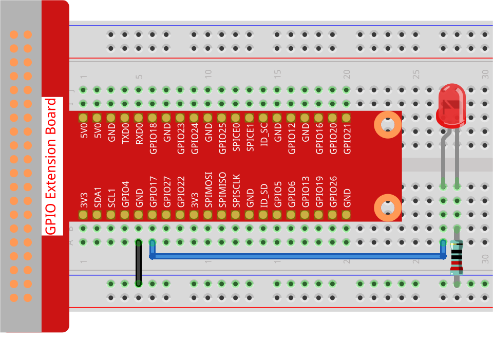

.. note::

    Hello, welcome to the SunFounder Raspberry Pi & Arduino & ESP32 Enthusiasts Community on Facebook! Dive deeper into Raspberry Pi, Arduino, and ESP32 with fellow enthusiasts.

    **Why Join?**

    - **Expert Support**: Solve post-sale issues and technical challenges with help from our community and team.
    - **Learn & Share**: Exchange tips and tutorials to enhance your skills.
    - **Exclusive Previews**: Get early access to new product announcements and sneak peeks.
    - **Special Discounts**: Enjoy exclusive discounts on our newest products.
    - **Festive Promotions and Giveaways**: Take part in giveaways and holiday promotions.

    👉 Ready to explore and create with us? Click [|link_sf_facebook|] and join today!

.. _1.1.1_py:

1.1.1 Blinking LED
==================

**Introduction**

Welcome to your first project! In this tutorial, we will learn how to make an LED blink using Python programming and the GPIO pins. This project is an excellent introduction to hardware and software integration, demonstrating how simple code can interact with real-world components.

Before we start, let’s briefly explain the basics:

* **What is an LED?**  

  An LED (Light Emitting Diode) is a small electronic component that lights up when an electrical current flows through it. LEDs are widely used in electronics because they are efficient and long-lasting.
  
* **What is a GPIO Pin?**  

  GPIO stands for **General Purpose Input/Output**. These pins allow the Raspberry Pi to communicate with external devices, such as LEDs, sensors, or buttons. Each pin can be programmed to send signals (output) or read signals (input).

In this tutorial, we’ll connect an LED to a GPIO pin and write a Python program to make it blink. Let’s get started!

----------------------------------------------

**What You’ll Need**

Here’s the list of components and their purposes:

.. list-table::
    :widths: 30 20
    :header-rows: 1

    *   - COMPONENT
        - PURPOSE
    *   - GPIO Extension Board
        - Simplifies access to GPIO pins
    *   - Breadboard
        - Used to build circuits without soldering
    *   - Wires
        - Connects components on the breadboard
    *   - Resistor (330Ω recommended)
        - Protects the LED from too much current
    *   - LED
        - The main component that will blink

----------------------------------------------

**Getting Started: Setting Up Your Raspberry Pi**

Before diving into the project, make sure your Raspberry Pi is ready:

1. **Install the Operating System:**  

   Download and install Raspberry Pi OS on your SD card. You can use the official `Raspberry Pi Imager <https://www.raspberrypi.org/software/>`_ tool to do this.

2. **Connect Peripherals:**  

   Attach a monitor, keyboard, and mouse to your Raspberry Pi. Alternatively, set up SSH to control your Raspberry Pi from another computer.

3. **Update Software:**  

   Open the terminal and run the following commands to ensure your system is up to date:
   
   .. code-block:: bash

       sudo apt update
       sudo apt upgrade

4. **Install GPIO Libraries:**  

   Install the ``gpiozero`` library, which makes it easy to control GPIO pins using Python:
   
   .. code-block:: bash

       sudo apt install python3-gpiozero

5. **Enable GPIO Access:**  

   Ensure your user account has permission to access the GPIO pins. This is usually configured by default in Raspberry Pi OS.

----------------------------------------------

**Circuit Diagram**

Here’s how the circuit should look:

* **GPIO Pin 17** connects to the anode (long pin) of the LED.
* The cathode (short pin) of the LED connects to one leg of the resistor.
* The other leg of the resistor connects to the **GND** (Ground) pin.

**Why Use a Resistor?**  

The resistor limits the current flowing through the LED, preventing it from burning out. Without a resistor, the LED may draw too much current, which can damage both the LED and the Raspberry Pi.

----------------------------------------------

**Wiring Diagram**

Follow the wiring diagram below to connect your components:

----------------------------------------------

**Writing the Code**

Let’s write the Python code to control the LED. You’ll create a script that turns the LED on and off at regular intervals.

1. **Navigate to the Code Directory:**  

   Open your terminal and type:

   .. code-block:: bash

       cd ~/zero-w-ai-kit/python

2. **Run the Program:**  

   Use the following command to execute the script:

   .. code-block:: bash

       sudo python3 1.1.1_BlinkingLed_zero.py

   You should see the LED blinking on and off at regular intervals.

3. **Edit the Code (Optional):**  

   To modify the program, open the code file in a text editor:

   .. code-block:: bash

       nano 1.1.1_BlinkingLed_zero.py

   Make your changes, then press ``Ctrl+X`` to exit. Save your modifications by typing `Y` when prompted. Run the script again to see your changes.

----------------------------------------------

**Code**

Here’s the complete Python script for this project:

.. code-block:: python

    #!/usr/bin/env python3
    from gpiozero import LED
    from time import sleep

    # Initialize the LED object connected to GPIO pin 17
    led = LED(17)

    try:
        while True:
            led.on()  # Turn on the LED
            print('LED is ON')
            sleep(0.5)  # Wait for 0.5 seconds

            led.off()  # Turn off the LED
            print('LED is OFF')
            sleep(0.5)  # Wait for 0.5 seconds
    except KeyboardInterrupt:
        pass  # Gracefully exit on Ctrl+C

This Python script controls an LED connected to GPIO pin 17 of a Raspberry Pi. When executed, the LED alternates between turning on and off in half-second intervals. Simultaneously, the console prints "LED is ON" and "LED is OFF" to indicate the LED's current state. The program runs indefinitely until interrupted by a user pressing ``Ctrl+C``.

----------------------------------------------

**Understanding the Code**

1. **Imports:**  

   The ``gpiozero`` library simplifies controlling GPIO devices. The ``LED`` class allows you to control an LED with basic methods like ``on()`` and ``off()``. The ``sleep`` function introduces delays between commands.

2. **Initialization:**  

   The line ``led = LED(17)`` tells the Raspberry Pi that an LED is connected to GPIO pin 17.

3. **Main Loop:**  

   Inside the ``while True`` loop: The LED turns on (``led.on()``) and off (``led.off()``) with a 0.5-second pause (``sleep(0.5)``) in between.

4. **Graceful Exit:**  

   The ``try...except`` block ensures the program stops cleanly when interrupted (e.g., by pressing ``Ctrl+C``).

----------------------------------------------

**Troubleshooting**

1. **LED Does Not Light Up**  

   - **Cause**: Incorrect GPIO pin or faulty wiring.  
   - **Solution**: Double-check the LED's connection to GPIO pin 17 and ensure the resistor is correctly placed to prevent damage to the LED.

2. **KeyboardInterrupt Not Working**  

   - **Cause**: The program does not exit gracefully.  
   - **Solution**: Ensure the script is running in a terminal where ``Ctrl+C`` is captured, not as a background process.

3. **Incorrect GPIO Setup**  

   - **Cause**: GPIO library is not installed.  
   - **Solution**: Install ``gpiozero`` via ``pip install gpiozero``.

4. **LED Flickers or Behaves Erratically**  

   - **Cause**: Unstable power supply or poor connections.  
   - **Solution**: Ensure a stable power source and secure wiring.

----------------------------------------------

**Extendable Ideas**

1. **Variable Blink Speed**: Add user input to control the LED's blinking speed dynamically:  

   .. code-block:: python
        
        interval = float(input("Enter blink interval in seconds: "))

        while True:
            led.on()
            sleep(interval)
            led.off()
            sleep(interval)

2. **Multi-LED Control**: Connect multiple LEDs to different GPIO pins and control them in patterns (e.g., sequential lighting or simultaneous blinking).

3. **Use PWM for Brightness Control**: Use the ``PWMLED`` class to control the brightness of the LED:  

   .. code-block:: python

        from gpiozero import PWMLED
        led = PWMLED(17)
        led.pulse()  # Gradually increase and decrease brightness

----------------------------------------------

**Conclusion**

Congratulations! You’ve completed your first Raspberry Pi project. By controlling an LED, you’ve learned how to use GPIO pins and write Python scripts to interact with hardware. This foundational knowledge will serve as a stepping stone for more complex projects. Keep experimenting and exploring!
