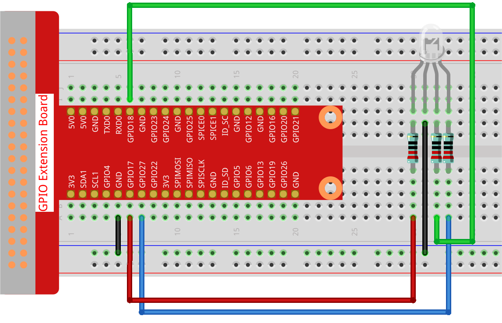

.. note::

    Hello, welcome to the SunFounder Raspberry Pi & Arduino & ESP32 Enthusiasts Community on Facebook! Dive deeper into Raspberry Pi, Arduino, and ESP32 with fellow enthusiasts.

    **Why Join?**

    - **Expert Support**: Solve post-sale issues and technical challenges with help from our community and team.
    - **Learn & Share**: Exchange tips and tutorials to enhance your skills.
    - **Exclusive Previews**: Get early access to new product announcements and sneak peeks.
    - **Special Discounts**: Enjoy exclusive discounts on our newest products.
    - **Festive Promotions and Giveaways**: Take part in giveaways and holiday promotions.

    👉 Ready to explore and create with us? Click [|link_sf_facebook|] and join today!

.. _1.1.2_py:

1.1.2 RGB LED
====================

**Introduction**

In this project, we will explore how to control an RGB LED to display various colors by using a Raspberry Pi and GPIO programming. RGB LEDs are versatile components that can emit a spectrum of colors by mixing red, green, and blue light at different intensities.

----------------------------------------------

**What You’ll Need**

To complete this project, you will need the following components:

.. list-table::
    :widths: 30 20
    :header-rows: 1

    *   - COMPONENT
        - PURCHASE LINK

    *   - :ref:`cpn_gpio_extension_board`
        - |link_gpio_board_buy|
    *   - :ref:`cpn_breadboard`
        - |link_breadboard_buy|
    *   - :ref:`cpn_wires`
        - |link_wires_buy|
    *   - :ref:`cpn_resistor`
        - |link_resistor_buy|
    *   - :ref:`cpn_rgb_led`
        - |link_rgb_led_buy|

----------------------------------------------

**Circuit Diagram**

After connecting the R, G, and B pins of the RGB LED to current-limiting resistors, connect these resistors to GPIO12, GPIO13, and GPIO16, respectively. The longest pin of the LED (GND) is connected to the GND pin of the Raspberry Pi. Different PWM values for the three pins produce various colors.

.. image:: ../python/img/1.1.2_rgb_led_schematic.png

----------------------------------------------

**Wiring Diagram**

Follow the steps below to build the circuit:

1. Place the RGB LED on the breadboard.
2. Connect the red, green, and blue pins of the LED to GPIO17, GPIO18, and GPIO27 through resistors.
3. Connect the longest pin (GND) of the LED to the GND of the Raspberry Pi.

----------------------------------------------

**Writing the Code**

The following Python code cycles through various colors on the RGB LED by setting different PWM values for the red, green, and blue components:

.. code-block:: python

   #!/usr/bin/env python3
   from gpiozero import RGBLED
   from time import sleep

   # Define colors as (red, green, blue) tuples.
   COLORS = [(1, 0, 0), (0, 1, 0), (0, 0, 1), (1, 1, 0), (1, 0, 1), (0, 1, 1)]

   # Initialize the RGB LED with GPIO pins for red, green, and blue.
   rgb_led = RGBLED(red=17, green=18, blue=27)

   try:
       # Cycle through colors indefinitely.
       while True:
           for color in COLORS:
               rgb_led.color = color
               print(f"Color set to: {color}")
               sleep(1)
   except KeyboardInterrupt:
       # Exit gracefully on Ctrl+C.
       pass

This Python script controls an RGB LED connected to GPIO pins 17, 18, and 27 of a Raspberry Pi. When executed, the program cycles through a predefined set of colors (``COLORS``), which are represented as RGB tuples:

1. Red ``(1, 0, 0)``
2. Green ``(0, 1, 0)``
3. Blue ``(0, 0, 1)``
4. Yellow ``(1, 1, 0)``
5. Magenta ``(1, 0, 1)``
6. Cyan ``(0, 1, 1)``

Each color is displayed for one second, and the current color is printed to the console. The program runs indefinitely until interrupted by pressing ``Ctrl+C``.

----------------------------------------------

**Understanding the Code**

1. **Importing Libraries**

   The ``gpiozero`` library is used for controlling the RGB LED, and the ``time`` library provides a delay function.

   .. code-block:: python

       from gpiozero import RGBLED
       from time import sleep

2. **Defining Colors**

   The ``COLORS`` list contains tuples representing different colors in RGB format. Each value ranges from 0 (off) to 1 (full intensity).

   .. code-block:: python

       COLORS = [(1, 0, 0), (0, 1, 0), (0, 0, 1), (1, 1, 0), (1, 0, 1), (0, 1, 1)]

3. **Initializing the LED**

   An RGB LED is connected to GPIO pins 17, 18, and 27 for red, green, and blue, respectively.

   .. code-block:: python

       rgb_led = RGBLED(red=17, green=18, blue=27)

4. **Cycling Through Colors**

   The ``while`` loop continuously iterates through the ``COLORS`` list, setting the LED to each color with a 1-second delay.

   .. code-block:: python

       while True:
           for color in COLORS:
               rgb_led.color = color
               print(f"Color set to: {color}")
               sleep(1)

5. **Handling Interruptions**

   The ``try-except`` block ensures the program exits gracefully on a ``KeyboardInterrupt`` (Ctrl+C).

   .. code-block:: python

       except KeyboardInterrupt:
           pass

----------------------------------------------

**Troubleshooting**

1. **LED Does Not Light Up**  

   - **Cause**: Incorrect wiring or GPIO pin mismatch.  
   - **Solution**: Verify that the red, green, and blue pins of the RGB LED are connected to the correct GPIO pins (17, 18, 27) and that the LED's common cathode or anode is properly connected.

2. **gpiozero Module Not Found**  

   - **Cause**: Missing GPIOZero library.  
   - **Solution**: Install it using ``pip install gpiozero``.

3. **Flickering or Unstable Colors**  

   - **Cause**: Unstable power supply or improper resistor usage.  
   - **Solution**: Use appropriate resistors and ensure a stable power source.

----------------------------------------------

**Extendable Ideas**

1. **Custom Color Sequences**  

   Add more colors to the ``COLORS`` list, including dimmer variations by using fractional values, such as ``(0.5, 0.2, 0.8)`` for a softer tone.

2. **User-Defined Colors**  

   Allow the user to input custom RGB values:  

   .. code-block:: python

        while True:
            user_color = input("Enter RGB values (e.g., 1,0,0): ")
            r, g, b = map(float, user_color.split(","))
            rgb_led.color = (r, g, b)

3. **Randomized Colors**  

   Generate random colors to create a dynamic and unpredictable light display:  

   .. code-block:: python

        from random import random
        while True:
            rgb_led.color = (random(), random(), random())
            sleep(1)

----------------------------------------------

**Conclusion**

By following this guide, you have successfully learned how to control an RGB LED using a Raspberry Pi and Python. This project demonstrates the basics of PWM and color mixing, which can be expanded into more advanced lighting effects or used as a foundation for interactive projects.