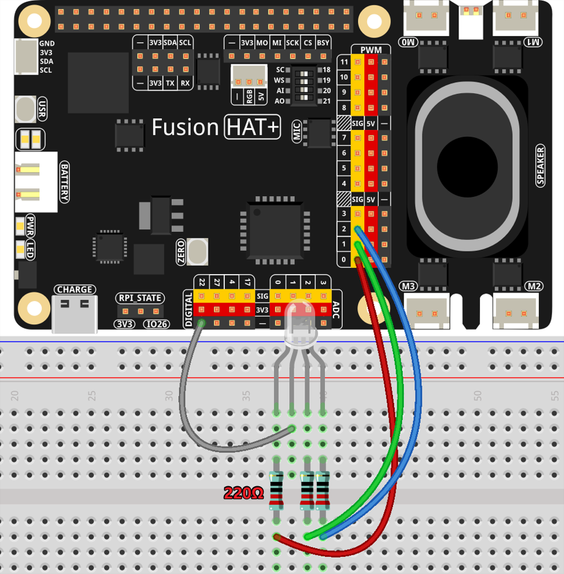

.. note::

    Hello, welcome to the SunFounder Raspberry Pi & Arduino & ESP32 Enthusiasts Community on Facebook! Dive deeper into Raspberry Pi, Arduino, and ESP32 with fellow enthusiasts.

    **Why Join?**

    - **Expert Support**: Solve post-sale issues and technical challenges with help from our community and team.
    - **Learn & Share**: Exchange tips and tutorials to enhance your skills.
    - **Exclusive Previews**: Get early access to new product announcements and sneak peeks.
    - **Special Discounts**: Enjoy exclusive discounts on our newest products.
    - **Festive Promotions and Giveaways**: Take part in giveaways and holiday promotions.

    👉 Ready to explore and create with us? Click [|link_sf_facebook|] and join today!

.. _1.1.2_py:

1.1.2 RGB LED
====================

**Introduction**

In this project, we will explore how to control an RGB LED to display various colors by using a Raspberry Pi and GPIO programming. RGB LEDs are versatile components that can emit a spectrum of colors by mixing red, green, and blue light at different intensities.

----------------------------------------------

**What You’ll Need**

To complete this project, you will need the following components:

.. list-table::
    :widths: 30 20
    :header-rows: 1

    *   - COMPONENT
        - PURCHASE LINK

    *   - :ref:`cpn_breadboard`
        - |link_breadboard_buy|
    *   - :ref:`cpn_wires`
        - |link_wires_buy|
    *   - :ref:`cpn_resistor`
        - |link_resistor_buy|
    *   - :ref:`cpn_rgb_led`
        - |link_rgb_led_buy|
    *   - Fusion HAT
        - 
    *   - Raspberry Pi Zero 2 W
        -

----------------------------------------------

**Circuit Diagram**

After connecting the R, G, and B pins of the RGB LED to current-limiting resistors, connect these resistors to PWM0, PWM1, and PWM2, respectively. The longest pin of the LED (GND) is connected to the GND pin of the Raspberry Pi. Different PWM values for the three pins produce various colors.

----------------------------------------------

**Wiring Diagram**

Follow the steps below to build the circuit:

1. Place the RGB LED on the breadboard.
2. Connect the red, green, and blue pins of the LED to P0, P1, and P2 through resistors.
3. Connect the longest pin (GND) of the LED to the GND of the Raspberry Pi.

----------------------------------------------

**Writing the Code**

The following Python code cycles through various colors on the RGB LED by setting different PWM values for the red, green, and blue components:

.. code-block:: python

   #!/usr/bin/env python3
   from fusion_hat import RGB_LED,PWM
   from time import sleep

   # Initialize an RGB LED. Connect the red component to P0, green to P1, and blue to P2.
   rgb_led = RGB_LED(PWM('P0'), PWM('P1'), PWM('P2'),common=RGB_LED.CATHODE)

   try:
      # Set the RGB LED to red.
      rgb_led.color((255, 0, 0))
      sleep(1)

      # Set the RGB LED to green.
      rgb_led.color("#00FF22") 
      sleep(1)

      # Set the RGB LED to purple.
      rgb_led.color(0xFF00FF)  
      sleep(1)

      # Set the RGB LED to black.
      rgb_led.color(0x000000)  

   except KeyboardInterrupt:
      # Handle a KeyboardInterrupt (Ctrl+C) to exit.
      rgb_led.color(0x000000)  
      pass

This script demonstrates how to control an RGB LED using the Fusion Hat library. It initializes the RGB LED with specific PWM pins and sets different colors sequentially.

----------------------------------------------

**Understanding the Code**

Run the script on a compatible device with a connected RGB LED. The LED will cycle through red, green, and purple before turning off.

1. **Importing Dependencies**
   
   .. code:: python

      from fusion_hat import RGB_LED, PWM
      from time import sleep
   
   The required modules are imported. ``RGB_LED`` and ``PWM`` from the ``fusion_hat`` library manage the RGB LED, and ``sleep`` is used for timing.

2. **Initializing the RGB LED**
   
   .. code:: python

      rgb_led = RGB_LED(PWM('P0'), PWM('P1'), PWM('P2'), common=RGB_LED.CATHODE)
   
   The RGB LED is initialized with its red, green, and blue components connected to PWM pins ``P0``, ``P1``, and ``P2``, respectively. The LED uses a common cathode configuration.

3. **Setting Colors Sequentially**
   
   .. code:: python

      rgb_led.color((255, 0, 0))  # Red
      sleep(1)
      
      rgb_led.color("#00FF22")  # Green
      sleep(1)
      
      rgb_led.color(0xFF00FF)  # Purple
      sleep(1)
   
   The script sets the RGB LED to different colors using different formats:

   - ``(255, 0, 0)``: Tuple representing red in RGB.
   - ``"#00FF22"``: Hexadecimal string representing a greenish color.
   - ``0xFF00FF``: Hexadecimal integer for purple.

4. **Turning Off the LED**
   
   .. code:: python

      rgb_led.color(0x000000)
   
   The script sets the LED color to black (``0x000000``), effectively turning it off.

5. **Handling Interrupts**
   
   .. code:: python

      except KeyboardInterrupt:
         rgb_led.color(0x000000)
         pass
   
   If the user interrupts the script using ``Ctrl+C``, the exception is caught, and the LED is turned off before exiting.

----------------------------------------------

**Troubleshooting**

1. **LED Does Not Light Up**  

   - **Cause**: Incorrect wiring or GPIO pin mismatch.  
   - **Solution**: Verify that the red, green, and blue pins of the RGB LED are connected to the correct pins and that the LED's common cathode or anode is properly connected.

2. **Flickering or Unstable Colors**  

   - **Cause**: Unstable power supply or improper resistor usage.  
   - **Solution**: Use appropriate resistors and ensure a stable power source.

3. **Incorrect GPIO Setup**  

   - **Cause**: Fusion_hat library is not installed.  
   - **Solution**: See :ref:`download_the_lib`.

----------------------------------------------

**Extendable Ideas**

1. **Custom Color Sequences**  

   Add more colors to the ``COLORS`` list, including dimmer variations, such as ``(125, 50, 200)`` for a softer tone.

2. **User-Defined Colors**  

   Allow the user to input custom RGB values:  

   .. code-block:: python

        while True:
            user_color = input("Enter RGB values (e.g., 125,0,0): ")
            r, g, b = map(int, user_color.split(","))
            rgb_led.color = (r, g, b)

3. **Randomized Colors**  

   Generate random colors to create a dynamic and unpredictable light display:  

   .. code-block:: python

      from random import randint
      while True:
         rgb_led.color = (randint(1,255) , randint(1,255) , randint(1,255) )
         sleep(1)

----------------------------------------------

**Conclusion**

By following this guide, you have successfully learned how to control an RGB LED using a Raspberry Pi and Python. This project demonstrates the basics of PWM and color mixing, which can be expanded into more advanced lighting effects or used as a foundation for interactive projects.