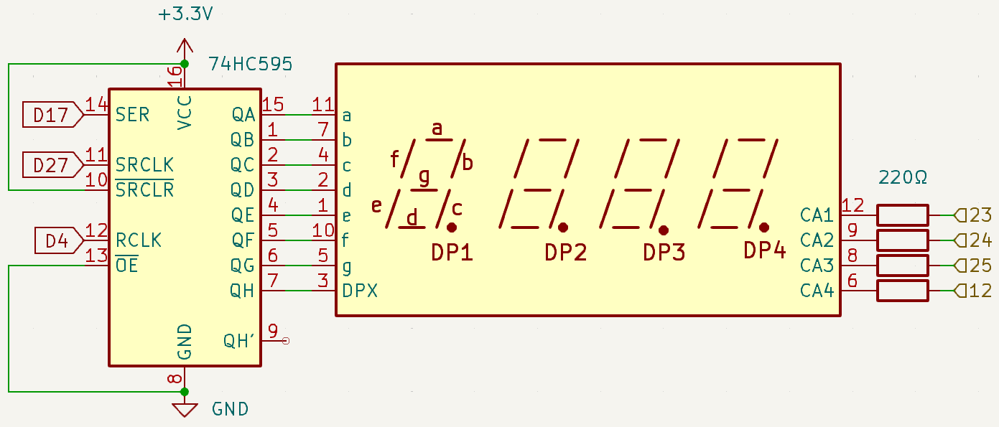
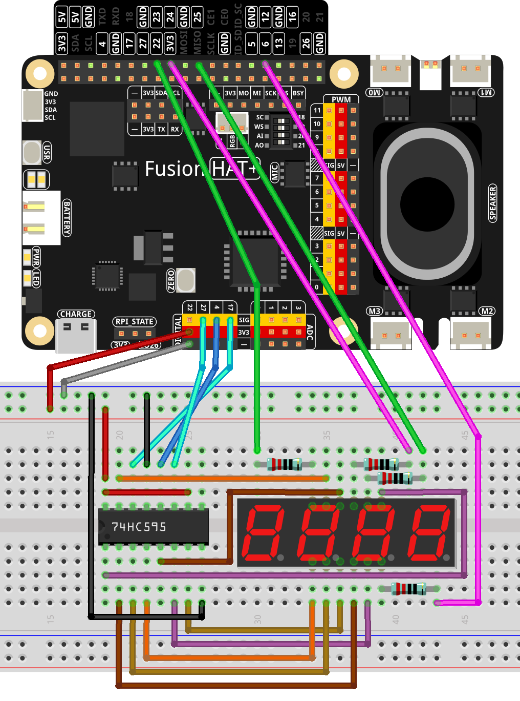

.. note::

    Hello, welcome to the SunFounder Raspberry Pi & Arduino & ESP32 Enthusiasts Community on Facebook! Dive deeper into Raspberry Pi, Arduino, and ESP32 with fellow enthusiasts.

    **Why Join?**

    - **Expert Support**: Solve post-sale issues and technical challenges with help from our community and team.
    - **Learn & Share**: Exchange tips and tutorials to enhance your skills.
    - **Exclusive Previews**: Get early access to new product announcements and sneak peeks.
    - **Special Discounts**: Enjoy exclusive discounts on our newest products.
    - **Festive Promotions and Giveaways**: Take part in giveaways and holiday promotions.

    👉 Ready to explore and create with us? Click [|link_sf_facebook|] and join today!

.. _1.1.5_py:

1.1.5 4-Digit 7-Segment Display
====================================

**Introduction**

In this project, we will learn how to control a 4-digit 7-segment display to create a counter. The counter will increment by 1 every second, and the display will update accordingly. This project highlights the use of GPIO pins and a 74HC595 shift register to manage multiple digits efficiently.

----------------------------------------------

**What You’ll Need**

To complete this project, you will need the following components:

.. list-table::
    :widths: 30 20
    :header-rows: 1

    *   - COMPONENT
        - PURCHASE LINK

    *   - :ref:`cpn_breadboard`
        - |link_breadboard_buy|
    *   - :ref:`cpn_wires`
        - |link_wires_buy|
    *   - :ref:`cpn_resistor`
        - |link_resistor_buy|
    *   - :ref:`cpn_4_digit`
        - \-
    *   - :ref:`cpn_74hc595`
        - |link_74hc595_buy|
    *   - Fusion HAT
        - 
    *   - Raspberry Pi Zero 2 W
        -

----------------------------------------------

**Circuit Diagram**

The circuit diagram shows how to connect the 74HC595 shift register to the 4-digit 7-segment display and the Raspberry Pi GPIO pins. The shift register reduces the number of GPIO pins required, allowing efficient control of the display.

----------------------------------------------

**Wiring Diagram**

Follow these steps to assemble the circuit:

1. Place the 4-digit 7-segment display and the 74HC595 shift register on the breadboard.
2. Connect the output pins of the 74HC595 to the segments of the display.
3. Use Digital pins on the Fusion HAT for the data input (SER also called SDI), shift register clock (SRCLK), and latch register clock (RCLK).
4. Add resistors to limit current for the display segments.

----------------------------------------------

**Running the Example**

All example code used in this tutorial is available in the ``ai-explorer-lab-kit`` directory. 
Follow these steps to run the example:

.. code-block:: shell
   
   cd ai-explorer-lab-kit/python/
   sudo python3 1.1.5_4-Digit_zero.py 

----------------------------------------------

**Writing the Code**

The Python code below initializes the display, updates the counter, and manages the display refresh loop:

.. raw:: html

   <run></run>

.. code-block:: python

   #!/usr/bin/env python3
   from fusion_hat import Pin
   import time
   import threading

   # Define GPIO pins for the 74HC595 shift register
   SDI = Pin(17,Pin.OUT)   # Serial Data Input
   RCLK = Pin(4,Pin.OUT)  # Register Clock
   SRCLK = Pin(27,Pin.OUT) # Shift Register Clock

   # Define GPIO pins for digit selection on the 7-segment display
   placePin = [Pin(pin,Pin.OUT) for pin in (23, 24, 25, 12)]

   # Define segment codes for numbers 0-9 for the 7-segment display
   number = (0xc0, 0xf9, 0xa4, 0xb0, 0x99, 0x92, 0x82, 0xf8, 0x80, 0x90)

   counter = 0  # Initialize counter for display
   timer1 = 0   # Initialize timer for counter increment

   def clearDisplay():
      """ Clear the 7-segment display. """
      for _ in range(8):
         SDI.high()
         SRCLK.high()
         SRCLK.low()
      RCLK.high()
      RCLK.low()

   def hc595_shift(data):
      """ Shift a byte of data to the 74HC595 shift register. """
      for i in range(8):
         SDI.value(0x80 & (data << i))  # Set SDI high/low based on data bit
         SRCLK.high()  # Pulse the Shift Register Clock
         SRCLK.low()
      RCLK.high()  # Latch data on the output by pulsing Register Clock
      RCLK.low()

   def pickDigit(digit):
      """ Select a digit for display on the 7-segment display. """
      for pin in placePin:
         pin.low()  # Turn off all digit selection pins
      placePin[digit].high()  # Turn on the selected digit

   def timer():
      """ Timer function to increment the counter every second. """
      global counter, timer1
      timer1 = threading.Timer(1.0, timer)  # Reset timer for next increment
      timer1.start()
      counter += 1  # Increment counter
      print("%d" % counter)  # Print current counter value

   def setup():
      """ Setup initial state and start the timer. """
      global timer1
      timer1 = threading.Timer(1.0, timer)  # Initialize and start the timer
      timer1.start()

   def loop():
      """ Main loop to update the 7-segment display with counter value. """
      global counter
      while True:
         for i in range(4):  # Loop through each digit
               clearDisplay()  # Clear display before setting new digit
               pickDigit(i)    # Select digit for display

               # Choose the digit of counter to display
               digit = (counter // (10 ** i)) % 10

               hc595_shift(number[digit])  # Shift digit value to 74HC595
               time.sleep(0.001)  # Short delay for display stability

   def destroy():
      """ Cleanup GPIO resources and stop timer on exit. """
      global timer1
      timer1.cancel()  # Stop the timer
      for device in [SDI, RCLK, SRCLK] + placePin:
         device.close()  # Close GPIO devices

   try:
      setup()  # Initialize the setup
      while True:
         loop()  # Start the main loop
         
   except KeyboardInterrupt:
      # Handle script interruption (e.g., Ctrl+C)
      destroy()  # Cleanup resources on exit

This Python script controls a 4-digit 7-segment display using a Raspberry Pi and a 74HC595 shift register. When executed:

1. The display shows an incrementing counter, with digits updating every second.
2. The counter value is printed to the console for debugging purposes.

The program runs indefinitely, incrementing the displayed counter until the user interrupts the script by pressing ``Ctrl+C``.

----------------------------------------------

**Understanding the Code**

1. **Initialize GPIO Pins**

   Assign GPIO pins for the shift register and digit selection.

   .. code-block:: python

      # Define GPIO pins for the 74HC595 shift register
      SDI = Pin(17,Pin.OUT)   # Serial Data Input
      RCLK = Pin(4,Pin.OUT)  # Register Clock
      SRCLK = Pin(27,Pin.OUT) # Shift Register Clock

      # Define GPIO pins for digit selection on the 7-segment display
      placePin = [Pin(pin,Pin.OUT) for pin in (23, 24, 25, 12)]

2. **Segment Codes**

   The ``number`` array defines the binary representation for digits 0-9.

   .. code-block:: python

      number = (0xc0, 0xf9, 0xa4, 0xb0, 0x99, 0x92, 0x82, 0xf8, 0x80, 0x90)

3. **Display Refresh**

   The ``loop`` function continuously updates the display by selecting each digit and sending the appropriate data.

   .. code-block:: python

      def loop():
         global counter
         while True:
            for i in range(4):
               clearDisplay()
               pickDigit(i)
               digit = (counter // (10 ** i)) % 10
               hc595_shift(number[digit])
               time.sleep(0.001)

4. **Counter Update**

   The ``timer`` function increments the counter every second.

   .. code-block:: python

      def timer():
         global counter, timer1
         timer1 = threading.Timer(1.0, timer)
         timer1.start()
         counter += 1
         print("%d" % counter)

5. **Cleanup**

   The ``destroy`` function stops the timer and releases GPIO resources on program exit.

   .. code-block:: python

      def destroy():
         """ Cleanup GPIO resources and stop timer on exit. """
         global timer1
         timer1.cancel()  # Stop the timer
         for device in [SDI, RCLK, SRCLK] + placePin:
            device.close()  # Close GPIO devices

----------------------------------------------

**Troubleshooting**

1. **Display Shows Nothing**  

   - **Cause**: Incorrect wiring or GPIO pin configuration.  
   - **Solution**: Double-check the connections to the 74HC595 shift register and ensure the GPIO pins (17, 4, 27) match the defined variables (``SDI``, ``RCLK``, ``SRCLK``).

2. **Digits Do Not Update Correctly**  

   - **Cause**: Timing issues or incorrect multiplexing.  
   - **Solution**: Ensure that the ``time.sleep(0.001)`` in the ``loop()`` function is sufficient for stable display updates.

3. **Counter Resets Unexpectedly**  

   - **Cause**: The ``timer1`` threading timer may not be running properly.  
   - **Solution**: Confirm that the ``setup()`` function is executed before the main ``loop()`` and that the timer is started correctly.

4. **KeyboardInterrupt Not Working**  

   - **Cause**: The ``destroy()`` function may not execute properly on interruption.  
   - **Solution**: Ensure all GPIO devices are properly closed in ``destroy()`` and that it is called in the ``except KeyboardInterrupt`` block.

----------------------------------------------

**Extendable Ideas**

1. **Custom Counter Behavior**  

   Modify the counter to count down, reset at a specific value, or display specific patterns.

2. **Multi-Mode Display**  

   Add different display modes, such as:
   
   - Static message display.
   - Alternating between the counter and a predefined message.

3. **Variable Counter Speed**  

   Allow the user to change the counter increment speed dynamically:

   .. code-block:: python

      speed = float(input("Enter counter speed in seconds: "))
      timer1 = threading.Timer(speed, timer)

4. **Real-Time Clock**  

   Replace the counter with a real-time clock to display the current time:

   .. code-block:: python

      from datetime import datetime
      now = datetime.now()
      counter = now.hour * 100 + now.minute  # Display as HHMM

----------------------------------------------

**Conclusion**

This project demonstrates how to control a 4-digit 7-segment display using a 74HC595 shift register and GPIO programming. The skills learned here can be applied to more complex displays and interactive systems.