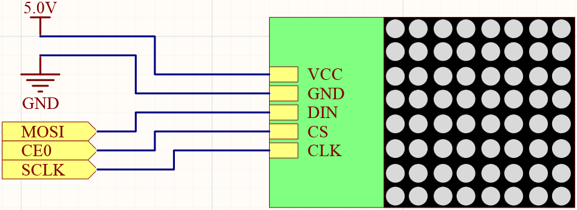

.. note::

    Hello, welcome to the SunFounder Raspberry Pi & Arduino & ESP32 Enthusiasts Community on Facebook! Dive deeper into Raspberry Pi, Arduino, and ESP32 with fellow enthusiasts.

    **Why Join?**

    - **Expert Support**: Solve post-sale issues and technical challenges with help from our community and team.
    - **Learn & Share**: Exchange tips and tutorials to enhance your skills.
    - **Exclusive Previews**: Get early access to new product announcements and sneak peeks.
    - **Special Discounts**: Enjoy exclusive discounts on our newest products.
    - **Festive Promotions and Giveaways**: Take part in giveaways and holiday promotions.

    👉 Ready to explore and create with us? Click [|link_sf_facebook|] and join today!

.. _1.1.6_py:

1.1.6 LED Dot Matrix
=====================

**Introduction**

An LED dot matrix is a grid of LEDs that can light up in various patterns to display characters, symbols, or animations. This project demonstrates how to control an LED dot matrix to display static shapes, letters, and scrolling text using Python and a Raspberry Pi.

----------------------------------------------

**What You’ll Need**

To complete this project, you will need the following components:

.. list-table::
    :widths: 30 20
    :header-rows: 1

    *   - COMPONENT
        - PURCHASE LINK

    *   - :ref:`cpn_gpio_extension_board`
        - |link_gpio_board_buy|
    *   - :ref:`cpn_breadboard`
        - |link_breadboard_buy|
    *   - :ref:`cpn_wires`
        - |link_wires_buy|
    *   - :ref:`cpn_dot_matrix`
        - |link_led_matrix_buy|

----------------------------------------------

**Circuit Diagram**

The circuit connects the LED dot matrix to the Raspberry Pi using SPI communication. The schematic below provides a clear view of the wiring.

----------------------------------------------

**Wiring Diagram**

Follow these steps to build the circuit:

1. Place the LED dot matrix on the breadboard.
2. Connect the SPI interface pins (MOSI, SCK, and CS) to the Raspberry Pi GPIO pins.
3. Ensure proper power supply connections to the matrix.

.. image:: ../img/1.1.6fritzing.png

----------------------------------------------

**Writing the Code**

The following Python code controls the LED dot matrix to display a rectangle, a letter, and scrolling text:

.. code-block:: python

   from luma.core.interface.serial import spi, noop
   from luma.core.render import canvas
   from luma.core.virtual import viewport
   from luma.led_matrix.device import max7219
   from luma.core.legacy import text
   from luma.core.legacy.font import proportional, CP437_FONT
   import time

   # Initialize SPI interface and the dot matrix device
   serial = spi(port=0, device=0, gpio=noop())
   device = max7219(serial, rotate=1)
   virtual = viewport(device, width=200, height=8)

   def displayRectangle():
       with canvas(device) as draw:
           draw.rectangle(device.bounding_box, outline="white", fill="black")

   def displayLetter():
       with canvas(device) as draw:
           text(draw, (0, 0), "A", fill="white", font=proportional(CP437_FONT))

   def scrollToDisplayText():
       with canvas(virtual) as draw:
           text(draw, (0, 0), "Hello, Nice to meet you!", fill="white", font=proportional(CP437_FONT))

       for offset in range(150):
           virtual.set_position((offset, 0))
           time.sleep(0.1)

   def main():
       while True:
           displayRectangle()
           time.sleep(2)
           displayLetter()
           time.sleep(2)
           scrollToDisplayText()

   if __name__ == '__main__':
       try:
           main()
       except KeyboardInterrupt:
           pass

This Python script is designed to control an LED matrix display using the Luma library. When executed, it performs the following tasks in a loop:

1. Displays a white rectangle outlining the entire LED matrix for 2 seconds.
2. Displays the letter "A" at the top-left corner of the matrix for 2 seconds.
3. Scrolls the text "Hello, Nice to meet you!" across the LED matrix horizontally from right to left.

The program runs indefinitely until interrupted by pressing ``Ctrl+C``.

----------------------------------------------

**Understanding the Code**

1. **Libraries and Initialization**

   The ``luma`` library is used for handling LED dot matrix displays, providing functions for rendering text and graphics.

   .. code-block:: python

       from luma.core.interface.serial import spi, noop
       from luma.led_matrix.device import max7219

   Initialize the dot matrix:

   .. code-block:: python

       serial = spi(port=0, device=0, gpio=noop())
       device = max7219(serial, rotate=1)

2. **Rectangle Display**

   The ``displayRectangle`` function uses the canvas to draw a rectangle on the dot matrix.

   .. code-block:: python

       def displayRectangle():
           with canvas(device) as draw:
               draw.rectangle(device.bounding_box, outline="white", fill="black")

3. **Letter Display**

   The ``displayLetter`` function renders a single letter ("A") on the matrix.

   .. code-block:: python

       def displayLetter():
           with canvas(device) as draw:
               text(draw, (0, 0), "A", fill="white", font=proportional(CP437_FONT))

4. **Scrolling Text**

   The ``scrollToDisplayText`` function displays scrolling text by moving the virtual viewport.

   .. code-block:: python

       def scrollToDisplayText():
           with canvas(virtual) as draw:
               text(draw, (0, 0), "Hello, Nice to meet you!", fill="white", font=proportional(CP437_FONT))

           for offset in range(150):
               virtual.set_position((offset, 0))
               time.sleep(0.1)

----------------------------------------------

**Troubleshooting**

1. **No Output on the LED Matrix**  

   - **Cause**: Incorrect SPI connection or initialization issues.  
   - **Solution**: Verify the SPI connections between the Raspberry Pi and the LED matrix. Ensure the correct ``port`` and ``device`` values are passed to the ``spi()`` function.

2. **Text or Shapes Appear Distorted**  

   - **Cause**: Incorrect rotation or device dimensions.  
   - **Solution**: Adjust the ``rotate`` parameter in the ``max7219()`` initialization to match the physical orientation of the LED matrix.

3. **scrollToDisplayText() Does Not Scroll Properly**  

   - **Cause**: Inadequate viewport width or text length mismatch.  
   - **Solution**: Ensure the ``viewport`` width (``200``) is sufficient for the scrolling text length.

4. **KeyboardInterrupt Does Not Stop the Program Gracefully**  

   - **Cause**: The ``main()`` loop lacks cleanup logic.  
   - **Solution**: Add cleanup logic to handle interruptions, such as clearing the LED matrix.

5. **ModuleNotFoundError**  

   - **Cause**: Missing Luma library or dependencies.  
   - **Solution**: Install the required libraries using ``pip install luma.led_matrix luma.core``.

6. **Slow Performance**  

   - **Cause**: High ``time.sleep()`` values or inefficient drawing logic.  
   - **Solution**: Reduce the sleep duration (e.g., from ``0.1`` to ``0.05``) for smoother scrolling.

----------------------------------------------

**Extendable Ideas**

1. **Custom Text Messages**  

   Allow the user to input custom text to scroll across the LED matrix:

   .. code-block:: python

      user_message = input("Enter your message: ")
      def scrollCustomText(message):
         with canvas(virtual) as draw:
               text(draw, (0, 0), message, fill="white", font=proportional(CP437_FONT))
         for offset in range(len(message) * 6):
               virtual.set_position((offset, 0))
               time.sleep(0.1)

2. **Multi-Line Scrolling**  

   Extend the scrolling functionality to handle multi-line messages by adjusting the viewport height and positioning text.

3. **Animations**  

   Create animations, such as bouncing text or moving patterns, using the ``canvas()`` method.

4. **Font Customization**  

   Use different fonts to vary the appearance of the displayed text. For example:
   
   .. code-block:: python

      from luma.core.legacy.font import TINY_FONT
      text(draw, (0, 0), "Custom Font!", font=proportional(TINY_FONT))

5. **Interactive LED Control**  

   Add buttons or sensors to interactively change what is displayed, such as switching between messages or patterns.

----------------------------------------------

**Conclusion**

By completing this project, you have learned how to control an LED dot matrix to display shapes, letters, and scrolling text. This knowledge can be extended to create custom animations and dynamic displays for various applications.
