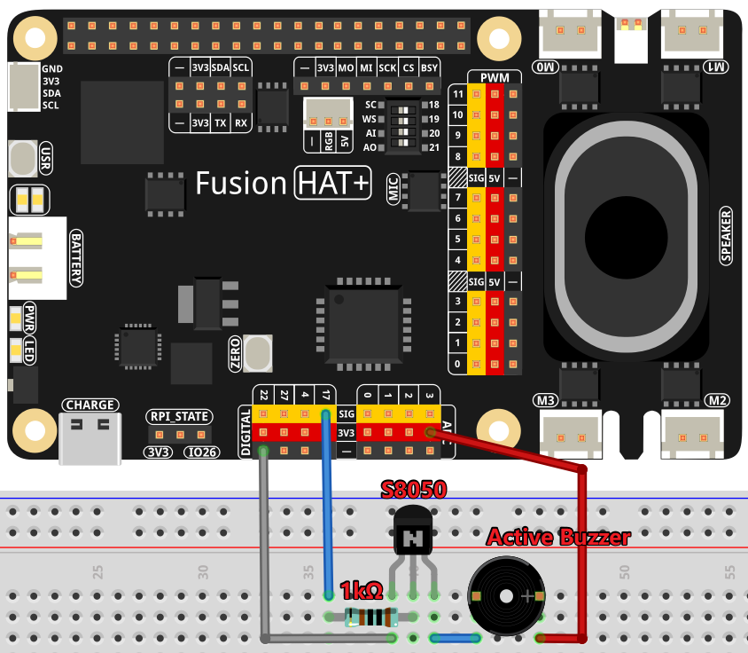

.. note::

    Hello, welcome to the SunFounder Raspberry Pi & Arduino & ESP32 Enthusiasts Community on Facebook! Dive deeper into Raspberry Pi, Arduino, and ESP32 with fellow enthusiasts.

    **Why Join?**

    - **Expert Support**: Solve post-sale issues and technical challenges with help from our community and team.
    - **Learn & Share**: Exchange tips and tutorials to enhance your skills.
    - **Exclusive Previews**: Get early access to new product announcements and sneak peeks.
    - **Special Discounts**: Enjoy exclusive discounts on our newest products.
    - **Festive Promotions and Giveaways**: Take part in giveaways and holiday promotions.

    👉 Ready to explore and create with us? Click [|link_sf_facebook|] and join today!

.. _1.2.1_py:

1.2.1 Active Buzzer
=========================================

**Introduction**

In this project, we will learn how to drive an active buzzer to produce a beeping sound using a PNP transistor. Active buzzers are simple components used in many electronic projects to produce sound signals.

----------------------------------------------

**What You’ll Need**

To complete this project, you will need the following components:

.. list-table::
    :widths: 30 20
    :header-rows: 1

    *   - COMPONENT
        - PURCHASE LINK

    *   - :ref:`cpn_wires`
        - |link_wires_buy|
    *   - :ref:`cpn_resistor`
        - |link_resistor_buy|
    *   - :ref:`cpn_buzzer`
        - \-
    *   - :ref:`cpn_transistor`
        - |link_transistor_buy|
    *   - Fusion HAT
        - 
    *   - Raspberry Pi Zero 2 W
        -

----------------------------------------------

**Circuit Diagram**

The circuit uses an active buzzer, a PNP transistor, and a 1kΩ resistor. The resistor protects the transistor by limiting the base current. When GPIO17 outputs a high level (3.3V), the transistor conducts, allowing current to flow through the buzzer, causing it to beep. When GPIO17 outputs a low level, the transistor is cut off, and the buzzer remains silent.

----------------------------------------------

**Wiring Diagram**

Follow these steps to build the circuit:

1. Place the PNP transistor, buzzer, and resistor on the breadboard.
2. Connect the base of the transistor to GPIO17 through the resistor.
3. Connect the emitter of the transistor to the power supply (+).
4. Connect the collector of the transistor to one terminal of the buzzer.
5. Connect the other terminal of the buzzer to the ground (-).

----------------------------------------------

**Writing the Code**

The following Python code drives the active buzzer to beep on and off in a loop:

.. code-block:: python

    #!/usr/bin/env python3
    from fusion_hat import Buzzer,Pin
    from time import sleep

    # Initialize a Buzzer object on GPIO pin 17
    buzzer = Buzzer(Pin(17))

    try:
        while True:
            # Turn on the buzzer
            print('Buzzer On')
            buzzer.on()
            sleep(0.1)  # Keep the buzzer on for 0.1 seconds

            # Turn off the buzzer
            print('Buzzer Off')
            buzzer.off()
            sleep(0.1)  # Keep the buzzer off for 0.1 seconds

    except KeyboardInterrupt:
        # Handle KeyboardInterrupt (Ctrl+C) for clean script termination
        pass

This Python script controls a buzzer connected to GPIO pin 17 on a Raspberry Pi. When executed:

1. The buzzer alternates between turning on and off every 0.1 seconds, producing a beeping sound.
2. The program prints "Buzzer On" and "Buzzer Off" to the console in sync with the buzzer's operation.
3. The buzzing continues indefinitely until the user interrupts the script by pressing ``Ctrl+C``.

----------------------------------------------

**Understanding the Code**

1. **Library Import**

   The ``fusion_hat`` library provides an easy-to-use interface for controlling GPIO pins, and ``time`` is used for delays.

   .. code-block:: python

      from fusion_hat import Buzzer,Pin
      from time import sleep

2. **Buzzer Initialization**

   The ``Buzzer`` object is initialized and associated with Pin 17.

   .. code-block:: python

      buzzer = Buzzer(Pin(17))

3. **Control Loop**

   The program uses an infinite loop (``while True``) to toggle the buzzer on and off every 0.1 seconds, creating a beeping sound. The ``print`` statements provide console feedback.

   .. code-block:: python

      while True:
         print('Buzzer On')
         buzzer.on()
         sleep(0.1)
         print('Buzzer Off')
         buzzer.off()
         sleep(0.1)

4. **Keyboard Interrupt Handling**

   The ``try-except`` block ensures that the program can be terminated cleanly using Ctrl+C without raising errors.

   .. code-block:: python

      except KeyboardInterrupt:
         pass

----------------------------------------------

**Troubleshooting**

1. **No Sound from the Buzzer**  

   - **Cause**: Incorrect GPIO pin connection or buzzer wiring.  
   - **Solution**: Ensure the buzzer is properly connected to GPIO pin 17 and the ground (GND). 

2. **Buzzer Always On or Off**  

   - **Cause**: Faulty buzzer or GPIO setup issue.  
   - **Solution**: Verify the buzzer's functionality by testing it with direct voltage. 

3. **Script Doesn't Respond to KeyboardInterrupt**  

   - **Cause**: The ``except`` block may not properly handle interruption.  
   - **Solution**: Ensure the ``try...except KeyboardInterrupt`` block is properly implemented, and that no other processes are blocking the main loop.

4. **Buzzing is Too Fast or Annoying**  

   - **Cause**: The ``sleep(0.1)`` interval may be too short.  
   - **Solution**: Increase the ``sleep()`` duration for longer intervals between buzzes.

----------------------------------------------

**Extendable Ideas**

1. **Custom Beep Patterns**  
   Create distinct beep patterns for different events or notifications:

   .. code-block:: python

      def beep_pattern():
         buzzer.on()
         sleep(0.3)
         buzzer.off()
         sleep(0.1)
         buzzer.on()
         sleep(0.1)
         buzzer.off()

2. **User Input for Buzzer Control**  
   Allow the user to start, stop, or change the buzzer's pattern dynamically:

   .. code-block:: python

      while True:
         command = input("Enter 'on', 'off', or 'pattern': ")
         if command == 'on':
            buzzer.on()
         elif command == 'off':
            buzzer.off()
         elif command == 'pattern':
            beep_pattern()

----------------------------------------------

**Conclusion**

This project demonstrates how to drive an active buzzer using a PNP transistor and the Raspberry Pi GPIO pins. The simplicity of the code and hardware setup makes it a great starting point for sound-based electronic projects.
