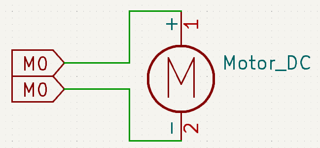
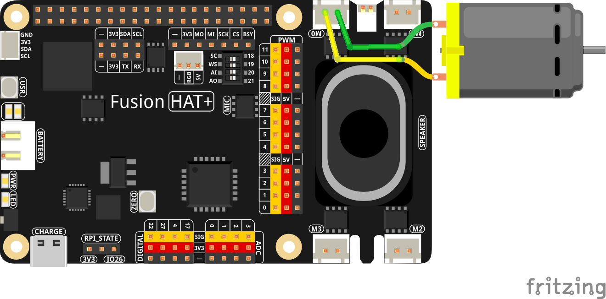

.. note::

    Hello, welcome to the SunFounder Raspberry Pi & Arduino & ESP32 Enthusiasts Community on Facebook! Dive deeper into Raspberry Pi, Arduino, and ESP32 with fellow enthusiasts.

    **Why Join?**

    - **Expert Support**: Solve post-sale issues and technical challenges with help from our community and team.
    - **Learn & Share**: Exchange tips and tutorials to enhance your skills.
    - **Exclusive Previews**: Get early access to new product announcements and sneak peeks.
    - **Special Discounts**: Enjoy exclusive discounts on our newest products.
    - **Festive Promotions and Giveaways**: Take part in giveaways and holiday promotions.

    👉 Ready to explore and create with us? Click [|link_sf_facebook|] and join today!

.. _1.3.1_py:

1.3.1 Motor
=============

**Introduction**

In this project, we will learn how to use the Fusion HAT to control a DC motor, making it rotate clockwise and counterclockwise.

----------------------------------------------

**What You’ll Need**

To complete this project, you will need the following components:

.. list-table::
   :widths: 30 20
   :header-rows: 1

   *   - COMPONENT
       - PURCHASE LINK

   *   - :ref:`cpn_motor`
       - |link_motor_buy|
   *   - Fusion HAT
       - 
   *   - Raspberry Pi Zero 2 W
       -

----------------------------------------------

**Circuit Diagram**

The circuit diagram below shows the connections required to control the motor.

----------------------------------------------

**Wiring Diagram**

----------------------------------------------

**Writing the Code**

The following Python code controls the motor’s rotation direction and timing:

.. raw:: html

   <run></run>

.. code-block:: python

   #!/usr/bin/env python3
   from time import sleep
   from fusion_hat import Motor, PWM

   """
   Initialize a motor

   motor = Motor(pwmA, pwmB, is_reversed=False)

   :param pwmA pwmB: Motor speed control pwm pin
   :type pwm: fusion_hat.pwm.PWM

   :param is_reversed: Motor direction control
   :type is_reversed: True or False
   :default: False
   """

   motor = Motor(PWM('P8'), PWM('P9'))

   try:
      while True:
         motor.speed(0)
         sleep(0.5)
         motor.speed(-50)
         sleep(1)
         motor.speed(0)
         sleep(0.5)
         motor.speed(75)
         sleep(1)
   finally:
      motor.stop()
      sleep(.1)

----------------------------------------------

**Understanding the Code**

1. **Library Import**

   The ``fusion_hat`` library simplifies GPIO interactions, while the ``time`` library provides delay functions.

   .. code-block:: python

      from time import sleep
      from fusion_hat import Motor, PWM

2. **Motor Initialization**

   The ``Motor`` object is created using M0 pins.

   .. code-block:: python

      motor = Motor(PWM('P8'), PWM('P9'))

3. **Motor Actions**

   The motor speed is set to 0, -50, and 75, respectively. The ``sleep`` function pauses the program for a specified duration.

   .. code-block:: python

      while True:
         motor.speed(0)
         sleep(0.5)
         motor.speed(-50)
         sleep(1)
         motor.speed(0)
         sleep(0.5)
         motor.speed(75)
         sleep(1)

4. **Interrupt Handling**

   The ``try-except`` block allows the program to terminate cleanly when interrupted using Ctrl+C.

   .. code-block:: python

       except KeyboardInterrupt:
           pass

----------------------------------------------

**Troubleshooting**

1. **Motor Does Not Move**  

   - **Cause**: Incorrect wiring or GPIO pin configuration.  
   - **Solution**: Ensure the motor is receiving power and the enable pin is connected properly.

2. **Only One Direction Works**

   - **Cause**: Faulty connection to the forward or backward pin.  
   - **Solution**: Ensure the pins are securely connected to the Fusion HAT.

3. **Motor Spins Continuously Without Stopping**  

   - **Cause**: The ``stop()`` function may not be executed properly.  
   - **Solution**: Confirm that the ``motor.stop()`` method is called.

----------------------------------------------

**Extendable Ideas**

1. **User-Controlled Actions**  

   Allow the user to control the motor in real-time via keyboard input:

   .. code-block:: python

      while True:
         num = int(input("The speed percentage (-100~100): "))
         if num >= -100 and num <= 100:
            motor.speed(num)
         else:
            print("Invalid action!")

3. **Timed Motor Control**  

   Add functionality to run the motor for a user-specified duration:

   .. code-block:: python

      duration = int(input("Enter duration (seconds): "))
      motor.speed(50)
      sleep(duration)
      motor.stop()

----------------------------------------------

**Conclusion**

This project demonstrates how to control a DC motor using the Fusion HAT. Understanding motor control is essential for building robotics and other motion-based electronic projects.
