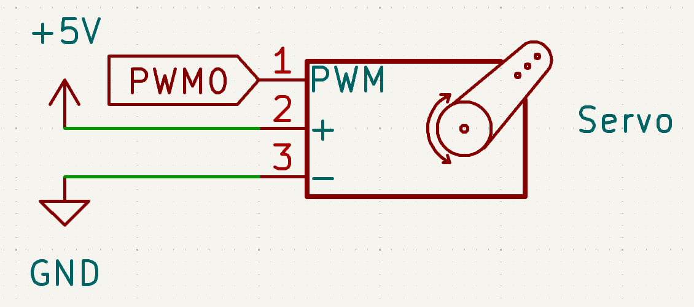
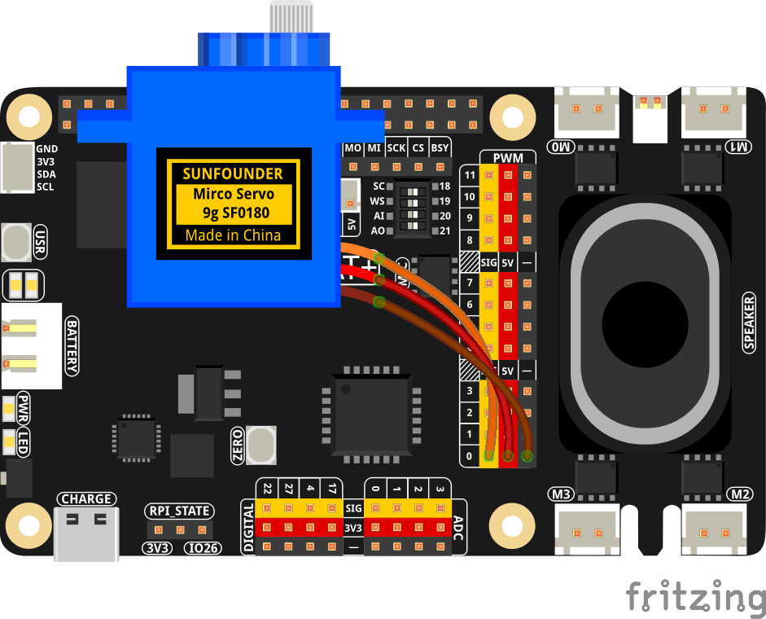

.. note::

    Hello, welcome to the SunFounder Raspberry Pi & Arduino & ESP32 Enthusiasts Community on Facebook! Dive deeper into Raspberry Pi, Arduino, and ESP32 with fellow enthusiasts.

    **Why Join?**

    - **Expert Support**: Solve post-sale issues and technical challenges with help from our community and team.
    - **Learn & Share**: Exchange tips and tutorials to enhance your skills.
    - **Exclusive Previews**: Get early access to new product announcements and sneak peeks.
    - **Special Discounts**: Enjoy exclusive discounts on our newest products.
    - **Festive Promotions and Giveaways**: Take part in giveaways and holiday promotions.

    👉 Ready to explore and create with us? Click [|link_sf_facebook|] and join today!

.. _1.3.2_py:

1.3.2 Servo
==============================

**Introduction**

In this project, we will learn how to control a servo motor using a Raspberry Pi. Servo motors are commonly used in robotics and automation for precise control of angular motion.

----------------------------------------------

**What You’ll Need**

To complete this project, you will need the following components:

.. list-table::
    :widths: 30 20
    :header-rows: 1

    *   - COMPONENT
        - PURCHASE LINK

    *   - :ref:`cpn_servo`
        - |link_servo_buy|
    *   - Fusion HAT
        - 
    *   - Raspberry Pi Zero 2 W
        -

----------------------------------------------

**Circuit Diagram**

The circuit diagram below shows the connections required for controlling the servo motor.

----------------------------------------------

**Wiring Diagram**

----------------------------------------------

**Writing the Code**

The following Python code demonstrates how to control the servo motor by moving it between various angles:

.. code-block:: python

   from fusion_hat import Servo
   from time import sleep

   servo = Servo('P0')

   while True:
      for i in range(-90, 91, 10):
         servo.angle(i)
         sleep(0.1)
      for i in range(90, -91, -10):
         servo.angle(i)
         sleep(0.1)

This Python script controls a servo motor connected to PWM 0. When executed:

1. The servo moves from -90 degrees to 90 degrees in 10-degree increments.
2. It pauses for 0.1 seconds between each movement.
3. It then reverses the direction and moves from 90 degrees to -90 degrees in 10-degree increments.
4. The process repeats indefinitely.

----------------------------------------------

**Understanding the Code**

1. **Library Import**

   The ``fusion_hat`` library simplifies GPIO interactions, while the ``time`` library provides delay functions.

   .. code-block:: python

      from fusion_hat import Servo
      from time import sleep

2. **Servo Initialization**

   The ``Servo`` object is initialized with PWM 0.

   .. code-block:: python

      servo = Servo('P0')

3. **Servo Movement**

   The servo is moved to different angles in a loop. The ``angle`` method sets the servo's position, and ``sleep`` pauses the loop for a specified duration.

   .. code-block:: python

      while True:
         for i in range(-90, 91, 10):
            servo.angle(i)
            sleep(0.1)
         for i in range(90, -91, -10):
            servo.angle(i)
            sleep(0.1)

----------------------------------------------

**Troubleshooting**

1. **Servo Does Not Move**  

   - **Cause**: Incorrect GPIO pin connection or power supply issues.  
   - **Solution**: Ensure the servo is connected to PWM 0 and verify the power supply.

2. **Servo Movement is Erratic or Unresponsive**  

   - **Cause**: Insufficient power supply to the servo.  
   - **Solution**: Use an external power source for the servo if the Fusion HAT does not provide enough power.

----------------------------------------------

**Extendable Ideas**

1. **User-Controlled Servo**  

   Allow users to control the servo position interactively through keyboard input:

   .. code-block:: python

      while True:
         position = float(input("Enter position (-90 to 90): "))
         servo.angle(position)

2. **Servo Position Tracking**  

   Record the servo position over time and plot the trajectory:

   .. code-block:: python

      positions = []
      for i in range(-90, 91, 10):
         servo.angle(i)
         sleep(0.1)
         positions.append(servo.angle())
      plt.plot(positions)
      plt.show()

----------------------------------------------

**Conclusion**

This project demonstrates how to control a servo motor. Understanding servo control opens the door to building robots, mechanical arms, and other motion-based projects.
