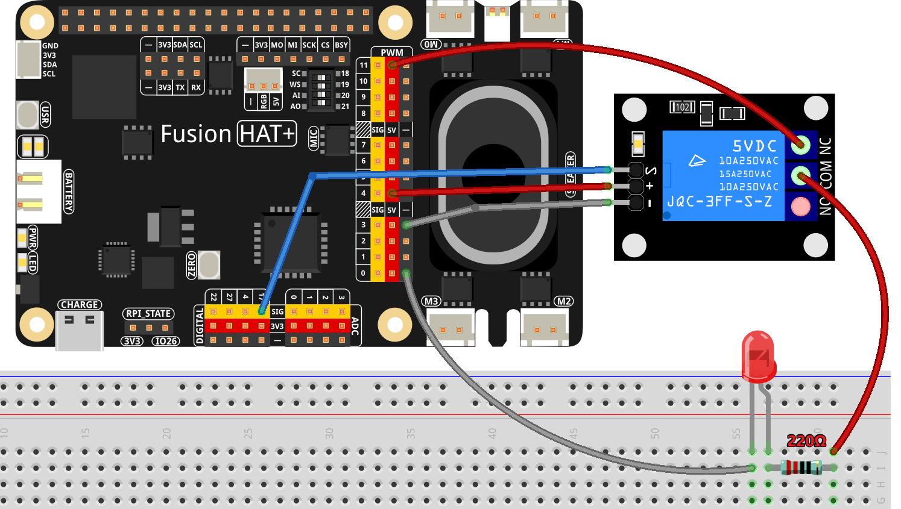

.. note::

    Hello, welcome to the SunFounder Raspberry Pi & Arduino & ESP32 Enthusiasts Community on Facebook! Dive deeper into Raspberry Pi, Arduino, and ESP32 with fellow enthusiasts.

    **Why Join?**

    - **Expert Support**: Solve post-sale issues and technical challenges with help from our community and team.
    - **Learn & Share**: Exchange tips and tutorials to enhance your skills.
    - **Exclusive Previews**: Get early access to new product announcements and sneak peeks.
    - **Special Discounts**: Enjoy exclusive discounts on our newest products.
    - **Festive Promotions and Giveaways**: Take part in giveaways and holiday promotions.

    👉 Ready to explore and create with us? Click [|link_sf_facebook|] and join today!

.. _1.3.3_py:

1.3.3 Relay
===============================================

**Introduction**

In this project, we will learn how to use a relay, one of the most common components in automatic control systems. Relays are used to connect or interrupt a circuit based on input signals such as voltage, current, or environmental conditions. They provide a reliable method to control and protect electronic equipment.

----------------------------------------------

**What You’ll Need**

To complete this project, you will need the following components:

.. list-table::
    :widths: 30 20
    :header-rows: 1

    *   - COMPONENT
        - PURCHASE LINK

    *   - :ref:`cpn_breadboard`
        - |link_breadboard_buy|
    *   - :ref:`cpn_wires`
        - |link_wires_buy|
    *   - :ref:`cpn_resistor`
        - |link_resistor_buy|
    *   - :ref:`cpn_led`
        - |link_led_buy|
    *   - :ref:`cpn_relay`
        - 
    *   - Fusion HAT
        - 
    *   - Raspberry Pi Zero 2 W
        -

----------------------------------------------

**Circuit Diagram**

The circuit diagram below shows the connections required to control the relay with a Raspberry Pi.

----------------------------------------------

**Wiring Diagram**

Follow these steps to build the circuit:

1. Connect the relay module to GPIO17 on the Fusion HAT.
2. Optionally, connect an LED in the circuit to indicate the relay's state.

----------------------------------------------

**Writing the Code**

The following Python code toggles the relay on and off with a 1-second interval:

.. code-block:: python

    #!/usr/bin/env python3
    from fusion_hat import Pin  # Import the class for controlling GPIO pins
    from time import sleep  # Import the sleep function for delay

    # Initialize the relay connected to GPIO pin 17, starting in the 'off' state
    relay = Pin(17,Pin.OUT)

    try:
        # Loop to continuously toggle the relay's state every second
        while True:
            print('Relay open...')  # Inform that the relay is being activated
            relay.high()  # Turn on the relay 
            sleep(1)   # Maintain the relay in the on state for 1 second

            print('...Relay close')  # Inform that the relay is being deactivated
            relay.low()  # Turn off the relay
            sleep(1)   # Maintain the relay in the off state for 1 second

    except KeyboardInterrupt:
        # Handle a keyboard interrupt (Ctrl+C) to exit the loop
        relay.off()  # Ensure the relay is turned off before exiting
        pass

This Python script controls a relay connected to GPIO pin 17 on the Fusion HAT. When executed:

1. The relay alternates between "open" (activated) and "close" (deactivated) states every second.

2. Messages are printed to the console to indicate the relay's current state:

   - "Relay open..." when the relay is turned on.
   - "...Relay close" when the relay is turned off.

3. The relay continues toggling its state in a loop until the user interrupts the script by pressing ``Ctrl+C``. Upon interruption, the relay is turned off to ensure a safe exit.

----------------------------------------------

**Understanding the Code**

1. **Library Import**

   The ``fusion_hat`` library is used for GPIO control, and the ``time`` module provides delay functionality.

   .. code-block:: python

        from fusion_hat import Pin  # Import the class for controlling GPIO pins
        from time import sleep  # Import the sleep function for delay

2. **Relay Initialization**

   An ``Pin`` object is created for GPIO17.

   .. code-block:: python

       relay = Pin(17,Pin.OUT)

3. **Relay Control Loop**

   A ``while True`` loop toggles the relay's state every second, with messages printed to indicate its current status.

   .. code-block:: python

       while True:
           print('Relay open...')
           relay.on()
           sleep(1)
           print('...Relay close')
           relay.off()
           sleep(1)

4. **Interrupt Handling**

   The ``try-except`` block ensures the relay is turned off cleanly when the script is interrupted (e.g., Ctrl+C).

   .. code-block:: python

       except KeyboardInterrupt:
           relay.off()
           pass

----------------------------------------------

**Troubleshooting**

1. **Relay Does Not Respond**  

   - **Cause**: Incorrect wiring or GPIO pin configuration.  
   - **Solution**: Verify the relay module’s connection to GPIO pin 17 and ensure the relay’s power and ground pins are securely connected.

2. **Relay Stays in One State**  

   - **Cause**: Incorrect relay type (active low or active high).  
   - **Solution**: Check the relay's configuration and adjust the ``relay.on()`` and ``relay.off()`` logic accordingly.

----------------------------------------------

**Extendable Ideas**

1. **Custom Toggle Timing**  

   Allow the user to set custom on/off durations for the relay:

   .. code-block:: python

      on_time = float(input("Enter ON time (seconds): "))
      off_time = float(input("Enter OFF time (seconds): "))
      while True:
         relay.on()
         sleep(on_time)
         relay.off()
         sleep(off_time)

2. **Scheduled Relay Control**  

   Use the ``datetime`` module to schedule relay activation and deactivation at specific times:

   .. code-block:: python

      import datetime
      if datetime.datetime.now().hour == 18:  # Turn on at 6 PM
         relay.on()

3. **Load Control**  

   Use the relay to control real-world appliances, such as turning on/off lights, fans, or pumps.

4. **Safety Features**  

   Add safety checks to ensure the relay does not remain activated for too long:

   .. code-block:: python

      max_on_duration = 60  # Maximum duration in seconds
      relay.on()
      sleep(max_on_duration)
      relay.off()

5. **Logging**  

   Log relay activity to a file for debugging or monitoring:

   .. code-block:: python

      with open("relay_log.txt", "a") as log:
         log.write(f"Relay toggled at {datetime.datetime.now()}\n")

----------------------------------------------

**Conclusion**

This project demonstrates how to use a relay with a Raspberry Pi to control circuits. Relays are essential components in automation and control systems, enabling the Raspberry Pi to interface with high-power devices safely.
