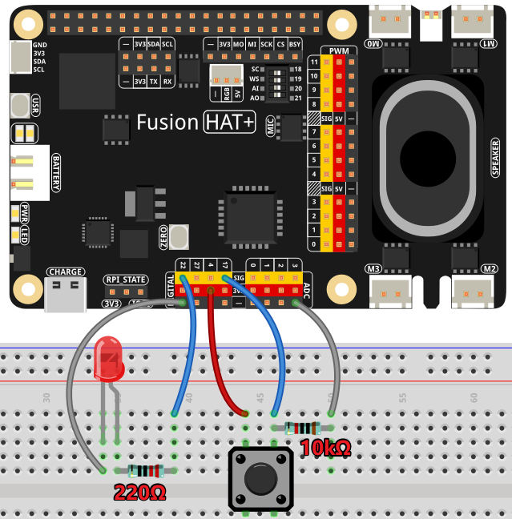

.. note::

    Hello, welcome to the SunFounder Raspberry Pi & Arduino & ESP32 Enthusiasts Community on Facebook! Dive deeper into Raspberry Pi, Arduino, and ESP32 with fellow enthusiasts.

    **Why Join?**

    - **Expert Support**: Solve post-sale issues and technical challenges with help from our community and team.
    - **Learn & Share**: Exchange tips and tutorials to enhance your skills.
    - **Exclusive Previews**: Get early access to new product announcements and sneak peeks.
    - **Special Discounts**: Enjoy exclusive discounts on our newest products.
    - **Festive Promotions and Giveaways**: Take part in giveaways and holiday promotions.

    👉 Ready to explore and create with us? Click [|link_sf_facebook|] and join today!

.. _2.1.1_py:

2.1.1 Button
===============

**Introduction**

In this project, we will learn how to use a button to control an LED. Buttons are fundamental input devices used in various electronic projects to interact with circuits and systems.

----------------------------------------------

**What You’ll Need**

To complete this project, you will need the following components:

.. list-table::
    :widths: 30 20
    :header-rows: 1

    *   - COMPONENT
        - PURCHASE LINK

    *   - :ref:`cpn_breadboard`
        - |link_breadboard_buy|
    *   - :ref:`cpn_wires`
        - |link_wires_buy|
    *   - :ref:`cpn_resistor`
        - |link_resistor_buy|
    *   - :ref:`cpn_led`
        - |link_led_buy|
    *   - :ref:`cpn_button`
        - |link_button_buy|
    *   - Fusion HAT
        - 
    *   - Raspberry Pi Zero 2 W
        -

----------------------------------------------

**Circuit Diagram**

We will use a normally open button as an input for the Raspberry Pi. When the button is pressed, GPIO17 will receive a high-level signal (3.3V). The Raspberry Pi will detect this signal and turn the LED on. The circuit connections are shown in the diagrams below:

.. image:: ../python/img/2.

----------------------------------------------

**Wiring Diagram**

Follow these steps to build the circuit:

1. Connect the anode (long pin) of the LED to a GPIO pin (GPIO22) through a current-limiting resistor.
2. Connect the cathode (short pin) of the LED to the ground (GND).
3. Connect one terminal of the button to GPIO17 and the other terminal to the ground (GND).

----------------------------------------------

**Writing the Code**

The following Python code toggles the LED based on button presses and releases:

.. code-block:: python

   #!/usr/bin/env python3
   from fusion_hat import Pin  
   from signal import pause  # Import pause function from signal module

   # Initialize an LED object on GPIO pin 22
   led = Pin(22,Pin.OUT)
   # Initialize a Button object on GPIO pin 17
   button = Pin(17, Pin.IN, pull= Pin.PULL_DOWN)

   # # Link the button's "when_activated" event to the LED's high() method
   button.when_activated = led.high

   # # Link the button's "when_deactivated" event to the LED's low() method
   button.when_deactivated = led.low

   # Run an event loop that waits for button events and keeps the script running
   print("CTRL + C to exit")
   pause()

This Python script demonstrates an interactive setup where a button controls an LED. When executed:

1. Pressing the button (connected to GPIO pin 17) turns the LED (connected to GPIO pin 22) on.
2. Releasing the button turns the LED off.
3. The program runs indefinitely, listening for button press and release events to control the LED.

----------------------------------------------

**Understanding the Code**

1. **Library Import**

   The ``fusion_hat`` library provides a simple interface for GPIO control, and the ``signal`` module is used to keep the program running.

   .. code-block:: python

      from fusion_hat import Pin  
      from signal import pause 

2. **Component Initialization**

   The LED is connected to GPIO pin 22, and the Button is connected to GPIO pin 17.

   .. code-block:: python

      # Initialize an LED object on GPIO pin 22
      led = Pin(22,Pin.OUT)
      # Initialize a Button object on GPIO pin 17
      button = Pin(17, Pin.IN, pull= Pin.PULL_DOWN)

3. **Event Handling**

   The ``when_activated`` and ``when_deactivated`` events are linked to the LED's ``high()`` and ``low()`` methods, respectively. This ensures that the LED turns on when the button is pressed and off when the button is released.

   .. code-block:: python

       button.when_activated = led.high
       button.when_deactivated = led.low

4. **Event Loop**

   The ``pause()`` function keeps the program running and listens for button press and release events.

   .. code-block:: python

       pause()

----------------------------------------------

**Troubleshooting**

1. **LED Does Not Light Up**  

   - **Cause**: Incorrect GPIO pin connection or LED wiring.  
   - **Solution**: Verify that the LED's positive leg is connected to GPIO pin 22 and its negative leg to a resistor leading to ground.

2. **Button Press Has No Effect**  

   - **Cause**: Incorrect button wiring or GPIO pin configuration.  
   - **Solution**: Ensure the button is connected correctly to GPIO pin 17 and ground. .

3. **LED Stays On or Off Regardless of Button State**  

   - **Cause**: The button may not trigger events correctly.  
   - **Solution**: Check the button’s functionality by directly testing its connectivity with a multimeter or simple circuit.

----------------------------------------------

**Extendable Ideas**

1. **Toggle LED State**  

   Modify the script to toggle the LED's state with each button press instead of turning it on/off directly:

   .. code-block:: python
    
      def toggle():
         if led.value() == 1:
            led.off()
         else:
            led.on()

      button.when_activated = toggle

2. **Multiple LEDs**  

   Control multiple LEDs with a single button, cycling through different patterns:

   .. code-block:: python

      leds = [LED(17), LED(27), LED(22)]
      current_led = 0

      def cycle_leds():
         global current_led
         leds[current_led].off()
         current_led = (current_led + 1) % len(leds)
         leds[current_led].on()

      button.when_activated = cycle_leds

3. **Button Press Duration**  

   Add functionality to perform different actions based on how long the button is held:

   .. code-block:: python

      from time import time

      press_time = None

      def start_timer():
         global press_time
         press_time = time()

      def check_duration():
         global press_time
         duration = time() - press_time
         if duration < 2:
            led.on()
         else:
            led.off()

      button.when_activated = start_timer
      button.when_deactivated = check_duration

4. **Debouncing**  

   Implement software debouncing for more accurate button press detection:

   .. code-block:: python

      from time import time

      press_time = None
      debounce_time = 0.2

      def press():
         global press_time
         press_time = time()

      def debounce():
         global press_time
         current_time = time()
         duration = current_time - press_time
         if duration < debounce_time:
            return
         else:
            led.on()

      button.when_activated = press
      button.when_deactivated = debounce

----------------------------------------------

**Conclusion**

This project demonstrates how to use a button to control an LED with a Fusion HAT. Buttons are versatile components and can be integrated into various applications, from basic circuits to complex interactive systems.
