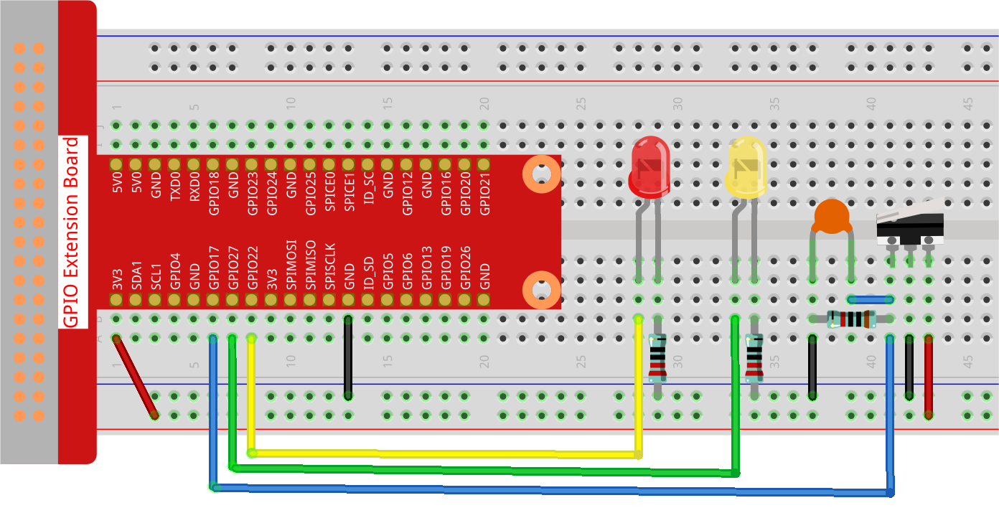

.. note::

    Hello, welcome to the SunFounder Raspberry Pi & Arduino & ESP32 Enthusiasts Community on Facebook! Dive deeper into Raspberry Pi, Arduino, and ESP32 with fellow enthusiasts.

    **Why Join?**

    - **Expert Support**: Solve post-sale issues and technical challenges with help from our community and team.
    - **Learn & Share**: Exchange tips and tutorials to enhance your skills.
    - **Exclusive Previews**: Get early access to new product announcements and sneak peeks.
    - **Special Discounts**: Enjoy exclusive discounts on our newest products.
    - **Festive Promotions and Giveaways**: Take part in giveaways and holiday promotions.

    👉 Ready to explore and create with us? Click [|link_sf_facebook|] and join today!

.. _2.1.2_py:

2.1.2 Micro Switch
=====================

**Introduction**

In this project, we will explore how to use a Micro Switch to control two LEDs. A Micro Switch is a highly sensitive component that requires minimal compression to activate. It is often used in safety systems to prevent machinery or doors from operating under unsafe conditions.

----------------------------------------------

**What You’ll Need**

To complete this project, you will need the following components:

.. list-table::
    :widths: 30 20
    :header-rows: 1

    *   - COMPONENT
        - PURCHASE LINK

    *   - :ref:`cpn_gpio_extension_board`
        - |link_gpio_board_buy|
    *   - :ref:`cpn_breadboard`
        - |link_breadboard_buy|
    *   - :ref:`cpn_wires`
        - |link_wires_buy|
    *   - :ref:`cpn_resistor`
        - |link_resistor_buy|
    *   - :ref:`cpn_led`
        - |link_led_buy|
    *   - :ref:`cpn_micro_switch`
        - \-
    *   - :ref:`cpn_capacitor`
        - |link_capacitor_buy|

----------------------------------------------

**Circuit Diagram**

The Micro Switch is connected to GPIO17, and two LEDs are connected to GPIO22 and GPIO27. When the Micro Switch is pressed, the yellow LED lights up; when released, the red LED turns on.

.. image:: ../python/img/2.1.2_micro_switch_schematic_1.png

.. image:: ../python/img/2.1.2_micro_switch_schematic_2.png

----------------------------------------------

**Wiring Diagram**

Follow these steps to build the circuit:

1. Connect one terminal of the Micro Switch to GPIO17 and the other to the ground (GND).
2. Connect the anodes of the two LEDs to GPIO22 (yellow) and GPIO27 (red) through current-limiting resistors.
3. Connect the cathodes of both LEDs to GND.

----------------------------------------------

**Writing the Code**

The following Python code toggles between two LEDs based on the state of the Micro Switch:

.. code-block:: python

   #!/usr/bin/env python3
   from gpiozero import LED, Button  # Import LED and Button classes from gpiozero
   from time import sleep  # Import sleep function for delays

   # Initialize micro switch on GPIO pin 17 with the pull-up resistor disabled
   micro_switch = Button(17, pull_up=False)
   # Initialize LED1 connected to GPIO pin 22
   led1 = LED(22)
   # Initialize LED2 connected to GPIO pin 27
   led2 = LED(27)

   try:
       # Continuously check the state of the micro switch and control LEDs accordingly
       while True:
           if micro_switch.is_pressed:  # If the micro switch is pressed
               print('LED1 ON')  # Print a message to the console
               led1.on()       # Turn on LED1
               led2.off()      # Turn off LED2
           else:  # If the micro switch is not pressed
               print('    LED2 ON')  # Print a message to the console
               led1.off()      # Turn off LED1
               led2.on()       # Turn on LED2

           sleep(0.5)  # Pause for 0.5 seconds before checking the switch again

   except KeyboardInterrupt:
       # Handle KeyboardInterrupt (Ctrl+C) to exit the loop gracefully
       pass

This Python script controls two LEDs based on the state of a micro switch connected to a Raspberry Pi. When executed:

1. **Micro Switch Pressed**:

   - LED1 (connected to GPIO pin 22) turns on.
   - LED2 (connected to GPIO pin 27) turns off.
   - The console displays the message: ``LED1 ON``.

2. **Micro Switch Released**:

   - LED1 turns off.
   - LED2 turns on.
   - The console displays the message: ``LED2 ON``.

3. The program continuously checks the micro switch's state every 0.5 seconds and adjusts the LEDs accordingly.

4. The script runs indefinitely until interrupted by pressing ``Ctrl+C``.

----------------------------------------------

**Understanding the Code**

1. **Library Import**

   The ``gpiozero`` library provides simple GPIO control, and the ``time`` library enables delays.

   .. code-block:: python

       from gpiozero import LED, Button
       from time import sleep

2. **Component Initialization**

   The Micro Switch is connected to GPIO17 with pull-up disabled, while the LEDs are connected to GPIO22 and GPIO27.

   .. code-block:: python

       micro_switch = Button(17, pull_up=False)
       led1 = LED(22)
       led2 = LED(27)

3. **Switch State Handling**

   The program checks the state of the Micro Switch in a loop. When pressed, LED1 turns on and LED2 off. When released, LED1 turns off and LED2 on.

   .. code-block:: python

       while True:
           if micro_switch.is_pressed:
               led1.on()
               led2.off()
           else:
               led1.off()
               led2.on()
           sleep(0.5)

4. **Interrupt Handling**

   The ``try-except`` block ensures the script exits cleanly when interrupted using Ctrl+C.

   .. code-block:: python

       except KeyboardInterrupt:
           pass

----------------------------------------------

**Troubleshooting**

1. **LEDs Do Not Respond**  

   - **Cause**: Incorrect GPIO wiring or pin configuration.  
   - **Solution**: Ensure LED1 is connected to GPIO pin 22, LED2 to GPIO pin 27, and both LEDs have appropriate resistors. Verify the micro switch connection to GPIO pin 17.

2. **Micro Switch Not Detected**  

   - **Cause**: The micro switch might not be configured properly or needs a pull-up/pull-down resistor.  
   - **Solution**: Confirm that ``pull_up=False`` matches your switch configuration. If the switch requires a pull-up, enable it in the ``Button`` initialization.

3. **LEDs Flicker or Behave Erratically**  

   - **Cause**: Button debounce issues.  
   - **Solution**: Add software debounce by introducing a short delay after detecting a press:

   .. code-block:: python

      if micro_switch.is_pressed:
         sleep(0.05)  # Debounce delay

----------------------------------------------

**Extendable Ideas**

1. **Button Hold Detection**  

   Detect whether the micro switch is held down and trigger specific actions:

   .. code-block:: python

      if micro_switch.is_held:
         print("Button Held!")
         led1.blink()

2. **Adjustable Delay**  

   Allow the user to change the delay dynamically to fine-tune LED responsiveness:

   .. code-block:: python

      delay = float(input("Enter delay in seconds: "))
      while True:
         sleep(delay)

3. **Audio Feedback**  

   Add a buzzer to provide an audible signal when the switch is pressed or released:

   .. code-block:: python

      from gpiozero import Buzzer
      buzzer = Buzzer(18)
      if micro_switch.is_pressed:
         buzzer.on()
      else:
         buzzer.off()

----------------------------------------------

**Conclusion**

This project demonstrates how to use a Micro Switch to control LEDs with a Raspberry Pi. Micro Switches are versatile components widely used in safety systems, user interfaces, and industrial controls. Experimenting with them can open up opportunities for creating more advanced projects.
