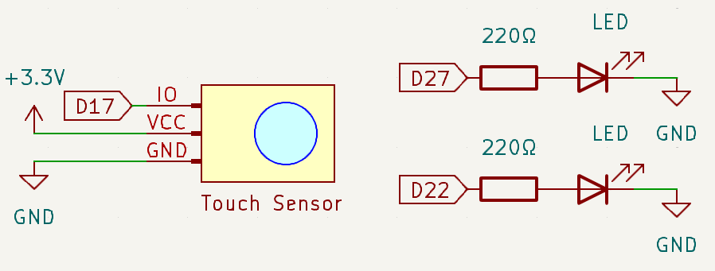
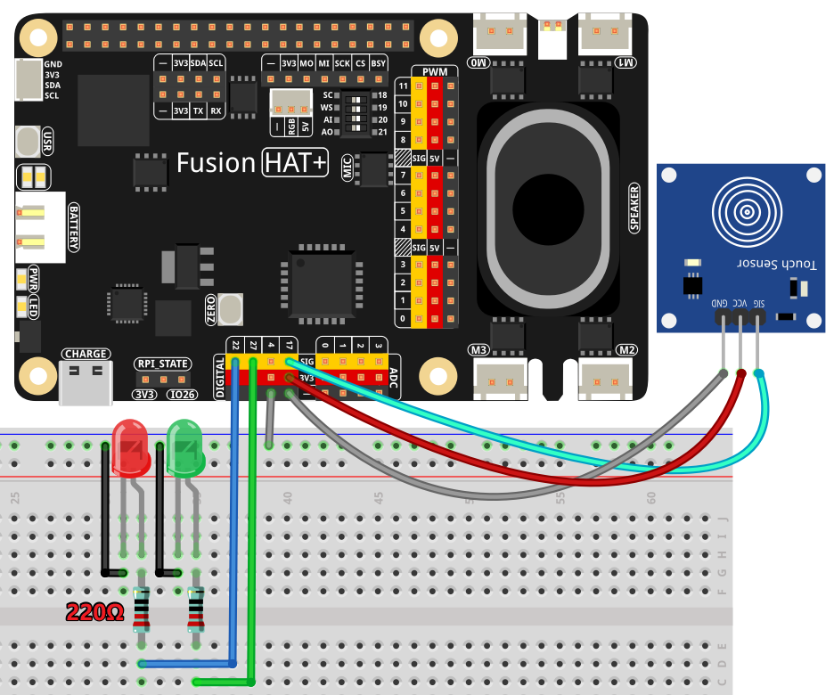

.. note::

    Hello, welcome to the SunFounder Raspberry Pi & Arduino & ESP32 Enthusiasts Community on Facebook! Dive deeper into Raspberry Pi, Arduino, and ESP32 with fellow enthusiasts.

    **Why Join?**

    - **Expert Support**: Solve post-sale issues and technical challenges with help from our community and team.
    - **Learn & Share**: Exchange tips and tutorials to enhance your skills.
    - **Exclusive Previews**: Get early access to new product announcements and sneak peeks.
    - **Special Discounts**: Enjoy exclusive discounts on our newest products.
    - **Festive Promotions and Giveaways**: Take part in giveaways and holiday promotions.

    👉 Ready to explore and create with us? Click [|link_sf_facebook|] and join today!

.. _2.1.3_py:

2.1.3 Touch Switch Module
================================

**Introduction**

In this project, we explore the use of a Touch Switch Module. This component replaces traditional mechanical switches and offers benefits such as precise control, fine touch sensitivity, and minimal mechanical wear. Touch switches are commonly used in modern appliances and devices where reliability and ease of operation are essential.

----------------------------------------------

**What You’ll Need**

To complete this project, you will need the following components:

.. list-table::
    :widths: 30 20
    :header-rows: 1

    *   - COMPONENT
        - PURCHASE LINK

    *   - :ref:`cpn_breadboard`
        - |link_breadboard_buy|
    *   - :ref:`cpn_wires`
        - |link_wires_buy|
    *   - :ref:`cpn_resistor`
        - |link_resistor_buy|
    *   - :ref:`cpn_led`
        - |link_led_buy|
    *   - :ref:`cpn_touch_switch`
        - |link_touch_buy|
    *   - Fusion HAT
        - 
    *   - Raspberry Pi Zero 2 W
        -

----------------------------------------------

**Circuit Diagram**

Below is the schematic diagram showing how to connect the Touch Switch Module to the Raspberry Pi and LEDs:

----------------------------------------------

**Wiring Diagram**

Follow these steps to build the circuit:

1. Connect the Touch Switch Module output pin to GPIO17.
2. Connect LED1 anode to GPIO22 and LED2 anode to GPIO27 via appropriate resistors.
3. Connect the cathodes of both LEDs and the Touch Switch ground pin to GND.

----------------------------------------------

**Writing the Code**

The following Python code controls two LEDs based on the state of the Touch Switch Module:

.. raw:: html

   <run></run>

.. code-block:: python

   #!/usr/bin/env python3
   from fusion_hat import Pin  
   from time import sleep  # Import sleep for delay

   # Initialize touch sensor (Button) on GPIO pin 17
   touch_sensor = Pin(17, Pin.IN, pull = Pin.PULL_DOWN) 

   # Initialize LED1 connected to GPIO pin 22
   led1 = Pin(22,Pin.OUT)
   # Initialize LED2 connected to GPIO pin 27
   led2 = Pin(27,Pin.OUT)

   try:
      # Continuously monitor the state of the touch sensor and control LEDs accordingly
      while True:
         if touch_sensor.value() == 1:  # Check if the touch sensor is pressed
            print('You touch it!')  # Output message indicating sensor activation
            led1.off()  # Turn off LED1
            led2.on()   # Turn on LED2
         else:  # If the sensor is not pressed
            led1.on()   # Turn on LED1
            led2.off()  # Turn off LED2
         sleep(0.5)  # Pause for 0.5 seconds before rechecking the sensor state

   except KeyboardInterrupt:
      # Handle a keyboard interrupt (Ctrl+C) for a clean exit from the loop
      pass

This Python script uses a touch sensor to control two LEDs connected to a Raspberry Pi. When executed:

1. **Touch Sensor Pressed**:

   - Prints "You touch it!" to the console.
   - Turns off LED1 (connected to GPIO pin 22).
   - Turns on LED2 (connected to GPIO pin 27).

2. **Touch Sensor Not Pressed**:

   - LED1 turns on.
   - LED2 turns off.

3. The program continuously monitors the touch sensor's state every 0.5 seconds and adjusts the LEDs accordingly.

4. The script runs indefinitely until interrupted by pressing ``Ctrl+C``.

----------------------------------------------

**Understanding the Code**

1. **Library Import**

   The ``fusion_hat`` library is used to simplify GPIO control, and the ``sleep`` function provides delay functionality.

   .. code-block:: python

      from fusion_hat import Pin  
      from time import sleep 

2. **Component Initialization**

   The touch sensor is configured as a button on GPIO17, and two LEDs are initialized on GPIO22 and GPIO27.

   .. code-block:: python

      # Initialize touch sensor (Button) on GPIO pin 17
      touch_sensor = Pin(17, Pin.IN, pull = Pin.PULL_DOWN) 

      # Initialize LED1 connected to GPIO pin 22
      led1 = Pin(22,Pin.OUT)
      # Initialize LED2 connected to GPIO pin 27
      led2 = Pin(27,Pin.OUT)

3. **Main Loop**

   The program continuously checks the state of the Touch Switch Module. When touched, LED2 turns on and LED1 off; otherwise, LED1 is on, and LED2 is off.

   .. code-block:: python

       while True:
           if touch_sensor.value() == 1:
               led1.off()
               led2.on()
           else:
               led1.on()
               led2.off()
           sleep(0.5)

4. **Interrupt Handling**

   A ``try-except`` block ensures that the program exits cleanly upon receiving a keyboard interrupt (Ctrl+C).

   .. code-block:: python

       except KeyboardInterrupt:
           pass

----------------------------------------------

**Troubleshooting**

1. **No Response from Touch Sensor**  

   - **Cause**: Incorrect wiring or GPIO pin configuration.  
   - **Solution**: Ensure the touch sensor is connected to GPIO pin 17 and ground, and verify that ``PULL_DOWN`` matches the sensor's active-low configuration.

2. **Sensor Always Reads Pressed or Not Pressed**  

   - **Cause**: Faulty sensor or wiring.  
   - **Solution**: Test the sensor with a multimeter or replace it. Check for loose or incorrect connections.

3. **LEDs Flicker or Behave Erratically**  

   - **Cause**: Button debounce issues.  
   - **Solution**: Add software debounce to stabilize the input signal:

   .. code-block:: python

      if touch_sensor.value() == 1:
         sleep(0.05)  # Debounce delay

----------------------------------------------

**Extendable Ideas**

1. **Touch Duration Detection**  

   Add functionality to detect how long the touch sensor is pressed and adjust LED behavior:

   .. code-block:: python

      from time import time
      start_time = None

      def handle_touch():
         global start_time
         if touch_sensor.value() == 1:
            start_time = time()
         else:
            duration = time() - start_time
            print(f"Sensor was touched for {duration:.2f} seconds")

2. **Adjustable Delay**  

   Allow the user to modify the delay dynamically to fine-tune responsiveness:

   .. code-block:: python

      delay = float(input("Enter delay in seconds: "))
      sleep(delay)

----------------------------------------------

**Conclusion**

This project demonstrates how to use a Touch Switch Module with the Fusion HAT to control LEDs. Touch switches are versatile and reliable components, often used in modern devices for seamless and intuitive interaction.
