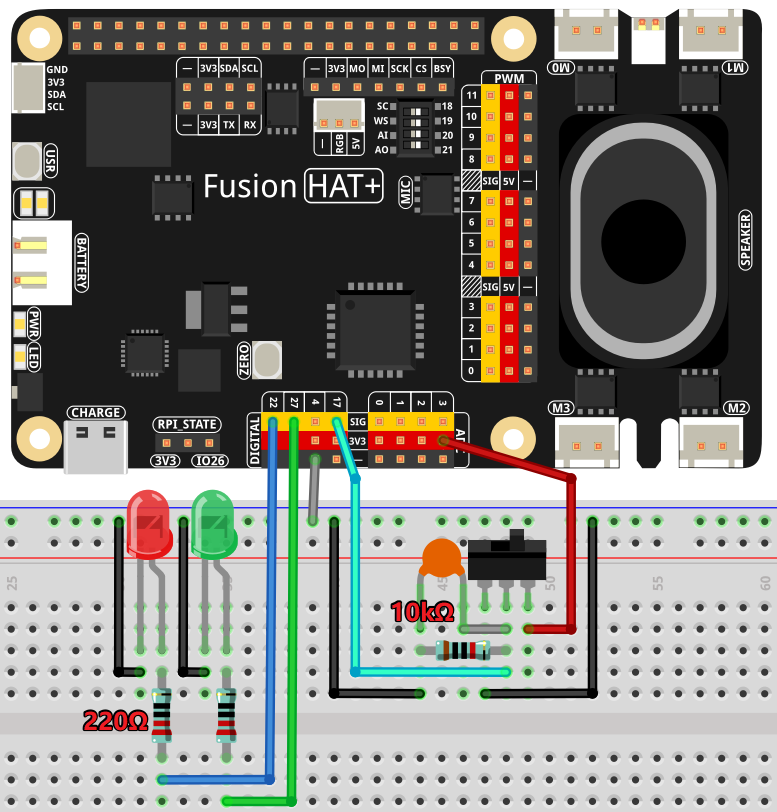

.. note::

    Hello, welcome to the SunFounder Raspberry Pi & Arduino & ESP32 Enthusiasts Community on Facebook! Dive deeper into Raspberry Pi, Arduino, and ESP32 with fellow enthusiasts.

    **Why Join?**

    - **Expert Support**: Solve post-sale issues and technical challenges with help from our community and team.
    - **Learn & Share**: Exchange tips and tutorials to enhance your skills.
    - **Exclusive Previews**: Get early access to new product announcements and sneak peeks.
    - **Special Discounts**: Enjoy exclusive discounts on our newest products.
    - **Festive Promotions and Giveaways**: Take part in giveaways and holiday promotions.

    👉 Ready to explore and create with us? Click [|link_sf_facebook|] and join today!

.. _2.1.4_py:

2.1.4 Slide Switch
==============================================

**Introduction**

In this project, we will learn how to use a slide switch to control two LEDs. Slide switches are commonly used as power switches in electronic circuits. Here, we demonstrate its functionality using a breadboard setup. While slide switches are often soldered onto PCBs for stability, we will use it in a flexible breadboard configuration to better understand its operation.

----------------------------------------------

**What You’ll Need**

To complete this project, gather the following components:

.. list-table::
    :widths: 30 20
    :header-rows: 1

    *   - COMPONENT
        - PURCHASE LINK

    *   - :ref:`cpn_breadboard`
        - |link_breadboard_buy|
    *   - :ref:`cpn_wires`
        - |link_wires_buy|
    *   - :ref:`cpn_resistor`
        - |link_resistor_buy|
    *   - :ref:`cpn_led`
        - |link_led_buy|
    *   - :ref:`cpn_slide_switch`
        - |link_slide_switch_buy|
    *   - :ref:`cpn_capacitor`
        - |link_capacitor_buy|
    *   - Fusion HAT
        - 
    *   - Raspberry Pi Zero 2 W
        -

----------------------------------------------

**Circuit Diagram**

The Slide Switch middle pin is connected to GPIO17, while two LEDs are connected to GPIO22 and GPIO27. The switch toggles between the two LEDs, alternately lighting them up.

----------------------------------------------

**Wiring Diagram**

Follow these steps to build the circuit:

1. Connect the middle pin of the Slide Switch to GPIO17.
2. Connect one side pin of the Slide Switch to GND and the other to VCC.
3. Connect LED1’s anode to GPIO22 via a current-limiting resistor.
4. Connect LED2’s anode to GPIO27 via a current-limiting resistor.
5. Connect the cathodes of both LEDs to GND.

----------------------------------------------

**Writing the Code**

Here’s the Python code to control the LEDs based on the state of the Slide Switch:

.. code-block:: python

   #!/usr/bin/env python3
   from fusion_hat import Pin 
   from time import sleep  # Import sleep for delay

   # Initialize slider (Button) on GPIO pin 17
   slider = Pin(17, Pin.IN, pull = Pin.PULL_DOWN) 

   # Initialize LED1 connected to GPIO pin 22
   led1 = Pin(22,Pin.OUT)
   # Initialize LED2 connected to GPIO pin 27
   led2 = Pin(27,Pin.OUT)

   try:
      # Continuously monitor the state of the slider and control LEDs accordingly
      while True:
         if slider.value() == 1:  # Check if the slider is pressed
               led1.off()  # Turn off LED1
               led2.on()   # Turn on LED2
         else:  # If the sensor is not pressed
               led1.on()   # Turn on LED1
               led2.off()  # Turn off LED2

         sleep(0.5)  # Pause for 0.5 seconds before rechecking the sensor state

   except KeyboardInterrupt:
      # Handle a keyboard interrupt (Ctrl+C) for a clean exit from the loop
      pass

This Python script demonstrates the use of a slide switch to control two LEDs on the Fusion HAT. When executed:

1. **Slide Switch Activated**:

   - Turns off LED1 (connected to GPIO pin 22).
   - Turns on LED2 (connected to GPIO pin 27).

2. **Slide Switch Not Activated**:

   - Turns on LED1.
   - Turns off LED2.

3. The program continuously checks the state of the slide switch every 0.5 seconds and adjusts the LEDs accordingly.

4. The script runs indefinitely until interrupted by pressing ``Ctrl+C``.

----------------------------------------------

**Understanding the Code**

1. **Library Imports**

   Import necessary libraries for GPIO control and adding delays.

   .. code-block:: python

      from fusion_hat import Pin 
      from time import sleep  # Import sleep for delay

2. **Component Initialization**

   Configure the Slide Switch as a Button and initialize two LEDs connected to GPIO pins 22 and 27.

   .. code-block:: python

      # Initialize slider (Button) on GPIO pin 17
      slider = Pin(17, Pin.IN, pull = Pin.PULL_DOWN) 

      # Initialize LED1 connected to GPIO pin 22
      led1 = Pin(22,Pin.OUT)
      # Initialize LED2 connected to GPIO pin 27
      led2 = Pin(27,Pin.OUT)

3. **State Monitoring and LED Control**

   In the main loop, the program monitors the state of the Slide Switch. When the switch is toggled, it alternates between turning on LED1 and LED2.

   .. code-block:: python

      # Continuously monitor the state of the slider and control LEDs accordingly
      while True:
         if slider.value() == 1:  # Check if the slider is pressed
               led1.off()  # Turn off LED1
               led2.on()   # Turn on LED2
         else:  # If the sensor is not pressed
               led1.on()   # Turn on LED1
               led2.off()  # Turn off LED2

         sleep(0.5)  # Pause for 0.5 seconds before rechecking the sensor state

4. **Graceful Exit**

   The script terminates gracefully when interrupted using Ctrl+C.

   .. code-block:: python

       except KeyboardInterrupt:
           pass

----------------------------------------------

**Troubleshooting**

1. **Slide Switch Does Not Respond**  

   - **Cause**: The slide switch is not connected properly, or the pull-up resistor configuration is incorrect.  
   - **Solution**: Confirm that the slide switch is connected to GPIO pin 17 and ground. Ensure ``PULL_DOWN`` matches the switch configuration.

2. **LEDs Flicker or Behave Erratically**  

   - **Cause**: Debounce issues with the slide switch.  
   - **Solution**: Add software debounce to stabilize the input signal:

   .. code-block:: python

      if slider.value() == 1:
         sleep(0.05)  # Debounce delay

----------------------------------------------

**Extendable Ideas**

1. **Two-Way Switch Control**  

   Combine two slide switches to control LEDs in a more complex setup, such as a simple light control panel.

2. **Audio Feedback**  

   Add a buzzer that sounds when the slide switch is activated:

   .. code-block:: python

      from fusion_hat import Buzzer
      buzzer = Buzzer(Pin(22))
      if slider.value() == 1:
         buzzer.on()
      else:
         buzzer.off()

----------------------------------------------

**Conclusion**

This project demonstrates how to use a Slide Switch with the Fusion HAT to control LEDs. Slide Switches are versatile and durable components, often employed in user interfaces and control systems. Experimenting with them opens up possibilities for creating advanced and interactive projects.
