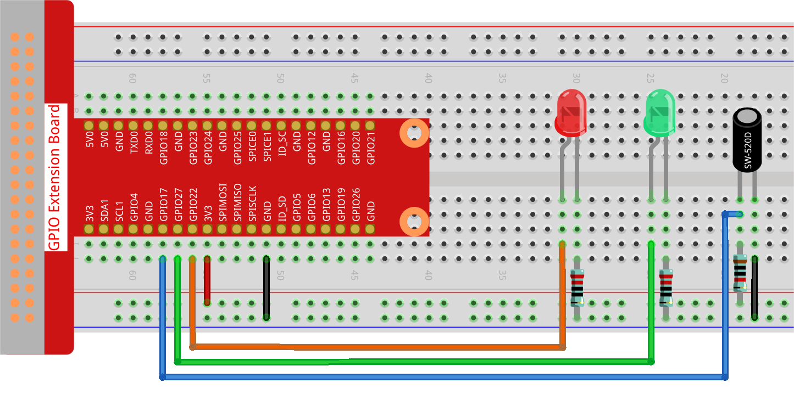

.. note::

    Hello, welcome to the SunFounder Raspberry Pi & Arduino & ESP32 Enthusiasts Community on Facebook! Dive deeper into Raspberry Pi, Arduino, and ESP32 with fellow enthusiasts.

    **Why Join?**

    - **Expert Support**: Solve post-sale issues and technical challenges with help from our community and team.
    - **Learn & Share**: Exchange tips and tutorials to enhance your skills.
    - **Exclusive Previews**: Get early access to new product announcements and sneak peeks.
    - **Special Discounts**: Enjoy exclusive discounts on our newest products.
    - **Festive Promotions and Giveaways**: Take part in giveaways and holiday promotions.

    👉 Ready to explore and create with us? Click [|link_sf_facebook|] and join today!

.. _2.1.5_py:

2.1.5 Tilt Switch
=================

**Introduction**

In this project, we will explore the tilt switch module, a ball tilt-switch containing a small metal ball inside. This switch is designed to detect slight inclinations and can be utilized in various applications like motion detection, angle measurement, and balance monitoring.

----------------------------------------------

**What You’ll Need**

To complete this project, gather the following components:

.. list-table::
    :widths: 30 20
    :header-rows: 1

    *   - COMPONENT INTRODUCTION
        - PURCHASE LINK

    *   - :ref:`cpn_gpio_extension_board`
        - |link_gpio_board_buy|
    *   - :ref:`cpn_breadboard`
        - |link_breadboard_buy|
    *   - :ref:`cpn_wires`
        - |link_wires_buy|
    *   - :ref:`cpn_resistor`
        - |link_resistor_buy|
    *   - :ref:`cpn_led`
        - |link_led_buy|
    *   - :ref:`cpn_tilt_switch`
        - \-

----------------------------------------------

**Circuit Diagram**

Refer to the following diagrams for connecting the tilt switch:

.. image:: ../python/img/2.1.5_tilt_switch_schematic_1.png

.. image:: ../python/img/2.1.5_tilt_switch_schematic_2.png

----------------------------------------------

**Wiring Diagram**

Follow these steps to set up the circuit:

1. Connect the tilt switch to GPIO pin 17 on the Raspberry Pi.
2. Connect the green LED to GPIO pin 27 with a resistor.
3. Connect the red LED to GPIO pin 22 with a resistor.
4. Complete the connections by wiring the cathodes of both LEDs to GND.

----------------------------------------------

**Writing the Code**

Below is the Python script to control the tilt switch and LEDs:

.. code-block:: python

   #!/usr/bin/env python3
   from gpiozero import LED, Button

   # Initialize the Button for the tilt sensor and LEDs using GPIO Zero
   TiltPin = Button(17, pull_up=False)  # Tilt sensor connected to GPIO pin 17, pull-up resistor disabled
   green_led = LED(27)  # Green LED connected to GPIO pin 27
   red_led = LED(22)   # Red LED connected to GPIO pin 22

   def detect():
       """
       Detect the tilt sensor state and control the LEDs.
       Turns on the red LED and turns off the green LED when tilted.
       Turns off the red LED and turns on the green LED when not tilted.
       """
       if TiltPin.is_pressed:  # Check if the sensor is tilted
           print('    *************')
           print('    *   Tilt!   *')
           print('    *************')
           red_led.on()   # Turn on red LED
           green_led.off()  # Turn off green LED
       else:  # If the sensor is not tilted
           red_led.off()  # Turn off red LED
           green_led.on()  # Turn on green LED

   try:
       while True:
           # Continuously check the tilt sensor state and update LEDs
           TiltPin.when_pressed = detect
           TiltPin.when_released = detect

   except KeyboardInterrupt:
       # Handle KeyboardInterrupt (Ctrl+C) to exit the loop gracefully
       pass

This Python script uses a tilt sensor to control two LEDs and display status messages on the console. When executed:

1. If the tilt sensor (connected to GPIO pin 17) detects a tilt:

   - Prints a message to the console.
   - Turns on the red LED (connected to GPIO pin 22).
   - Turns off the green LED (connected to GPIO pin 27).

2. If the tilt sensor is not tilted:

   - Turns off the red LED.
   - Turns on the green LED.

3. The program continuously monitors the tilt sensor's state and adjusts the LEDs accordingly.

4. The script runs indefinitely until interrupted by pressing ``Ctrl+C``.

----------------------------------------------

**Understanding the Code**

1. **Imports**

   The script imports necessary classes for LED and Button control and initializes them with appropriate GPIO pins.

   .. code-block:: python

       from gpiozero import LED, Button

2. **Initialization**

   Configure the tilt switch and LEDs connected to GPIO pins 17, 27, and 22.

   .. code-block:: python

       TiltPin = Button(17, pull_up=False)
       green_led = LED(27)
       red_led = LED(22)

3. **Detect Function**

   The ``detect`` function checks the state of the tilt switch and updates the LEDs accordingly. If the switch is tilted, the red LED lights up and the green LED turns off.

   .. code-block:: python

       def detect():
           if TiltPin.is_pressed:
               red_led.on()
               green_led.off()
           else:
               red_led.off()
               green_led.on()

4. **Main Loop**

   Assign the ``detect`` function to handle ``when_pressed`` and ``when_released`` events of the tilt sensor. The loop continues until interrupted.

   .. code-block:: python

       try:
           while True:
               TiltPin.when_pressed = detect
               TiltPin.when_released = detect
       except KeyboardInterrupt:
           pass

----------------------------------------------

**Troubleshooting**

1. **Script Does Not Respond to Tilting**  

   - **Cause**: Event listeners (``when_pressed`` and ``when_released``) not functioning properly.  
   - **Solution**: Confirm that ``detect()`` is correctly linked to both ``when_pressed`` and ``when_released`` events.

2. **LEDs Flicker**  

   - **Cause**: Sensor noise or debounce issues.  
   - **Solution**: Add a short delay to stabilize the signal:

   .. code-block:: python

      from time import sleep
      def detect():
            sleep(0.05)  # Debounce delay
            if TiltPin.is_pressed:
               red_led.on()
               green_led.off()
            else:
               red_led.off()
               green_led.on()

----------------------------------------------

**Extendable Ideas**

1. **Sound Feedback**  

   Add a buzzer to provide audio feedback when the tilt sensor is activated:
   
   .. code-block:: python

      from gpiozero import Buzzer
      buzzer = Buzzer(18)
      if TiltPin.is_pressed:
         buzzer.on()
      else:
         buzzer.off()

2. **Timed Alerts**  

   Trigger an alert if the sensor remains tilted for a specified duration:

   .. code-block:: python

      from threading import Timer
      def alert():
         print("Tilt detected for too long!")
         red_led.blink()

      if TiltPin.is_pressed:
         Timer(5, alert).start()  # Trigger alert if tilted for 5 seconds

----------------------------------------------

**Conclusion**

This project demonstrates how to use a tilt switch with a Raspberry Pi to detect inclinations and control LEDs. Tilt switches are a cost-effective solution for simple motion and angle detection, offering practical applications in robotics and home automation.
