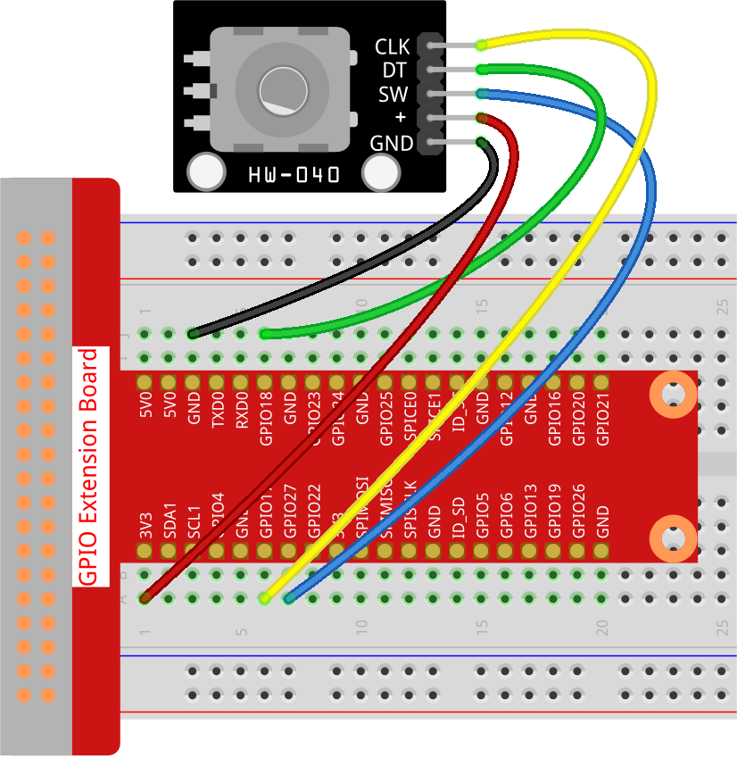

.. note::

    Hello, welcome to the SunFounder Raspberry Pi & Arduino & ESP32 Enthusiasts Community on Facebook! Dive deeper into Raspberry Pi, Arduino, and ESP32 with fellow enthusiasts.

    **Why Join?**

    - **Expert Support**: Solve post-sale issues and technical challenges with help from our community and team.
    - **Learn & Share**: Exchange tips and tutorials to enhance your skills.
    - **Exclusive Previews**: Get early access to new product announcements and sneak peeks.
    - **Special Discounts**: Enjoy exclusive discounts on our newest products.
    - **Festive Promotions and Giveaways**: Take part in giveaways and holiday promotions.

    👉 Ready to explore and create with us? Click [|link_sf_facebook|] and join today!

.. _2.1.6_py:

2.1.6 Rotary Encoder Module
===========================

**Introduction**

In this project, you will learn how to use a Rotary Encoder, a compact electronic switch that generates pulses in a specific timing sequence. Rotary Encoders are commonly used for precise control in increment, decrement, menu navigation, and other operations, making them ideal for tasks like mouse scrolling or adjusting settings in devices.

----------------------------------------------

**What You’ll Need**

Here are the components required for this project:

.. list-table::
    :widths: 30 20
    :header-rows: 1

    *   - COMPONENT INTRODUCTION
        - PURCHASE LINK

    *   - :ref:`cpn_gpio_extension_board`
        - |link_gpio_board_buy|
    *   - :ref:`cpn_breadboard`
        - |link_breadboard_buy|
    *   - :ref:`cpn_wires`
        - |link_wires_buy|
    *   - :ref:`cpn_rotary_encoder`
        - |link_rotary_encoder_buy|

.. **Circuit Diagram**

.. Below is the circuit diagram showing how to connect the Rotary Encoder module to the Raspberry Pi. Ensure proper connections to avoid damage or errors.

.. .. image:: ../python/img/2.1.6_rotary_encoder_schematic.png
..    :align: center

----------------------------------------------

**Wiring Diagram**

Connect the Rotary Encoder pins to the Raspberry Pi using a breadboard:

  - GND of the Rotary Encoder to GND
  - “+” to 5V
  - SW to GPIO27
  - DT to GPIO18
  - CLK to GPIO17

----------------------------------------------

**Writing the Code**

Navigate to the appropriate directory and run the following Python script to interact with the Rotary Encoder:

.. raw:: html

   <run></run>

.. code-block::

    cd ~/zero-w-ai-kit/python

Run the script:

.. raw:: html

   <run></run>

.. code-block::

    sudo python3 2.1.6_RotaryEncoder_zero.py

While running the script, observe the following behavior:

   - Turning the Rotary Encoder clockwise increases the count.

   - Turning it counterclockwise decreases the count.

   - Pressing the Rotary Encoder switch resets the count to zero.

----------------------------------------------

**Writing the Code**

.. code-block:: python

   #!/usr/bin/env python3
   from gpiozero import RotaryEncoder, Button
   from time import sleep

   # Initialize the rotary encoder and button
   encoder = RotaryEncoder(a=17, b=18)  # Rotary Encoder connected to GPIO pins 17 (CLK) and 18 (DT)
   button = Button(27)                  # Button connected to GPIO pin 27

   global_counter = 0  # Track the rotary encoder's position

   def rotary_change():
      """ Update the global counter based on the rotary encoder's rotation. """
      global global_counter
      global_counter += encoder.steps  # Adjust counter based on encoder steps
      encoder.steps = 0  # Reset encoder steps after updating counter
      print('Global Counter =', global_counter)  # Display current counter value

   def reset_counter():
      """ Reset the global counter to zero when the button is pressed. """
      global global_counter
      global_counter = 0  # Reset the counter
      print('Counter reset')  # Indicate counter reset

   # Assign the reset_counter function to button press event
   button.when_pressed = reset_counter

   try:
      # Monitor rotary encoder continuously and process changes
      while True:
         rotary_change()  # Handle rotary encoder changes
         sleep(0.1)  # Short delay to reduce CPU load

   except KeyboardInterrupt:
      # Gracefully handle a keyboard interrupt (Ctrl+C)
      pass

This Python script uses a rotary encoder and a button to control and monitor a counter value on a Raspberry Pi. When executed:

1. Rotating the encoder updates a global counter:

   - Clockwise rotation increases the counter.
   - Counterclockwise rotation decreases the counter.

2. Pressing the button (connected to GPIO pin 27) resets the counter to zero.
3. The current counter value is printed to the console in real time as the encoder rotates or the counter is reset.
4. The program runs indefinitely, listening for rotary encoder changes and button presses, until interrupted with ``Ctrl+C``.

----------------------------------------------

**Understanding the Code**

1. **Initialization:**

   - The ``RotaryEncoder`` class initializes the rotary encoder with GPIO pins 17 (CLK) and 18 (DT).

   - The ``Button`` class initializes a button connected to GPIO pin 27.

2. **Functions:**

   - ``rotary_change``: Updates the counter based on encoder steps and resets the steps after each update.

   - ``reset_counter``: Resets the counter to zero when the button is pressed.

3. **Event Handling:**

   - Assigns the ``reset_counter`` function to the ``when_pressed`` event of the button.

4. **Main Loop:**

   - Continuously monitors the encoder and updates the counter. Handles interruptions gracefully using a try-except block.

----------------------------------------------

**Troubleshooting**

1. **Counter Does Not Change**  

   - **Cause**: Incorrect wiring of the rotary encoder.  
   - **Solution**: Ensure the rotary encoder’s ``CLK`` pin is connected to GPIO pin 17 and ``DT`` pin to GPIO pin 18. Verify proper ground connection.

2. **Button Does Not Reset the Counter**  

   - **Cause**: Incorrect button wiring or event assignment.  
   - **Solution**: Check that the button is connected to GPIO pin 27 and ground. Ensure the ``reset_counter()`` function is assigned to ``button.when_pressed``.

3. **Counter Updates Erratically**  

   - **Cause**: Noise or debounce issues with the rotary encoder.  
   - **Solution**: Add software debounce by introducing a small delay before processing encoder changes:

   .. code-block:: python
   
      def rotary_change():
         sleep(0.01)  # Debounce delay
         global global_counter
         global_counter += encoder.steps
         encoder.steps = 0
   

----------------------------------------------

**Extendable Ideas**

1. **Display Counter Value**  

   Use an LCD or OLED screen to display the counter value instead of relying on the console output.

2. **Adjustable Step Size**  

   Allow dynamic adjustment of the step size (e.g., increment by 2 or 5 per step) using a second button:
   
   
   .. code-block:: python

      step_size = 1
      def adjust_step_size():
         global step_size
         step_size += 1
         print(f"Step size adjusted to {step_size}")
      another_button = Button(22)
      another_button.when_pressed = adjust_step_size

3. **Directional Feedback**  

   Add LEDs to indicate the direction of rotation:

   .. code-block:: python

      from gpiozero import LED
      cw_led = LED(23)  # Clockwise rotation indicator
      ccw_led = LED(24)  # Counterclockwise rotation indicator

      def rotary_change():
         global global_counter
         steps = encoder.steps
         if steps > 0:
            cw_led.on()
            ccw_led.off()
         elif steps < 0:
            cw_led.off()
            ccw_led.on()
         global_counter += steps
         encoder.steps = 0

4. **PWM Brightness Control**  

   Control the brightness of an LED using the counter value:

   .. code-block:: python

      from gpiozero import PWMLED
      brightness_led = PWMLED(25)
      brightness_led.value = min(max(global_counter / 100, 0), 1)  # Scale counter to 0-1 range

----------------------------------------------

**Conclusion**

This project demonstrated how to integrate a Rotary Encoder with the Raspberry Pi for precision control. You learned to handle rotation and button press events effectively. By experimenting further, you can extend this setup for more advanced applications like volume control, menu navigation, or even gaming controllers.
