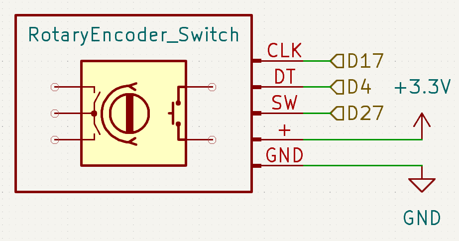
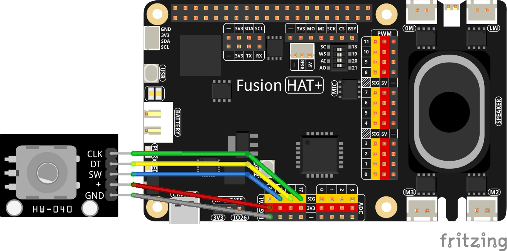

.. note::

    Hello, welcome to the SunFounder Raspberry Pi & Arduino & ESP32 Enthusiasts Community on Facebook! Dive deeper into Raspberry Pi, Arduino, and ESP32 with fellow enthusiasts.

    **Why Join?**

    - **Expert Support**: Solve post-sale issues and technical challenges with help from our community and team.
    - **Learn & Share**: Exchange tips and tutorials to enhance your skills.
    - **Exclusive Previews**: Get early access to new product announcements and sneak peeks.
    - **Special Discounts**: Enjoy exclusive discounts on our newest products.
    - **Festive Promotions and Giveaways**: Take part in giveaways and holiday promotions.

    👉 Ready to explore and create with us? Click [|link_sf_facebook|] and join today!

.. _2.1.6_py:

2.1.6 Rotary Encoder Module
===========================

**Introduction**

In this project, you will learn how to use a Rotary Encoder, a compact electronic switch that generates pulses in a specific timing sequence. Rotary Encoders are commonly used for precise control in increment, decrement, menu navigation, and other operations, making them ideal for tasks like mouse scrolling or adjusting settings in devices.

----------------------------------------------

**What You’ll Need**

Here are the components required for this project:

.. list-table::
    :widths: 30 20
    :header-rows: 1

    *   - COMPONENT INTRODUCTION
        - PURCHASE LINK

    *   - :ref:`cpn_rotary_encoder`
        - |link_rotary_encoder_buy|
    *   - :ref:`cpn_wires`
        - |link_wires_buy|  
    *   - Fusion HAT
        - 
    *   - Raspberry Pi Zero 2 W
        -

--------------------------------------------------

**Circuit Diagram**

Below is the circuit diagram showing how to connect the Rotary Encoder module to the Raspberry Pi. Ensure proper connections to avoid damage or errors.

----------------------------------------------

**Wiring Diagram**

Connect the Rotary Encoder pins to the Raspberry Pi using a breadboard:

  - GND of the Rotary Encoder to GND
  - “+” to 5V
  - SW to GPIO27
  - DT to GPIO4
  - CLK to GPIO17

----------------------------------------------

**Writing the Code**

Run the following Python script to interact with the Rotary Encoder:

.. code-block:: python

   #!/usr/bin/env python3
   from fusion_hat import Rotary_Encoder, Pin
   from signal import pause  # Import pause function from signal module

   # Initialize the rotary encoder and button (sw)
   encoder = Rotary_Encoder(clk=17, dt=4)  # Rotary Encoder connected to GPIO pins 17 (CLK) and 4 (DT)
   sw = Pin(27, Pin.IN, pull= Pin.PULL_UP)  # Button (sw) connected to GPIO pin 27

   def rotary_change():
      """ Update the counter based on the rotary encoder's rotation. """
      print('Counter =', encoder.steps())  # Display current counter value

   def reset_counter():
      """ Reset the counter to zero when the button (sw) is pressed. """
      encoder.reset()  # Reset the counter
      print('Counter reset')  # Indicate counter reset

   # Set up event handlers for the rotary encoder and button (sw)
   encoder.when_rotated = rotary_change
   sw.when_activated = reset_counter

   # Run an event loop that waits for button (sw) events and keeps the script running
   print("CTRL + C to exit")
   pause()

While running the script, observe the following behavior:

   - Turning the Rotary Encoder clockwise increases the count.
   - Turning it counterclockwise decreases the count.
   - Pressing the Rotary Encoder resets the count to zero.

----------------------------------------------

**Understanding the Code**

1. **Initialization:**

   - The ``RotaryEncoder`` class initializes the rotary encoder with GPIO pins 17 (CLK) and 4 (DT).

   - The ``Button`` class initializes a button connected to GPIO pin 27.

2. **Functions:**

   - ``rotary_change``: Updates the counter based on encoder steps and resets the steps after each update.

   - ``reset_counter``: Resets the counter to zero when the button is pressed.

3. **Event Handling:**

   - Assigns the ``reset_counter`` function to the ``when_activated`` event of the button.
   - Assigns the ``rotary_change`` function to the ``when_rotated`` event of the encoder.

4. **Main Loop:**

   - Continuously monitors the encoder and updates the counter. Handles interruptions gracefully using a try-except block.

----------------------------------------------

**Troubleshooting**

1. **Counter Does Not Change**  

   - **Cause**: Incorrect wiring of the rotary encoder.  
   - **Solution**: Ensure the rotary encoder’s ``CLK`` pin is connected to GPIO pin 17 and ``DT`` pin to GPIO pin 4. Verify proper ground connection.

2. **Can Not Reset the Counter**  

   - **Cause**: Incorrect wiring or event assignment.  
   - **Solution**: Check that the SW pin is connected to GPIO pin 27 and ground. Ensure the ``reset_counter()`` function is assigned to ``button.when_activated``.

3. **Counter Updates Erratically**  

   - **Cause**: Noise or debounce issues with the rotary encoder.  
   - **Solution**: Add software debounce by introducing a small delay before processing encoder changes:

   .. code-block:: python
   
      def rotary_change():
         """ Update the counter based on the rotary encoder's rotation. """      
         sleep(0.01) # Add a small delay for software debounce
         print('Counter =', encoder.steps()) 

----------------------------------------------

**Extendable Ideas**

1. **Display Counter Value**  

   Use an LCD or OLED screen to display the counter value instead of relying on the console output.

2. **Directional Feedback**  

   Add LEDs to indicate the direction of rotation:

   .. code-block:: python

      from fusion_hat import Pin
      cw_led = Pin(23, Pin.OUT)  # Clockwise rotation indicator
      ccw_led = Pin(24, Pin.OUT)  # Counterclockwise rotation indicator

      def rotary_change():
         global last_position
         steps = encoder.steps()
         if steps > last_position:
            cw_led.on()
            ccw_led.off()
         elif steps < last_position:
            cw_led.off()
            ccw_led.on()
         last_position = steps

3. **PWM Brightness Control**  

   Control the brightness of an LED using the counter value:

   .. code-block:: python

      from fusion_hat import PWM
      brightness_led = PWM('P0')
      brightness_led.pulse_width_percent(min(max(encoder.steps(), 0), 100))

----------------------------------------------

**Conclusion**

This project demonstrated how to integrate a Rotary Encoder with the Fusion HAT for precision control. You learned to handle rotation and button press events effectively. By experimenting further, you can extend this setup for more advanced applications like volume control, menu navigation, or even gaming controllers.
