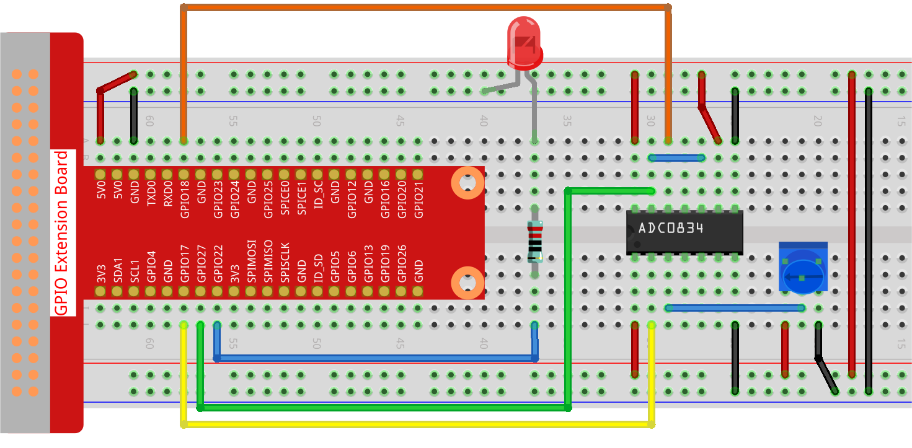

.. note::

    Hello, welcome to the SunFounder Raspberry Pi & Arduino & ESP32 Enthusiasts Community on Facebook! Dive deeper into Raspberry Pi, Arduino, and ESP32 with fellow enthusiasts.

    **Why Join?**

    - **Expert Support**: Solve post-sale issues and technical challenges with help from our community and team.
    - **Learn & Share**: Exchange tips and tutorials to enhance your skills.
    - **Exclusive Previews**: Get early access to new product announcements and sneak peeks.
    - **Special Discounts**: Enjoy exclusive discounts on our newest products.
    - **Festive Promotions and Giveaways**: Take part in giveaways and holiday promotions.

    👉 Ready to explore and create with us? Click [|link_sf_facebook|] and join today!

.. _2.1.7_py:

2.1.7 Potentiometer
===================

**Introduction**

The ADC (Analog-to-Digital Converter) function is essential for converting analog signals to digital ones. In this experiment, we use the ADC0834 module to achieve this conversion, utilizing a potentiometer. The potentiometer adjusts the voltage, a physical quantity, which the ADC then digitizes. This experiment also demonstrates how the potentiometer can control the brightness of an LED.

----------------------------------------------

**What You’ll Need**

Here are the components required for this project:

.. list-table::
    :widths: 30 20
    :header-rows: 1

    * - COMPONENT INTRODUCTION
      - PURCHASE LINK
    * - GPIO Extension Board
      - |link_gpio_board_buy|
    * - Breadboard
      - |link_breadboard_buy|
    * - Wires
      - |link_wires_buy|
    * - Resistor
      - |link_resistor_buy|
    * - LED
      - |link_led_buy|
    * - Potentiometer
      - |link_potentiometer_buy|
    * - ADC0834 Module
      - 

----------------------------------------------

**Circuit Diagram**

Below are the schematic diagrams for the project:

.. image:: ../python/img/2.1.7_potentiometer_second_1.png

.. image:: ../python/img/2.1.7_potentiometer_second_2.png

----------------------------------------------

**Wiring Diagram**

Build the circuit as shown in the image below:

.. note::
    Place the chip in the correct position as depicted in the diagram. Ensure the grooves on the chip face the left when placed.

----------------------------------------------

**Writing the Code**

Navigate to the source code directory:

.. code-block:: bash

    cd ~/zero-w-ai-kit/python

Run the Python script:

.. code-block:: bash

    sudo python3 2.1.7_Potentiometer_zero.py

When the script runs, rotating the potentiometer's knob changes the LED brightness accordingly.

.. warning::
    If you encounter the error ``RuntimeError: Cannot determine SOC peripheral base address``, refer to the :ref:`faq_soc`.

----------------------------------------------

**Code**

Below is the code for the experiment:

.. code-block:: python

   #!/usr/bin/env python3

   from gpiozero import PWMLED
   import ADC0834
   import time

   # Initialize a PWM LED on GPIO pin 22
   led = PWMLED(22)

   # Set up the ADC0834 module
   ADC0834.setup()

   def MAP(x, in_min, in_max, out_min, out_max):
       """
       Map a value from one range to another.
       :param x: The value to be mapped.
       :param in_min: The lower bound of the value's current range.
       :param in_max: The upper bound of the value's current range.
       :param out_min: The lower bound of the value's target range.
       :param out_max: The upper bound of the value's target range.
       :return: The mapped value.
       """
       return (x - in_min) * (out_max - out_min) / (in_max - in_min) + out_min

   try:
       while True:
           # Get the current reading from the ADC0834 module
           res = ADC0834.getResult()
           print('res = %d' % res)

           # Map the ADC value to a range suitable for setting LED brightness
           R_val = MAP(res, 0, 255, 0, 100)

           # Set the LED brightness
           led.value = float(R_val / 100)

           # Wait for 0.2 seconds before reading again
           time.sleep(0.2)

   except KeyboardInterrupt:
       led.value = 0  # Turn off the LED

This Python script uses an ADC0834 module to read analog input and control the brightness of a PWM LED connected to a Raspberry Pi. When executed:

1. The ADC0834 module continuously reads an analog signal, converting it to a digital value between 0 and 255.
2. This value is mapped to a range between 0 and 100, representing the brightness percentage of the LED.
3. The brightness of the PWM LED (connected to GPIO pin 22) is dynamically adjusted based on the mapped value.
4. The raw ADC value (``res``) is printed to the console in real time.
5. The program runs indefinitely until interrupted with ``Ctrl+C``, at which point the LED turns off.

----------------------------------------------

**Understanding the Code**

1. **Imports:**
   The script uses ``gpiozero`` for PWM LED control, ``ADC0834`` for analog-to-digital conversion, and ``time`` for implementing delays.

   .. code-block:: python

       from gpiozero import PWMLED
       import ADC0834
       import time

2. **Initialization:**
   The ``PWMLED`` object connects to GPIO pin 22, and the ADC0834 module is initialized.

   .. code-block:: python

       led = PWMLED(22)
       ADC0834.setup()

3. **MAP Function:**
   The ``MAP`` function converts values from one range to another, essential for mapping ADC readings to LED brightness.

   .. code-block:: python

       def MAP(x, in_min, in_max, out_min, out_max):
           return (x - in_min) * (out_max - out_min) / (in_max - in_min) + out_min

4. **Main Loop:**

   - Continuously read ADC values.
   - Map ADC readings (0-255) to brightness levels (0-100).
   - Adjust LED brightness and wait for 0.2 seconds before repeating.

   .. code-block:: python

       try:
           while True:
               res = ADC0834.getResult()
               print('res = %d' % res)
               R_val = MAP(res, 0, 255, 0, 100)
               led.value = float(R_val / 100)
               time.sleep(0.2)
       except KeyboardInterrupt:
           led.value = 0  # Turn off the LED

----------------------------------------------

**Troubleshooting**

1. **LED Does Not Respond**  

   - **Cause**: Incorrect wiring or GPIO pin configuration.  
   - **Solution**: Ensure the LED is connected to GPIO pin 22 with an appropriate resistor.

2. **ADC Values Always Zero**  

   - **Cause**: Incorrect wiring of the ADC0834 module or sensor.  
   - **Solution**: Verify the ADC0834 connections, including power, ground, chip select, clock, and data lines. Ensure the input sensor is functioning.

3. **Mapping Issues**  

   - **Cause**: Incorrect ``MAP()`` function parameters.  
   - **Solution**: Ensure the input range (``in_min``, ``in_max``) matches the ADC0834 output range (0–255) and the output range (``out_min``, ``out_max``) is suitable for LED brightness control (0–100).

----------------------------------------------

**Extendable Ideas**

1. **Multi-Channel Input**: Use multiple channels of the ADC0834 to control multiple LEDs or other devices:

   .. code-block:: python

      channel_0 = ADC0834.getResult(0)
      channel_1 = ADC0834.getResult(1)

2. **Threshold-Based Behavior**: Add logic to turn the LED on or off based on specific ADC value thresholds:

   .. code-block:: python

      if res > 200:
         led.on()
      else:
         led.off()

----------------------------------------------

**Conclusion**

This experiment demonstrates how to utilize the ADC0834 module and a potentiometer to control the brightness of an LED. By understanding analog-to-digital conversion and PWM control, you can expand this knowledge to build more complex interactive systems.
