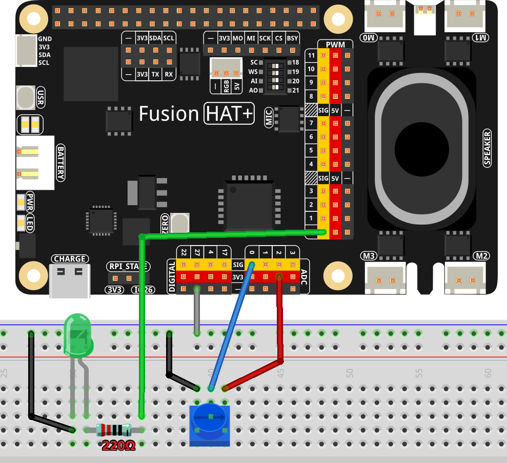

.. note::

    Hello, welcome to the SunFounder Raspberry Pi & Arduino & ESP32 Enthusiasts Community on Facebook! Dive deeper into Raspberry Pi, Arduino, and ESP32 with fellow enthusiasts.

    **Why Join?**

    - **Expert Support**: Solve post-sale issues and technical challenges with help from our community and team.
    - **Learn & Share**: Exchange tips and tutorials to enhance your skills.
    - **Exclusive Previews**: Get early access to new product announcements and sneak peeks.
    - **Special Discounts**: Enjoy exclusive discounts on our newest products.
    - **Festive Promotions and Giveaways**: Take part in giveaways and holiday promotions.

    👉 Ready to explore and create with us? Click [|link_sf_facebook|] and join today!

.. _2.1.7_py:

2.1.7 Potentiometer
===================

**Introduction**

The ADC (Analog-to-Digital Converter) function is essential for converting analog signals to digital ones. In this experiment, we use the Fusion HAT to achieve this conversion, utilizing a potentiometer. The potentiometer adjusts the voltage, a physical quantity, which the ADC then digitizes. This experiment also demonstrates how the potentiometer can control the brightness of an LED.

----------------------------------------------

**What You’ll Need**

Here are the components required for this project:

.. list-table::
    :widths: 30 20
    :header-rows: 1

    *   - COMPONENT INTRODUCTION
        - PURCHASE LINK

    *   - Breadboard
        - |link_breadboard_buy|
    *   - Wires
        - |link_wires_buy|
    *   - Resistor
        - |link_resistor_buy|
    *   - LED
        - |link_led_buy|
    *   - Potentiometer
        - |link_potentiometer_buy|
    *   - Fusion HAT
        - 
    *   - Raspberry Pi Zero 2 W
        -

----------------------------------------------

**Circuit Diagram**

Below are the schematic diagrams for the project:

.. image:: ../python/img/2.1.

----------------------------------------------

**Wiring Diagram**

Build the circuit as shown in the image below:

----------------------------------------------

**Writing the Code**

Below is the code for the experiment:

.. code-block:: python

   #!/usr/bin/env python3

   from fusion_hat import ADC, PWM
   import time

   # Initialize a PWM LED
   led = PWM('P0')

   # Set up the potentiometer
   pot = ADC('A0')

   def MAP(x, in_min, in_max, out_min, out_max):
      """
      Map a value from one range to another.
      :param x: The value to be mapped.
      :param in_min: The lower bound of the value's current range.
      :param in_max: The upper bound of the value's current range.
      :param out_min: The lower bound of the value's target range.
      :param out_max: The upper bound of the value's target range.
      :return: The mapped value.
      """
      return (x - in_min) * (out_max - out_min) / (in_max - in_min) + out_min

   try:
      while True:
         # Get the current reading from the ADC port
         result = pot.read()
         voltage = pot.read_voltage() # Get the voltage from the ADC port, in Volts (0-3.3V)
         print('result = %d voltage = %.2f' %(result,voltage))

         # Map the ADC value to a range suitable for setting LED brightness
         value = MAP(result, 0, 4095, 0, 100)

         # Set the LED brightness
         led.pulse_width_percent(value)

         # Wait for 1 seconds before reading again
         time.sleep(0.2)

   # Graceful exit when 'Ctrl+C' is pressed
   except KeyboardInterrupt: 
      led.pulse_width_percent(0)  # Turn off the LED

This Python script uses an Fusion HAT to read analog input and control the brightness of a PWM LED. When executed:

1. The Fusion HAT continuously reads an analog signal, converting it to a digital value between 0 and 4095.
2. This value is mapped to a range between 0 and 100, representing the brightness percentage of the LED.
3. The brightness of the PWM LED is dynamically adjusted based on the mapped value.
4. The raw ADC value and voltage is printed to the console in real time.
5. The program runs indefinitely until interrupted with ``Ctrl+C``, at which point the LED turns off.

----------------------------------------------

**Understanding the Code**

1. **Imports:**

   .. code-block:: python

      from fusion_hat import ADC, PWM
      import time

   The script uses ``fusion_hat`` for PWM LED control and analog-to-digital conversion, and ``time`` for implementing delays.

2. **Initialization:**

   .. code-block:: python

      # Initialize a PWM LED
      led = PWM('P0')

      # Set up the potentiometer
      pot = ADC('A0')

   The script initializes a PWM LED on pin ``P0`` and an ADC on pin ``A0``.

3. **MAP Function:**

   .. code-block:: python

       def MAP(x, in_min, in_max, out_min, out_max):
           return (x - in_min) * (out_max - out_min) / (in_max - in_min) + out_min

   The ``MAP`` function converts values from one range to another, essential for mapping ADC readings to LED brightness.

4. **Main Loop:**

   .. code-block:: python

      try:
         while True:
            # Get the current reading from the ADC port
            result = pot.read()
            voltage = pot.read_voltage()
            print('result = %d voltage = %.2f' %(result,voltage))

            # Map the ADC value to a range suitable for setting LED brightness
            value = MAP(result, 0, 4095, 0, 100)

            # Set the LED brightness
            led.pulse_width_percent(value)

            # Wait for 1 seconds before reading again
            time.sleep(0.2)

      # Graceful exit when 'Ctrl+C' is pressed
      except KeyboardInterrupt: 
         led.pulse_width_percent(0)  # Turn off the LED

   - Continuously read ADC values.
   - Map ADC readings (0-4095) to brightness levels (0-100).
   - Adjust LED brightness and wait for 0.2 seconds before repeating.

----------------------------------------------

**Troubleshooting**

1. **LED Does Not Respond**  

   - **Cause**: Incorrect wiring or GPIO pin configuration.  
   - **Solution**: Ensure the LED is connected to PWM 0 with an appropriate resistor.

2. **ADC Values Always Zero**  

   - **Cause**: Incorrect wiring of the sensor.  
   - **Solution**: Verify the sensor connections. Ensure the input sensor is functioning.

3. **Mapping Issues**  

   - **Cause**: Incorrect ``MAP()`` function parameters.  
   - **Solution**: Ensure the input range (``in_min``, ``in_max``) matches the output range (0–4095) and the output range (``out_min``, ``out_max``) is suitable for LED brightness control (0–100).

----------------------------------------------

**Extendable Ideas**

1. **Threshold-Based Behavior**: Add logic to turn the LED on or off based on specific ADC value thresholds:

   .. code-block:: python

      if result > 2048:
         led.on()
      else:
         led.off()

----------------------------------------------

**Conclusion**

This experiment demonstrates how to utilize the Fusion HAT and a potentiometer to control the brightness of an LED. By understanding analog-to-digital conversion and PWM control, you can expand this knowledge to build more complex interactive systems.
