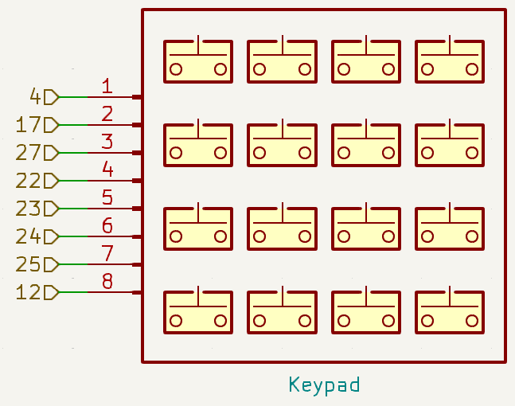
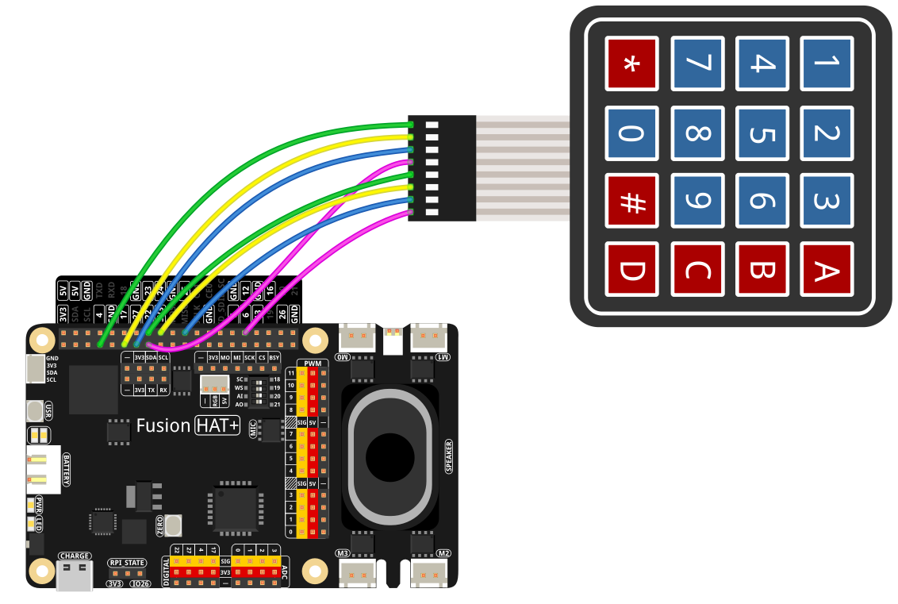

.. note::

    Hello, welcome to the SunFounder Raspberry Pi & Arduino & ESP32 Enthusiasts Community on Facebook! Dive deeper into Raspberry Pi, Arduino, and ESP32 with fellow enthusiasts.

    **Why Join?**

    - **Expert Support**: Solve post-sale issues and technical challenges with help from our community and team.
    - **Learn & Share**: Exchange tips and tutorials to enhance your skills.
    - **Exclusive Previews**: Get early access to new product announcements and sneak peeks.
    - **Special Discounts**: Enjoy exclusive discounts on our newest products.
    - **Festive Promotions and Giveaways**: Take part in giveaways and holiday promotions.

    👉 Ready to explore and create with us? Click [|link_sf_facebook|] and join today!

.. _2.1.8_py:

2.1.8 Keypad
============

**Introduction**

A keypad is a rectangular array of buttons commonly used for inputting characters, numbers, or commands. In this project, we will use a keypad to input characters and display the values of pressed buttons on the screen. This experiment illustrates how to interface a keypad with a Raspberry Pi and process the input.

----------------------------------------------

**What You’ll Need**

Here are the components required for this project:

.. list-table::
    :widths: 30 20
    :header-rows: 1

    *   - COMPONENT INTRODUCTION
        - PURCHASE LINK

    *   - Keypad
        - 
    *   - Wires
        - |link_wires_buy|  
    *   - Fusion HAT
        - 
    *   - Raspberry Pi Zero 2 W
        -

----------------------------------------------

**Circuit Diagram**

Below are the schematic diagrams for the project:

----------------------------------------------

**Wiring Diagram**

Connect the components as shown in the wiring diagram below:

Ensure that all connections are secure and that the GPIO pins are correctly assigned to the rows and columns of the keypad.

----------------------------------------------

**Writing the Code**

Below is the Python code used for this project:

.. code-block:: python

   from fusion_hat import Keypad
   from time import sleep

   try:
      # Configure rows, columns, and keypad layout
      # pin from left to right - 4 17 27 22 23 24 25 12
      rows_pins = [4, 17, 27, 22]
      cols_pins = [23, 24, 25, 12]
      keys = ["1", "2", "3", "A",
               "4", "5", "6", "B",
               "7", "8", "9", "C",
               "*", "0", "#", "D"]

      # Create an instance of the Keypad class
      keypad = Keypad(rows_pins, cols_pins, keys)
      last_key_pressed = []

      # Continuously read the keypad and print newly pressed keys
      while True:
         pressed_keys = keypad.read()
         if pressed_keys and pressed_keys != last_key_pressed:
               print(pressed_keys)  # Print the list of pressed keys
               last_key_pressed = pressed_keys
         sleep(0.1)  # Short delay to reduce CPU load

   except KeyboardInterrupt:
      # Handle a keyboard interrupt (Ctrl+C) for a clean exit
      pass

The provided Python script implements a 4x4 keypad using the GPIO pins of a Raspberry Pi. When executed:

1. **Keypad Initialization**:

   - The keypad uses GPIO pins specified in ``rows_pins`` (rows) and ``cols_pins`` (columns).
   - Each key corresponds to a specific button layout defined in ``keys`` (e.g., "1", "2", "A", etc.).

2. **Key Press Detection**:

   - The program continuously scans the keypad to detect pressed keys.
   - When a key is pressed, its value (e.g., "1", "A") is printed to the console.

3. **Continuous Monitoring**:

   - The script runs in a loop, updating the list of currently pressed keys every 0.1 seconds.
   - The program stops when interrupted with ``Ctrl+C``.

----------------------------------------------

**Understanding the Code**

1. **Imports:**

   .. code-block:: python

      from fusion_hat import Keypad
      from time import sleep

   The script uses ``fusion_hat`` for Keypad control and ``time`` for implementing delays.

2. **Main Script:**

   .. code-block:: python

      # Configure rows, columns, and keypad layout
      # pin from left to right - 4 17 27 22 23 24 25 12
      rows_pins = [4, 17, 27, 22]
      cols_pins = [23, 24, 25, 12]
      keys = ["1", "2", "3", "A",
               "4", "5", "6", "B",
               "7", "8", "9", "C",
               "*", "0", "#", "D"]

      # Create an instance of the Keypad class
      keypad = Keypad(rows_pins, cols_pins, keys)
      last_key_pressed = []

      # Continuously read the keypad and print newly pressed keys
      while True:
         pressed_keys = keypad.read()
         if pressed_keys and pressed_keys != last_key_pressed:
               print(pressed_keys)  # Print the list of pressed keys
               last_key_pressed = pressed_keys
         sleep(0.1)  # Short delay to reduce CPU load

   - Configures pins for the rows and columns.
   - Defines the keypad layout.
   - Continuously reads and prints pressed keys.

----------------------------------------------

**Troubleshooting**

1. **No Output When Pressing Keys**:

   - **Cause**: Incorrect wiring of the keypad or GPIO pins.
   - **Solution**: Verify the keypad is connected according to the ``rows_pins`` and ``cols_pins`` assignments. Ensure proper ground connections.

2. **Incorrect Key Press Detection**:

   - **Cause**: Keypad layout mismatch with ``keys`` or row/column order.  
   - **Solution**: Ensure the ``keys`` list matches the physical keypad layout. Double-check row and column pin order.

----------------------------------------------

**Extendable Ideas**

1. **Multi-Key Combination Detection**: Implement logic to detect specific key combinations or sequences:

     .. code-block:: python

         if pressed_keys == ["A", "B", "C"]:
             print("Special Combination Detected!")

2. **LED or Buzzer Feedback**: Provide visual or auditory feedback when keys are pressed:
     
      .. code-block:: python

         from fusion_hat import Pin
         led = Pin(26, Pin.OUT)
         if pressed_keys:
            led.on()
            sleep(0.1)
            led.off()

3. **Event Trigger**: Trigger specific actions based on key presses, such as controlling appliances.

----------------------------------------------

**Conclusion**

This experiment demonstrates how to interface a keypad with a Fusion HAT and process input in Python. By understanding how the row-column scanning method works, you can build interactive applications like access control systems, calculators, or custom input devices.
