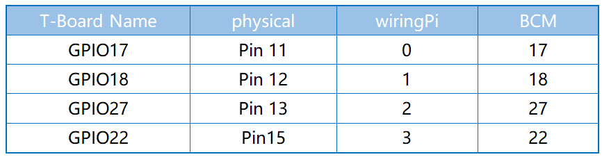
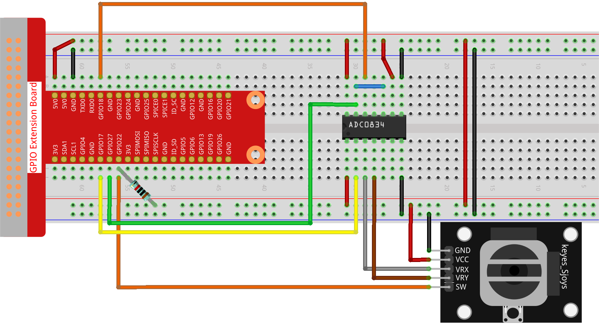

.. note::

    Hello, welcome to the SunFounder Raspberry Pi & Arduino & ESP32 Enthusiasts Community on Facebook! Dive deeper into Raspberry Pi, Arduino, and ESP32 with fellow enthusiasts.

    **Why Join?**

    - **Expert Support**: Solve post-sale issues and technical challenges with help from our community and team.
    - **Learn & Share**: Exchange tips and tutorials to enhance your skills.
    - **Exclusive Previews**: Get early access to new product announcements and sneak peeks.
    - **Special Discounts**: Enjoy exclusive discounts on our newest products.
    - **Festive Promotions and Giveaways**: Take part in giveaways and holiday promotions.

    👉 Ready to explore and create with us? Click [|link_sf_facebook|] and join today!

.. _2.1.9_py:

2.1.9 Joystick
==============

**Introduction**

A joystick is an input device commonly used for gaming, robotics, and navigation systems. It typically has two axes (X and Y) for directional control and a button (Z-axis or SW) for additional input. In this project, you will learn how a joystick works by manipulating it and displaying the corresponding values of the X, Y, and button states on the screen.

----------------------------------------------

**What You’ll Need**

Below are the components required for this project:

.. list-table::
    :widths: 30 20
    :header-rows: 1

    * - COMPONENT INTRODUCTION
      - PURCHASE LINK
    * - GPIO Extension Board
      - |link_gpio_board_buy|
    * - Breadboard
      - |link_breadboard_buy|
    * - Wires
      - |link_wires_buy|
    * - Resistor
      - |link_resistor_buy|
    * - Joystick
      - 
    * - ADC0834 Module
      - 

----------------------------------------------

**Circuit Diagram**

When using a joystick, the data for the X and Y axes are analog values that require an ADC (Analog-to-Digital Converter) like the ADC0834 to be converted to digital values. The button (Z-axis or SW) is digital and can be directly read using a GPIO pin.

.. image:: ../python/img/2.1.9_joystick_schematic_2.png

----------------------------------------------

**Wiring Diagram**

Build the circuit as shown in the diagram below:

Ensure that:

- The VRX and VRY pins of the joystick are connected to CH0 and CH1 of the ADC0834.
- The SW pin of the joystick is connected to a GPIO pin (e.g., GPIO 22).
- Power and ground connections are correctly set.

----------------------------------------------

**Writing the Code**

1. Navigate to the project directory:

   .. code-block:: bash

       cd ~/zero-w-ai-kit/python

2. Run the Python script:

   .. code-block:: bash

       sudo python3 2.1.9_Joystick_zero.py

After running the code, manipulate the joystick, and observe the X, Y, and button values displayed on the screen.

.. warning::
    If you encounter the error ``RuntimeError: Cannot determine SOC peripheral base address``, refer to the :ref:`faq_soc` for troubleshooting steps.

----------------------------------------------

**Code**

Below is the Python code used for this project:

.. code-block:: python

   #!/usr/bin/env python3
   from gpiozero import Button
   import ADC0834
   import time

   # Initialize the button connected to GPIO pin 22
   BtnPin = Button(22)

   # Setup the ADC0834 ADC
   ADC0834.setup()

   try:
       # Main loop to read and print ADC values and button state
       while True:
           # Read X and Y values from ADC channels 0 and 1
           x_val = ADC0834.getResult(0)
           y_val = ADC0834.getResult(1)

           # Read the state of the button (pressed or not)
           Btn_val = BtnPin.value

           # Print the X, Y, and button values
           print('X: %d  Y: %d  Btn: %d' % (x_val, y_val, Btn_val))

           # Delay of 0.2 seconds before the next read
           time.sleep(0.2)

   except KeyboardInterrupt: 
       # Gracefully handle script termination (e.g., via KeyboardInterrupt)
       pass

This Python script combines an analog-to-digital converter (ADC0834) and a joystick to read and display real-time data on a Raspberry Pi. When executed:

1. The script continuously reads the X and Y values from the ADC0834 on channels 0 and 1.
2. It monitors the button connected to GPIO pin 22 to detect whether it is pressed or not.
3. The X, Y, and button state values are printed to the console in the format ``X: <value>  Y: <value>  Btn: <value>``, where:

   - ``X`` and ``Y`` are the analog readings from the ADC0834.
   - ``Btn`` is ``1`` when the button is not pressed and ``0`` when it is pressed.

4. The script updates every 0.2 seconds, running continuously until interrupted with ``Ctrl+C``.

----------------------------------------------

**Understanding the Code**

1. **Imports:**
   The script uses the ``gpiozero`` library for GPIO handling and ``ADC0834`` for reading analog values.

   .. code-block:: python

       from gpiozero import Button
       import ADC0834
       import time

2. **Initialization:**
   The button connected to GPIO 22 is initialized, and the ADC0834 module is set up for reading analog signals from the joystick.

   .. code-block:: python

       BtnPin = Button(22)
       ADC0834.setup()

3. **Main Loop:**

   - Reads X and Y values from ADC channels 0 and 1, respectively.
   - Reads the button state (pressed or not) from the SW pin.
   - Prints the X, Y, and button values to the screen every 0.2 seconds.

   .. code-block:: python

       try:
           while True:
               x_val = ADC0834.getResult(0)
               y_val = ADC0834.getResult(1)
               Btn_val = BtnPin.value
               print('X: %d  Y: %d  Btn: %d' % (x_val, y_val, Btn_val))
               time.sleep(0.2)
       except KeyboardInterrupt:
           pass

----------------------------------------------

**Troubleshooting**

1. **No Output in the Console**:

   - **Cause**: Joystick not wired correctly.
   - **Solution**: Ensure the ADC0834 is properly connected, with its power, ground, and data pins correctly wired to the Raspberry Pi. Verify the button connection to GPIO pin 22 and ground.

2. **Button State Always 1 or 0**:

   - **Cause**: Incorrect pull-up or pull-down configuration.
   - **Solution**: Verify the button wiring. Ensure it pulls the GPIO pin low when pressed. The ``gpiozero.Button`` class defaults to internal pull-up.

3. **ADC Values Are Constant**:

   - **Cause**: The ADC channels are not connected to any input.
   - **Solution**: Connect analog sensors, potentiometers, or joysticks to ADC channels 0 and 1 to provide variable inputs.

----------------------------------------------

**Extendable Ideas**

1. **Joystick Control**: Use the X and Y values to control a virtual joystick or game element.

2. **Data Logging**: Log the X, Y, and button values to a file for analysis:
     
   .. code-block:: python

      with open("sensor_log.txt", "a") as log_file:
            log_file.write(f"X: {x_val}, Y: {y_val}, Btn: {Btn_val}\n")

3. **Event Triggering**: Use the button press to toggle between different modes:
     
     .. code-block:: python

         mode = 0
         def toggle_mode():
             global mode
             mode = (mode + 1) % 2
             print(f"Mode changed to: {mode}")

         BtnPin.when_pressed = toggle_mode

----------------------------------------------

**Conclusion**

This experiment demonstrates how to interface a joystick with a Raspberry Pi using the ADC0834 module for analog-to-digital conversion. By understanding how to read and interpret joystick inputs, you can build interactive systems for gaming, robotics, or other applications.
