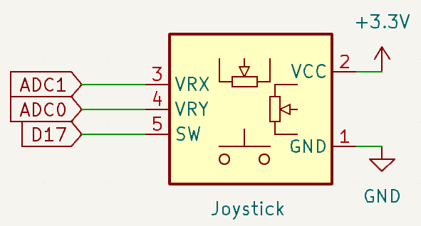
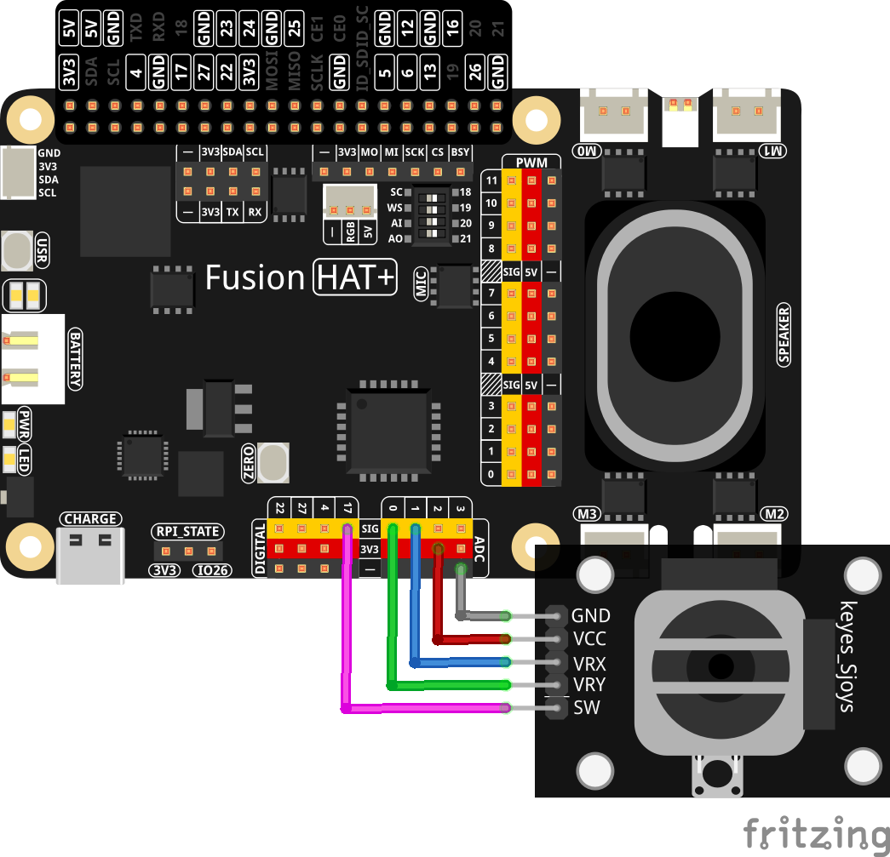

.. note::

    Hello, welcome to the SunFounder Raspberry Pi & Arduino & ESP32 Enthusiasts Community on Facebook! Dive deeper into Raspberry Pi, Arduino, and ESP32 with fellow enthusiasts.

    **Why Join?**

    - **Expert Support**: Solve post-sale issues and technical challenges with help from our community and team.
    - **Learn & Share**: Exchange tips and tutorials to enhance your skills.
    - **Exclusive Previews**: Get early access to new product announcements and sneak peeks.
    - **Special Discounts**: Enjoy exclusive discounts on our newest products.
    - **Festive Promotions and Giveaways**: Take part in giveaways and holiday promotions.

    👉 Ready to explore and create with us? Click [|link_sf_facebook|] and join today!

.. _2.1.9_py:

2.1.9 Joystick
==============

**Introduction**

A joystick is an input device commonly used for gaming, robotics, and navigation systems. It typically has two axes (X and Y) for directional control and a button (Btn or SW) for additional input. In this project, you will learn how a joystick works by manipulating it and displaying the corresponding values of the X, Y, and button states on the screen.

----------------------------------------------

**What You’ll Need**

Below are the components required for this project:

.. list-table::
    :widths: 30 20
    :header-rows: 1

    *   - COMPONENT INTRODUCTION
        - PURCHASE LINK

    *   - :ref:`cpn_joystick`
        - 
    *   - :ref:`cpn_wires`
        - |link_wires_buy|
    *   - Fusion HAT
        - 
    *   - Raspberry Pi Zero 2 W
        -

----------------------------------------------

**Circuit Diagram**

When using a joystick, the data for the X and Y axes are analog values that require an ADC (Analog-to-Digital Converter) like the ADC0834 to be converted to digital values. The button (Z-axis or SW) is digital and can be directly read using a GPIO pin.

----------------------------------------------

**Wiring Diagram**

Build the circuit as shown in the diagram below:

Ensure that:

- The VRX and VRY pins of the joystick are connected to ADC pins.
- The SW pin of the joystick is connected to a GPIO pin 17.
- Power and ground connections are correctly set.

----------------------------------------------

**Writing the Code**

Below is the Python code used for this project:

.. raw:: html

   <run></run>

.. code-block:: python

   #!/usr/bin/env python3
   from fusion_hat import Pin,ADC
   import time

   # Initialize the button connected to GPIO pin 17
   BtnPin = Pin(17, Pin.IN, Pin.PULL_UP)
   xAxis = ADC('A1')
   yAxis = ADC('A0')

   def MAP(x, in_min, in_max, out_min, out_max):
      """
      Map a value from one range to another.
      :param x: The value to be mapped.
      :param in_min: The lower bound of the value's current range.
      :param in_max: The upper bound of the value's current range.
      :param out_min: The lower bound of the value's target range.
      :param out_max: The upper bound of the value's target range.
      :return: The mapped value.
      """
      return (x - in_min) * (out_max - out_min) / (in_max - in_min) + out_min

   try:
      # Main loop to read and print ADC values and button state
      while True:
         # Read X and Y values from ADC channels
         x_val = MAP(xAxis.read(),0,4095,-100,100)
         y_val = MAP(yAxis.read(),0,4095,-100,100)

         # Read the state of the button (pressed or not)
         Btn_val = BtnPin.value()

         # Print the X, Y, and button values
         print('X: %d  Y: %d  Btn: %d' % (x_val, y_val, Btn_val))

         # Delay of 0.2 seconds before the next read
         time.sleep(0.2)

   # Gracefully handle script termination (e.g., via KeyboardInterrupt)
   except KeyboardInterrupt: 
      pass

This Python script read and display real-time joystick data on a Fusion HAT. When executed:

1. The script continuously reads the X and Y values from the Fusion HAT.
2. It monitors the button connected to GPIO pin 17 to detect whether it is pressed or not.
3. The X, Y, and button state values are printed to the console in the format ``X: <value>  Y: <value>  Btn: <value>``, where:

   - ``X`` and ``Y`` are the analog readings from the ADC0834.
   - ``Btn`` is ``1`` when the button is not pressed and ``0`` when it is pressed.

4. The script updates every 0.2 seconds, running continuously until interrupted with ``Ctrl+C``.

----------------------------------------------

**Understanding the Code**

1. **Imports:**

   .. code-block:: python

      from fusion_hat import Pin,ADC
      import time

   The script imports necessary modules: ``fusion_hat`` for GPIO functionalities, and ``time`` for adding delays.

2. **Initialization:**

   .. code-block:: python

      # Initialize the Joystick
      BtnPin = Pin(17, Pin.IN, Pin.PULL_UP)
      xAxis = ADC('A1')
      yAxis = ADC('A0')

   The script initializes the joystick by creating instances of the ``Pin`` and ``ADC`` classes. The button is set to input mode with an internal pull-up resistor enabled, and the X and Y axes are set to read from ADC channels A0 and A1, respectively.

3. **Main Loop:**

   .. code-block:: python

      try:
         # Main loop to read and print ADC values and button state
         while True:
            # Read X and Y values from ADC channels
            x_val = MAP(xAxis.read(),0,4095,-100,100)
            y_val = MAP(yAxis.read(),0,4095,-100,100)

            # Read the state of the button (pressed or not)
            Btn_val = BtnPin.value()

            # Print the X, Y, and button values
            print('X: %d  Y: %d  Btn: %d' % (x_val, y_val, Btn_val))

            # Delay of 0.2 seconds before the next read
            time.sleep(0.2)

      # Gracefully handle script termination (e.g., via KeyboardInterrupt)
      except KeyboardInterrupt: 
         pass

   - Reads X and Y values from ADC channels 0 and 1, respectively.
   - Reads the button state (pressed or not) from the SW pin.
   - Prints the X, Y, and button values to the screen every 0.2 seconds.

----------------------------------------------

**Troubleshooting**

1. **ADC Values Not in Expected Range**:

   - **Cause**: Incorrect ADC channel configuration or wiring issues.
   - **Solution**: Verify the ADC channel configuration and wiring. Ensure the joystick is connected to the correct ADC channels.

2. **Button State Always 0**:

   - **Cause**: Incorrect button wiring or pull-up/pull-down configuration.
   - **Solution**: Verify the button wiring. Check the pull-up/pull-down configuration to ensure the button is properly connected to the SW pin.

3. **ADC Values Are Constant**:

   - **Cause**: The ADC channels are not connected to any input.
   - **Solution**: Connect joysticks to ADC channels 0 and 1 to provide variable inputs.

----------------------------------------------

**Extendable Ideas**

1. **Joystick Control**: Use the X and Y values to control a virtual joystick or game element.

2. **Data Logging**: Log the X, Y, and button values to a file for analysis:
     
   .. code-block:: python

      with open("sensor_log.txt", "a") as log_file:
            log_file.write(f"X: {x_val}, Y: {y_val}, Btn: {Btn_val}\n")

----------------------------------------------

**Conclusion**

This experiment demonstrates how to interface a joystick with a Fusion HAT for analog-to-digital conversion. By understanding how to read and interpret joystick inputs, you can build interactive systems for gaming, robotics, or other applications.
