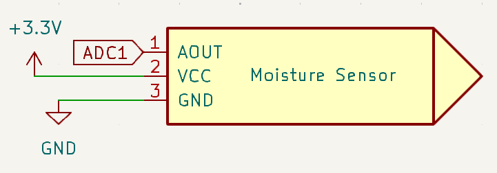
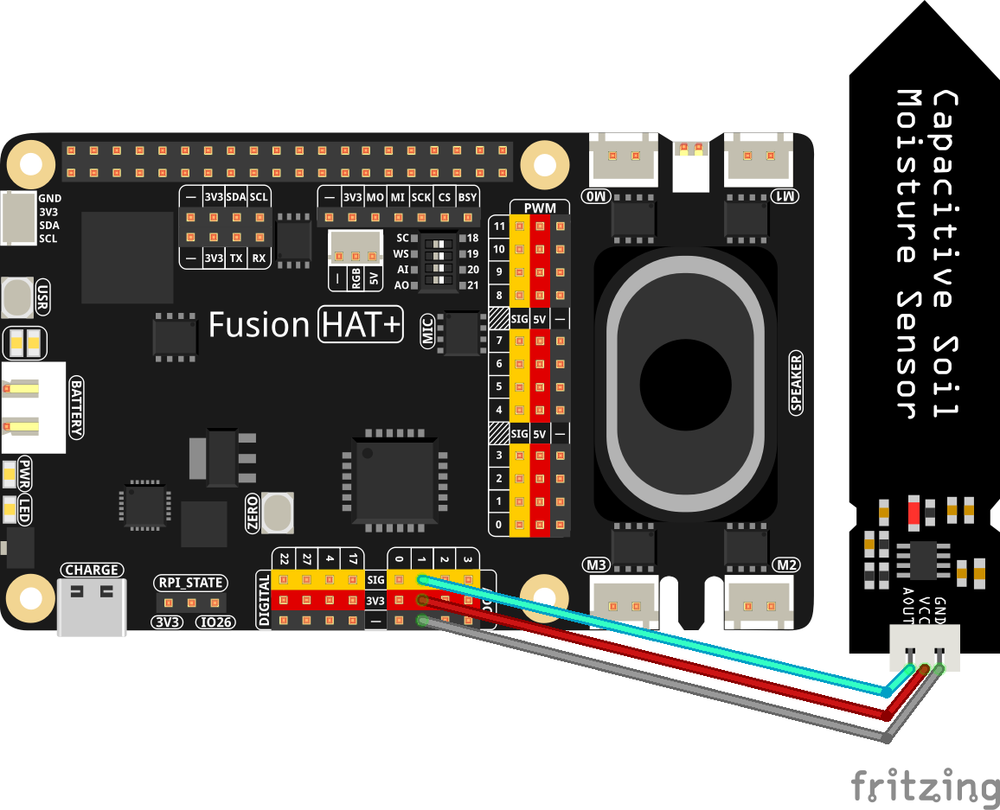

.. note::

    Hello, welcome to the SunFounder Raspberry Pi & Arduino & ESP32 Enthusiasts Community on Facebook! Dive deeper into Raspberry Pi, Arduino, and ESP32 with fellow enthusiasts.

    **Why Join?**

    - **Expert Support**: Solve post-sale issues and technical challenges with help from our community and team.
    - **Learn & Share**: Exchange tips and tutorials to enhance your skills.
    - **Exclusive Previews**: Get early access to new product announcements and sneak peeks.
    - **Special Discounts**: Enjoy exclusive discounts on our newest products.
    - **Festive Promotions and Giveaways**: Take part in giveaways and holiday promotions.

    👉 Ready to explore and create with us? Click [|link_sf_facebook|] and join today!

2.2.10 Soil Moisture Sensor
=====================================

**Introduction**

In this tutorial, we'll explore how to set up and use a soil moisture sensor with a Raspberry Pi using Python. This guide is tailored for those who have a basic understanding of the Raspberry Pi platform and Python programming. By the end of this tutorial, you'll understand how to read moisture levels from the sensor and process that data for various applications like gardening automation.

-----------------------------------------------------

**What You’ll Need**

Below are the components required for this project:

.. list-table::
    :widths: 30 20
    :header-rows: 1

    *   - COMPONENT INTRODUCTION
        - PURCHASE LINK

    *   - :ref:`cpn_wires`
        - |link_wires_buy|
    *   - :ref:`cpn_soil_moisture`
        - |link_soil_moisture_buy|
    *   - Fusion HAT
        - 
    *   - Raspberry Pi Zero 2 W
        -

----------------------------------------------

**Circuit Diagram**

Below are the schematic diagrams for the project:

----------------------------------------------

**Wiring Diagram**

Assemble the circuit as shown below:

----------------------------------------------

**Writing the Code**

Below is the Python code for this project:

.. raw:: html

   <run></run>

.. code-block:: python

    #!/usr/bin/env python3
    from fusion_hat import ADC
    import time

    # Set up the soil moisture sensor
    moisture = ADC('A1')

    try:
        while True:
            # Get the current reading from the ADC port
            result = moisture.read()
            print('result = %d ' %result)

            # Wait for 1 seconds before reading again
            time.sleep(0.2)

    # Graceful exit when 'Ctrl+C' is pressed
    except KeyboardInterrupt: 
        pass

This script initializes the moisture sensor and continuously reads the moisture levels, printing them to the console.

By inserting the module into the soil and watering it, the value of the soil moisture sensor will become smaller.

----------------------------------------------

**Understanding the Code**

This script begins by importing necessary modules: ``fusion_hat`` for the ADC interface and ``time`` for controlling the reading intervals.

1. **Initialization**:
   The ``moisture`` object is created as an instance of ``ADC`` on port ``'A1'``. This is the connection point for the soil moisture sensor.

.. code-block:: python

    moisture = ADC('A1')

2. **Continuous Monitoring Loop**:
   The script enters an infinite loop, where it continuously reads the moisture level through ``moisture.read()``. The result is stored in the variable ``result``, which is then printed to the console.

.. code-block:: python

    result = moisture.read()
    print('result = %d ' %result)

3. **Timing Control**:
   ``time.sleep(0.2)`` is used to pause the loop for 0.2 seconds between readings, allowing for a controlled flow of readings.

4. **Graceful Exit**:
   The ``try`` and ``except`` block gracefully handles a user-generated interrupt, typically ``Ctrl+C``, allowing the program to exit without error messages.

----------------------------------------------

**Troubleshooting**

When working with hardware and sensor setups like this one, you might encounter several common issues. Here's how to troubleshoot some of the frequent problems:

1. **No Output or Erratic Readings**:
   Check all physical connections first. Loose or improper connections between the Raspberry Pi Zero and the moisture sensor can cause no output or fluctuating readings.

2. **Constant Zero or Maximum Readings**:

   - Constant readings often indicate a problem with the sensor itself or its configuration on the ADC. Verify that the sensor is not damaged and is correctly inserted into the ADC port.

   - Check the voltage levels supported by your moisture sensor, it should be 3.3V.

4. **Handling Interrupts**:
   If the script does not exit cleanly on pressing ``Ctrl+C``, check your exception handling. Ensure that the KeyboardInterrupt exception is correctly being caught in your try-except block.

.. code-block:: python

    except KeyboardInterrupt: 
        pass

**Extendable Ideas**

Taking this basic project to the next level involves adding features and integrating it with other technologies. Here are some extendable ideas to enhance your soil moisture sensor project:

1. **Data Logging and Visualization**:
   Implement data logging by storing the moisture readings in a file or a database at regular intervals. This data can then be used to create graphs and visualizations to analyze the moisture trends over time.

   .. code-block:: python

      import csv
      with open('moisture_data.csv', mode='a', newline='') as file:
         writer = csv.writer(file)
         writer.writerow([time.time(), result])

2. **Real-Time Alerts**:
   Set up a system to send real-time alerts (via email or SMS) when the soil moisture falls below a certain threshold. This could be particularly useful for maintaining optimal soil conditions for specific plants.

   .. code-block:: python

      if result < threshold:
         send_alert("Soil moisture is low, consider watering.")

3. **Integration with a Watering System**:
   Connect your Raspberry Pi to a solenoid valve or a water pump to automate watering based on the moisture level readings. This can make the system fully autonomous and very efficient for maintaining gardens or crops.

   .. code-block:: python

      if result < threshold:
         activate_pump()

4. **Multi-Sensor Expansion**:
   Expand the system by integrating other environmental sensors, such as ambient temperature, humidity, and light sensors. This holistic approach would provide more data points for precise gardening or farming conditions management.

**Conclusion**

This project demonstrates a straightforward method to integrate a soil moisture sensor with a Raspberry Pi Zero for real-time monitoring. This setup can be the foundation for more complex projects, including automated watering systems or environmental data collection for scientific analysis. By understanding and modifying this simple script, you can tailor the system to meet specific needs or conditions in your garden or greenhouse.