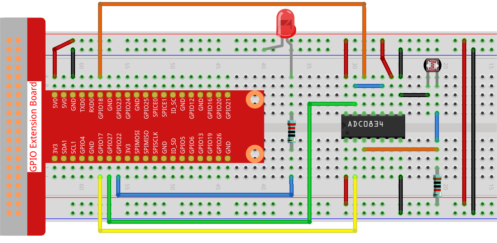

.. note::

    Hello, welcome to the SunFounder Raspberry Pi & Arduino & ESP32 Enthusiasts Community on Facebook! Dive deeper into Raspberry Pi, Arduino, and ESP32 with fellow enthusiasts.

    **Why Join?**

    - **Expert Support**: Solve post-sale issues and technical challenges with help from our community and team.
    - **Learn & Share**: Exchange tips and tutorials to enhance your skills.
    - **Exclusive Previews**: Get early access to new product announcements and sneak peeks.
    - **Special Discounts**: Enjoy exclusive discounts on our newest products.
    - **Festive Promotions and Giveaways**: Take part in giveaways and holiday promotions.

    👉 Ready to explore and create with us? Click [|link_sf_facebook|] and join today!

.. _2.2.1_py:

2.2.1 Photoresistor
===================

**Introduction**

A photoresistor, also known as a light-dependent resistor (LDR), is a component that detects light intensity. Its resistance decreases as the light intensity increases, making it useful in devices like automatic night lamps and ambient light controllers. This project demonstrates how to use a photoresistor with an ADC0834 module to adjust an LED's brightness based on ambient light levels. The working principle is similar to a potentiometer, except the input is light instead of manual adjustment.

----------------------------------------------

**What You’ll Need**

Here are the components required for this project:

.. list-table::
    :widths: 30 20
    :header-rows: 1

    * - COMPONENT INTRODUCTION
      - PURCHASE LINK
    * - GPIO Extension Board
      - |link_gpio_board_buy|
    * - Breadboard
      - |link_breadboard_buy|
    * - Wires
      - |link_wires_buy|
    * - Resistor
      - |link_resistor_buy|
    * - LED
      - |link_led_buy|
    * - ADC0834 Module
      - 
    * - Photoresistor
      - |link_photoresistor_buy|

----------------------------------------------

**Circuit Diagram**

Below are the schematic diagrams illustrating how to connect the components:

.. image:: ../python/img/2.2.1_photoresistor_schematic_1.png

.. image:: ../python/img/2.2.1_photoresistor_schematic_2.png

----------------------------------------------

**Wiring Diagram**

Build the circuit as shown in the diagram below:

Ensure that:

- The photoresistor is connected to the ADC0834 module to convert analog signals into digital values.
- The LED is connected to a GPIO pin for PWM control.
- All connections are secure, and power and ground connections are properly set.

----------------------------------------------

**Writing the Code**

1. Navigate to the project directory:

   .. code-block:: bash

       cd ~/zero-w-ai-kit/python

2. Run the Python script:

   .. code-block:: bash

       sudo python3 2.2.1_Photoresistor_zero.py

When the code runs, the LED's brightness will dynamically adjust based on the light intensity detected by the photoresistor.

.. warning::
    If you encounter the error ``RuntimeError: Cannot determine SOC peripheral base address``, refer to the :ref:`faq_soc` for troubleshooting steps.

----------------------------------------------

**Code**

Below is the Python code used in this project:

.. code-block:: python

   #!/usr/bin/env python3
   from gpiozero import PWMLED
   import ADC0834
   import time

   # Initialize a PWM LED on GPIO pin 22
   led = PWMLED(22)

   # Set up the ADC0834 module
   ADC0834.setup()

   # Define a function for mapping values from one range to another
   def MAP(x, in_min, in_max, out_min, out_max):
       return (x - in_min) * (out_max - out_min) / (in_max - in_min) + out_min

   # Main loop for reading ADC values and controlling LED brightness
   def loop():
       while True:
           # Read analog value from ADC
           analogVal = ADC0834.getResult()
           print('Light Intensity Value = %d' % analogVal)

           # Map the ADC value to a PWM value and set LED brightness
           led.value = float(analogVal / 255)

           # Wait for 0.2 seconds
           time.sleep(0.2)

   # Run the main loop and handle KeyboardInterrupt for graceful shutdown
   try:
       loop()
   except KeyboardInterrupt: 
       # Turn off LED before exiting
       led.value = 0

This Python script uses the ADC0834 module to read photoresistor input and control the brightness of a PWM LED connected to a Raspberry Pi. When executed:

1. The ADC0834 continuously reads photoresistor values from its input channel (ranging from 0 to 255).
2. The analog value, representing light intensity or another variable input, is printed to the console as ``Light Intensity Value = <value>``.
3. The script maps the analog value to a PWM signal to adjust the brightness of the LED (connected to GPIO pin 22).
4. The LED brightness dynamically changes based on the ADC input, with updates every 0.2 seconds.
5. The program runs indefinitely until interrupted with ``Ctrl+C``, at which point the LED turns off.

----------------------------------------------

**Understanding the Code**

1. **Imports:**
   The script uses ``gpiozero`` for PWM control of the LED, ``ADC0834`` for analog-to-digital conversion, and ``time`` for managing delays.

   .. code-block:: python

       from gpiozero import PWMLED
       import ADC0834
       import time

2. **Initialization:**
   The LED connected to GPIO pin 22 is initialized, and the ADC0834 module is set up to read analog values from the photoresistor.

   .. code-block:: python

       led = PWMLED(22)
       ADC0834.setup()

3. **Mapping Function:**
   The ``MAP`` function converts ADC values (0-255) to a range suitable for PWM control (0.0 to 1.0).

   .. code-block:: python

       def MAP(x, in_min, in_max, out_min, out_max):
           return (x - in_min) * (out_max - out_min) / (in_max - in_min) + out_min

4. **Main Loop:**
   - Continuously reads light intensity values from the photoresistor.
   - Adjusts the LED brightness proportionally to the detected light intensity.
   - Includes a short delay to reduce CPU usage and allow visible changes in LED brightness.

   .. code-block:: python

       def loop():
           while True:
               analogVal = ADC0834.getResult()
               print('Light Intensity Value = %d' % analogVal)
               led.value = float(analogVal / 255)
               time.sleep(0.2)

5. **Graceful Exit:**
   The program ensures the LED is turned off when the script is interrupted (e.g., via ``Ctrl+C``).

   .. code-block:: python

       try:
           loop()
       except KeyboardInterrupt:
           led.value = 0

----------------------------------------------

**Troubleshooting**

1. **LED Does Not Light Up**:

   - **Cause**: Incorrect GPIO connection or LED wiring.
   - **Solution**: Verify the LED is connected to GPIO pin 22 with a resistor to prevent damage.

2. **ADC Values Always Zero or Maximum**:

   - **Cause**: Incorrect wiring or the ADC0834 input pin is not connected to a variable source.
   - **Solution**: Check the ADC input channel and ensure it is connected to photoresistor.

3. **LED Brightness Not Changing**:

   - **Cause**: ADC values are not correctly mapped to the PWM range.
   - **Solution**: Ensure the mapping function ``led.value = float(analogVal / 255)`` correctly scales the ADC value to the PWM range (0 to 1).

----------------------------------------------

**Extendable Ideas**

1. **Threshold-Based Behavior**: Turn the LED on or off when the analog value crosses a threshold:
     
     .. code-block:: python

         if analogVal > 128:
             led.on()
         else:
             led.off()

2. **Data Logging**: Log the ADC values and LED brightness to a file for analysis:
     
     .. code-block:: python

         with open("adc_log.txt", "a") as log_file:
             log_file.write(f"Light Intensity: {analogVal}\n")

----------------------------------------------

**Conclusion**

This experiment demonstrates how to use a photoresistor and an ADC0834 module to control an LED's brightness based on ambient light intensity. By understanding the principles of analog-to-digital conversion and PWM control, you can expand this project to develop more complex light-responsive systems, such as automated lighting or smart devices.
