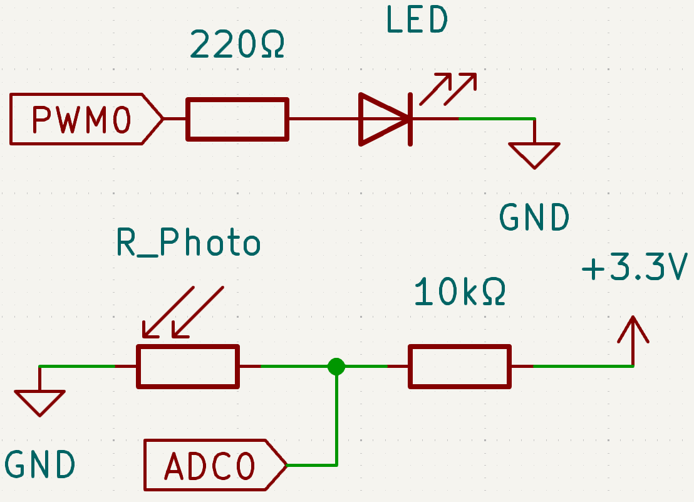
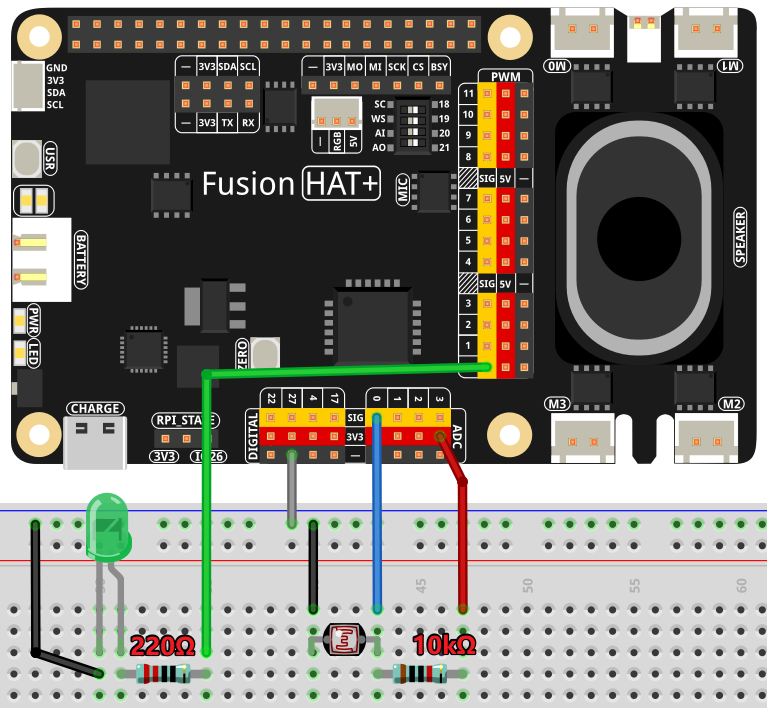

.. note::

    Hello, welcome to the SunFounder Raspberry Pi & Arduino & ESP32 Enthusiasts Community on Facebook! Dive deeper into Raspberry Pi, Arduino, and ESP32 with fellow enthusiasts.

    **Why Join?**

    - **Expert Support**: Solve post-sale issues and technical challenges with help from our community and team.
    - **Learn & Share**: Exchange tips and tutorials to enhance your skills.
    - **Exclusive Previews**: Get early access to new product announcements and sneak peeks.
    - **Special Discounts**: Enjoy exclusive discounts on our newest products.
    - **Festive Promotions and Giveaways**: Take part in giveaways and holiday promotions.

    👉 Ready to explore and create with us? Click [|link_sf_facebook|] and join today!

.. _2.2.1_py:

2.2.1 Photoresistor
===================

**Introduction**

A photoresistor, also known as a light-dependent resistor (LDR), is a component that detects light intensity. Its resistance decreases as the light intensity increases, making it useful in devices like automatic night lamps and ambient light controllers. 

This project demonstrates how to use a photoresistor with Fusion HAT to adjust an LED's brightness based on ambient light levels. The working principle is similar to a potentiometer, except the input is light instead of manual adjustment.

----------------------------------------------

**What You’ll Need**

Here are the components required for this project:

.. list-table::
    :widths: 30 20
    :header-rows: 1

    *   - COMPONENT INTRODUCTION
        - PURCHASE LINK

    *   - :ref:`cpn_breadboard`
        - |link_breadboard_buy|
    *   - :ref:`cpn_wires`
        - |link_wires_buy|
    *   - :ref:`cpn_resistor`
        - |link_resistor_buy|
    *   - :ref:`cpn_led`
        - |link_led_buy|
    *   - :ref:`cpn_photoresistor`
        - |link_photoresistor_buy|
    *   - Fusion HAT
        - 
    *   - Raspberry Pi Zero 2 W
        -

----------------------------------------------

**Circuit Diagram**

Below are the schematic diagrams illustrating how to connect the components:

----------------------------------------------

**Wiring Diagram**

Build the circuit as shown in the diagram below:

Ensure that:

- The photoresistor is connected to the Fusion HAT to convert analog signals into digital values.
- The LED is connected to a GPIO pin for PWM control.
- All connections are secure, and power and ground connections are properly set.

----------------------------------------------

**Writing the Code**

Below is the Python code used in this project:

.. raw:: html

   <run></run>

.. code-block:: python

   #!/usr/bin/env python3

   from fusion_hat import ADC, PWM
   import time

   # Initialize a PWM LED on GPIO pin 22
   led = PWM('P0')

   # Set up the potentiometer
   photoresistor = ADC('A0')

   def MAP(x, in_min, in_max, out_min, out_max):
      """
      Map a value from one range to another.
      :param x: The value to be mapped.
      :param in_min: The lower bound of the value's current range.
      :param in_max: The upper bound of the value's current range.
      :param out_min: The lower bound of the value's target range.
      :param out_max: The upper bound of the value's target range.
      :return: The mapped value.
      """
      return (x - in_min) * (out_max - out_min) / (in_max - in_min) + out_min

   try:
      while True:
         # Get the current reading from the ADC port
         result = photoresistor.read()
         print('result = %d ' %result)

         # Map the ADC value to a range suitable for setting LED brightness
         value = MAP(result, 0, 4095, 0, 100)

         # Set the LED brightness
         led.pulse_width_percent(value)

         # Wait for 1 seconds before reading again
         time.sleep(0.2)

   # Graceful exit when 'Ctrl+C' is pressed
   except KeyboardInterrupt: 
      led.pulse_width_percent(0)  # Turn off the LED

This Python script continuously reads the photoresistor's value, maps it to a suitable range for setting the LED brightness, and adjusts the LED's brightness accordingly. The script also includes a graceful exit mechanism to turn off the LED when interrupted by the user. When executed:

1. The Fusion HAT continuously reads photoresistor values from its input channel (ranging from 0 to 4095).
2. The analog value, representing light intensity or another variable input, is printed to the console as ``result =  <value>``.
3. The script maps the analog value to a PWM signal to adjust the brightness of the LED.
4. The LED brightness dynamically changes based on the ADC input, with updates every 0.2 seconds.
5. The program runs indefinitely until interrupted with ``Ctrl+C``, at which point the LED turns off.

----------------------------------------------

**Understanding the Code**

1. **Imports:**

   .. code-block:: python

      from fusion_hat import ADC, PWM
      import time

   The script imports necessary modules for reading analog values and controlling the LED brightness.

2. **Initialization:**

   .. code-block:: python

      # Initialize a PWM LED
      led = PWM('P0')

      # Set up the potentiometer
      photoresistor = ADC('A0')

   The LED connected to GPIO pin P0 is initialized, and the A0 is set up to read analog values from the photoresistor.

3. **Mapping Function:**

   .. code-block:: python

       def MAP(x, in_min, in_max, out_min, out_max):
           return (x - in_min) * (out_max - out_min) / (in_max - in_min) + out_min

   The ``MAP`` function converts ADC values (0-4095) to a range suitable for PWM control (0 to 100).

4. **Main Loop:**

   .. code-block:: python

      while True:
         # Get the current reading from the ADC port
         result = photoresistor.read()
         print('result = %d ' %result)

         # Map the ADC value to a range suitable for setting LED brightness
         value = MAP(result, 0, 4095, 0, 100)

         # Set the LED brightness
         led.pulse_width_percent(value)

         # Wait for 1 seconds before reading again
         time.sleep(0.2)

   - Continuously reads light intensity values from the photoresistor.
   - Adjusts the LED brightness proportionally to the detected light intensity.
   - Includes a short delay to reduce CPU usage and allow visible changes in LED brightness.

5. **Graceful Exit:**

   .. code-block:: python

      try:
         ...
      except KeyboardInterrupt:
         led.pulse_width_percent(0)  # Turn off the LED

   The program ensures the LED is turned off when the script is interrupted (e.g., via ``Ctrl+C``).

----------------------------------------------

**Troubleshooting**

1. **LED Does Not Light Up**:

   - **Cause**: Incorrect GPIO connection or LED wiring.
   - **Solution**: Verify the LED is connected to P0 with a resistor to prevent damage.

2. **ADC Values Always Zero or Maximum**:

   - **Cause**: Incorrect wiring.
   - **Solution**: Check the ADC pin and ensure it is connected to photoresistor.

3. **LED Brightness Not Changing**:

   - **Cause**: ADC values are not correctly mapped to the PWM range.
   - **Solution**: Ensure the mapping function correctly scales the ADC value to the PWM range (0 to 100).

----------------------------------------------

**Extendable Ideas**

1. **Threshold-Based Behavior**: Turn the LED on or off when the analog value crosses a threshold:
     
   .. code-block:: python

      if result > 128:
         led.on()
      else:
         led.off()

2. **Data Logging**: Log the ADC values and LED brightness to a file for analysis:
     
     .. code-block:: python

         with open("adc_log.txt", "a") as log_file:
             log_file.write(f"Light Intensity: {result}\n")

----------------------------------------------

**Conclusion**

This experiment demonstrates how to use a photoresistor and Fusion HAT to control an LED's brightness based on ambient light intensity. By understanding the principles of analog-to-digital conversion and PWM control, you can expand this project to develop more complex light-responsive systems, such as automated lighting or smart devices.
