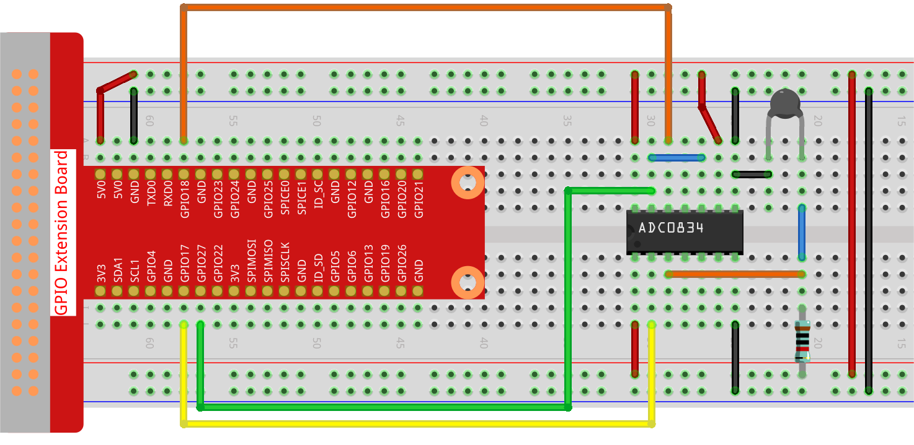

.. note::

    Hello, welcome to the SunFounder Raspberry Pi & Arduino & ESP32 Enthusiasts Community on Facebook! Dive deeper into Raspberry Pi, Arduino, and ESP32 with fellow enthusiasts.

    **Why Join?**

    - **Expert Support**: Solve post-sale issues and technical challenges with help from our community and team.
    - **Learn & Share**: Exchange tips and tutorials to enhance your skills.
    - **Exclusive Previews**: Get early access to new product announcements and sneak peeks.
    - **Special Discounts**: Enjoy exclusive discounts on our newest products.
    - **Festive Promotions and Giveaways**: Take part in giveaways and holiday promotions.

    👉 Ready to explore and create with us? Click [|link_sf_facebook|] and join today!

.. _2.2.2_py:

2.2.2 Thermistor
================

**Introduction**

A thermistor is a temperature-sensitive resistor widely used in temperature sensing and control applications. Unlike photoresistors that detect light, thermistors respond to temperature changes by varying their resistance. This makes them ideal for projects like heat alarms, thermostats, and temperature monitoring systems. In this project, we will use a thermistor with an ADC0834 module to measure ambient temperature and display it in both Celsius and Fahrenheit.

----------------------------------------------

**What You’ll Need**

Here are the components required for this project:

.. list-table::
    :widths: 30 20
    :header-rows: 1

    * - COMPONENT INTRODUCTION
      - PURCHASE LINK
    * - GPIO Extension Board
      - |link_gpio_board_buy|
    * - Breadboard
      - |link_breadboard_buy|
    * - Wires
      - |link_wires_buy|
    * - Resistor
      - |link_resistor_buy|
    * - Thermistor
      - |link_thermistor_buy|
    * - ADC0834 Module
      - 

----------------------------------------------

**Circuit Diagram**

Below are the schematic diagrams illustrating how to connect the thermistor to the ADC0834 module:

.. image:: ../python/img/2.2.2_thermistor_schematic_1.png

.. image:: ../python/img/2.2.2_thermistor_schematic_2.png

----------------------------------------------

**Wiring Diagram**

Build the circuit as shown in the wiring diagram below:

Ensure that:

* The thermistor is correctly connected to the ADC0834 module.
* Power and ground connections are secure.
* All wiring is consistent with the diagram to ensure proper functionality.

----------------------------------------------

**Writing the Code**

1. Navigate to the project directory:

   .. code-block:: bash

       cd ~/zero-w-ai-kit/python

2. Run the Python script:

   .. code-block:: bash

       sudo python3 2.2.2_Thermistor_zero.py

When the code executes, the thermistor measures the ambient temperature, and the values are displayed on the screen in both Celsius and Fahrenheit.

.. warning::
    If you encounter the error ``RuntimeError: Cannot determine SOC peripheral base address``, refer to the :ref:`faq_soc` for troubleshooting steps.

----------------------------------------------

**Code**

Below is the Python code used for this project:

.. code-block:: python

   #!/usr/bin/env python3

   import ADC0834
   import time
   import math

   # Initialize the ADC0834 module
   ADC0834.setup()

   # Run the process in a try-except block
   try:
       while True:
           # Read the analog value from the sensor
           analogVal = ADC0834.getResult()

           # Convert the analog value to a voltage
           Vr = 5 * float(analogVal) / 255

           # Calculate the resistance of the thermistor
           Rt = 10000 * Vr / (5 - Vr)

           # Calculate the temperature in Kelvin
           temp = 1 / (((math.log(Rt / 10000)) / 3950) + (1 / (273.15 + 25)))

           # Convert Kelvin to Celsius
           Cel = temp - 273.15

           # Convert Celsius to Fahrenheit
           Fah = Cel * 1.8 + 32

           # Print the temperature in both Celsius and Fahrenheit
           print('Celsius: %.2f C  Fahrenheit: %.2f F' % (Cel, Fah))

           # Wait for 0.2 seconds before the next read
           time.sleep(0.2)

   # Handle KeyboardInterrupt for graceful termination
   except KeyboardInterrupt:
       # Clean up ADC0834 resources
       ADC0834.destroy()

This Python script reads an analog signal from a thermistor via the ADC0834 module and calculates the corresponding temperature. When executed:

1. The script continuously reads the analog value from the ADC0834 module.
2. It converts the analog value to a voltage (``Vr``), calculates the thermistor resistance (``Rt``), and determines the temperature in Kelvin, Celsius, and Fahrenheit.
3. The calculated temperatures are printed to the console in both Celsius and Fahrenheit, formatted to two decimal places, as ``Celsius: <value> C  Fahrenheit: <value> F``.
4. The process repeats every 0.2 seconds until the script is interrupted with ``Ctrl+C``, after which the ADC0834 is cleaned up gracefully.

----------------------------------------------

**Understanding the Code**

1. **Imports:**
   The script uses the `ADC0834` library for analog-to-digital conversion, the `time` library for implementing delays, and the `math` library for performing logarithmic and other calculations.

   .. code-block:: python

       import ADC0834
       import time
       import math

2. **Initialization:**
   The ADC0834 module is initialized to read analog values from the thermistor.

   .. code-block:: python

       ADC0834.setup()

3. **Data Processing:**

   - Reads the analog value from the thermistor.
   - Converts the analog value to a voltage.
   - Calculates the thermistor's resistance.
   - Uses the Steinhart-Hart equation to compute temperature in Kelvin.
   - Converts Kelvin to Celsius and Fahrenheit.

   .. code-block:: python

       analogVal = ADC0834.getResult()
       Vr = 5 * float(analogVal) / 255
       Rt = 10000 * Vr / (5 - Vr)
       temp = 1 / (((math.log(Rt / 10000)) / 3950) + (1 / (273.15 + 25)))
       Cel = temp - 273.15
       Fah = Cel * 1.8 + 32

4. **Output:**
   The calculated temperature is displayed on the screen in both Celsius and Fahrenheit. A delay is included to allow the temperature readings to stabilize and to prevent excessive CPU usage.

   .. code-block:: python

       print('Celsius: %.2f C  Fahrenheit: %.2f F' % (Cel, Fah))
       time.sleep(0.2)

5. **Graceful Termination:**
   The program ensures the ADC0834 resources are properly released when the script is interrupted.

   .. code-block:: python

       except KeyboardInterrupt:
           ADC0834.destroy()

----------------------------------------------

**Troubleshooting**

1. **No Output in the Console**:

   - **Cause**: ADC0834 not initialized or wired correctly.
   - **Solution**: Verify the ADC0834 connections, including power, ground, chip select, clock, and data pins. Ensure ``ADC0834.setup()`` is called.

2. **Temperature Values Are Incorrect or Erratic**:

   - **Cause**: Incorrect thermistor parameters or noisy input signal.
   - **Solution**:

     - Ensure the thermistor's resistance at 25°C (``10000`` in this script) and the ``3950`` B-value are accurate for your thermistor model.
     - Add a capacitor or software filtering to reduce signal noise.

3. **Divide-by-Zero Error**:

   - **Cause**: The voltage ``Vr`` is too close to 0 or 5, leading to division by zero in the resistance calculation.
   - **Solution**: Ensure the ADC input voltage stays within the 0–5V range, and check connections for short circuits or disconnections.

----------------------------------------------

**Extendable Ideas**

1. **Display Temperatures on an LCD or OLED**: Use an LCD or OLED screen to show the temperature values dynamically.

2. **Data Logging**: Save the temperature readings to a file for analysis:
     
     .. code-block:: python

         with open("temperature_log.txt", "a") as log_file:
             log_file.write(f"Celsius: {Cel:.2f}, Fahrenheit: {Fah:.2f}\n")

3. **Threshold-Based Alerts**: Trigger alerts when the temperature exceeds a predefined threshold:
     
     .. code-block:: python

         if Cel > 30:
             print("Warning: High temperature!")

4. **LED or Buzzer Feedback**: Provide visual or auditory feedback based on temperature levels:
     
     .. code-block:: python

         from gpiozero import Buzzer
         buzzer = Buzzer(27)
         if Cel > 30:
             buzzer.on()
         else:
             buzzer.off()

----------------------------------------------

**Conclusion**

This experiment demonstrates how to use a thermistor with an ADC0834 module to measure ambient temperature accurately. By understanding the principles of analog-to-digital conversion and the Steinhart-Hart equation, you can build advanced temperature monitoring and control systems for various applications.
