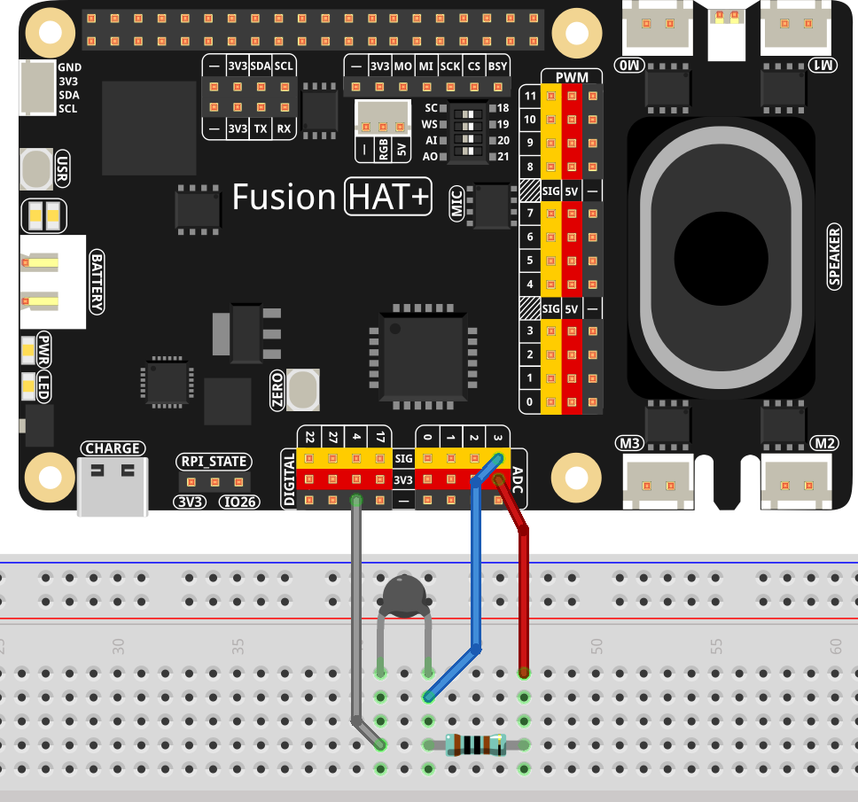

.. note::

    Hello, welcome to the SunFounder Raspberry Pi & Arduino & ESP32 Enthusiasts Community on Facebook! Dive deeper into Raspberry Pi, Arduino, and ESP32 with fellow enthusiasts.

    **Why Join?**

    - **Expert Support**: Solve post-sale issues and technical challenges with help from our community and team.
    - **Learn & Share**: Exchange tips and tutorials to enhance your skills.
    - **Exclusive Previews**: Get early access to new product announcements and sneak peeks.
    - **Special Discounts**: Enjoy exclusive discounts on our newest products.
    - **Festive Promotions and Giveaways**: Take part in giveaways and holiday promotions.

    👉 Ready to explore and create with us? Click [|link_sf_facebook|] and join today!

.. _2.2.2_py:

2.2.2 Thermistor
================

**Introduction**

A thermistor is a temperature-sensitive resistor widely used in temperature sensing and control applications. Unlike photoresistors that detect light, thermistors respond to temperature changes by varying their resistance. This makes them ideal for projects like heat alarms, thermostats, and temperature monitoring systems. In this project, we will use a thermistor to measure ambient temperature and display it in both Celsius and Fahrenheit.

----------------------------------------------

**What You’ll Need**

Here are the components required for this project:

.. list-table::
    :widths: 30 20
    :header-rows: 1

    *   - COMPONENT INTRODUCTION
        - PURCHASE LINK

    *   - Breadboard
        - |link_breadboard_buy|
    *   - Wires
        - |link_wires_buy|
    *   - Resistor
        - |link_resistor_buy|
    *   - Thermistor
        - |link_thermistor_buy|
    *   - Fusion HAT
        - 
    *   - Raspberry Pi Zero 2 W
        -

----------------------------------------------

**Circuit Diagram**

Below are the schematic diagrams illustrating how to connect the thermistor to the Fusion HAT:

.. image:: ../python/img/2.2.2

----------------------------------------------

**Wiring Diagram**

Build the circuit as shown in the wiring diagram below:

Ensure that:

* The thermistor is correctly connected to the Fusion HAT.
* Power and ground connections are secure.
* All wiring is consistent with the diagram to ensure proper functionality.

----------------------------------------------

**Writing the Code**

Below is the Python code used for this project:

.. code-block:: python

   from fusion_hat import ADC
   import time
   import math

   thermistor = ADC('A3')

   # Run the process in a try-except block
   try:
      while True:
         # Read the voltage from the sensor
         Vr = thermistor.read_voltage()
         # Calculate the resistance of the thermistor
         if 3.3 - Vr < 0.1:
            print("Please check the sensor")
            continue
         else:
            Rt = 10000 * Vr / (3.3 - Vr)
            temp = 1 / (((math.log(Rt / 10000)) / 3950) + (1 / (273.15 + 25))) # Calculate the temperature in Kelvin
            Cel = temp - 273.15 # Convert Kelvin to Celsius
            Fah = Cel * 1.8 + 32 # Convert Celsius to Fahrenheit
            print('Celsius: %.2f C  Fahrenheit: %.2f F' % (Cel, Fah))
            time.sleep(0.2)

   # Handle KeyboardInterrupt for graceful termination
   except KeyboardInterrupt:
      pass

This Python script reads an analog signal from a thermistor via the ADC0834 module and calculates the corresponding temperature. When executed:

1. The script continuously reads the voltage.
2. It calculates the thermistor resistance (``Rt``), and determines the temperature in Kelvin, Celsius, and Fahrenheit.
3. The calculated temperatures are printed to the console in both Celsius and Fahrenheit, formatted to two decimal places, as ``Celsius: <value> C  Fahrenheit: <value> F``.
4. The process repeats every 0.2 seconds until the script is interrupted with ``Ctrl+C``, after which the ADC0834 is cleaned up gracefully.

----------------------------------------------

**Understanding the Code**

1. **Imports:**

   .. code-block:: python

      from fusion_hat import ADC
      import time
      import math

   This script imports necessary modules: ``ADC`` from the ``fusion_hat`` library for read voltage, ``time`` for sleep functionality, and ``math`` for mathematical calculations.

2. **Initialization:**

   .. code-block:: python

      thermistor = ADC('A3')

   Initialize the ADC object on pin A3.

3. **Data Processing:**

   .. code-block:: python

      while True:
         # Read the voltage from the sensor
         Vr = thermistor.read_voltage()
         # Calculate the resistance of the thermistor
         if 3.3 - Vr < 0.1:
            print("Please check the sensor")
            continue
         else:
            Rt = 10000 * Vr / (3.3 - Vr)
            temp = 1 / (((math.log(Rt / 10000)) / 3950) + (1 / (273.15 + 25))) # Calculate the temperature in Kelvin
            Cel = temp - 273.15 # Convert Kelvin to Celsius
            Fah = Cel * 1.8 + 32 # Convert Celsius to Fahrenheit

   - Reads the voltage from the thermistor.
   - Calculates the thermistor's resistance.
   - Uses the Steinhart-Hart equation to compute temperature in Kelvin.
   - Converts Kelvin to Celsius and Fahrenheit.

4. **Output:**

   .. code-block:: python

      print('Celsius: %.2f C  Fahrenheit: %.2f F' % (Cel, Fah))
      time.sleep(0.2)

   The calculated temperature is displayed on the screen in both Celsius and Fahrenheit. A delay is included to allow the temperature readings to stabilize and to prevent excessive CPU usage.

----------------------------------------------

**Troubleshooting**

1. **Temperature Values Are Incorrect or Erratic**:

   - **Cause**: Incorrect thermistor parameters or noisy input signal.
   - **Solution**:

     - Ensure the thermistor's resistance at 25°C (``10000`` in this script) and the ``3950`` B-value are accurate for your thermistor model.
     - Add a capacitor or software filtering to reduce signal noise.

2. **Divide-by-Zero Error**:

   - **Cause**: The voltage ``Vr`` is too close to 0 or 3.3V, leading to division by zero in the resistance calculation.
   - **Solution**: Ensure the ADC input voltage stays within the 0–3.3V range, and check connections for short circuits or disconnections.

----------------------------------------------

**Extendable Ideas**

1. **Display Temperatures on an LCD or OLED**: Use an LCD or OLED screen to show the temperature values dynamically.

2. **Data Logging**: Save the temperature readings to a file for analysis:
     
   .. code-block:: python

      with open("temperature_log.txt", "a") as log_file:
         log_file.write(f"Celsius: {Cel:.2f}, Fahrenheit: {Fah:.2f}\n")

3. **Threshold-Based Alerts**: Trigger alerts when the temperature exceeds a predefined threshold:
     
   .. code-block:: python

      if Cel > 30:
         print("Warning: High temperature!")

4. **LED or Buzzer Feedback**: Provide visual or auditory feedback based on temperature levels:
     
   .. code-block:: python

      from fusion_hat import Pin
      led = Pin(27.Pin.OUT)
      if Cel > 30:
            led.on()
      else:
            led.off()

----------------------------------------------

**Conclusion**

This experiment demonstrates how to use a thermistor with an Fusion HAT to measure ambient temperature accurately. By understanding the principles of analog-to-digital conversion and the Steinhart-Hart equation, you can build advanced temperature monitoring and control systems for various applications.
