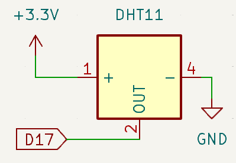
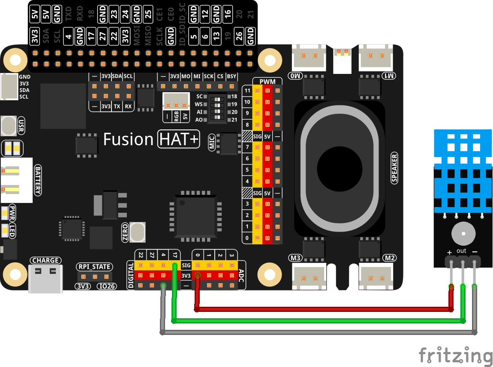

.. note::

    Hello, welcome to the SunFounder Raspberry Pi & Arduino & ESP32 Enthusiasts Community on Facebook! Dive deeper into Raspberry Pi, Arduino, and ESP32 with fellow enthusiasts.

    **Why Join?**

    - **Expert Support**: Solve post-sale issues and technical challenges with help from our community and team.
    - **Learn & Share**: Exchange tips and tutorials to enhance your skills.
    - **Exclusive Previews**: Get early access to new product announcements and sneak peeks.
    - **Special Discounts**: Enjoy exclusive discounts on our newest products.
    - **Festive Promotions and Giveaways**: Take part in giveaways and holiday promotions.

    👉 Ready to explore and create with us? Click [|link_sf_facebook|] and join today!

.. _2.2.3_py:

2.2.3 DHT-11
================

**Introduction**

In this lesson, you will learn how to connect and read data from a DHT11 temperature and humidity sensor using a Raspberry Pi. The DHT11 is a reliable, low-cost digital sensor used in various applications, such as weather monitoring and environmental control. This project introduces you to interfacing with external sensors, handling real-time data, and basic exception handling in Python. By the end, you will know how to read temperature (in both Celsius and Fahrenheit) and humidity values.

----------------------------------------------

**What You’ll Need**

Here are the components required for this project:

.. list-table::
    :widths: 30 20
    :header-rows: 1

    *   - COMPONENT INTRODUCTION
        - PURCHASE LINK

    *   - :ref:`cpn_humiture_sensor`
        - |link_humiture_buy|
    *   - :ref:`cpn_wires`
        - |link_wires_buy|  
    *   - Fusion HAT
        - 
    *   - Raspberry Pi Zero 2 W
        -

----------------------------------------------

**Circuit Diagram**

Below is the schematic diagram for connecting the DHT11 sensor:

----------------------------------------------

**Wiring Diagram**

Build the circuit as shown in the wiring diagram below:

----------------------------------------------

**Running the Example**

All example code used in this tutorial is available in the ``ai-explorer-lab-kit`` directory. 
Follow these steps to run the example:

.. code-block:: shell
   
   cd ai-explorer-lab-kit/python/
   sudo python3 2.2.3_DHT.py 

----------------------------------------------

**Writing the Code**

Below is the Python code used for this project:

.. raw:: html

   <run></run>

.. code-block:: python

   from fusion_hat import DHT11
   from time import sleep

   dht11 = DHT11(pin=17)

   while True:
      result = dht11.read()
      if result:
         humidity, temperature = result
         print ("humidity: %s %%,  Temperature: %s C`" % (humidity, temperature))
      else:
         print("time out")
      sleep(1)

This Python script reads temperature and humidity data from a DHT11 sensor connected to a Fusion HAT using GPIO pin 17. When executed:

1. Data is printed to the console every 1 seconds, providing real-time updates.
2. If the data reading is not successful, the script outputs “time out” , indicating an error in data reading.

----------------------------------------------

**Understanding the Code**

1. **Import:**

   .. code-block:: python

      from fusion_hat import DHT11
      from time import sleep

   These lines import the necessary modules for the script.

2. **Sensor Initialization:**

   .. code-block:: python

      dht11 = DHT11(pin=17)

   This line initializes the DHT11 sensor on GPIO pin 17.

3. **Data Reading:**

   .. code-block:: python

      while True:
         result = dht11.read()
         if result:
            humidity, temperature = result
            print ("humidity: %s %%,  Temperature: %s C`" % (humidity, temperature))
         else:
            print("time out")
         sleep(1)

   The ``read`` method sends a start signal to the DHT11.

----------------------------------------------

**Troubleshooting**

1. **No Output or Constant 0.0°C and 0.0% Values**:

   - **Cause**: Sensor connection issues.
   - **Solution**: Ensure the DHT11 sensor is properly connected to GPIO pin 17, power, and ground.

2. **Script Crashes with ValueError**:

   - **Cause**: Corrupt or incomplete data from the sensor.
   - **Solution**: Check for stable connections and ensure the DHT11 is functioning properly. Ensure the data line is not noisy or floating.

3. **High CPU Usage**:

   - **Cause**: Continuous polling of the GPIO pin without delays.
   - **Solution**: The code already has built-in delays (e.g., ``time.sleep(2)``). Ensure these are not removed.

4. **Incorrect Temperature or Humidity Values**:

   - **Cause**: Calibration issue or sensor malfunction.
   - **Solution**: Test the DHT11 in a controlled environment to verify accuracy. Replace the sensor if the issue persists.

5. **Script Does Not Exit Gracefully**:

   - **Cause**: The script lacks proper exception handling for manual interruptions.
   - **Solution**: Wrap the main loop in a ``try...except KeyboardInterrupt`` block to allow clean termination.

   .. code-block:: python

      try:
         while True:
               humidity, temperature = dht11.read()
               print(f"{time.time():.3f}  Temperature: {temperature}°C  Humidity: {humidity}%")
               time.sleep(2)
      except KeyboardInterrupt:
         print("Exiting gracefully...")

----------------------------------------------

**Extendable Ideas**

1. **Data Logging**: Save the temperature and humidity readings to a file for analysis:
  
  .. code-block:: python

      with open("dht11_log.txt", "a") as log_file:
          log_file.write(f"{time.time():.3f}, {temperature}°C, {humidity}%\n")

2. **Threshold-Based Alerts**: Trigger an alert when the temperature or humidity exceeds specific thresholds:
  
  .. code-block:: python

      if temperature > 30:
          print("Warning: High temperature!")
      if humidity > 70:
          print("Warning: High humidity!")

----------------------------------------------

**Conclusion**

This project demonstrates how to interface with the DHT11 temperature and humidity sensor using a Fusion HAT. By understanding how to read and process sensor data, you can integrate such sensors into various practical applications, from weather stations to automated climate control systems.
