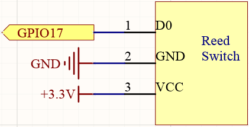
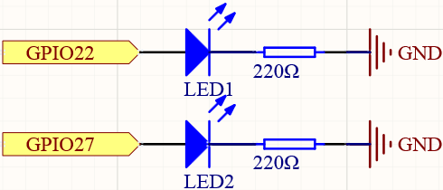
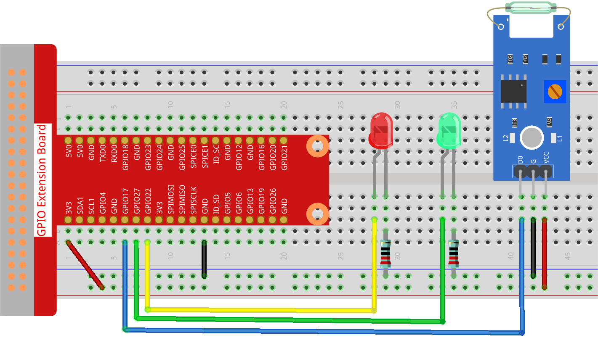

.. note::

    Hello, welcome to the SunFounder Raspberry Pi & Arduino & ESP32 Enthusiasts Community on Facebook! Dive deeper into Raspberry Pi, Arduino, and ESP32 with fellow enthusiasts.

    **Why Join?**

    - **Expert Support**: Solve post-sale issues and technical challenges with help from our community and team.
    - **Learn & Share**: Exchange tips and tutorials to enhance your skills.
    - **Exclusive Previews**: Get early access to new product announcements and sneak peeks.
    - **Special Discounts**: Enjoy exclusive discounts on our newest products.
    - **Festive Promotions and Giveaways**: Take part in giveaways and holiday promotions.

    👉 Ready to explore and create with us? Click [|link_sf_facebook|] and join today!

.. _2.2.4_py:

2.2.4 Reed Switch Module
========================

**Introduction**

A reed switch is an electrical switch that operates through a magnetic field. When a magnet is brought near the reed switch, its contacts close, completing the circuit. This simple yet versatile component is widely used in security systems, door sensors, and various automation projects. In this lesson, we will learn how to integrate a reed switch module with a Raspberry Pi and control LEDs based on its state.

----------------------------------------------

**What You’ll Need**

Below are the components required for this project:

.. list-table::
    :widths: 30 20
    :header-rows: 1

    * - COMPONENT INTRODUCTION
      - PURCHASE LINK
    * - GPIO Extension Board
      - |link_gpio_board_buy|
    * - Breadboard
      - |link_breadboard_buy|
    * - Wires
      - |link_wires_buy|
    * - Resistor
      - |link_resistor_buy|
    * - LED
      - |link_led_buy|
    * - Reed Switch Module
      - |link_reed_switch_buy|

----------------------------------------------

**Circuit Diagram**

Below are the schematic diagrams for the project:

----------------------------------------------

**Wiring Diagram**

Assemble the circuit as shown below:

Ensure all connections are secure and match the schematic to avoid functionality issues.

----------------------------------------------

**Writing the Code**

1. Navigate to the project directory:

   .. code-block:: bash

       cd ~/zero-w-ai-kit/python

2. Run the Python script:

   .. code-block:: bash

       sudo python3 2.2.4_ReedSwitch_zero.py

When the script is running:

* The green LED lights up initially.
* When a magnet is near the reed switch, the red LED turns on, and the green LED turns off.
* Removing the magnet reverses this behavior.

.. warning::
    If you encounter the error ``RuntimeError: Cannot determine SOC peripheral base address``, refer to the :ref:`faq_soc` for troubleshooting steps.

----------------------------------------------

**Code**

Below is the Python code for this project:

.. code-block:: python

   #!/usr/bin/env python3
   from gpiozero import LED, Button

   # Initialize the reed switch and LEDs using GPIO Zero
   reed_switch = Button(17, pull_up=True)  # Reed switch on GPIO 17 with internal pull-up resistor
   green_led = LED(27)                     # Green LED on GPIO pin 27
   red_led = LED(22)                       # Red LED on GPIO pin 22

   def update_leds():
       """
       Update the state of the LEDs based on the reed switch.
       """
       if reed_switch.is_pressed:
           green_led.off()  # Turn off the green LED
           red_led.on()     # Turn on the red LED
       else:
           green_led.on()   # Turn on the green LED
           red_led.off()    # Turn off the red LED

   try:
       green_led.on()  # Turn on the green LED at the start
       while True:
           # Assign callbacks for reed switch state changes
           reed_switch.when_pressed = update_leds   # When the switch is pressed
           reed_switch.when_released = update_leds  # When the switch is released

   except KeyboardInterrupt:
       # Clean up resources and exit gracefully
       green_led.off()
       red_led.off()
       pass

This Python script controls two LEDs using a reed switch connected to a Raspberry Pi. When executed:

1. The green LED (connected to GPIO pin 27) is initially turned on.
2. The reed switch (connected to GPIO pin 17) controls the LEDs:

   - When the reed switch is activated (magnet near the switch), the red LED (connected to GPIO pin 22) turns on, and the green LED turns off.
   - When the reed switch is deactivated (magnet removed), the green LED turns on, and the red LED turns off.

3. The script continuously monitors the state of the reed switch and updates the LEDs accordingly.
4. The program runs indefinitely until interrupted with ``Ctrl+C``, at which point both LEDs are turned off.

----------------------------------------------

**Understanding the Code**

1. **Initialization:**

   The script uses the ``gpiozero`` library to initialize the reed switch on GPIO pin 17 with an internal pull-up resistor, and two LEDs on GPIO pins 27 (green) and 22 (red).

   .. code-block:: python

       reed_switch = Button(17, pull_up=True)
       green_led = LED(27)
       red_led = LED(22)

2. **LED Control Function:**

   The ``update_leds`` function determines the state of the LEDs based on whether the reed switch is activated by a magnet.

   .. code-block:: python

       def update_leds():
           if reed_switch.is_pressed:
               green_led.off()
               red_led.on()
           else:
               green_led.on()
               red_led.off()

3. **Main Loop:**

   * Initially turns on the green LED.
   * Continuously checks the state of the reed switch and updates the LEDs accordingly.
   * Handles ``KeyboardInterrupt`` (e.g., pressing ``Ctrl+C``) to clean up resources and exit gracefully.

   .. code-block:: python

       try:
           green_led.on()
           while True:
               reed_switch.when_pressed = update_leds
               reed_switch.when_released = update_leds
       except KeyboardInterrupt:
           green_led.off()
           red_led.off()

----------------------------------------------

**Troubleshooting**

1. **Reed Switch Not Responding**:

   - **Cause**: Incorrect reed switch wiring or configuration.
   - **Solution**: Ensure the reed switch is connected to GPIO pin 17 and ground. Confirm that the internal pull-up resistor is enabled with ``pull_up=True``.

2. **LEDs Always On or Off**:

   - **Cause**: Reed switch not functioning or always in one state.
   - **Solution**: Test the reed switch with a multimeter to ensure it changes state when a magnet is near.

----------------------------------------------

**Extendable Ideas**

1. **Auditory Feedback**: Add a buzzer to provide audio feedback when the reed switch is activated:

   .. code-block:: python

      from gpiozero import Buzzer
      buzzer = Buzzer(18)
      def update_leds():
         if reed_switch.is_pressed:
            green_led.off()
            red_led.on()
            buzzer.on()
         else:
            green_led.on()
            red_led.off()
            buzzer.off()

2. **Threshold-Based Timer**: Measure how long the reed switch remains activated and log the duration:

   .. code-block:: python

      import time
      start_time = None
      def update_leds():
         global start_time
         if reed_switch.is_pressed:
            start_time = time.time()
         else:
            duration = time.time() - start_time
            print(f"Switch activated for {duration:.2f} seconds")

----------------------------------------------

**Conclusion**

This project demonstrates how to use a reed switch module with a Raspberry Pi to control LEDs. By understanding the basics of magnetic switches and GPIO programming, you can expand this knowledge to create automated systems and interactive projects for various applications.
