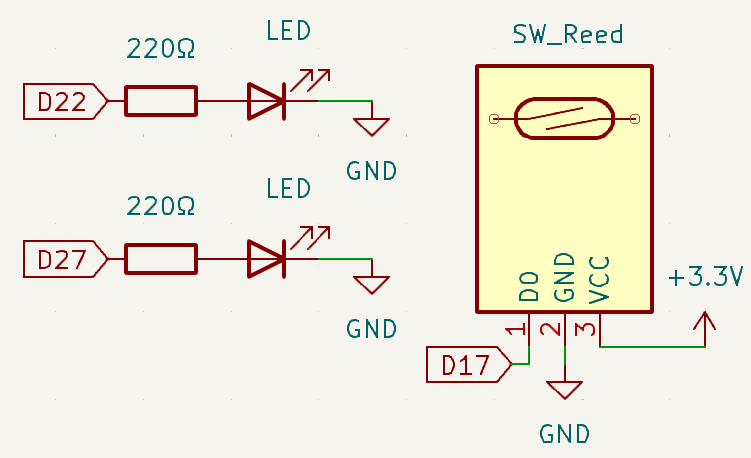

.. note::

    Hello, welcome to the SunFounder Raspberry Pi & Arduino & ESP32 Enthusiasts Community on Facebook! Dive deeper into Raspberry Pi, Arduino, and ESP32 with fellow enthusiasts.

    **Why Join?**

    - **Expert Support**: Solve post-sale issues and technical challenges with help from our community and team.
    - **Learn & Share**: Exchange tips and tutorials to enhance your skills.
    - **Exclusive Previews**: Get early access to new product announcements and sneak peeks.
    - **Special Discounts**: Enjoy exclusive discounts on our newest products.
    - **Festive Promotions and Giveaways**: Take part in giveaways and holiday promotions.

    👉 Ready to explore and create with us? Click [|link_sf_facebook|] and join today!

.. _2.2.4_py:

2.2.4 Reed Switch Module
========================

**Introduction**

A reed switch is an electrical switch that operates through a magnetic field. When a magnet is brought near the reed switch, its contacts close, completing the circuit. This simple yet versatile component is widely used in security systems, door sensors, and various automation projects. In this lesson, we will learn how to integrate a reed switch module with a Raspberry Pi and control LEDs based on its state.

----------------------------------------------

**What You’ll Need**

Below are the components required for this project:

.. list-table::
    :widths: 30 20
    :header-rows: 1

    *   - COMPONENT INTRODUCTION
        - PURCHASE LINK

    *   - :ref:`cpn_breadboard`
        - |link_breadboard_buy|
    *   - :ref:`cpn_wire`
        - |link_wires_buy|
    *   - :ref:`cpn_resistor`
        - |link_resistor_buy|
    *   - :ref:`cpn_led`
        - |link_led_buy|
    *   - :ref:`cpn_reed_switch`
        - |link_reed_switch_buy|
    *   - Fusion HAT
        - 
    *   - Raspberry Pi Zero 2 W
        -

----------------------------------------------

**Circuit Diagram**

Below are the schematic diagrams for the project:

----------------------------------------------

**Wiring Diagram**

Assemble the circuit as shown below:

Ensure all connections are secure and match the schematic to avoid functionality issues.

----------------------------------------------

**Writing the Code**

Below is the Python code for this project:

.. code-block:: python

   #!/usr/bin/env python3
   from fusion_hat import Pin
   from signal import pause  # Import pause function from signal module

   # Initialize the reed sensor
   reed_switch = Pin(17,Pin.IN, pull=Pin.PULL_UP)  # reed sensor connected to GPIO pin 17, pull-up resistor disabled
   green_led = Pin(27, Pin.OUT)  # Green LED connected to GPIO pin 27
   red_led = Pin(22, Pin.OUT)   # Red LED connected to GPIO pin 22

   def detect():
      if reed_switch.value() == 0:  # Check if the sensor is actived
         red_led.high()   # Turn on red LED
         green_led.low()  # Turn off green LED
      else:  # If the sensor is not actived
         red_led.low()  # Turn off red LED
         green_led.high()  # Turn on green LED

   try:
      green_led.high() # Turn on green LED initially
      reed_switch.when_activated = detect  # Set up an interrupt to detect changes in the reed sensor state
      reed_switch.when_deactivated = detect  # Set up an interrupt to detect changes in the reed sensor state

      # Run an event loop that waits for button events and keeps the script running
      print("CTRL + C to exit")
      pause()

   except KeyboardInterrupt:
      # Handle KeyboardInterrupt (Ctrl+C) to exit the loop gracefully
      pass

This Python script controls two LEDs using a reed switch. When executed:

1. The green LED (connected to GPIO pin 27) is initially turned on.
2. The reed switch (connected to GPIO pin 17) controls the LEDs:

   - When the reed switch is activated (magnet near the switch), the red LED (connected to GPIO pin 22) turns on, and the green LED turns off.
   - When the reed switch is deactivated (magnet removed), the green LED turns on, and the red LED turns off.

3. The script continuously monitors the state of the reed switch and updates the LEDs accordingly.
4. The program runs indefinitely until interrupted with ``Ctrl+C``, at which point both LEDs are turned off.

----------------------------------------------

**Understanding the Code**

1. **Initialization:**

   .. code-block:: python

      reed_switch = Pin(17,Pin.IN, pull=Pin.PULL_UP)  # reed sensor connected to GPIO pin 17, pull-up resistor disabled
      green_led = Pin(27, Pin.OUT)  # Green LED connected to GPIO pin 27
      red_led = Pin(22, Pin.OUT)   # Red LED connected to GPIO pin 22

   The script uses the ``fusion_hat`` library to initialize the reed switch on GPIO pin 17 with an internal pull-up resistor, and two LEDs on GPIO pins 27 (green) and 22 (red).

2. **LED Control Function:**

   .. code-block:: python

      def detect():
         if reed_switch.value() == 0:  # Check if the sensor is actived
            red_led.high()   # Turn on red LED
            green_led.low()  # Turn off green LED
         else:  # If the sensor is not actived
            red_led.low()  # Turn off red LED
            green_led.high()  # Turn on green LED

   The ``detect`` function determines the state of the LEDs based on whether the reed switch is activated by a magnet.

3. **Main Loop:**

   .. code-block:: python

      try:
         green_led.high() # Turn on green LED initially
         reed_switch.when_activated = detect 
         reed_switch.when_deactivated = detect 

         print("CTRL + C to exit")
         pause()

      except KeyboardInterrupt:
         # Handle KeyboardInterrupt (Ctrl+C) to exit the loop gracefully
         pass

   * Initially turns on the green LED.
   * Continuously checks the state of the reed switch and updates the LEDs accordingly.
   * Handles ``KeyboardInterrupt`` (e.g., pressing ``Ctrl+C``) to clean up resources and exit gracefully.

----------------------------------------------

**Troubleshooting**

1. **Reed Switch Not Responding**:

   - **Cause**: Incorrect reed switch wiring or configuration.
   - **Solution**: Ensure the reed switch is connected to GPIO pin 17 and ground. Confirm that the internal pull-up resistor is enabled with ``pull=Pin.PULL_UP``.

2. **LEDs Always On or Off**:

   - **Cause**: Reed switch not functioning or always in one state.
   - **Solution**: Test the reed switch with a multimeter to ensure it changes state when a magnet is near.

----------------------------------------------

**Extendable Ideas**

1. **Auditory Feedback**: Add a buzzer to provide audio feedback when the reed switch is activated:

   .. code-block:: python

      from fusion_hat import Buzzer
      buzzer = Buzzer(Pin(4))
      def detect():
         if reed_switch.value() == 0:
            green_led.off()
            red_led.on()
            buzzer.on()
         else:
            green_led.on()
            red_led.off()
            buzzer.off()

2. **Threshold-Based Timer**: Measure how long the reed switch remains activated and log the duration:

   .. code-block:: python

      import time
      start_time = None
      def detect():
         global start_time
         if reed_switch.value() == 0:
            start_time = time.time()
         else:
            duration = time.time() - start_time
            print(f"Switch activated for {duration:.2f} seconds")

----------------------------------------------

**Conclusion**

This project demonstrates how to use a reed switch module with a fusion_hat to control LEDs. By understanding the basics of magnetic switches and GPIO programming, you can expand this knowledge to create automated systems and interactive projects for various applications.
