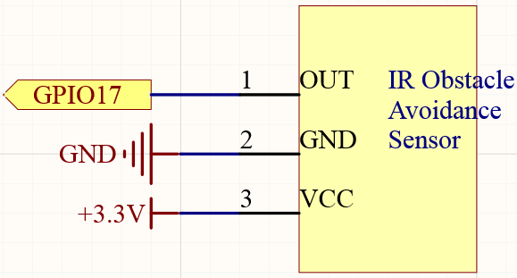
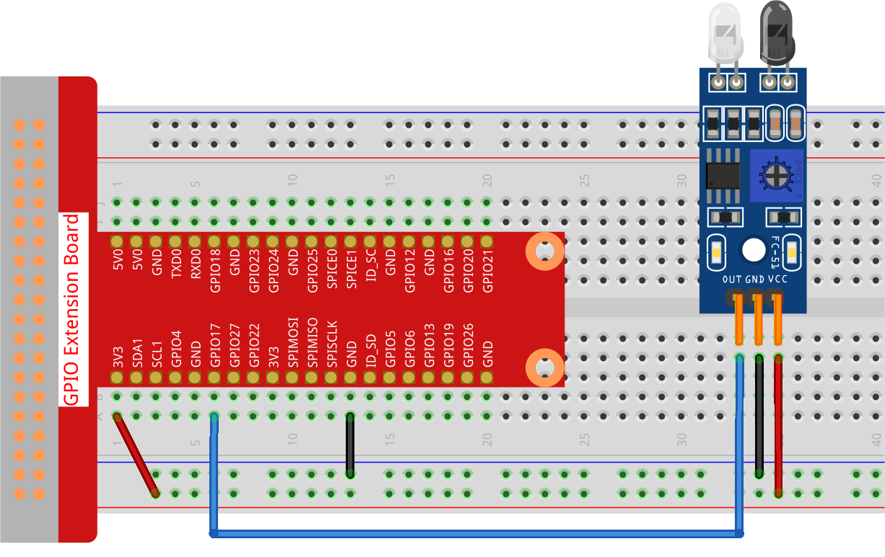

.. note::

    Hello, welcome to the SunFounder Raspberry Pi & Arduino & ESP32 Enthusiasts Community on Facebook! Dive deeper into Raspberry Pi, Arduino, and ESP32 with fellow enthusiasts.

    **Why Join?**

    - **Expert Support**: Solve post-sale issues and technical challenges with help from our community and team.
    - **Learn & Share**: Exchange tips and tutorials to enhance your skills.
    - **Exclusive Previews**: Get early access to new product announcements and sneak peeks.
    - **Special Discounts**: Enjoy exclusive discounts on our newest products.
    - **Festive Promotions and Giveaways**: Take part in giveaways and holiday promotions.

    👉 Ready to explore and create with us? Click [|link_sf_facebook|] and join today!

.. _2.2.5_py:

2.2.5 IR Obstacle Avoidance Sensor
===================================

**Introduction**

The IR obstacle avoidance sensor is a versatile and efficient module designed to detect obstacles at short distances. It works by emitting infrared light and detecting the reflected light from nearby objects. This module is widely used in robotics, automation, and conveyor belt systems for obstacle detection, counting, and more. In this project, you will learn how to connect and use the IR obstacle avoidance module with a Raspberry Pi to detect obstacles and respond to them programmatically.

----------------------------------------------

**What You’ll Need**

Below are the components required for this project:

.. list-table::
    :widths: 30 20
    :header-rows: 1

    * - COMPONENT INTRODUCTION
      - PURCHASE LINK
    * - GPIO Extension Board
      - |link_gpio_board_buy|
    * - Breadboard
      - |link_breadboard_buy|
    * - Wires
      - |link_wires_buy|
    * - IR Obstacle Avoidance Module
      - |link_obstacle_avoidance_buy|

----------------------------------------------

**Circuit Diagram**

Below is the schematic diagram for the project:

----------------------------------------------

**Wiring Diagram**

Connect the components as shown in the wiring diagram below:

Ensure the connections are secure and match the schematic. The IR sensor module should be connected to GPIO pin 17 of the Raspberry Pi.

----------------------------------------------

**Writing the Code**

1. Navigate to the project directory:

   .. code-block:: bash

       cd ~/zero-w-ai-kit/python

2. Run the Python script:

   .. code-block:: bash

       sudo python3 2.2.5_IrObstacle_zero.py

After the script starts running:

* If you place your hand or any object in front of the sensor's probe, the output indicator on the module lights up.
* The message "Detected Barrier!" will repeatedly appear on the screen until the object is removed.

.. warning::
    If you encounter the error ``RuntimeError: Cannot determine SOC peripheral base address``, refer to the :ref:`faq_soc` for troubleshooting steps.

----------------------------------------------

**Code**

Below is the Python code for this project:

.. code-block:: python

   #!/usr/bin/env python3
   from gpiozero import Button
   import time

   # Initialize the obstacle sensor connected to GPIO pin 17
   # The sensor is configured with a pull-up resistor
   obstacle_sensor = Button(17, pull_up=True)

   try:
       # Continuously monitor for obstacles
       while True:
           if obstacle_sensor.is_pressed:  # Check if the sensor is triggered
               print("Detected Barrier!")  # Print a message when an obstacle is detected
               time.sleep(1)  # Delay for 1 second to avoid repetitive messages
   except KeyboardInterrupt:
       # Handle KeyboardInterrupt (Ctrl+C) for a clean and safe exit
       pass

This Python script monitors an obstacle sensor connected to GPIO pin 17 of a Raspberry Pi. When executed:

1. The script continuously checks the state of the obstacle sensor.
2. If the sensor detects an obstacle (triggered state), the console displays the message ``Detected Barrier!``.
3. A 1-second delay prevents repetitive messages from being printed too quickly.
4. The program runs indefinitely until interrupted by pressing ``Ctrl+C``, allowing for a clean and safe exit.

----------------------------------------------

**Understanding the Code**

1. **Imports:**
   The script uses ``gpiozero`` to interact with the obstacle sensor and ``time`` for implementing delays.

   .. code-block:: python

       from gpiozero import Button
       import time

2. **Sensor Initialization:**
   The obstacle sensor is connected to GPIO pin 17 with an internal pull-up resistor. This configuration ensures that the sensor outputs stable signals.

   .. code-block:: python

       obstacle_sensor = Button(17, pull_up=True)

3. **Main Loop:**
   The script continuously checks the state of the obstacle sensor:

   * When the sensor is triggered (object detected), the message "Detected Barrier!" is printed.
   * A 1-second delay prevents repetitive messages from flooding the output.

   .. code-block:: python

       try:
           while True:
               if obstacle_sensor.is_pressed:
                   print("Detected Barrier!")
                   time.sleep(1)
       except KeyboardInterrupt:
           pass

----------------------------------------------

**Troubleshooting**

1. **No Output When an Obstacle is Present**:

   - **Cause**: Incorrect wiring of the obstacle sensor.
   - **Solution**: Ensure the obstacle sensor is correctly connected to GPIO pin 17, power, and ground. Verify that the ``pull_up=True`` configuration matches the sensor’s requirements.

2. **Sensor Always Triggered or Never Triggered**:

   - **Cause**: Sensor malfunction or misconfiguration.
   - **Solution**: Test the sensor with a multimeter to ensure it changes state when an obstacle is present. Double-check the pull-up resistor setting.

3. **Script Exits Immediately**:

   - **Cause**: The ``try...except`` block is not handling interruptions or errors correctly.
   - **Solution**: Ensure the ``pass`` statement in the ``except KeyboardInterrupt`` block allows for a clean termination.

----------------------------------------------

**Extendable Ideas**

1. **Visual Feedback**: Add an LED that lights up when an obstacle is detected:

     .. code-block:: python

         from gpiozero import LED
         led = LED(27)
         if obstacle_sensor.is_pressed:
             led.on()
         else:
             led.off()

2. **Auditory Feedback**: Include a buzzer to provide an audible alert when an obstacle is detected:

     .. code-block:: python

         from gpiozero import Buzzer
         buzzer = Buzzer(22)
         if obstacle_sensor.is_pressed:
             buzzer.on()
             time.sleep(1)
             buzzer.off()

3. **Data Logging**: Log obstacle detection events to a file for later analysis:

     .. code-block:: python

         with open("obstacle_log.txt", "a") as log_file:
             log_file.write(f"Obstacle detected at {time.time():.3f}\n")

----------------------------------------------

**Conclusion**

This project demonstrates how to use an IR obstacle avoidance sensor module with a Raspberry Pi to detect obstacles. By understanding how to programmatically respond to sensor inputs, you can integrate similar modules into complex systems like robotics, automation, or IoT applications. This foundational knowledge opens the door to building smarter, more interactive projects.
