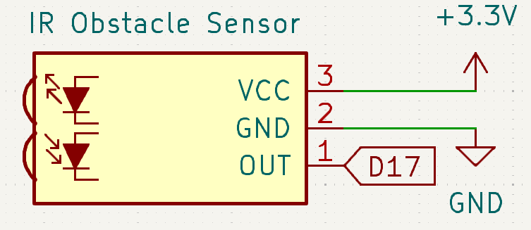
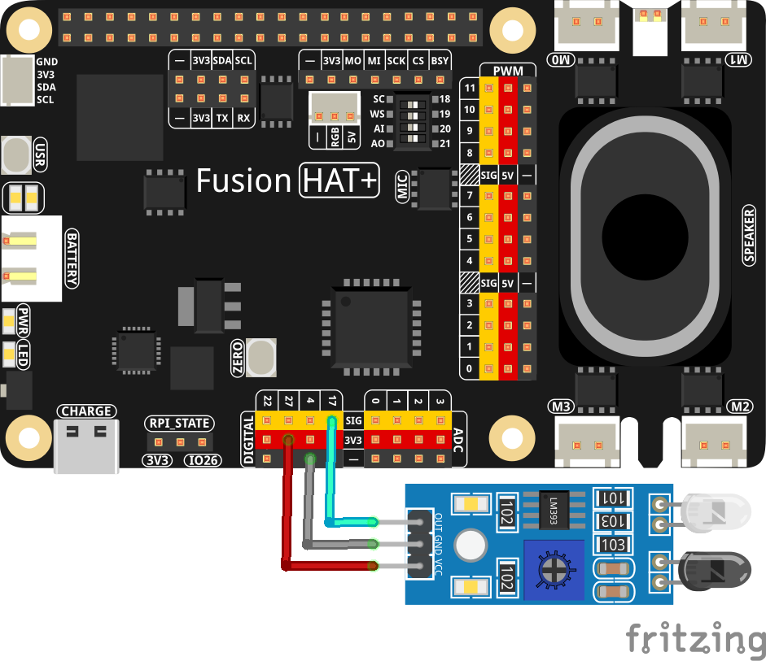

.. note::

    Hello, welcome to the SunFounder Raspberry Pi & Arduino & ESP32 Enthusiasts Community on Facebook! Dive deeper into Raspberry Pi, Arduino, and ESP32 with fellow enthusiasts.

    **Why Join?**

    - **Expert Support**: Solve post-sale issues and technical challenges with help from our community and team.
    - **Learn & Share**: Exchange tips and tutorials to enhance your skills.
    - **Exclusive Previews**: Get early access to new product announcements and sneak peeks.
    - **Special Discounts**: Enjoy exclusive discounts on our newest products.
    - **Festive Promotions and Giveaways**: Take part in giveaways and holiday promotions.

    👉 Ready to explore and create with us? Click [|link_sf_facebook|] and join today!

.. _2.2.5_py:

2.2.5 IR Obstacle Avoidance Sensor
===================================

**Introduction**

The IR obstacle avoidance sensor is a versatile and efficient module designed to detect obstacles at short distances. It works by emitting infrared light and detecting the reflected light from nearby objects. This module is widely used in robotics, automation, and conveyor belt systems for obstacle detection, counting, and more. In this project, you will learn how to connect and use the IR obstacle avoidance module with a Raspberry Pi to detect obstacles and respond to them programmatically.

----------------------------------------------

**What You’ll Need**

Below are the components required for this project:

.. list-table::
    :widths: 30 20
    :header-rows: 1

    *   - :ref:`cpn_avoid_module`
        - |link_obstacle_avoidance_buy|
    *   - :ref:`cpn_wires`
        - |link_wires_buy|  
    *   - Fusion HAT
        - 
    *   - Raspberry Pi Zero 2 W
        -

----------------------------------------------

**Circuit Diagram**

Below is the schematic diagram for the project:

----------------------------------------------

**Wiring Diagram**

Connect the components as shown in the wiring diagram below:

Ensure the connections are secure and match the schematic. The IR sensor module should be connected to GPIO pin 17.

----------------------------------------------

**Writing the Code**

The following Python code can be used to read the obstacle distance and detect if an obstacle is present:

.. raw:: html

   <run></run>

.. code-block:: python

   #!/usr/bin/env python3
   from fusion_hat import Pin 
   from signal import pause  # Import pause function from signal module

   # Initialize a IR Obstacle Module object on GPIO pin 17
   IR_Obstacle = Pin(17, Pin.IN, pull= Pin.PULL_UP)

   def detect():
      if IR_Obstacle.value() == 0:  # Check if the IR Obstacle Module is activated
         print("Detected Barrier!")
      else:
         print("No Barrier")

   try:
      IR_Obstacle.when_activated = detect  # Set up an interrupt to detect changes in the reed sensor state
      IR_Obstacle.when_deactivated = detect
      
      # Run an event loop that waits for button events and keeps the script running
      print("CTRL + C to exit")
      pause()

   except KeyboardInterrupt:
      # Handle KeyboardInterrupt (Ctrl+C) to exit the loop gracefully
      pass

----------------------------------------------

**Understanding the Code**

1. **Imports:**

   .. code-block:: python

      from fusion_hat import Pin 
      from signal import pause  # Import pause function from signal module

   The script uses ``fusion_hat`` to interact with the obstacle sensor and ``time`` for implementing delays.

2. **Sensor Initialization:**

   .. code-block:: python

      IR_Obstacle = Pin(17, Pin.IN, pull= Pin.PULL_UP)

   The obstacle sensor is connected to GPIO pin 17 with an internal pull-up resistor. This configuration ensures that the sensor outputs stable signals.

3. **Main Loop:**

   .. code-block:: python

      def detect():
         if IR_Obstacle.value() == 0:  # Check if the IR Obstacle Module is activated
            print("Detected Barrier!")
         else:
            print("No Barrier")

      try:
         IR_Obstacle.when_activated = detect
         IR_Obstacle.when_deactivated = detect
      
         print("CTRL + C to exit")
         pause()

      except KeyboardInterrupt:
         # Handle KeyboardInterrupt (Ctrl+C) to exit the loop gracefully
         pass

   The script continuously checks the state of the obstacle sensor:

   * When the sensor is triggered (object detected), the message "Detected Barrier!" is printed.
   * A 1-second delay prevents repetitive messages from flooding the output.

----------------------------------------------

**Troubleshooting**

1. **No Output When an Obstacle is Present**:

   - **Cause**: Incorrect wiring of the obstacle sensor.
   - **Solution**: Ensure the obstacle sensor is correctly connected to GPIO pin 17, power, and ground. Verify that the ``PULL_UP`` configuration matches the sensor’s requirements.

2. **Sensor Always Triggered or Never Triggered**:

   - **Cause**: Sensor malfunction or misconfiguration.
   - **Solution**: Test the sensor with a multimeter to ensure it changes state when an obstacle is present. Double-check the pull-up resistor setting.

----------------------------------------------

**Extendable Ideas**

1. **Visual Feedback**: Add an LED that lights up when an obstacle is detected:

   .. code-block:: python

      from fusion_hat import Pin
      led = Pin(27, Pin.OUT)
      if obstacle_sensor.value() == 0:
         led.on()
      else:
         led.off()

2. **Auditory Feedback**: Include a buzzer to provide an audible alert when an obstacle is detected:

   .. code-block:: python

      from fusion_hat import Buzzer
      buzzer = Buzzer(Pin(22))
      if obstacle_sensor.value() == 0:
         buzzer.on()
         time.sleep(1)
         buzzer.off()

3. **Data Logging**: Log obstacle detection events to a file for later analysis:

   .. code-block:: python

      with open("obstacle_log.txt", "a") as log_file:
         log_file.write(f"Obstacle detected at {time.time():.3f}\n")

----------------------------------------------

**Conclusion**

This project demonstrates how to use an IR obstacle avoidance sensor module with a Fusion HAT to detect obstacles. By understanding how to programmatically respond to sensor inputs, you can integrate similar modules into complex systems like robotics, automation, or IoT applications. This foundational knowledge opens the door to building smarter, more interactive projects.
